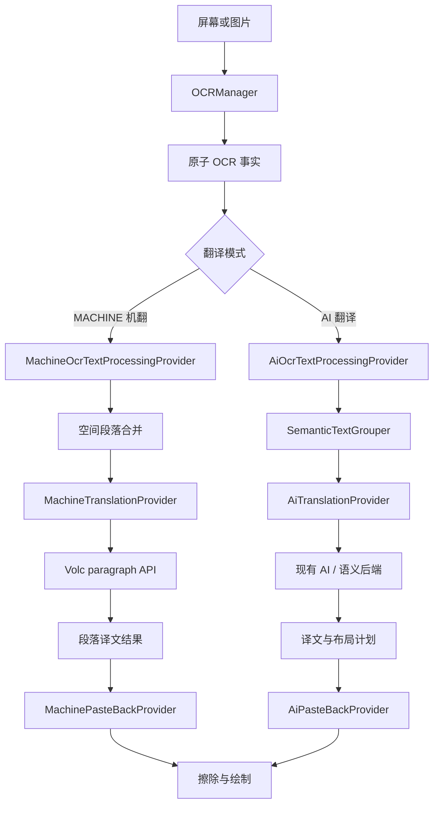
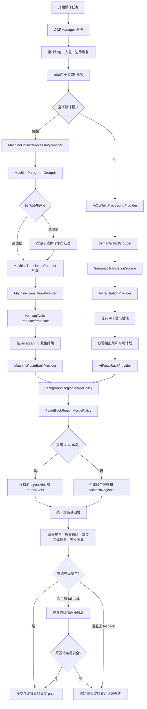
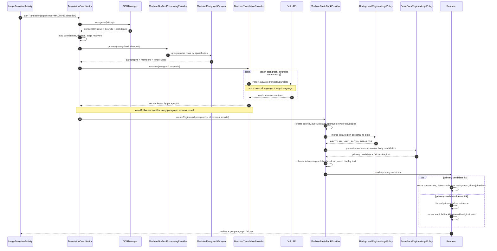
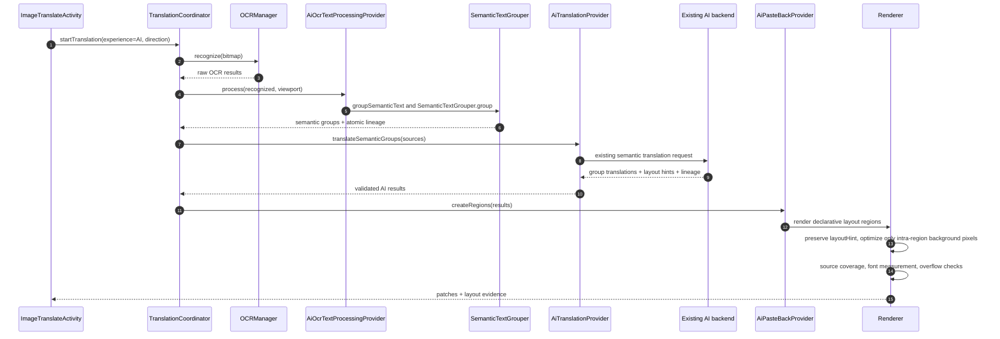

# 机翻与 AI 翻译 Provider 分层改造方案

日期：2026-09-14
状态：已实施并持续验证
适用范围：Android OCR 图片翻译、全屏实时翻译、自建翻译服务和回贴渲染链路

## 0. 结论与边界

本方案将“翻译模式”提升为一次翻译任务的上层策略，并将 OCR 文字整理、翻译和回贴分别抽象为 Provider：

```text
翻译模式选择
  ├── 机翻模式
  │     ├── MachineOcrTextProcessingProvider
  │     ├── MachineTranslationProvider
  │     └── MachinePasteBackProvider
  └── AI 翻译模式
        ├── AiOcrTextProcessingProvider
        ├── AiTranslationProvider
        └── AiPasteBackProvider
```

统一流水线是：

```text
OCR 文字识别
  -> OCR 文字整理 Provider
  -> 翻译 Provider
  -> 文字回贴 Provider
```

机翻模式的职责是：

```text
OCR 原子文字
  -> MachineOcrTextProcessingProvider
  -> 空间关系段落合并
  -> MachineTranslationProvider
  -> 每个段落调用 Volc 机翻接口
  -> 收集全部段落译文
  -> MachinePasteBackProvider 按段落槽位绘制
```

AI 翻译模式继续使用当前流程：

```text
OCR 原子文字
  -> AiOcrTextProcessingProvider
  -> SemanticTextGrouper
  -> SemanticTranslationSource
  -> AiTranslationProvider
  -> 声明式布局计划
  -> AiPasteBackProvider
```

两种模式共用 OCR 事实、坐标映射、图片擦除基础能力和最终任务生命周期，但不共用段落合并策略、翻译请求协议、布局提示解释方式和回贴决策。

> 安全边界：用户提供的 Volc Authorization token 不写入文档、代码仓库或日志。实际实现必须从安全配置读取，并禁止输出完整 token。

## 1. 当前代码证据

### 1.1 当前识别与翻译入口

当前主要入口是 [BackgroundTranslatedImageProcessor.kt](../app/src/main/java/com/example/imagetranslate/screenshot/BackgroundTranslatedImageProcessor.kt) 中的 `recognizeAndTranslate()`。当前 OCR 文字整理和翻译编排仍然集中在这个入口，目标是将其拆成四个连续阶段：

```text
OCRManager.recognize()
  -> OCR 文字识别结果
  -> OcrTextProcessingProvider
  -> TextTranslationProvider
  -> TranslationPasteBackProvider
  -> BackgroundImageRegion / 回贴渲染
```

关键位置：

| 位置 | 当前职责 |
| --- | --- |
| `recognizeAndTranslate()` | OCR 触发、生命周期和四阶段总编排 |
| `OCRManager` | 只负责识别文字和基础识别结果 |
| `OcrTextProcessingProvider` | 坐标整理、去重、原子化、角色/段落/语义组整理 |
| `SemanticTextGrouper` | 基于角色、OCR block、空间关系和字体兼容性进行语义分组 |
| `SemanticTextGroup.toRecognizedText()` | 将组转换为复合识别结果，并保留 `componentBounds` |
| `SemanticTextGroup.toSemanticTranslationSource()` | 构造 AI 语义翻译请求的原子成员和布局槽位 |
| `translateRegions()` | 调用 `TranslateManager`、校验结果并生成回贴区域 |
| `BackgroundTranslatedImageRenderer` | 擦除原文、真实字体测量和绘制译文 |

当前 [SemanticTranslationContract.kt](../app/src/main/java/com/example/imagetranslate/translate/SemanticTranslationContract.kt) 已有 `memberRegionIds`、`renderSlots`、`sourceCoverSlots`、`sourceLineCount` 和 `layoutShape` 等字段。这些字段适合 AI 流程，但机翻只需要更轻量的“段落文本 + 段落来源槽位”契约。两类 OCR 文字整理 Provider 都必须输出可供后续翻译和回贴使用的统一中间结果，不能让翻译 Provider 自己重新猜坐标或重新分组。

### 1.2 当前存在的模式混淆

现有 `TranslationBackend` 主要表示本地、网络、自建、嵌入式等服务来源；现有 `TranslationMode` 表示中英方向或自动双向，并不表示“机翻 / AI 翻译”。因此本次不应把机翻直接添加成一个普通 `TranslationBackend` 值，否则会继续让以下概念混在一起：

```text
翻译体验模式：MACHINE / AI
翻译方向：CHINESE_TO_ENGLISH / ENGLISH_TO_CHINESE / AUTO_BIDIRECTIONAL
服务来源：LOCAL / NETWORK / SELF_HOSTED / EMBEDDED_V4
回贴策略：MACHINE_PASTE_BACK / AI_PASTE_BACK
```

建议新增独立枚举，例如：

```kotlin
internal enum class TranslationExperience {
    MACHINE,
    AI
}
```

现有 `TranslationMode` 保持为翻译方向，不改名、不复用。

## 2. 目标架构

### 2.1 Provider 组合

OCR 文字整理、翻译和回贴 Provider 必须按模式成套选择，不能出现“机翻整理结果交给 AI 翻译”“AI 语义组交给机翻翻译”或“机翻文本交给 AI 回贴”的隐式混用。

```kotlin
internal data class TranslationPipeline(
    val ocrTextProcessing: OcrTextProcessingProvider,
    val translation: TextTranslationProvider,
    val pasteBack: TranslationPasteBackProvider
)

internal interface OcrTextProcessingProvider {
    fun process(
        recognized: List<RecognizedText>,
        viewport: TranslationViewport
    ): OcrTextProcessingResult
}

internal interface TextTranslationProvider {
    suspend fun translate(
        request: TextTranslationRequest
    ): TextTranslationBatchResult
}

internal interface TranslationPasteBackProvider {
    fun createRegions(
        source: List<RecognizedText>,
        translations: List<TextTranslationResult>,
        viewport: TranslationViewport
    ): List<BackgroundImageRegion>
}
```

Provider 选择器负责组合：

```kotlin
internal object TranslationPipelineSelector {
    fun select(
        experience: TranslationExperience,
        settings: TranslationBackendSettings
    ): TranslationPipeline = when (experience) {
        TranslationExperience.MACHINE -> TranslationPipeline(
            ocrTextProcessing = MachineOcrTextProcessingProvider(),
            translation = VolcMachineTranslationProvider(settings),
            pasteBack = MachinePasteBackProvider()
        )
        TranslationExperience.AI -> TranslationPipeline(
            ocrTextProcessing = AiOcrTextProcessingProvider(),
            translation = AiTranslationProvider(settings),
            pasteBack = AiPasteBackProvider()
        )
    }
}
```

实际项目可以按现有 `TranslateManager` 生命周期改成工厂或构造注入，但选择关系必须集中在一个地方，不能散落在 OCR 文字整理、翻译和渲染分支中。

### 2.2 OCR 文字整理 Provider 的职责

`OCRManager` 负责“看见文字”，不负责决定文字如何成为段落或语义组。OCR 识别成功后，必须先进入当前模式对应的文字整理 Provider：

| Provider | 输出 | 处理策略 |
| --- | --- | --- |
| `MachineOcrTextProcessingProvider` | `MachineParagraph` | 原子化、归一化、去重、空间段落合并、保护内容隔离 |
| `AiOcrTextProcessingProvider` | `SemanticTextGroup` / `SemanticTranslationSource` | 当前 `groupSemanticText`、上下文整理和 `SemanticTextGrouper` 语义分组 |

统一输出至少需要包含：

```kotlin
internal data class OcrTextProcessingResult(
    val sourceItems: List<RecognizedText>,
    val units: List<TranslationUnit>,
    val readingOrder: List<String>,
    val diagnostics: OcrTextProcessingDiagnostics
)
```

其中 `TranslationUnit` 是翻译 Provider 的输入适配层。它必须携带原子成员、来源 ID、文本、`bounds`、`renderSlots`、`sourceCoverSlots`、行数和模式相关的证据。翻译 Provider 不再直接消费未整理的 `RecognizedText` 列表。

### 2.3 两条处理路径



### 2.4 共用层与专属层

| 层 | 机翻 | AI 翻译 | 说明 |
| --- | --- | --- | --- |
| OCR 识别 | 共用 | 共用 | 产生原子文字、置信度和坐标 |
| 坐标映射 | 共用 | 共用 | OCR 缩放图坐标映射回原图 |
| 去重和边缘恢复 | 共用 | 共用 | 识别基础事实处理 |
| OCR 文字整理 | `MachineOcrTextProcessingProvider` | `AiOcrTextProcessingProvider` | 将 OCR 事实转换为模式专属翻译单元 |
| 段落合并 | `MachineParagraphGrouper` | `SemanticTextGrouper` | 不共用决策结果 |
| 翻译请求 | 每段一个 Volc 请求 | 当前 AI 语义组请求 | 协议不同 |
| 翻译结果 | 段落译文 | 语义组译文和布局提示 | 结果模型可有公共父接口 |
| 回贴排版 | `MachinePasteBackProvider` | `AiPasteBackProvider` | 机翻简单回贴，AI 使用现有布局计划 |
| 最终安全校验 | 共用基础校验 | 共用基础校验 | 越界、空文本、重叠和过期响应仍需统一处理 |

## 3. 机翻段落合并模型

### 3.1 原子 OCR 是唯一事实来源

机翻段落合并必须建立在 OCR 原子行之上。不可先将文字压成一个大矩形，再尝试从大矩形反推段落结构。

```text
原子行 r0: text + bounds + componentBounds + confidence
原子行 r1: text + bounds + componentBounds + confidence
原子行 r2: text + bounds + componentBounds + confidence

虚拟段落 p0:
  memberRegionIds = [r0, r1, r2]
  sourceText = r0.text + "\n" + r1.text + "\n" + r2.text
  renderSlots = [r0.bounds, r1.bounds, r2.bounds]
  unionBounds = union(r0.bounds, r1.bounds, r2.bounds)
```

段落合并结果只改变翻译上下文，不破坏原子坐标：

```kotlin
internal data class MachineParagraph(
    val paragraphId: String,
    val members: List<RecognizedText>,
    val sourceText: String,
    val bounds: Rect,
    val renderSlots: List<Rect>,
    val sourceLineCount: Int,
    val readingOrder: Int,
    val confidence: Float,
    val evidence: Set<MachineGroupingEvidence>
)
```

### 3.2 候选排序

在合并前先处理明显的页面区域边界。最小可行版本可以先使用全局排序，但必须预留列分区能力：

```text
1. 过滤空文本、无效坐标和明显重复识别结果
2. 按页面区域分桶
3. 每个桶内按 top、left 排序
4. 对同一基线的文字按 left 排序
5. 在桶内建立相邻候选边
6. 将候选边合并为段落
7. 重新生成全局 readingOrder
```

多栏页面不能直接把左栏底部和右栏顶部作为相邻段落。区域分桶可先采用投影间隙、OCR block、水平重叠和列中心聚类实现；复杂版面后续再引入独立版面分析器。

### 3.3 合并条件

两个原子行或临时段落 `A`、`B` 可以合并，需要同时满足硬条件和软评分条件。

硬条件：

| 条件 | 规则 |
| --- | --- |
| 文本 | 两者都非空，且不是纯噪声 |
| 方向 | 位于同一阅读方向和同一页面区域 |
| 角色 | 不能是控制项、时间、代码、标识符等保护内容 |
| 顺序 | B 在 A 之后，不能形成回头连接 |
| 几何 | 垂直间距和横向偏移均未超过上限 |
| 归属 | 不跨越明确的 OCR block、卡片或聊天气泡边界 |

软评分：

```text
mergeScore =
    0.25 * verticalProximity
  + 0.20 * horizontalAlignment
  + 0.15 * horizontalOverlap
  + 0.15 * typographyCompatibility
  + 0.10 * sameOcrBlock
  + 0.10 * punctuationContinuation
  + 0.05 * languageCompatibility
```

建议阈值：

| 分数 | 行为 |
| --- | --- |
| `>= 0.90` | 允许进入机翻段落请求 |
| `0.75..0.90` | 只记录为影子候选，按未合并结果处理 |
| `< 0.75` | 不合并 |

### 3.4 几何计算

代表行高：

```text
lineHeight = max(1, bounds.bottom - bounds.top)
```

垂直接近度：

```text
verticalGap = B.top - A.bottom
verticalProximity = 1 - verticalGap / (max(lineHeightA, lineHeightB) * 1.05)
```

横向重叠：

```text
overlapWidth = min(A.right, B.right) - max(A.left, B.left)
overlapRatio = max(0, overlapWidth) / min(A.width, B.width)
```

左边界对齐：

```text
leftDelta = abs(A.left - B.left)
horizontalAlignment = 1 - leftDelta / max(lineHeightA, lineHeightB)
```

实现时所有比例都要进行 `0..1` 限制；阈值应使用文字高度归一化，不能使用固定像素，否则不同分辨率和缩放密度下行为不稳定。

### 3.5 文本连续性

空间关系只能产生候选，文本特征用于提高或降低分数。

提高分数的特征：

- 上一行不是句末标点；
- 下一行以小写字母、连接词或普通句子内容开头；
- 同一 OCR block；
- 同一字体高度和脚本；
- 前一段和后一段均为连续正文；
- 多行宽度分布接近正常段落换行。

降低或禁止合并的特征：

- 下一行是标题式大写或明显字号变化；
- 文本以时间、用户名、按钮词、URL、代码或编号开头；
- 前一行以句号、问号、感叹号等强句末符号结束；
- 两者之间存在明显装饰线、卡片边界或聊天气泡边界；
- 两行语言方向或脚本明显冲突。

### 3.6 机翻保护角色

机翻模式不依赖 AI 角色理解，因此需要在端侧使用确定性规则保护以下内容：

```text
CONTROL
CODE
IDENTIFIER
TIMESTAMP
URL
EMAIL
PHONE_NUMBER
BRAND_OR_LOGO
```

保护内容的策略：

```text
保护内容不跨组
保护内容默认原样保留或交给专门的字面量策略
普通 BODY 段落不能吞并保护内容
保护内容相邻不代表语义连续
```

## 4. 机翻 Provider 设计

### 4.1 请求模型

机翻请求不需要 AI 的 `documentPlan`、`layoutHint` 或模型思考参数。建议使用独立模型：

```kotlin
internal data class MachineTranslationRequest(
    val requestId: String,
    val paragraphId: String,
    val text: String,
    val sourceLanguage: String,
    val targetLanguage: String,
    val sourceLineCount: Int,
    val memberRegionIds: List<String>,
    val renderSlots: List<TranslationBounds>,
    val sourceBounds: TranslationBounds
)

internal data class MachineTranslationResult(
    val paragraphId: String,
    val translatedText: String?,
    val sourceLanguage: String,
    val targetLanguage: String,
    val memberRegionIds: List<String>,
    val status: MachineTranslationStatus,
    val error: MachineTranslationError? = null
)
```

Provider 接口建议支持批量提交，但逻辑上仍以段落为独立翻译单元：

```kotlin
internal interface MachineTranslationProvider : TextTranslationProvider {
    override suspend fun translate(
        request: TextTranslationRequest
    ): TextTranslationBatchResult
}
```

批量并发不能改变结果顺序。结果必须通过 `paragraphId` 关联，不能依赖 HTTP 返回顺序。

### 4.2 Volc 接口

接口：

```http
POST https://instant-dev.pnuts.ai/api/volc-translate/translate
Accept: text/plain
Authorization: Bearer <configured-token>
Content-Type: application/json-patch+json
request-from: swagger
```

请求体：

```json
{
  "text": "The premiere was jointly organized by Vietnamese distributors Mockingbird Pictures and Galaxy Studio, with the support of the China Cultural Centre in Hanoi.\\nDoan Thi Trang Anh, deputy CEO of Mockingbird Pictures, said securing the distribution rights for Dear You in Vietnam was a special opportunity for the company.",
  "sourceLanguage": "en",
  "targetLanguage": "zh"
}
```

注意：接口响应示例为 `text/plain`，实现不能假设响应一定是 JSON。Provider 应执行：

```text
HTTP 2xx
  -> 读取 response body 为纯文本
  -> trim 后判断是否为空
  -> 以 paragraphId 绑定结果

非 2xx、超时、空响应、响应等于原文
  -> 该段翻译失败
  -> 进入机翻回贴回退策略
```

`sourceLanguage` 和 `targetLanguage` 的值由端侧语言策略生成。自动双向模式的方向判断继续复用现有语言判断逻辑，但不要把 `TranslationMode` 当作 Provider 类型。

### 4.3 请求策略

机翻 Provider 的基本执行单位是一个段落。每个段落独立构造 Volc 请求，并通过协程并行执行；所有段落任务完成后，才将完整结果集合一次性传递给 `MachinePasteBackProvider`。禁止某个段落返回后立即单独触发回贴，否则会造成覆盖层多次重建、段落绘制顺序不稳定以及部分结果先显示的问题。

推荐执行模型：

```text
paragraphs = OCR 文字整理 Provider 输出的有序段落列表
results = coroutineScope {
    paragraphs.map { paragraph ->
        async(limitedDispatcher) {
            translateOneParagraph(paragraph)
        }
    }.awaitAll()
}
MachinePasteBackProvider.createRegions(paragraphs, results)
```

这里的 `awaitAll()` 是机翻到回贴之间的屏障：无论结果成功、失败或超时，每个段落都必须产生一个终态结果，批量任务才可以结束并进入回贴阶段。协程完成顺序不代表段落顺序，最终必须按 `paragraphId` 或稳定的段落索引重新排序。

建议第一版使用 4 个并发槽位。并发度应可配置，并在服务端限流、网络耗时和设备资源指标验证后再调整：

| 场景 | 策略 |
| --- | --- |
| 段落数 `0` | 直接返回空结果，不请求后端 |
| 段落数 `1` | 单协程执行 |
| 段落数 `2..4` | 每段一个协程，并行请求 |
| 段落数 `>4` | 使用 `Semaphore` 或固定大小 dispatcher 限制为 4 个活动请求 |
| 单段超时/失败 | 该段生成失败结果，其他协程继续 |
| 全批取消 | 取消父 `coroutineScope`，级联取消所有未完成请求 |
| 所有段落终态完成 | 一次性调用机翻回贴 Provider |

如果接口或网关对并发敏感，可将并发度配置为 `1`，但仍保留“全部段落完成后统一回贴”的批处理语义。无论是否并发，都必须保持：

- 每个段落只发送一次有效请求；
- 每个结果必须绑定原始 `paragraphId`；
- 失败只影响当前段落；
- 不把多个段落拼成一个请求后再依赖换行切分响应。
- 不以协程完成顺序决定回贴顺序；
- 不在单段完成时提前调用回贴 Provider；
- 回贴 Provider 只接收完整的段落结果集合。

### 4.4 机翻提示和上下文

机翻接口按 `text` 翻译，段落合并的上下文来自文本本身，不需要发送页面全局 `documentText`。段落内的原始换行应保留，用于让服务端识别句子和段落边界；但端侧不能依赖服务端保留换行，回贴时以原始槽位重新排版。

机翻不应添加以下 AI 约束：

```text
不要要求返回 groupId JSON
不要要求模型输出 layoutHint
不要将多个段落标记为一个 AI semantic group
不要使用 AI 的 group lineage 作为机翻请求的唯一身份
```

## 5. 机翻回贴 Provider

### 5.1 输入输出

机翻回贴 Provider 只在机翻批次的所有段落进入终态后被调用，一次接收完整的段落集合。它接收：

```text
原子 OCR 成员
机翻段落译文
原始 renderSlots
原始 sourceCoverSlots
viewport
```

完整批次的终态包括 `SUCCEEDED`、`FAILED` 和 `PRESERVED`。失败段落也必须传给回贴 Provider，使 Provider 能够明确保留原文并生成完整的批次诊断；不能通过“缺少结果”来隐式判断失败。

输出仍可转换为当前渲染器使用的 `BackgroundImageRegion`，但转换必须由机翻 Provider 完成：

```kotlin
internal class MachinePasteBackProvider {
    fun createMachineRegions(
        paragraphs: List<MachineParagraph>,
        translations: List<MachineTranslationResult>,
        viewport: TranslationViewport
    ): List<BackgroundImageRegion> {
        // 等待完整批次后，将全部段落译文与原子槽位关联并生成安全回贴区域。
    }
}
```

### 5.2 擦除和绘制规则

机翻回贴必须遵守以下顺序：

```text
1. 根据原始成员 bounds/componentBounds 生成 sourceCoverSlots
2. 只擦除原文实际覆盖区域，不直接擦除 unionBounds 全部区域
3. 使用原始 renderSlots 作为段落的几何约束
4. 使用真实 Android 字体测量译文
5. 优先保持原始行数和行间距
6. 译文超出时按机翻策略缩小字号或截断
7. 无法安全绘制时保留原文，不生成破坏性覆盖层
```

机翻 Provider 的首版布局策略建议简单、确定性优先：

```text
短单行：在原始槽位内居中或按原始对齐绘制
多行段落：按 renderSlots 的纵向范围进行 StaticLayout 排版
译文较长：先降低字号，再降低行距，最后保留原文
不允许：扩大到相邻控件区域，不允许覆盖保护内容
```

机翻回贴可以复用 `ShapeAwareTextLayout` 和当前背景合成工具，但调用和决策入口必须位于 `MachinePasteBackProvider`，不能让机翻分支直接调用 AI 的布局计划解释逻辑。

### 5.3 背景规划与联合译文回贴

背景规划是回贴阶段的独立步骤，不得反向修改 OCR 事实或翻译 Provider 结果。执行顺序是：

```text
BackgroundImageRegion 列表
  -> BackgroundRegionMergePolicy 规划每个区域内部背景
  -> PasteBackRegionMergePolicy 规划相邻非声明式正文候选
  -> 生成首选联合回贴候选和原区域 fallbackRegions
  -> ShapeAwareTextLayout 尝试联合译文布局
  -> 成功：提交连续背景和联合译文
  -> 失败：按 fallbackRegions 恢复原区域逐段布局
```

背景规划输出三种形态：

| 形态 | 条件 | 文字布局 |
| --- | --- | --- |
| `CONTIGUOUS_RECT` | 同列、垂直距离小、水平重叠充分、面积膨胀不超过 25% | BODY/FLOW 可优先使用单矩形排版 |
| `BRIDGED_FLOW` | 阶梯行宽明显，完整外接矩形膨胀超过 25% | 保留原文字槽，只在水平交集内补背景桥 |
| `SEPARATE_BLOCKS` | 真实段距、不同列、重叠不足或结构边界 | 背景和文字槽均保持原状 |

几何职责必须分离：

```text
sourceCoverSlots：只负责准确擦除原文
backgroundRegions：只负责连续背景，不参与 OCR 或翻译分组
renderSlots：只负责译文排版，可使用安全的连续背景矩形
fallbackRegions：联合排版失败时恢复原回贴区域
```

跨区域候选只处理没有声明式布局提示的普通正文。携带 AI `layoutHint`、`FLOW_SLOTS`、角色和服务端布局血缘的区域不得被客户端重写；它们只允许在各自区域内部优化背景像素。

联合候选需要对译文做局部显示规范化：折叠 Provider 因 OCR 行切分而返回的行内换行，再按脚本自然连接。中文相邻字符和中文标点后不插入空格，拉丁文本使用一个空格。该规范化只作用于联合候选的显示文本，不修改 Provider 原始响应、缓存内容或单区域回贴结果。

跨区域合并需要同时满足：

- 两侧都是达到最小正文行数或字符数的自然文本；
- 不属于时间、控制、代码、URL、标识符或独立元数据；
- 水平重叠率至少 70%，左边界偏差不超过一个代表字形高度；
- 字形高度比例至少 0.6；
- 垂直间距不超过 `1.25 × representativeGlyphHeight`；
- 使用各区域已批准的回贴外壳推演后，完整矩形面积膨胀不超过 25%；
- 合并后总字符数不超过 2,000。

这里的 `1.25` 使用字形高度而不是 OCR block 总高度。逐行背景槽的内部融合仍使用更严格的 `0.45 × lineHeight`，避免把真实段落空白填满。

### 5.4 回贴回退节点

回退必须在运行时逐候选执行，而不是整屏失败后切换 Provider：

```text
联合候选生成失败
  -> 保持原区域

联合候选文字布局失败
  -> 丢弃联合候选的失败证据
  -> 使用 fallbackRegions 逐区域重排

原区域仍无法布局
  -> 当前原区域记为 render_failed
  -> 其他区域继续呈现
```

只有最终实际覆盖的原区域数量参与 `render_failed` 计算。一个联合 patch 覆盖两个原区域时，覆盖计数为 2，不能因为 patch 数量减少而误报失败。

实现时禁止假设联合候选一定携带 AI `smartAssistDisplayHints`。机翻候选没有声明式 hints，RECT fallback 必须能够在 hints 为 null 时工作。2026-10-08 真机日志曾在此处触发无用的 `checkNotNull(smartAssistDisplayHints)`，导致联合候选失败后回退为多个背景块；该前置条件已经移除。

### 5.3 机翻失败回退

单个段落失败时，按以下顺序回退：

```text
1. 保留该段原文
2. 继续绘制其他成功段落
3. 记录 paragraphId、HTTP 状态或异常类型
4. 不把失败段落拆成单词或逐字符请求
5. 不自动切换到 AI Provider，除非产品明确配置了跨模式降级
```

默认不建议机翻失败自动切换 AI，因为这会造成耗时、成本、隐私策略和回贴行为不可预测。若未来启用跨模式降级，应是显式的任务级策略，并重新选择完整的翻译与回贴 Provider 对。

## 6. AI Provider 与现有流程

AI 模式保持当前行为，重点是通过接口隔离，而不是重写现有语义翻译能力。

```text
raw OCR
  -> AiOcrTextProcessingProvider
  -> groupSemanticText()
  -> SemanticTextGrouper.group()
  -> SemanticTranslationSource
  -> TranslateManager.translateSemanticGroups()
  -> sourceGroupIds/memberRegionIds/layoutHint 校验
  -> AiPasteBackProvider
  -> ShapeAwareTextLayout / 声明式槽位回贴
```

AI Provider 继续负责：

- 语义组上下文；
- 保护内容和角色信息；
- 服务端语义规划；
- 组级翻译；
- `layoutHint`、`renderSlots` 和 `sourceCoverSlots`；
- 当前请求代际、取消和响应血缘校验。

AI 回贴 Provider 继续负责：

- 处理 `layoutHint`；
- 处理 `FLOW_SLOTS` 和 `RECT`；
- 使用真实字体做最终测量；
- overflow、`MORE`、压缩和安全回退；
- 当前已有的背景、缓存、覆盖层和渲染证据。

机翻 Provider 不应复用 AI 结果中的 `documentPlan`，AI Provider 也不应依赖机翻的段落 ID 语义。

## 7. 端到端流程图



## 8. 机翻时序图



## 9. AI 时序图



## 10. 建议的代码分层

### 10.1 编排层

新增 `TranslationCoordinator`，从 `BackgroundTranslatedImageProcessor` 中抽出模式分支：

```text
BackgroundTranslatedImageProcessor
  -> TranslationCoordinator
       -> TranslationPipelineSelector
            -> MachineOcrTextProcessingProvider
            -> MachineTranslationProvider + MachinePasteBackProvider
            -> AiOcrTextProcessingProvider
            -> AiTranslationProvider + AiPasteBackProvider
```

`BackgroundTranslatedImageProcessor` 保留：

- Bitmap 生命周期；
- OCR 触发和计时；
- 任务取消；
- 最终覆盖层合并；
- 统一指标和错误上报。

它不再直接决定每种模式如何组段落和如何解释翻译结果。

### 10.2 建议新增文件

```text
app/src/main/java/com/example/imagetranslate/translate/
  TranslationExperience.kt
  TranslationPipeline.kt
  TranslationCoordinator.kt
  OcrTextProcessingProvider.kt
  MachineOcrTextProcessingProvider.kt
  AiOcrTextProcessingProvider.kt
  MachineTranslationProvider.kt
  VolcMachineTranslationProvider.kt
  AiTranslationProvider.kt
  MachineParagraphGrouper.kt
  MachinePasteBackProvider.kt
  AiPasteBackProvider.kt
```

实际命名可服从当前项目风格，但必须保持以下职责可以单独测试：

```text
OCR 文字整理
机翻段落分组
机翻 HTTP
AI 语义翻译
机翻回贴 / AI 回贴
```

### 10.3 UI 设置

在设置页增加“翻译模式”切换，建议使用二选一的 segmented control：

```text
机翻 | AI 翻译
```

现有“翻译后端”设置保留，用于配置对应模式的服务来源：

```text
翻译模式 = 机翻
  -> 显示 Volc endpoint、token 配置状态

翻译模式 = AI 翻译
  -> 显示当前 AI backend、模型、思考参数等
```

模式切换后，新任务使用新 Provider。正在执行的任务不应在中途切换 Provider；切换设置时应取消旧任务并清理旧代际结果。

## 11. 数据和缓存规则

机翻缓存 key 至少包含：

```text
experience = MACHINE
provider = VOLC
sourceLanguage
targetLanguage
normalizedParagraphText
```

如果段落合并策略发生变化，还应包含分组策略版本：

```text
machineGroupingVersion
```

AI 缓存继续使用现有 AI backend、模型和语义请求上下文，但不能与机翻缓存共享 key 空间。两种模式即使输入文本相同，也必须视为不同 Provider 结果。

建议请求归档记录增加：

| 字段 | 说明 |
| --- | --- |
| `translationExperience` | `MACHINE` 或 `AI` |
| `translationProvider` | 例如 `VOLC_MACHINE`、`SELF_HOSTED_AI` |
| `pasteBackProvider` | 例如 `MACHINE_SLOTS`、`AI_DECLARATIVE_LAYOUT` |
| `paragraphCount` | 机翻段落数 |
| `mergedSourceCount` | 被合并的原子 OCR 行数量 |
| `failedParagraphCount` | 机翻失败段落数 |
| `groupingVersion` | 机翻段落算法版本 |

## 12. 失败、取消和安全回退

### 12.1 机翻 HTTP 失败

```text
单段超时/非 2xx/空响应
  -> 当前段落标记失败
  -> 原文保留
  -> 其他段落继续
```

### 12.2 结果错配

如果 Provider 返回结果无法绑定到 `paragraphId`，该结果不得绘制。禁止按返回数组下标猜测段落对应关系。

### 12.3 机翻回贴越界

如果译文经过最小字号和允许行距后仍然越界：

```text
该段不绘制译文
保留原文
记录 render failure
不扩大 sourceCoverSlots
不覆盖相邻段落
```

### 12.4 任务取消和过期响应

每次翻译任务继续使用 generation/requestId。Provider 返回后必须检查：

```text
当前 generation 是否仍然有效
当前 translationExperience 是否与请求一致
当前 bitmap/session 是否仍然有效
```

过期机翻响应与过期 AI 响应一样直接丢弃，不得进入回贴 Provider。

## 13. 改造步骤

### 阶段一：模式模型和 Provider 骨架

1. 新增 `TranslationExperience.MACHINE/AI`。
2. 保持现有 `TranslationMode` 作为翻译方向。
3. 定义 `OcrTextProcessingProvider`、`TranslationPipeline`、翻译 Provider 和回贴 Provider 接口。
4. 将当前 OCR 后的 `groupSemanticText`、上下文整理和 `SemanticTextGrouper` 包装成 `AiOcrTextProcessingProvider`。
5. 将当前 AI 语义翻译入口包装成 `AiTranslationProvider`。
6. 将当前回贴流程包装成 `AiPasteBackProvider`。
7. 增加模式设置持久化和 UI 切换。

验收：选择 AI 模式时，输出和当前行为一致；未选择机翻时不请求 Volc 接口。

### 阶段二：机翻段落分组

1. 从 OCR 原子结果构建 `MachineOcrTextProcessingProvider`。
2. 在 Provider 内构建 `MachineParagraphGrouper`。
3. 复用已有坐标、去重、字体高度和 `componentBounds` 信息。
4. 实现页面区域分桶和阅读顺序。
5. 实现硬条件、评分、保护角色和段落上限。
6. 生成 `MachineParagraph`，不直接修改 `RecognizedText`。
7. 增加分组版本和调试日志。

验收：给定固定 OCR fixture，段落成员、顺序、文本和槽位结果稳定；跨列、跨卡片、跨时间戳不合并。

### 阶段三：Volc 机翻 Provider

1. 新增 Volc endpoint、token 和超时配置。
2. 实现 `application/json-patch+json` 请求体。
3. 按 `text/plain` 读取响应。
4. 使用 `coroutineScope + async + awaitAll` 实现段落级并行和全部完成屏障。
5. 实现有限并发、取消、超时和单段失败隔离。
6. 禁止 token 出现在日志和归档明文中。
7. 使用脱敏测试 token 或 MockWebServer 编写单元测试。

验收：一段、多段、中英双向、空响应、非 2xx、超时和取消均有确定行为。

### 阶段四：机翻回贴 Provider

1. 将机翻结果绑定到 `paragraphId` 和 `memberRegionIds`。
2. 从原子 bounds 生成 `renderSlots/sourceCoverSlots`。
3. 复用真实字体测量能力，但独立管理机翻布局策略。
4. 接入当前擦除、背景和 patch 输出。
5. 验证单段失败不影响其他段落。
6. 在文字布局前执行 `BackgroundRegionMergePolicy`。
7. 对非声明式相邻正文执行 `PasteBackRegionMergePolicy`。
8. 联合候选必须携带 `fallbackRegions`，布局失败时恢复原区域。
9. patch 数量减少时按覆盖原区域数计算成功与失败。

验收：短句、多行正文、长译文、空槽位、越界和保护区域均不会破坏原图。

### 阶段五：编排和指标

1. 在 `TranslationCoordinator` 中根据模式选择完整三 Provider 组合。
2. 从 `BackgroundTranslatedImageProcessor` 中移除模式相关的直接分支。
3. 统一 requestId、generation、取消和计时。
4. 增加机翻与 AI 的独立指标。
5. 增加模式切换后的任务取消和缓存隔离。

验收：机翻和 AI 翻译可以在同一张图片上分别执行，互不复用错误缓存，也不发生回贴 Provider 串用。

### 阶段六：灰度和优化

1. 先默认使用机翻影子分组但不切换用户输出，收集误合并数据。
2. 仅启用 `mergeScore >= 0.90` 的段落进入正式机翻。
3. 按新闻、聊天、列表、多栏、卡片和长正文分类评估。
4. 再决定是否开启有限并发和更宽松的段落阈值。

## 14. 测试计划

### 14.1 分组单元测试

覆盖：

```text
连续正文多行 -> 合并
不同段落大间距 -> 不合并
同一 block 换行 -> 合并
标题 + 正文 -> 默认不合并
时间戳 + 正文 -> 不合并
用户名 + 聊天正文 -> 不合并
左右双栏 -> 不跨栏合并
URL 换行 -> 按专门规则处理
保护文本 -> 不被普通正文吞并
```

### 14.2 Provider 单元测试

机翻 Provider 至少覆盖：

```text
请求体字段和 Content-Type
Authorization 从配置读取且日志脱敏
text/plain 响应
非 2xx
空响应
超时
取消
并发返回乱序但按 paragraphId 正确归并
多个段落并行时，回贴 Provider 只被调用一次
某个段落失败时，其他段落完成后仍统一进入回贴
所有段落完成前不得产生回贴调用
```

AI Provider 至少覆盖：

```text
现有请求仍然发送
sourceGroupIds/memberRegionIds 校验继续生效
layoutHint 正确传给 AI 回贴 Provider
```

### 14.3 回贴验证

使用固定图片和 OCR fixture 验证：

| 场景 | 关键断言 |
| --- | --- |
| 单行机翻 | 原文擦除区域正确，译文不越界 |
| 多行段落 | 译文使用多个原始槽位，未扩大到邻接区域 |
| 小间距同列正文 | 安全矩形先合并背景，再进行联合译文布局 |
| 阶梯正文 | 只补水平交集桥接，不使用高膨胀外接矩形 |
| 联合布局失败 | 自动恢复原区域布局，不新增失败 |
| AI 声明式布局 | 不改写 layoutHint/renderSlots，只优化区域内部背景 |
| 联合显示文本 | OCR 行内换行折叠，中文连续、拉丁文补单空格 |
| 长译文 | 缩放或保留原文，不发生遮挡 |
| 部分失败 | 成功段落仍绘制，失败段落保留原文 |
| AI 模式 | 与改造前布局结果一致 |
| 模式切换 | 不串用缓存、请求和回贴 Provider |

### 14.4 Chrome 连续滚动真机验收

2026-10-08 在 Android 16 真机 Chrome 中使用
`https://news.ycombinator.com/newcomments` 执行机翻验收。页面由 Chrome
真实加载，使用不同距离的平滑滚动模拟人工浏览；每次滚动必须等待
`overlay_translation_completed` 和同 generation 的
`overlay_translation_presented`，再额外等待 500ms 才允许下一次操作。到达页面底部后点击
`More`，连续完成两次分页。

本轮包含 13 次滚动和 2 次 `More`，形成 15 个有效翻译采样屏：

| 指标 | 结果 |
| --- | --- |
| 整屏最终实耗时 | min 1746ms / P50 2272ms / P95 2747ms / max 3043ms |
| 机翻段落并发墙钟耗时 | min 718ms / P50 1311ms / P95 1517ms / max 1806ms |
| OCR 耗时 | avg 768ms / max 909ms |
| 回贴渲染耗时 | avg 125ms / max 156ms |
| 机翻段落请求 | 248/248 成功，单屏 11-23 个 |
| 翻译与渲染失败 | 0 / 0 |
| 回贴区域与 patch | 241 个区域生成 220 个 patch；9/15 屏发生安全合并 |
| 分页 | `More` 成功 2/2，分页后继续遵守等待屏障 |

验收结论：背景合并和联合译文回贴在真实滚动与分页过程中没有引入失败或闪退；长正文可由少于原区域数的 patch
覆盖，证明运行时确实采用了安全联合候选。`suspicious_joins` 共记录 21 次、分布于 10
屏，它是 OCR/文本连续性审计信号，不能用继续放宽背景或段落阈值来消除；应保留为后续文字整理 Provider
质量优化的独立输入。

## 15. 证据、结论和实施路径

### Evidence

- 当前 OCR 结果包含 `bounds`、`componentBounds`、`sourceBlockId`、行号和置信度，可作为机翻段落合并的输入事实。
- 当前 OCR 识别、OCR 文字整理、翻译和回贴职责集中在同一条编排链路中，适合先抽出 `OcrTextProcessingProvider`，再由模式选择器组合后三类 Provider。
- 当前 `SemanticTextGroup.toRecognizedText()` 已经能够聚合成员几何，可复用其中的几何处理思路，但不应把 AI 组直接当作机翻段落。
- 当前 `SemanticTextGroup.toSemanticTranslationSource()` 已经将可安全拆分的多行文字转换为原子成员，并生成 `sourceLineCount` 与 `renderSlots`。
- 当前 `translateRegions()` 同时承担翻译结果校验、布局提示转换和 `BackgroundImageRegion` 生成，说明 Provider 分层应先从这里拆出编排边界。
- Volc 接口返回 `text/plain`，请求体只要求 `text/sourceLanguage/targetLanguage`，与 AI 语义翻译协议不同。
- 36 个历史请求归档包含 609 个翻译组，其中 12 个存在多背景槽；推演结果为 4 个安全单矩形、3 个桥接流和 5 个保持分离。
- 长图 WebView 同片区重复验证的 OCR、翻译区域、patch 和失败数完全一致，内容区 SSIM 为 0.999818。
- 版本 208 日志确认联合候选 `machine-paragraph-2--machine-paragraph-3` 已生成，但因无用的 AI hints 非空断言失败并回退，解释了同一连贯正文仍显示多个背景块的原因。
- 版本 209 移除该断言后，目标 `Prof` 消息为 `translated_regions=6 / patches=5 / failed=0`，证明两个原区域由一个联合 patch 安全覆盖，下一条图片消息保持独立。
- 版本 211 在真机 Chrome `newcomments` 连续滚动与两次 `More` 验收中完成 15 个有效采样屏，248 个机翻段落请求全部成功，翻译与渲染失败均为 0；241 个回贴区域收敛为 220 个 patch，9 屏发生安全合并。

### Finding

1. 机翻的核心改造点是“OCR 文字整理 Provider 生成段落翻译单元”，不是在 AI 语义协议里增加一个字段。
2. 翻译模式和服务来源必须分离，否则 `TranslationBackend` 会同时承担产品模式和网络后端两个维度。
3. OCR 文字整理 Provider 必须先于翻译 Provider 执行，翻译 Provider 不应直接处理未整理的 OCR 结果。
4. 机翻回贴应使用原始 OCR 槽位进行安全绘制，不能因为段落合并而使用一个覆盖全部空白的 union 矩形。
5. AI 流程应通过 `AiOcrTextProcessingProvider`、`AiTranslationProvider` 和 `AiPasteBackProvider` 封装保持稳定，避免机翻规则污染现有语义布局逻辑。
6. 背景规划可以先于文字布局，但只有低膨胀连续矩形可以成为首选文字槽；桥接流不得改变文字排版。
7. 跨区域联合回贴必须拥有逐区域运行时回退，不能以减少 patch 数量为代价增加 `render_failed`。

### Path

```text
模式模型
  -> OCR 文字整理 Provider 接口
  -> AI 现有 OCR 文字整理流程封装
  -> 机翻 OCR 文字整理和段落分组
  -> Volc Provider
  -> 机翻回贴 Provider
  -> 背景区域规划
  -> 非声明式回贴候选合并
  -> 联合布局与逐区域回退
  -> 统一编排
  -> 单元测试和真机回贴验证
```

## 16. 最终执行规范

后续实现必须满足以下不可变规则：

```text
规则 1：OCRManager 只负责 OCR 文字识别，OCR 原子文字和坐标永远保留。
规则 2：OCR 识别成功后必须先经过当前模式对应的 OcrTextProcessingProvider。
规则 3：机翻模式只使用 MachineOcrTextProcessingProvider + MachineTranslationProvider + MachinePasteBackProvider。
规则 4：AI 模式只使用 AiOcrTextProcessingProvider + AiTranslationProvider + AiPasteBackProvider。
规则 5：TranslationMode 继续表示语言方向，不表示机翻或 AI。
规则 6：机翻段落按 paragraphId 关联结果，不按 HTTP 返回顺序关联。
规则 7：机翻回贴使用原始 sourceCoverSlots，不能用 unionBounds 盲目覆盖。
规则 8：单段失败只保留该段原文，不影响其他段落。
规则 9：过期响应、错配响应和越界结果不得绘制。
规则 10：机翻和 AI 缓存、指标、请求归档必须可区分。
规则 11：任何放宽段落合并阈值的修改，都必须先通过固定 fixture 和真机回贴验证。
规则 12：sourceCoverSlots、backgroundRegions 和 renderSlots 必须保持独立职责。
规则 13：完整外接矩形面积膨胀超过 25% 时，只允许桥接背景，不改变文字槽。
规则 14：AI 声明式布局区域不得进入跨区域客户端合并。
规则 15：联合候选失败必须回退原区域，失败统计按最终覆盖的原区域计算。
规则 16：机翻联合候选不得要求 AI smartAssistDisplayHints 非空。
规则 17：联合候选只规范化显示文本的行内换行，不修改 Provider 原始响应与缓存。
规则 18：滚动验收必须等待 completed 与同代 presented，并在 presented 后至少等待 500ms 才执行下一次页面移动。
规则 19：suspicious_joins 属于文字连续性审计信号，不得通过放宽背景合并阈值消除。
```
