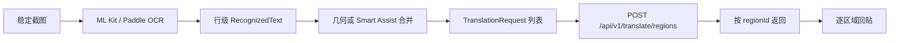
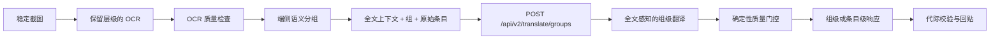
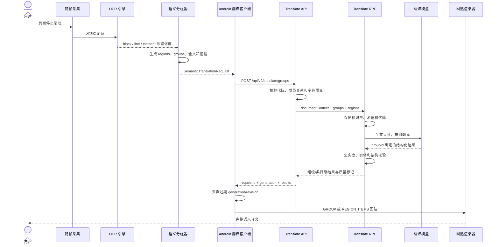
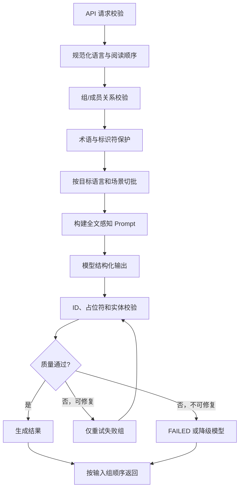

# Android 与后端全文感知语义组翻译改造方案

> 日期：2026-08-05  
> Android 基线：`ImageTranslateOCR@6f131e01566354bd3f1128d4f34c3bba6f961c56` 当前工作区  
> 后端基线：`pnuts@test@5e55f745728dc943f118d8215944251da70a76d8`  
> 目标：在保留 OCR 原始条目、坐标和现有回贴能力的前提下，让后端先理解完整视口，再按完整语义组翻译，必要时才输出逐条目译文。

## 1. 执行结论

本需求适合当前架构，但不能只增加一个 `fullText` 字段后继续逐 OCR 行独立翻译。推荐采用三层数据结构：

1. `documentContext`：当前稳定视口的只读全文，用于消歧，不直接产生译文。
2. `groups`：端侧整理出的标题、段落、聊天气泡、卡片或控件组，是主要翻译单元。
3. `regions`：OCR 原始行及坐标，负责编辑、追踪、局部保护和最终回贴。

后端应先读取 `documentContext`，再翻译指定 `groups`。正文、标题和聊天气泡默认返回组级译文；按钮、菜单和表格单元格按原始 region 返回。不要对同一内容先整体翻译、再逐条重新翻译，否则会增加成本并产生两套不一致的译文。

推荐新增公开接口：

```text
POST /api/v2/translate/groups
```

现有 `POST /api/v1/translate/regions` 保持兼容，不立即改变请求和响应语义。

## 2. 当前链路与问题

### 2.1 当前链路



### 2.2 已确认的结构损失

- ML Kit 原生提供 `TextBlock -> Line -> Element`，当前 `OCRManager.recognizeSingle()` 遍历 block 后只返回 line，block 身份和成员关系丢失。
- `RecognizedText` 只有文字、矩形、置信度和脚本，没有稳定 `regionId`、`blockId`、行序、角色和分组证据。
- `BackgroundTranslatedImageProcessor.groupLiveTextBlocks()` 可以合并行，但返回的仍是普通 `RecognizedText`，无法追溯成员行。
- `TranslateManager.translateBatch()` 只接收 `List<String>`，几何、场景、段落和阅读顺序在这里全部丢失。
- v1 后端的 `useContext=true` 只选择批次首尾相邻区域，不能表达同一句、同一卡片或同一气泡。
- v1 的 `scene`、`generation` 和 `translation.mode` 当前不参与模型决策。
- 服务端当前只验证结构、非空译文和占位符完整性，不验证漏译、增译、实体关系和术语一致性。

### 2.3 目标链路



## 3. 统一协议模型

### 3.1 请求层次

| 层次 | 用途 | 是否产生译文 | 主要字段 |
|---|---|---:|---|
| `documentContext` | 帮助模型理解页面主题、指代和相邻关系 | 否 | 全文、阅读顺序、语言 |
| `groups` | 完整语义翻译单元 | 是 | `groupId`、完整源文、成员 ID、角色、置信度 |
| `regions` | OCR 证据和几何锚点 | 视组模式而定 | 原文、坐标、block、行序、置信度 |

### 3.2 翻译单元模式

`groups[].translationUnit` 使用两种模式：

- `GROUP`：完整组只返回一段译文，在 `unionBounds` 内整体排版。用于标题、段落、聊天气泡和说明文字。
- `REGION_ITEMS`：模型看见完整组和全文，但逐成员返回译文。用于按钮、菜单、表格单元格和必须独立交互的区域。

默认规则：

| 角色 | 默认模式 |
|---|---|
| `TITLE`、`BODY`、`CHAT_MESSAGE`、`CAPTION` | `GROUP` |
| `BUTTON`、`MENU_ITEM`、`TABLE_CELL` | `REGION_ITEMS` |
| `CODE`、`URL`、`IDENTIFIER`、`BRAND` | `PRESERVED` 或上下文项 |
| 未知或低分组置信度 | 独立 `REGION_ITEMS`，不冒险合并 |

### 3.3 完整 Mock

可执行请求和响应分别位于：

- `docs/mock/semantic-group-translation.v2.request.json`
- `docs/mock/semantic-group-translation.v2.response.json`

## 4. 端到端时序



## 5. Android 端修改方案

### 5.1 OCR 数据模型保留层级

修改 `RecognizedText`，保留现有字段并追加可选元数据，避免一次性破坏所有调用方：

```kotlin
data class RecognizedText(
    val text: String,
    val bounds: Rect,
    val consensusScore: Float = 0.5f,
    val passCount: Int = 1,
    val modelConfidence: Float = 0f,
    val recognizerScript: RecognizerScript = RecognizerScript.CHINESE,
    val sourceBlockId: String? = null,
    val sourceLineIndex: Int? = null,
    val sourceElementCount: Int? = null
)
```

ML Kit 路径：

1. 遍历 `visionText.textBlocks` 时为 block 生成帧内稳定 ID。
2. `refineLine()` 返回结果时写入 `sourceBlockId` 和 block 内行序。
3. 多 pass 融合时，保留主要候选的 block 信息；冲突时将 block ID 置空，交给后续几何规则。

Paddle 路径没有原生 block 时：

1. 先返回 line/box。
2. 由统一分组器生成推断 block。
3. 将证据标记为 `GEOMETRY_INFERRED`，不能伪装成 OCR 原生 block。

### 5.2 新增统一语义模型

建议新建包：

```text
app/src/main/java/com/example/imagetranslate/semantic/
```

核心模型：

```kotlin
data class SemanticTextRegion(
    val regionId: String,
    val text: String,
    val bounds: Rect,
    val readingOrder: Int,
    val blockId: String?,
    val lineIndex: Int?,
    val role: TextRole,
    val confidence: Float,
    val sourceLanguage: String?,
    val targetLanguage: String?
)

data class SemanticTextGroup(
    val groupId: String,
    val memberRegionIds: List<String>,
    val sourceText: String,
    val unionBounds: Rect,
    val readingOrder: Int,
    val role: TextRole,
    val translationUnit: TranslationUnit,
    val groupingConfidence: Float,
    val evidence: Set<GroupingEvidence>
)

data class DocumentTranslationContext(
    val text: String,
    val readingOrderRegionIds: List<String>,
    val sourceLanguage: String?
)
```

枚举建议：

```kotlin
enum class TextRole {
    TITLE, BODY, CHAT_MESSAGE, CAPTION,
    BUTTON, MENU_ITEM, TABLE_CELL,
    CODE, URL, IDENTIFIER, BRAND, UNKNOWN
}

enum class GroupingEvidence {
    OCR_BLOCK, ACCESSIBILITY_CONTAINER, SAME_SURFACE,
    LEFT_ALIGNED, CENTER_ALIGNED, LINE_GAP,
    PUNCTUATION_CONTINUATION, SCRIPT_CONTINUITY,
    GEOMETRY_INFERRED
}
```

### 5.3 新增 `SemanticTextGrouper`

输入：完整稳定视口尺寸、按阅读顺序排列的 `RecognizedText`、可选 Accessibility/container 证据。

输出：`regions + groups + documentContext`。

推荐分组顺序：

1. 清理无效框和重复 OCR 行。
2. 使用 OCR 原生 block 形成初始组。
3. 使用容器、背景表面、列、对齐轴、行高和行间距修正组边界。
4. 使用标点、断词和大小写判断句子是否延续。
5. 分类角色，保护代码、URL、品牌、纯数字和控件标签。
6. 计算分组置信度；低于阈值时拆为独立区域，不进行激进合并。

必须满足的反误合并规则：

- 不跨不同列。
- 不跨明显不同的卡片、背景表面或聊天气泡。
- 按钮、菜单项和表格单元格不并入正文。
- 时间戳、用户名和状态标签可作为上下文，但默认不并入聊天正文。
- 代码块可整体保留，但不能与相邻说明文字合并。
- 不再使用固定“最多三行”作为段落边界；使用字符预算和置信度上限。

### 5.4 全文构建规则

`documentContext.text` 按组的阅读顺序生成，不直接使用 OCR 原始数组顺序：

```text
[TITLE] 页面标题
[BODY] 第一段完整文字
[BUTTON] 保存
[BUTTON] 取消
```

角色标签应由协议字段传递；上面的文本标签只用于模型输入的内部序列化，不应污染用户译文。

全文限制建议：

- 实时视口：最多 12000 Unicode 字符。
- 静态图片：最多 30000 Unicode 字符。
- 超限时保留当前待翻译组及前后邻近组，标题和页面主语优先。
- 不把密码输入框、隐私控件或被明确保护的文本加入全文。

### 5.5 翻译 Provider 改造

保留现有 `TranslationProvider` 给 v1 和本地 ML Kit 使用，新增组级接口：

```kotlin
interface SemanticTranslationProvider : AutoCloseable {
    suspend fun translate(
        request: SemanticTranslationRequest
    ): SemanticTranslationResult
}
```

新增：

- `RemoteSemanticTranslationProvider`：请求 `/api/v2/translate/groups`。
- `SemanticTranslationCoordinator`：选择 v2、v1 或本地回退。
- `SemanticTranslationRequestMapper`：把端侧模型映射为 JSON DTO。
- `SemanticTranslationResponseValidator`：校验 request/session/generation/group/member。

不要让 `TranslateManager.translateBatch(List<String>)` 承担新协议。该方法继续服务旧路径；新流程应接受结构化请求，避免再次丢失语义信息。

### 5.6 缓存、取消与代际

缓存键至少包含：

```text
backend + modelVersion + promptVersion + mode + sourceLanguage + targetLanguage
+ role + translationUnit + normalizedSourceText + relevantContextHash
```

不能只使用源文字作为组级缓存键，因为相同短词在不同场景可能有不同译法。

实时路径必须保留：

- `sessionId`
- `generation`
- `translationRevision`
- 每个 region 的 `sourceRevision`

响应中任一代际不匹配时丢弃整组，不能让旧上下文结果覆盖新画面。

### 5.7 回贴策略

`renderMode=GROUP`：

1. 使用组的 `unionBounds` 擦除原文。
2. 在整体区域内重新排版完整译文。
3. 点击详情时展示组原文、组译文和成员区域。
4. 恢复原文时恢复整个组，避免只恢复半句。

`renderMode=REGION_ITEMS`：

1. 每个 `regionId` 独立校验和绘制。
2. 允许部分成功。
3. 未返回、非法或质量低的成员保留原图。

不要把组译文按字符数机械切回源行。中英文语序不同，这种切分会重新制造断义。

### 5.8 Android 主要修改点

| 文件/模块 | 修改内容 |
|---|---|
| `ocr/OCRManager.kt` | 保留 block/line 层级 |
| `ocr/PaddleOcrEngine.kt` | 输出统一行证据，交给分组器 |
| `semantic/*` | 新增 region/group/context 与分组器 |
| `translate/TranslationProvider.kt` | 保留 v1，不强行扩展字符串接口 |
| `translate/RemoteSemanticTranslationProvider.kt` | 新增 v2 网络 Provider |
| `screenshot/BackgroundTranslatedImageProcessor.kt` | 统一静态/实时分组、请求和结果映射 |
| `ui/ImageTranslateActivity.kt` | 静态图片也使用组级翻译与组级复核 |
| `screenshot/ScreenTranslationOverlayView.kt` | 支持组级点击、恢复和状态展示 |

## 6. 后端修改方案

### 6.1 新接口与兼容边界

新增：

```text
POST /api/v2/translate/groups
```

保留：

```text
POST /api/v1/translate/regions
```

兼容策略：

- 老客户端继续调用 v1，行为不变。
- 新客户端优先调用 v2。
- v2 不可用时，端侧可以把每个 `GROUP` 降级为一个 v1 region；不要降级回组内逐行翻译。
- 后端不要在 v1 中静默改变 `results` 语义。

### 6.2 API DTO 与校验

建议在 `app/translate/api/desc/types/` 增加 `semantic_group_translate.api`。

请求级校验：

- `requestId/sessionId` 非空。
- `groups` 为 1 至 100 个。
- `regions` 为 1 至 300 个。
- `groupId/regionId` 在请求内唯一。
- 每个 group 的成员必须存在，且同一 region 只能属于一个产生译文的 group。
- `sourceText` 必须与成员文本按声明规则一致；不信任客户端任意替换原文。
- `bounds` 必须位于 viewport 内。
- 全文、组和区域分别执行字符预算。
- `GROUP` 至少有一个成员；`REGION_ITEMS` 必须声明全部待返回成员。

请求通过后，即使某个组失败，也返回 HTTP 200 和组级 `FAILED`；只有请求整体非法才返回 HTTP 400。

### 6.3 RPC 契约

不要继续往已有 `TranslateTextReqItem` 无限制追加字段。建议新增独立 RPC：

```proto
rpc TranslateSemanticGroups(TranslateSemanticGroupsReq)
    returns (TranslateSemanticGroupsResp);
```

RPC 输入保留：

- 请求、会话、画面代和配置修订。
- 文档全文。
- group、region、角色和阅读顺序。
- 术语集 ID 和保护策略。
- 质量模式。

RPC 输出保留：

- group 状态和渲染模式。
- 组级译文或成员级译文。
- 模型、Prompt、术语和质量规则版本。
- 不含原文的质量标记和错误代码。

### 6.4 后端处理阶段



### 6.5 Prompt 设计

基础 Prompt 必须进入代码或受版本管理的配置，不能只依赖数据库中不可追溯的自由文本。

建议拆为：

1. `semantic-translation-system-v1`：忠实度、输出协议、禁止增译。
2. 场景模板：UI、新闻、聊天、文档、代码说明。
3. 目标语言风格模板。
4. 术语和保护列表。

核心约束：

```text
- documentContext 只用于理解，不得为它生成结果。
- 只翻译 translateGroups。
- GROUP 返回完整组译文，不按源语言视觉行强行拆分。
- REGION_ITEMS 必须逐 memberRegionId 返回。
- 不总结、不解释、不扩写、不推断缺失事实。
- 保留否定、时间、数量、专名、因果和指代关系。
- 未知 ID、重复 ID、缺失 ID 均视为结构错误。
```

### 6.6 术语与实体保护

在现有正则占位符基础上增加服务端术语层：

- `PRESERVE`：品牌、产品、账号、代码符号不翻译。
- `FIXED_TRANSLATION`：指定固定译法。
- `PREFERRED_TRANSLATION`：模型优先使用，可因语法调整。
- 支持全局、企业、产品、场景四级作用域。

请求只传 `terminologySetIds`，不要把整套敏感词表从端侧发送。最终使用的 `terminologyVersion` 写入响应诊断。

### 6.7 质量门控

每个结果至少执行：

- JSON 和 ID 完整性。
- 占位符出现次数和恢复完整性。
- 数字、日期、时间、金额和版本号一致性。
- URL、邮箱、路径、品牌和代码实体一致性。
- 目标语言脚本与异常字符检查。
- 译文长度异常检测。
- 否定词和关键数量丢失检测。
- 同一请求内术语一致性检测。

质量失败分级：

| 类型 | 行为 |
|---|---|
| 结构错误、缺失 ID | 仅重试失败组 |
| 占位符或关键实体损坏 | 重试；仍失败则 `FAILED` |
| 轻微风格问题 | 返回结果并附 `STYLE_WARNING` |
| 疑似漏译、增译、否定丢失 | 使用修复 Prompt 或备用模型 |
| 上游超时、429、5xx | 按现有策略重试一次 |

不要用回译相似度作为唯一线上裁决。回译只可作为弱信号；离线评估应以黄金译文和盲测为主。

### 6.8 批次与并发

批次边界从“任意 10 个同目标语言 region”调整为：

1. 不拆分单个 group。
2. 按目标语言、场景和质量模式分组。
3. 每批最多 8 个 group 或 6000 字符。
4. `documentContext` 只附带相关窗口，避免每批重复完整 30000 字符。
5. 保留单请求并发 5、实例并发 20 和失败组一次重试。

### 6.9 可观测性与隐私

普通日志不得记录原文、全文、译文或术语值。允许记录：

- request/session/generation。
- group/region 数量和字符数。
- 场景、角色和翻译单元计数。
- prompt/model/terminology/quality-rule 版本。
- P50/P95 耗时、重试、失败类别和质量标记。

质量样本应走独立、明确授权的离线评测工具，不通过生产普通日志采集正文。

### 6.10 后端主要修改点

| 文件/模块 | 修改内容 |
|---|---|
| `app/translate/api/desc/types/` | 新增 v2 请求和响应 DTO |
| `app/translate/api/desc/translate.api` | 注册 `/v2/translate/groups` |
| `api/internal/logic/` | 请求校验、优先级和 RPC 映射 |
| `rpc/pb/translate.proto` | 新增独立组级 RPC |
| `rpc/internal/logic/` | 组级切批、上下文、质量门控和恢复 |
| `rpc/internal/trans/lib/trans_yunwu/` | 支持版本化 Prompt 和结构化响应配置 |
| Prompt 配置 | 增加版本、场景和回滚能力 |
| 测试目录 | 恢复并扩展曾删除的区域接口测试 |

## 7. Mock 数据说明

请求 Mock 覆盖四种对象：

1. 两个 OCR 行组成的新闻标题，按 `GROUP` 翻译。
2. 两个 OCR 行组成的正文段落，按 `GROUP` 翻译。
3. 两个独立 UI 控件，按 `REGION_ITEMS` 翻译。
4. Kotlin 代码块，返回 `PRESERVED`。

响应 Mock 展示：

- 标题和正文返回完整组译文。
- UI 控件逐 region 返回。
- 代码不返回 `translatedText`。
- 每个结果附模型、Prompt 和质量规则版本。

## 8. 测试方案

### 8.1 Android 单元测试

- ML Kit block/line 元数据保留。
- Paddle 几何 block 推断。
- 阅读顺序：单列、双列、聊天和卡片。
- 不跨按钮、卡片、气泡和代码边界。
- `documentContext` 字符预算和隐私过滤。
- group ID 在相同稳定视口下确定性一致。
- v2 JSON 序列化和响应关联。
- generation/sourceRevision 过期结果丢弃。
- GROUP 与 REGION_ITEMS 回贴选择。
- 组级缓存包含上下文哈希和版本。

### 8.2 Android 仪器测试

- 静态图片 OCR、人工复核、组级翻译、回贴和恢复。
- 实时滚动后只展示最终稳定 generation。
- 网络取消、超时和 v1 降级。
- 横竖屏、缩放和不同 DPI 坐标映射。
- 中文 UI、英文新闻、聊天、双列页面和代码页。

### 8.3 后端单元与契约测试

- DTO 边界、重复 ID、未知成员和越界坐标。
- 全文只做上下文，不产生额外结果。
- GROUP 和 REGION_ITEMS 输出数量约束。
- 分组不跨批次。
- 模型乱序响应仍恢复输入顺序。
- 只重试失败组，不重复翻译成功组。
- 结构错误、占位符错误和实体损坏。
- 并发 5/20、取消、20 秒尝试超时和总期限。
- v1 行为不回归。

### 8.4 黄金数据集

首批建议 100 至 300 个真实屏幕样本，按以下类型分层：

- UI 短标签。
- 新闻标题和长段落。
- 聊天气泡与用户名/时间戳。
- 双列、卡片和表格。
- 品牌、代码、URL、数字与混合语言。
- OCR 错字、漏字和低置信度小字。

每条样本标注：OCR 真值、region、group、角色、保护项、参考译文和可接受变体。

## 9. 验收指标

| 层级 | 指标 | 建议门槛 |
|---|---|---:|
| OCR | CER | 业务主样本不高于 5% |
| OCR | 漏检率 | 不高于 3% |
| 分组 | 跨容器误合并率 | 不高于 0.5% |
| 分组 | 段落边界 F1 | 不低于 0.92 |
| 翻译 | 实体/数字保持率 | 不低于 99.9% |
| 翻译 | 明显漏译/增译率 | 不高于 1% |
| 翻译 | 术语一致率 | 不低于 98% |
| 协议 | 结构化响应成功率 | 不低于 99.5% |
| 体验 | 静态图片 P95 | 不高于 15 秒 |
| 体验 | 实时稳定视口 P95 | 目标不高于 5 秒 |
| 状态 | 旧 generation 展示率 | 0 |
| 回贴 | 错误擦除率 | 0 |

最终质量判断使用盲测：组级方案相对当前逐行方案，人工偏好胜率至少达到 65%，且实体、数字和代码保护不得退化。

## 10. 分阶段实施计划

### 阶段 P0：质量基线和防回归

1. 恢复后端区域翻译被删除的测试。
2. 建立 Android 与后端共享的 Mock/黄金样本。
3. 固化 `modelVersion/promptVersion/qualityRuleVersion`。
4. 增加结构失败和质量失败分类指标。

完成条件：当前 v1 行为有可重复基线，线上模型和 Prompt 可追溯。

### 阶段 P1：端侧结构保真

1. OCR 保留 block/line 元数据。
2. 新增统一语义分组器和全文构建器。
3. 静态图片和实时屏幕统一生成 group。
4. 暂时把每个 group 当成一个 v1 region 请求，验证组级翻译收益。

完成条件：无需后端 v2 即可验证“分组本身”的质量提升。

### 阶段 P2：v2 组级协议

1. 新增 API/RPC 契约。
2. Android 接入 `RemoteSemanticTranslationProvider`。
3. 后端实现全文感知、组级切批和质量门控。
4. 回贴支持 GROUP/REGION_ITEMS。

完成条件：Mock、契约、单元和端到端测试通过；v1 不回归。

### 阶段 P3：术语、灰度与优化

1. 接入版本化术语集。
2. 对低质量组启用修复 Prompt 或备用模型。
3. 以场景为单位灰度，比较逐行、v1 组级和 v2 全文感知。
4. 达到质量和延迟门槛后逐步扩大流量。

回滚边界：Android 保留 v1 Provider 和本地 ML Kit；后端通过开关关闭 v2 或切回旧 Prompt/模型版本。

## 11. 明确不做的事项

- 不默认上传整屏图片给大模型。
- 不让模型直接生成最终像素坐标。
- 不把组译文按字符比例机械切回 OCR 行。
- 不对同一内容执行一次全文翻译再执行一次逐条翻译。
- 不使用生产普通日志收集原文和译文。
- 不在 Android 写死大规模业务术语表。

## 12. 风险与待确认项

1. 数据库中实际“C端文字翻译提示词”和线上模型版本仍需纳入版本治理。
2. Android 当前工作区包含大量未提交修改，实施时必须逐文件合并，不能覆盖现有 Paddle、网络引擎和实时滚动改造。
3. 端侧分组错误的危害高于少合并；阈值应偏保守，并通过黄金数据调整。
4. `REGION_ITEMS` 无法保证跨语言逐行严格等价，只适用于天然独立的控件和单元格。
5. v2 上线前必须恢复后端在合并前删除的测试，否则并发、重试和上下文逻辑缺少回归保护。

## 13. 可复现证据

- Android：`git rev-parse HEAD` 为 `6f131e01566354bd3f1128d4f34c3bba6f961c56`，分支 `main`，工作区非干净。
- 后端：`git rev-parse HEAD` 为 `5e55f745728dc943f118d8215944251da70a76d8`，分支 `test`。
- 后端演进：`cd808a01` 设计、`62d4e2ae` 并发批处理、`f2f95f7c` 协议加固、`5a44932a` 删除区域翻译测试、`5e55f745` 合入 test。
- 主要分析命令：`rg`、`nl -ba`、`git log`、`git show`、`collect_git_evidence.py --max-commits 2000`。

