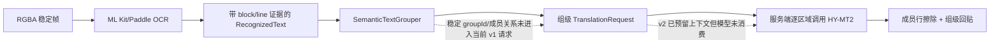
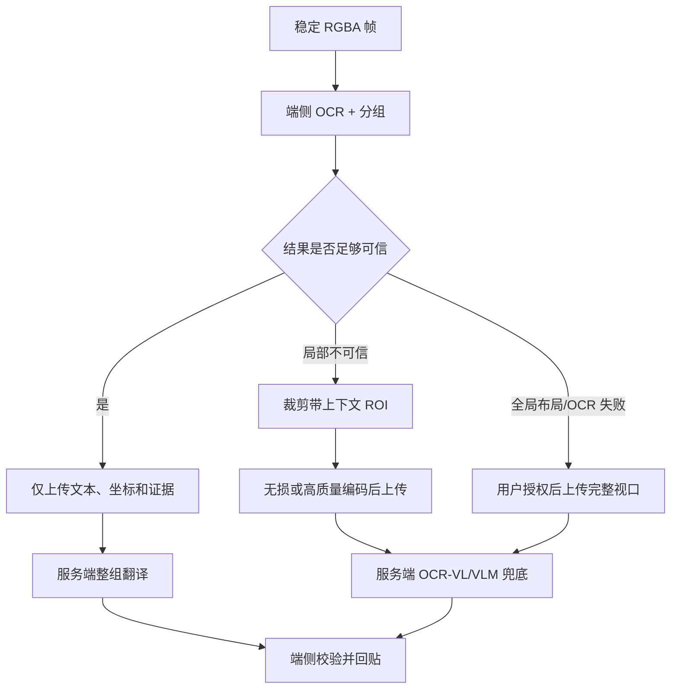

# OCR 与大模型结合及压缩图像端云方案调研

> 调研日期：2026-08-05
>
> 项目：ImageTranslateOCR
>
> 参考文档：[OCR 分段翻译断裂与回贴方案](./20260804_调研_OCR分段翻译断裂与回贴方案.md)
> 目标：结合当前 Android/服务端实现，给出兼顾端侧性能、翻译质量、坐标回贴、图像压缩和隐私的演进方案。

## 1. 执行结论

### 1.1 总体判断

**结论：方向与项目匹配，但需要调整实现重点。**

不建议把方案简单归结为“更换 PaddleOCR”或“整图交给 VLM”。当前项目已经具备可复用的基础：

- Android 端有 ML Kit/PaddleOCR 可插拔 OCR 引擎；
- 实时链路已有行级空间分组、Smart Assist 上下文分组、区域跟踪、差分识别和性能遥测；
- 客户端已有本地/远端翻译 Provider 切换；
- 服务端 v2 协议已经预留 `contextGroupId`、`CONTEXT_ONLY`、`generation` 和 `sourceRevision`。

本次改造前的主要缺口是：**OCR 结构信息在进入业务层时被降成了行列表；服务端虽然声明支持上下文，但模型调用仍逐区域独立执行。** 端侧前半段已在 2026-08-05 完成首次改造，服务端结构化组关系仍待实施。总体优先级为：

1. 保留 OCR 原生 block/line 层级，端侧先做确定性语义分组；
2. 按“语义组”调用翻译模型，并让输出绑定稳定的 `groupId/regionId`；
3. OCR/VLM 只在低置信度、未知脚本或复杂布局时升级，不进入默认实时热路径；
4. 默认只上传结构化文本。确需上传图像时，优先上传带上下文的 ROI，最后才是完整视口；
5. 本地 OCR 必须使用未经过有损编码的采集 Bitmap，压缩只作用于网络副本。

### 1.2 推荐的端云分工

| 层级 | 默认位置 | 职责 | 是否上传图像 |
|---|---|---|---|
| 采集、稳帧、差分 | 端侧 | 保留最新稳定视口，淘汰滚动中间帧 | 否 |
| OCR 与坐标 | 端侧 | 识别文字，保留 block/line/element 层级及置信度 | 否 |
| 确定性分组 | 端侧 | 用 block、几何、标点、脚本、UI/Accessibility 证据生成语义组 | 否 |
| 整组翻译 | 端侧或服务端 | 对完整句子/段落翻译，保护 URL、品牌、代码和数字 | 默认只上传文本 |
| 大模型辅助 | 服务端 | 处理歧义分组、OCR 纠错、长上下文翻译 | 通常不需要图像 |
| VLM 兜底 | 服务端 | 低置信度 ROI、复杂版面、未知脚本或 OCR 严重失败 | 按需上传 ROI/整图 |
| 回贴与过期裁决 | 端侧 | 使用本地坐标排版、渲染；丢弃旧 generation | 否 |

### 1.3 手机端方案适配度排序

| 顺位 | 方案 | 契合度 | 手机端实用性 | 建议 |
|---:|---|---|---|---|
| 1 | OCR block/坐标 + 确定性语义分组 + 整组翻译 + 组级回贴 | 很高 | 高 | 主线，优先验证 |
| 2 | 端侧分组 + 网络整组翻译 | 很高 | 高 | 默认高质量路径 |
| 3 | 大模型裁决歧义分组并完成翻译 | 中高 | 中 | 仅处理低置信度组，不进默认热路径 |
| 4 | ML Kit/PaddleOCR 双引擎质量路由 | 中 | 中高 | 在失败样本上验证收益，不先替换默认 OCR |
| 5 | PP-DocLayout 版面模型 | 中低 | 中低 | 文档/表格场景小范围验证 |
| 6 | VLM/OCR-VL 识别与翻译 | 默认路径低，兜底路径中 | 低 | 仅用于低置信度 ROI 或复杂版面 |
| 7 | 漫画专用的气泡检测/消字/回贴管线 | 低 | 中 | 与当前通用手机 UI 场景不匹配 |

### 1.4 翻译执行选择

- **网络整组翻译**：当前最适合作为高质量主路径，只上传文本组，不上传截图。
- **ML Kit 端侧翻译**：适合无网、隐私或快速降级，作为手机端实用基线。
- **Marian 等轻量本地模型**：作为第二阶段端侧质量实验，需单独评估包体、内存、发热和语种覆盖。
- **TranslateGemma 等较大端侧模型**：仅作高端机实验，不宜作通用默认方案。
- **整图 OCR+翻译模型**：只作兜底。已有项目记录中存在约 12.6 s 端到端样本，不适合实时主链路。

### 1.5 高契合度验证顺序

1. 先以 30-50 个代表性视口跑通指标和标注流程，再扩展到至少 200 个视口。
2. 保留 OCR block/line 证据，引入 `SemanticTextGroup`，先与现有端侧翻译和组级回贴打通。
3. 将同一批语义组切换到 Pnuts/网络翻译，对比逐行和整组的成功率、质量与时延。
4. 演进服务端结构化协议，让 `documentContext/groups/regions` 真正进入模型输入和结构化输出。
5. 在相同语义组上对比 ML Kit 翻译、网络模型和可选本地模型。
6. 只在 OCR 失败样本上比较 ML Kit/PaddleOCR 双引擎路由。
7. 只在前述路径无法解决的复杂版面上验证 PP-DocLayout 或 VLM ROI 兜底。

### 1.6 当前实施状态

2026-08-05 已完成第一步代码改造：ML Kit OCR 保留 block/line 证据，新增统一 `SemanticTextGrouper`，并将静态图片、后台截图和实时翻译收敛为“组文本翻译 + 成员行擦除 + 组外接框回贴”。当 OCR 没有 block 信息时（如当前 Paddle 路径），使用几何、列、间距和特殊角色规则回退分组。

已添加 5 个分组单元测试，覆盖五行 block、不同 block、时间戳、Paddle 几何段落和双栏；完整 `:app:testDebugUnitTest` 已通过。当前仍没有将稳定 `groupId/memberRegionIds` 传入 Pnuts v1 协议，这属于上述第 4 步。

### 1.7 验证记录索引

从本次起，每次验证完成后都在下表追加一行；详细报告与原始输入/输出放在 `docs/validation/<validation-id>/`，不只更改结论而不保留证据。

| ID | 日期 | 验证 | 结论摘要 | 详细报告 | 机读摘要 |
|---|---|---|---|---|---|
| V001 | 2026-08-05 | Pnuts 逐行 vs. 语义组 | 逐行 0/6 成功，整组 1/1 成功；支持优先实施语义组主线 | [报告](./validation/pnuts-semantic-grouping-2026-08-05/README.md) | [`summary.json`](./validation/pnuts-semantic-grouping-2026-08-05/summary.json) |
| V002 | 2026-08-05 | 当前真机页面 OCR + Pnuts | OCR 21 行/19 组；发现 2 处欠合并；Pnuts 批量 0/12，严格单组对照 9/12 | [报告](./validation/current-page-ocr-pnuts-2026-08-05/README.md) | [`summary.json`](./validation/current-page-ocr-pnuts-2026-08-05/summary.json) |

## 2. 当前项目基线

### 2.1 已确认事实

| 事实 | 项目证据 | 影响 |
|---|---|---|
| 屏幕采集使用 RGBA 原始帧 | `OneShotScreenCaptureService.kt:546-552,1180-1191` | 本地 OCR 前没有 JPEG/WebP 压缩损失 |
| 实时 OCR 最长边限制为 2880 px | `LiveOcrScalePolicy.kt:7-28` | 1440x3200 画面会先缩小到约 1296x2880 |
| PaddleOCR 检测最长边为 1280 px | `PaddleOcrEngine.kt:21-32,100-103` | 对超长屏幕的小字存在进一步缩小风险 |
| ML Kit 返回的 block/line 已保留到业务模型 | `OCRManager.kt:808-845` | 语义分组可优先使用 OCR 原生结构证据 |
| 统一分组器已取代实时链路的三行硬上限 | `SemanticTextGrouper.kt`、`BackgroundTranslatedImageProcessor.kt:1631-1646` | 长 block 可保持完整，不同 block、时间戳和不同列优先隔离 |
| Smart Assist 已能合并 BODY 组 | `BackgroundTranslatedImageProcessor.kt:706-752` | 可以复用为统一语义分组入口 |
| Smart Assist 当前是离线确定性规则 | `DeterministicAssistProvider.kt:16-70` | 延迟低，但不是大模型语义判定 |
| Smart Assist 只接收最多 4 个区域、512 字符的上下文组 | `BackgroundTranslatedImageProcessor.kt:728-740,1706-1707` | 长段落和多行气泡仍会被拆开 |
| 翻译调用已经批量化 | `BackgroundTranslatedImageProcessor.kt:860-927` | 具备按组改造的入口 |
| 客户端 v1 仅发送文本，不发送坐标和组关系 | `RemoteTranslationProvider.kt:67-103` | 服务端无法稳定重建段落或回贴关系 |
| 服务端 v2 契约含组 ID 与上下文区域 | `translation-service/src/contract.rs`、`docs/ocr-translation-backend-contract.md` | 协议方向正确，可继续扩展 |
| 服务端 v2 实际仍逐区域调用模型 | `translation-service/src/routes.rs:203-274` | `useContext/contextGroupId` 当前没有进入模型输入 |
| HY-MT2 提示词一次只翻译一个文本 | `translation-service/src/model.rs:77-98` | 同组上下文仍会断裂 |
| 当前文本接口限额 256 KiB | `translation-service/src/contract.rs:4-7` | 不应直接复用为图片上传接口 |

### 2.2 已有实测基线

固定 1440x3200 页面、同一台 `23113RKC6C` 设备的现有记录显示：

| 引擎 | P50 | P90 | 区域数 | 字符数 |
|---|---:|---:|---:|---:|
| ML Kit | 397 ms | 441 ms | 26 | 792 |
| PaddleOCR（当前选定配置） | 727 ms | 748 ms | 28 | 810 |

证据：`docs/validation/ocr-engine-same-screen-2026-08-03.json`。

这组数据只说明当前固定页面与设备上的速度/召回差异，不能证明某个引擎在所有图片上更准确。它足以支持一个工程判断：**ML Kit 更适合默认实时热路径；PaddleOCR 更适合作为可选高召回或无 GMS 路径，除非后续业务样本证明其质量收益足以抵消约 1.8 倍 P50 时延。**

### 2.3 当前数据流中的关键断点



## 3. 对原调研文档的校正与补充

### 3.1 可保留的结论

- OCR 负责像素坐标，大模型负责语义，是合理的职责分工；
- 逐行独立翻译是断义的直接原因；
- 合并后应保留子行坐标和段落外接框；
- 纯色 UI 可用表面色覆盖，复杂背景应使用模糊材质或 inpainting；
- VLM 不应在缺少稳定定位协议时直接负责最终回贴。

### 3.2 需要降级为假设的结论

1. **“PP-DocLayout 能直接识别 WhatsApp 气泡、用户名和时间戳”没有足够依据。**

   PP-Structure/PP-DocLayout 的公开能力面向文档图片中的文本、标题、表格、公式、图表等布局元素。聊天气泡是应用 UI 组件，不等同于训练标签中的文档段落。它可以作为服务端实验项，但不能未经业务数据验证就替换端侧分组。

2. **“PaddleOCR 一定是本案例最佳 OCR 引擎”与项目实测不一致。**

   项目当前同屏测试中 PaddleOCR 召回略高，但 P50 明显慢于 ML Kit。选型需要同时比较字符错误率、漏检率、错框率、分组质量、热稳定性、内存和包体，而不是只看公开模型指标。

3. **“VLM 无法返回坐标”已经过于绝对。**

   通用 VLM 的精确坐标仍不应直接信任，但 2026 年的专用 OCR-VL 模型已经支持 text spotting 或异形框定位。问题从“完全不能”变成了“是否能在业务图片上稳定绑定本地 region ID、是否满足端侧/服务端成本和延迟”。

4. **优先使用 OCR 已有 block，而不是先新增重量级版面模型。**

   ML Kit Text Recognition v2 本身返回 block、line、element、symbol 及坐标。项目在本次改造前主动丢弃了 block 层级，现已保留 block/line 证据。复用这部分原生结构信息，成本远低于加入新的端侧版面模型。

## 4. OCR 与大模型结合的推荐架构

### 4.1 P0：端侧确定性语义分组

新增统一的 `SemanticTextGroup`，不要直接把多个 `RecognizedText` 拼成一个不可追踪的新行：

```kotlin
data class SemanticTextGroup(
    val groupId: String,
    val memberRegionIds: List<String>,
    val sourceText: String,
    val unionBounds: PixelBounds,
    val lineBounds: List<PixelBounds>,
    val readingOrder: Int,
    val role: TextRole,
    val groupingConfidence: Float,
    val evidence: Set<GroupingEvidence>
)
```

建议证据优先级：

1. OCR 原生 `blockId` 和行顺序；
2. 可用时的 Accessibility 节点/容器边界；
3. 同背景色或同气泡/卡片表面、左/中对齐、行高、垂直间距；
4. 标点、断词、大小写、列表前缀和脚本连续性；
5. Smart Assist 场景与角色；
6. 低置信度时才请求服务端大模型裁决。

必须设置反误合并规则：

- 不跨不同 OCR block，除非有更强容器证据；
- 不跨明显不同背景表面、列、卡片、气泡或对齐轴；
- 时间戳、按钮、URL、代码、用户名默认独立或 `CONTEXT_ONLY`；
- 最大行数不再固定为 3，而是由字符预算、区域结构和置信度共同限制；
- 每个合并决策记录 evidence，便于离线回归。

### 4.2 P1：按组进行上下文翻译

不要让服务端继续并行翻译同组内的每一行。推荐两种输出模式：

#### 模式 A：组级翻译与组级回贴（默认）

- 输入：完整 `sourceText` + `groupId` + 成员行信息；
- 输出：一段 `translatedText`；
- 渲染：在 `unionBounds` 内重新排版；
- 优点：翻译质量最好，模型无需猜测如何把目标语言重新切回源语言行；
- 适用：段落、聊天气泡、说明文字、新闻标题。

#### 模式 B：组级上下文、成员级输出（受限场景）

- 输入：同组所有成员，每个成员带稳定 `regionId`；
- 输出：严格 JSON，逐成员回传，但模型能看到完整组上下文；
- 适用：成员区域不能合并覆盖、必须分别交互或分别回贴时；
- 风险：源语言与目标语言语序不同，强行逐行对齐可能再次破坏翻译。

因此模式 B 不应成为长段落默认方案。

### 4.3 P1：大模型应承担的任务

| 任务 | 是否推荐 | 说明 |
|---|---|---|
| 完整语义组翻译 | 推荐 | 是解决断义的主要收益点 |
| 结合 OCR alternatives 纠错 | 条件推荐 | 只处理低置信度词，不允许无证据改写全文 |
| 歧义边界判断 | 条件推荐 | 输出成员 region ID，不输出自由坐标 |
| 专名、URL、代码、数字保护 | 推荐 | 同时用端侧规则和服务端校验双保险 |
| 直接生成像素坐标 | 不推荐 | 坐标仍以 OCR/端侧变换矩阵为准 |
| 每帧整图 VLM 翻译 | 不推荐 | 延迟、流量、成本、隐私和过期结果风险过高 |

服务端翻译模型建议：

- 将 temperature 从当前 `0.7` 降到 `0-0.2`，提高翻译和结构化输出稳定性；
- prompt 明确“忠实翻译，不补充、不总结、不解释”；
- 使用 JSON Schema 或等价的强结构校验；
- 输出必须引用请求中的 `groupId/regionId`，未知 ID 直接拒绝；
- 缓存键包含源文、源/目标语言、模型版本、prompt 版本和保护策略；
- 结构校验失败时回退传统翻译模型，不把自由文本猜测映射回坐标。

### 4.4 P2：VLM 只做分级兜底

建议触发条件满足任一项时才上传图像：

- OCR 无结果，但质量检测确认画面含有可见文字；
- 平均/最低 OCR 置信度低于业务阈值；
- OCR 引擎对当前脚本不支持；
- 多个 OCR pass 差异显著，且端侧规则无法裁决；
- 复杂表格、图文混排、严重透视/弯曲/屏摄畸变；
- 分组模型连续出现高风险跨区合并。

VLM 响应仍应优先绑定客户端提供的 ROI/region ID。只有在客户端完全未检测到文字时，才允许模型提出新框；新框必须经过边界合法性、文本像素覆盖和二次 OCR/检测校验后才能回贴。

## 5. 服务端协议演进建议

### 5.1 保留文本接口，新增组级语义

当前 v2 结构可以演进为：

```json
{
  "schemaVersion": 3,
  "requestId": "...",
  "sessionId": "...",
  "generation": 43,
  "translationRevision": 8,
  "groups": [
    {
      "groupId": "track-1042-r3+track-1043-r1",
      "role": "TRANSLATE",
      "readingOrder": 0,
      "sourceText": "The country decided ... the Web3 community.",
      "memberRegionIds": ["track-1042", "track-1043"],
      "groupingConfidence": 0.93,
      "groupingEvidence": ["OCR_BLOCK", "LEFT_ALIGNED", "LINE_GAP"],
      "bounds": {"left": 64, "top": 318, "right": 900, "bottom": 458}
    }
  ]
}
```

响应：

```json
{
  "groupId": "track-1042-r3+track-1043-r1",
  "status": "TRANSLATED",
  "translatedText": "该国决定……Web3 社区。",
  "memberRegionIds": ["track-1042", "track-1043"],
  "modelVersion": "...",
  "promptVersion": "group-translation-v1"
}
```

客户端继续拥有最终裁决权：`generation`、`translationRevision`、成员 `sourceRevision` 任一不匹配时整组丢弃。

### 5.2 不要伪装成“支持上下文”

当前服务端 capability 返回 `supports_context_only_regions=true`，但执行路径过滤掉 `CONTEXT_ONLY` 后逐项调用模型。实现组级模型输入前，应：

- 暂时将 capability 标记为 false；或
- 明确定义为“协议可接收但模型不消费”，避免客户端误判；
- 完成组级实现后增加契约测试，证明修改某个 context-only 文本会影响相关组输入，但不会产生自身译文结果。

### 5.3 文本与图片接口分离

不要把现有 256 KiB JSON 文本接口的 body limit 直接放大。建议新增：

- `POST /api/v3/translation-groups`：文本和坐标 JSON；
- `POST /api/v3/vision-fallbacks`：`multipart/form-data`，一段 JSON metadata + 一个二进制图像 part；
- 大图/异步场景再考虑短期签名对象存储，实时 ROI 不必多一次对象存储往返。

## 6. 压缩采集图像与上传方案

### 6.1 先区分三类“压缩”

| 类型 | 当前项目情况 | 建议 |
|---|---|---|
| MediaProjection 采集格式 | `RGBA_8888` 原始像素 | 保持，直接用于稳帧、差分和本地 OCR |
| OCR 前缩放 | 实时最长边 2880；Paddle 内部 1280 | 依据最小字符像素高度调节，不只看最长边 |
| 网络编码 | 当前默认不上传图片 | 从原始 Bitmap 的副本一次编码，禁止反复转码 |

压缩问题的首要原则是：**压缩网络副本，不压缩 OCR 工作源；缩放和编码只做一次；所有坐标保留到原始采集空间。**

### 6.2 默认分级上传



建议的升级层级：

- L0：全端侧 OCR + 本地翻译，不上传；
- L1：上传文本组，服务端大模型翻译；
- L2：上传失败组的 ROI + 本地 OCR 候选；
- L3：完整视口，仅用于全局布局或端侧 OCR 大面积失败，并要求显式授权。

### 6.3 编码格式建议

| 输入类型 | 首选 | 可选 | 不建议 |
|---|---|---|---|
| UI 截图、小字、线条、代码 | WebP lossless 或 PNG | WebP lossy 高质量，必须经 OCR 回归验证 | 低质量 JPEG |
| 相机照片、连续色调背景 | JPEG/WebP lossy，质量从 90 附近实验 | ROI 可用 lossless | PNG 整图造成不必要流量 |
| 已经是 JPEG/WebP 的导入图 | 尽量上传原始字节 | 仅在尺寸超限时解码后一次重编码 | 多次有损转码 |
| 透明图层 | WebP lossless 或 PNG | - | JPEG（丢失 alpha） |

Android 注意事项：

- 项目 `minSdk=24`，`Bitmap.CompressFormat.WEBP_LOSSLESS/WEBP_LOSSY` 是较新 API，必须做版本分支或使用自带编码库；
- 旧设备可退回 PNG（UI ROI）或 JPEG 90+（照片）；
- 不建议一期使用 AVIF 做实时上传，主要原因是编码耗时、兼容路径和端侧收益尚未在目标设备验证。

质量值不能直接代表跨编码器的同等视觉质量。`90` 只应作为 A/B 起点，不是冻结协议值。

### 6.4 缩放策略：按字符高度，不按固定长边

ML Kit 官方建议理想情况下字符至少约 16x16 像素。项目应在 OCR 初检或 UI 尺度估计后计算：

```text
encodedCharacterHeight = sourceCharacterHeight * encodedHeight / sourceHeight
```

只有当目标编码后最小有效字符仍不低于质量门槛时才允许缩小。建议：

- 普通 OCR/VLM ROI：以最小字符高度不低于 16 px 为初始门槛；
- 极细字体、压缩历史图、CJK 小字：从 20-24 px 档开始实验；
- 低于门槛时优先保留 ROI 原分辨率，不要先缩整图再裁 ROI；
- ROI 外扩 1-2 个行高，保留上下文、气泡边界和相邻行；
- 如果多个 ROI 总面积已接近整图，应合并相邻 ROI 或改传完整视口，避免 multipart 头和重复背景开销。

项目当前 PaddleOCR 1280 最长边配置需要单独验证 1440x3200 小字：缩放比例约为 0.4，源字符高度 24 px 会降到约 10 px，可能低于理想输入范围。

### 6.5 上传坐标与图像元数据

图像 part 使用二进制，不要放入 Base64 JSON。Base64 的理论体积约增加三分之一，并会额外产生客户端字符串和服务端解码内存。

metadata 至少包含：

```json
{
  "schemaVersion": 1,
  "requestId": "...",
  "sessionId": "...",
  "generation": 43,
  "source": {"width": 1440, "height": 3200, "rotationDegrees": 0},
  "encoded": {
    "width": 1080,
    "height": 640,
    "mimeType": "image/webp",
    "qualityMode": "LOSSLESS",
    "sha256": "..."
  },
  "cropInSource": {"left": 120, "top": 900, "right": 1320, "bottom": 1611},
  "regionIds": ["track-1042", "track-1043"],
  "ocrCandidates": []
}
```

服务端输出坐标时必须明确坐标空间。推荐仍返回 `source` 像素坐标；服务端内部坐标通过以下变换还原：

```text
sourceX = cropLeft + encodedX * cropWidth / encodedWidth
sourceY = cropTop  + encodedY * cropHeight / encodedHeight
```

客户端最终做 clamp、最小面积、越界、重叠和像素证据校验。

### 6.6 服务端安全、隐私与资源治理

- 生产环境仅 HTTPS，短期访问令牌；
- 首次启用图片云端兜底时明确告知，完整视口上传需更强提示；
- 默认不持久化原图，不在日志中记录图像、OCR 全文、Base64 或可识别个人信息；
- 分离图片字节限额、像素总数、宽高、ROI 数、解码时间和模型超时；
- 校验 MIME 与文件 magic，不信任扩展名；
- 在解码前检查声明尺寸，在解码后再次检查，防止解压炸弹；
- 取消/过期 generation 只节省资源，端侧关联字段校验仍是最终正确性保障；
- 服务端缓存优先缓存不可逆内容指纹和模型结果，不缓存原始图片；
- 图像故障与文本翻译故障分开限流、熔断和观测。

## 7. 端侧性能策略

### 7.1 热路径约束

- 滚动期间不运行 OCR/LLM，不排队中间帧，继续沿用当前 latest-only 策略；
- 一次稳定视口最多一个在途 generation；
- 端侧分组必须是线性或近线性复杂度，目标耗时应远低于 OCR；
- ML Kit 作为默认实时引擎；PaddleOCR、增强 pass 和 VLM 按质量路由；
- OCR、图片编码、网络和渲染均不得阻塞主线程；
- 图像编码启动前再次检查 generation，编码完成后再检查一次，避免上传已经滚走的页面；
- 缓存以 `trackId + sourceRevision + language + model/promptVersion` 为边界，不能只按裸文本缓存。

### 7.2 建议新增遥测

| 阶段 | 指标 |
|---|---|
| 图像质量 | 模糊度、最小字符高度、缩放比例、编码格式/质量、编码字节数 |
| OCR | 引擎、P50/P95、区域/字符数、低置信度比例、block 数、脚本 |
| 分组 | 组数、平均/最大成员数、证据、过合并/欠合并人工标签 |
| 翻译 | 文本/ROI/整图路由、模型与 prompt 版本、缓存命中、结构校验失败 |
| 网络 | 上行字节、编码耗时、排队、TTFB、取消、迟到响应 |
| 回贴 | 溢出率、最小字号、遮挡率、无效坐标、旧 generation 丢弃数 |
| 端侧资源 | 峰值内存、持续运行温升、CPU 降频、功耗、OOM/ANR |

日志中只记录统计量、散列 ID 和枚举，不记录原始屏幕内容。

## 8. 分阶段实施建议

### P0：先修复上下文链路，不上传图片

1. `RecognizedText` 增加稳定 `regionId`、`blockId`、`lineIndex`、`readingOrder`；
2. ML Kit adapter 保留 `TextBlock`，Paddle adapter 用几何 block 作为兼容结构；
3. 把 `groupLiveTextBlocks` 与 Smart Assist 合并为单一 `SemanticTextGrouper`；
4. 静态图片和实时图片统一走语义组，不只在 `fastOcr=true` 时分组；
5. 服务端增加组级翻译调用，真正消费 context；
6. 默认组级回贴，保留成员行用于擦除、证据展示和失败降级；
7. 为跨气泡、时间戳、用户名、列表、双栏和代码块增加黄金样本测试。

这是投入最小、最直接解决“分段翻译断裂”的阶段。

### P1：结构化大模型辅助

1. 增加歧义组 adjudication 接口，输入 region IDs、文本、框和规则证据；
2. 服务端只返回 group membership 和译文，不自由生成坐标；
3. 增加 JSON Schema、ID 白名单和忠实性检查；
4. 低置信 OCR 发送候选文本，不先发送图片；
5. 对组级传统 MT 与 LLM 翻译做盲测，确认收益后再灰度。

### P2：ROI 图像兜底

1. 新增独立 multipart 接口和端侧一次编码器；
2. 从 WebP lossless/PNG ROI 开始，不先做整屏视频式上传；
3. 服务端接入 OCR-VL/VLM，响应绑定 region/ROI ID；
4. 完成隐私提示、限流、TTL、审计和故障回退；
5. 只有 ROI 召回仍不足时才开放完整视口上传。

### 暂不建议

- 每个稳定帧都上传整图；
- 在端侧默认运行 0.9B 级 OCR-VL；
- 用 PP-DocLayout 未经训练直接判定聊天气泡；
- 让 LLM 自由返回像素坐标并直接覆盖原图；
- 先压缩整图，再从压缩图裁 OCR ROI；
- 仅以星级表或单张截图决定 ML Kit/PaddleOCR/VLM 选型。

## 9. 最小可逆实验与验收

### 9.1 实验 A：语义组翻译

数据集至少覆盖 200 个稳定视口，包含聊天、新闻/长文、设置、商品、代码、双栏、深浅色和中英混排。

对照：

- A0：当前逐行/最多三行翻译；
- A1：ML Kit block + 规则分组 + 组级翻译；
- A2：A1 + Smart Assist；
- A3：A2 + 服务端大模型歧义裁决。

验收指标：

- 断句/断词错误显著下降；
- 跨气泡/跨卡片过合并率不高于既定门槛；
- 人工盲评的忠实度和流畅度优于 A0；
- 译文回贴无成员错配，旧 generation 展示为 0；
- P95 分组耗时相对 OCR 可忽略；
- 端到端 P50/P95、峰值内存和温升不超过产品预算。

### 9.2 实验 B：压缩质量矩阵

对 UI 截图和相机照片分开测试：

- 原始 RGBA/PNG；
- WebP lossless；
- WebP lossy 95/90/85；
- JPEG 95/90/85；
- 缩放 1.0/0.75/0.5；
- 最小字符高度按 10/12/16/20/24 px 分桶。

每档记录：

- 字节数、编码/解码耗时、峰值内存；
- OCR 字符错误率、词错误率、漏检率、错框率；
- 分组 F1、过合并率、欠合并率；
- VLM/OCR-VL 结构化输出成功率；
- 服务端总时延和单位请求成本。

先根据数据选择 codec/quality/scale 路由，不在协议中写死“JPEG 90 一定足够”。

### 9.3 试点判定

建议先上线“文本组上传”，图片兜底保持关闭。满足以下条件后再进入 ROI 试点：

- 大部分断裂问题已经由组级翻译解决；
- 剩余失败明确来自 OCR 质量或复杂视觉布局；
- ROI 上传在真实弱网下有可接受的成功率和延迟；
- 用户授权、隐私、服务端限额和删除策略完成；
- ROI 路径失败时能无闪烁地回退本地结果。

## 10. 外部资料

- [ML Kit Text Recognition v2 文本层级](https://developers.google.com/ml-kit/vision/text-recognition/v2)
- [ML Kit Android 输入图像建议](https://developers.google.com/ml-kit/vision/text-recognition/v2/android)
- [Android Bitmap.CompressFormat](https://developer.android.com/reference/android/graphics/Bitmap.CompressFormat)
- [PaddleOCR PP-StructureV3](https://www.paddleocr.ai/main/en/version3.x/algorithm/PP-StructureV3/PP-StructureV3.html)
- [PaddleOCR-VL 使用与服务端部署](https://github.com/PaddlePaddle/PaddleOCR/blob/main/docs/version3.x/pipeline_usage/PaddleOCR-VL.en.md)
- [PaddleOCR-VL-1.5 论文](https://arxiv.org/abs/2601.21957)
- [PaddleOCR-VL-1.6 论文](https://arxiv.org/abs/2606.03264)
- [DeepSeek-OCR 论文](https://arxiv.org/abs/2510.18234)
- [对 DeepSeek-OCR 语言先验与幻觉风险的独立分析](https://arxiv.org/abs/2601.03714)

## 11. 限制与复现信息

- 仓库 revision：`6f131e01566354bd3f1128d4f34c3bba6f961c56`（`main`）；
- 仓库非 shallow clone；
- 当前工作区包含大量未提交的 OCR、Paddle、远端翻译和测试改动，本报告按当前工作区代码分析，不假设所有内容已经进入 HEAD；
- Git 历史采样：109 个当前可见提交，重点检查 `c728d8b`（实时文本块分组）、`ea89de6`（Smart Assist）和近期 OCR/实时滚动改动；
- Git 证据命令：`collect_git_evidence.py --repo . --max-commits 2000`、`git log`、`git show`；
- 代码证据命令：`rg`、`nl -ba`、针对 OCR/截图/翻译/服务端入口的定向读取；
- 外部能力与版本会变化，最终选型必须以目标设备、真实业务图片、固定模型与固定编码器的回归结果为准。
