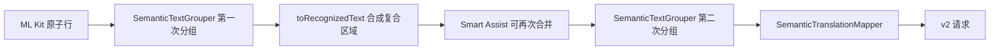
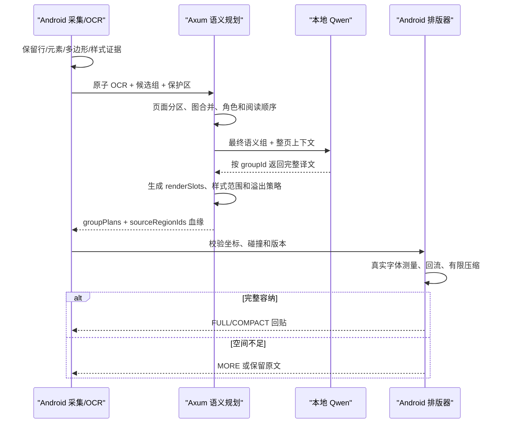

# 服务端语义重组与声明式回贴规划

日期：2026-08-07

## 1. 分析范围

本次基于两条真实请求记录、对应全屏图片、请求/响应 JSON 和 Web 布局还原结果进行分析：

- 案例 A：`c8dc210c-8578-470c-8d20-2af5fd45cc80`
- 案例 B：`51c72c83-884d-4e08-a5bc-4589329dc2bb`

案例 A 是新华网页文章，端侧上传 8 个 OCR 区域和 8 个语义组；案例 B 是聊天页面，端侧上传 30 个 OCR 区域和 14 个语义组。案例 B 的还原明显更接近原页面。


## 2. 结论先行

整体方案判定为 **fits with adjustments（目标契合，但职责边界需要调整）**：

1. 服务端适合负责语义重组、阅读顺序、角色判断、整组翻译和声明式布局计划。
2. 前提是端侧必须上传无损 OCR 原子信息。服务端无法从一个已经合并的大矩形中恢复真实逐行坐标。
3. 服务端可以返回文字样式、布局槽、多边形边界、对齐方式、字号缩放范围和溢出策略，让 App 按计划绘制。
4. 服务端不应返回最终字形坐标或要求 App 无条件照画。Android 仍必须使用真实字体、屏幕密度和 `StaticLayout` 做最终测量、碰撞检查和安全回退。
5. 最合理的主线是：**端侧无损采集 -> 服务端语义图重组 -> 整组翻译 -> 服务端声明式布局计划 -> 端侧确定性排版与安全裁决。**

## 3. 两个案例的事实对比

| 指标 | 案例 A：新华文章 | 案例 B：聊天页面 |
|---|---:|---:|
| viewport | 1440 x 3200 | 1080 x 2400 |
| 上传调试图 | JPEG 486 x 1080 | JPEG 486 x 1080 |
| OCR 区域 | 8 | 30 |
| 语义组 | 8 | 14 |
| 输入字符 | 565 | 673 |
| Qwen 耗时 | 31234ms | 24147ms |
| Web 最终布局 | MORE 6、COMPACT 2 | COMPACT 10、MORE 3、FULL 1 |
| 长正文几何 | 每段一个大矩形 | 17 行保留 17 个成员区域 |
| 长正文行数提示 | 错误地返回 1 | 正确返回 17 |

### 3.1 案例 A 的关键问题

标题原文包含 4 行：

```text
Laos issues warning as
prolonged rains trigger
flooding,landslides in
several areas
```

但请求中它只有一个成员：

```text
memberRegionIds = [semantic-6843d974-region-0]
bounds = [29,650,1350,1168]
renderSlots = [[29,650,1350,1168]]
```

两个正文段也分别被压成一个大区域。服务端当前以 `memberRegionIds.size` 计算 `sourceLineCount`，因此标题和正文全部被判断为 1 行，并返回 `preferredMaxLines=1`。这直接导致 Web 还原中 8 个组有 6 个进入 `MORE`，且标题出现异常大字。

角色识别也受到压缩影响：

- 四行新闻标题被标为 `BODY`，没有识别为 `TITLE`。
- `Source: Xinhua Editor: huaxia ...` 被标为 `BODY`，没有识别为 `METADATA`。
- 新闻 Logo 残片 `EWS` 被当作正文翻译成“紧急预警”。
- `XINHUANET` 被当作普通正文翻译，缺少品牌/标识保护信息。

### 3.2 案例 B 为什么更好

聊天长气泡虽然是一个语义组，但 17 行 OCR 仍对应 17 个稳定成员 ID 和 17 个独立行框：

```text
groupId = semantic-f71295cc
memberRegionIds = region-0 ... region-16
sourceLineCount = 17
preferredMaxLines = 17
renderSlots = [[153,807,905,1769]]
```

因此服务端能理解它是“一个语义段、17 行占用空间”，Qwen 得到完整上下文，布局器也拥有正确行预算。长气泡最终为 `FULL`。这说明正确结构不是“所有文字都拆成独立翻译”，而是：

```text
原子 OCR 行保持独立证据
        +
多个原子行归属同一个语义组
```

案例 B 仍有角色问题，例如 `Feux Lee ... instagram` 和 `DannV` 被标为 `BODY`。因此它的几何链路较好，但语义角色判断仍可由服务端增强。

## 4. 当前链路的根因

当前实时识别链路存在两次分组：



`toRecognizedText()` 和 `mergeLiveTextLines()` 在内存中还保留 `componentBounds`，但 `SemanticTranslationMapper` 只按最终 `members` 创建请求 region，并只序列化成员的总 `bounds`。因此复合区域内部的逐行 `componentBounds` 没有进入协议。

服务端当前还有三个硬约束：

1. `layout_hint()` 用成员 ID 数计算源行数，无法识别单个 region 文本中的换行。
2. v2 响应只能回传原 `memberRegionIds` 和原 `renderSlots`。
3. Android Provider 会校验服务返回的成员 ID 和槽位必须与请求完全一致，服务端不能真正拆组、并组或重算形状。

所以当前服务端实质上只能“翻译端侧已经决定好的组，并回显端侧几何”，还不具备页面重组权。

## 5. 推荐职责边界

| 能力 | 端侧 | 服务端 | 说明 |
|---|---|---|---|
| 截屏和 OCR | 主责 | 不重复 OCR | 保持当前隐私和性能边界 |
| 原子行/元素几何 | 主责采集 | 校验、存档 | 不得在发送前丢失 |
| 初步候选组 | 可提供 | 作为参考 | 用于离线回退和对比 |
| 页面分区与阅读顺序 | 提供基础顺序 | 主责纠正 | 文章、聊天、列表、表格分别处理 |
| 语义组与角色 | 候选 | 主责 | 必须保留 sourceRegionIds 血缘 |
| 整组翻译 | 回退/兼容 | 主责 | Qwen 只翻译最终语义组 |
| renderSlots/多边形计划 | 提供原始占用 | 主责规划 | 只能基于原始占用和保护区生成 |
| 最终字号、换行、字形 | 主责 | 只给范围和建议 | 取决于 Android 字体和密度 |
| 碰撞检测和回贴 | 主责 | 提供约束 | 不允许服务端计划越界后直接绘制 |

服务端增强分组是合理的，但不能把端侧降级成“只上传几个大框”。端侧应成为无损传感器和最终安全执行器，服务端成为页面语义与布局计划器。

## 6. 建议的服务端整理算法

### 6.1 输入预处理

服务端先执行确定性处理，不增加额外模型调用：

1. 校验 viewport、rotation、generation 和坐标范围。
2. 保留每个 OCR 原子行的 `regionId`，不修改原始证据。
3. 规范空格、标点、币种和 OCR 可审计纠错；保留 `rawText` 和 corrections。
4. 根据 blockId、lineIndex、基线、行高和 polygon 建立页面图。
5. 客户端候选组仅作为一类边，不作为不可修改事实。

### 6.2 页面图和合并判定

每个 OCR 原子行是节点，边由多维证据共同评分：

- 同一 OCR block/相邻 lineIndex。
- 垂直连续性、水平覆盖、左/右/中心对齐。
- 行高、字体权重、颜色和背景相似度。
- 标点连续、句法未结束、语言一致。
- 位于同一聊天气泡、文章栏、卡片或列表项。
- 图片绕排后的通道连续性。

以下是强负约束：

- 时间、电话号码、URL、按钮、Logo 和正文不得因距离近而合并。
- 明显不同背景面、字体尺度或列结构不得合并。
- 一个组不得跨越保护区、图片、多边形障碍或其他高置信组。
- 水平同排的键值、发送者/电话号码、导航项应优先保持独立。

### 6.3 AI 的使用方式

Qwen 适合处理：

- 低置信边是否属于同一语义段。
- TITLE/BODY/METADATA/CONTROL/IDENTIFIER 等角色判断。
- 跨 OCR 行的语义连续性和完整翻译。

Qwen 不适合决定：

- 最终像素字号。
- Android 字体的实际换行位置。
- 每个字形的 x/y 坐标。
- 可以覆盖哪些图片或控件。

为了避免 9B 延迟进一步增加，推荐“确定性图算法完成主分组，现有一次 Qwen 调用同时完成低置信语义确认和整组翻译”，不要再增加一次串行大模型调用。

## 7. v3 请求协议建议

新增 `/api/v3/translate/layout-plan`，保留现有 v2 和 Pnuts Provider 不变。请求应同时上传原子证据和端侧候选组：

```json
{
  "schemaVersion": 3,
  "requestId": "...",
  "sessionId": "...",
  "generation": 10,
  "coordinateSpaceId": "frame-10-1440x3200-r0",
  "viewport": {"width": 1440, "height": 3200, "rotationDegrees": 0},
  "ocrPrimitives": [
    {
      "regionId": "ocr-17",
      "text": "prolonged rains trigger",
      "rawText": "prolonged rains trigger",
      "bounds": {"left": 30, "top": 770, "right": 1320, "bottom": 875},
      "polygon": [[30,770],[1320,770],[1320,875],[30,875]],
      "blockId": "mlkit-5",
      "lineIndex": 1,
      "baselineY": 855,
      "confidence": 0.89,
      "styleSampleId": "style-title-1"
    }
  ],
  "clientCandidateGroups": [
    {
      "candidateGroupId": "client-title-1",
      "sourceRegionIds": ["ocr-16", "ocr-17", "ocr-18", "ocr-19"],
      "role": "TITLE",
      "confidence": 0.72
    }
  ],
  "protectedRegions": [
    {"regionId": "image-1", "polygon": [[0,0],[1,0],[1,1],[0,1]]}
  ],
  "styleSamples": [
    {
      "styleSampleId": "style-title-1",
      "estimatedTextSizePx": 91,
      "weight": 700,
      "foregroundColor": "#111111",
      "backgroundColor": "#FFFFFF"
    }
  ]
}
```

关键约束：

- 多行文字必须拆成多个 `ocrPrimitives`，或至少携带完整的 `componentBounds`；不能只发换行文本加一个总矩形。
- 原始像素坐标继续有效，但必须绑定 `coordinateSpaceId`、viewport 和 rotation。
- `styleSamples` 可由端侧轻量采样；调试图片仍只用于人工审计，不默认进入 Qwen 或服务端 OCR。

## 8. v3 响应和 App 绘制建议

服务端返回声明式 `layoutPlan`，而不是最终位图或字形坐标：

```json
{
  "schemaVersion": 3,
  "requestId": "...",
  "generation": 10,
  "coordinateSpaceId": "frame-10-1440x3200-r0",
  "groupPlans": [
    {
      "groupId": "server-title-1",
      "sourceRegionIds": ["ocr-16", "ocr-17", "ocr-18", "ocr-19"],
      "role": "TITLE",
      "readingOrder": 4,
      "sourceText": "Laos issues warning ... several areas",
      "translatedText": "老挝发布警告：持续降雨在多地引发洪水和山体滑坡",
      "groupingConfidence": 0.96,
      "groupingEvidence": ["OCR_BLOCK", "STYLE_MATCH", "SEMANTIC_CONTINUATION"],
      "geometry": {
        "bounds": {"left": 29, "top": 650, "right": 1350, "bottom": 1168},
        "renderSlots": [
          {"left": 29, "top": 650, "right": 1350, "bottom": 1168}
        ],
        "clipPolygon": [[29,650],[1350,650],[1350,1168],[29,1168]],
        "excludedRegionIds": []
      },
      "textStyle": {
        "alignment": "START",
        "verticalAlignment": "CENTER",
        "preferredTextSizePx": 91,
        "minimumTextScale": 0.72,
        "maximumTextScale": 1.0,
        "lineSpacingMultiplier": 1.0,
        "weight": 700
      },
      "layoutPolicy": {
        "preferredMaxLines": 4,
        "overflowSteps": ["REFLOW", "SCALE", "MORE", "PRESERVE_SOURCE"],
        "allowMore": true
      }
    }
  ]
}
```

App 可以依据该计划直接进入绘制流程，但必须执行以下本地裁决：

1. 校验 request/session/generation/coordinateSpaceId，拒绝过期计划。
2. 校验 `sourceRegionIds` 全部来自本次 OCR，且不能被多个可绘制组重复消费。
3. 校验 renderSlots 和 clipPolygon 位于成员占用形状内，不与保护区或其他组相交。
4. 使用 Android 真实 `Typeface`、density 和 `StaticLayout` 计算最终换行。
5. 在服务建议范围内选择字号和行距，不接受服务端越界要求。
6. 仍放不下时按 `REFLOW -> SCALE -> MORE -> PRESERVE_SOURCE` 执行。
7. 任何校验失败时回退到端侧候选组或原文，不能绘制不可信计划。

所以“App 直接按服务数据绘制”可以成立，但这里的“直接”应理解为**消费声明式约束并本地确定性布局**，不能理解为跳过字体测量和碰撞检查。

## 9. 推荐目标流程



## 10. 分批实施与验证顺序

### 第一批：无损协议和快速纠错，最高优先级

可以合并实施：

1. 删除或绕开“第一次分组 -> 合成 -> 第二次分组”造成的不可逆信息压缩。
2. v2 临时增加 `componentBounds`/`sourceLineCount`，服务端行数取 `max(原子成员数, component 数, sourceText 换行数)`。
3. Web 页同时显示原子 OCR、端侧候选组和服务端最终组。
4. 保持服务端只回显原几何，不立即改变 App 正式回贴。

验收标准：

- 案例 A 每个换行都对应原子 ID 和独立 bounds，不能再以 8 个大框代表整页。
- 四行标题 `sourceLineCount=4`，两段正文分别得到真实行数。
- 案例 A 的标题和正文不再因一行预算大面积进入 `MORE`。
- 案例 B 的 17 行长气泡仍保持一个语义组和 17 个成员。

### 第二批：服务端影子分组

1. 服务端构建确定性页面图和 `serverCandidateGroups`。
2. 同一请求保留 client/server 两套组，仅在 Web 页比较，不影响 App。
3. 对文章、聊天两种场景分别统计拆错、并错、角色错误和未消费区域。
4. 分组逻辑目标耗时小于 50ms，不增加第二次 Qwen 调用。

验收标准：

- 标题、来源元数据、Logo、URL、正文角色正确。
- 每个可见 OCR 原子区域要么进入一个组，要么带明确 `PRESERVED/IGNORED` 原因。
- `cross_protected_overlap=0`、`duplicate_consumption=0`。
- 服务端组的阅读顺序与人工标注一致。

### 第三批：服务端权威组 + 整组翻译

1. 新增 v3 Provider，服务端组成为 Qwen 翻译单位。
2. 响应必须返回 sourceRegionIds 血缘、分组证据和置信度。
3. 仅高置信文章/聊天组启用；低置信回退端侧组。
4. 保留 Pnuts 和 v2 格式兼容，可通过功能开关即时回滚。

### 第四批：声明式样式和布局计划

1. 服务端返回 renderSlots/clipPolygon、角色、对齐、字号范围、行距和溢出顺序。
2. App 使用 `ShapeAwareTextLayout` 消费计划并完成真实字体测量。
3. 增加跨组碰撞、保护区、截断、可读字号和“更多”专项测试。
4. Web 模拟器展示“服务建议”和“Android 实际结果”两套终态，避免把浏览器字体模拟当作真机结论。

### 第五批：可选图片感知

只有在纯 OCR 几何无法判断聊天气泡、复杂卡片或绕图障碍时，再评估服务端图片视觉分析。该能力应单独授权和开关；当前上传图片继续只用于 Debug 审计，不进入 OCR 或 Qwen。

## 11. 建议指标

| 类别 | 指标 |
|---|---|
| 信息完整性 | atomic_region_count、composite_region_count、lost_component_count |
| 分组 | merge_precision、split_recall、role_accuracy、reading_order_accuracy |
| 几何 | protected_overlap_px、outside_source_shape_px、duplicate_consumption |
| 排版 | FULL/COMPACT/MORE/PRESERVED 比例、minimum_text_scale、clipped_count |
| 翻译 | long_body_success、entity_preservation、currency_consistency |
| 性能 | server_grouping_ms、qwen_ms、layout_ms、cancel_latency_ms |

第一阶段不要用“翻译请求成功率”作为唯一指标。案例 A 已经是 `SUCCEEDED`，但布局结果仍为 6 个 `MORE`，说明 HTTP/Qwen 成功不能代表页面可用。

## 12. 风险和边界

1. 服务端分组错误的影响范围比端侧单组错误更大，必须保留 sourceRegionIds 血缘和本地回退。
2. 服务端给出的字号只是建议；不同 Android 字体、字重和系统字体缩放会改变换行。
3. Web 页面用于结构审计，不是 Android 像素级验收工具。
4. 旋转文字、曲线基线、表格和多栏阅读顺序需要 polygon/baseline 扩展，不能只靠矩形。
5. 当前 9B 翻译耗时为 24-31 秒，服务端重组必须是轻量步骤，不能再串行调用一次大模型。

## 13. 最终建议

推荐实施，但不要直接把所有合并和绘制权一次性迁到服务端。正确顺序是：

```text
先保证端侧无损上传原子 OCR
-> 服务端影子重组并与端侧对比
-> 高置信场景切换为服务端权威语义组
-> 返回声明式布局计划
-> App 本地字体测量、碰撞校验和安全回贴
```

第一批最关键的改动不是增加更复杂的 AI Prompt，而是修复 `componentBounds` 在二次分组和协议映射之间丢失的问题。只有原子几何完整，服务端语义合并和布局规划才有可靠输入。

## 14. 可复现证据

- 数据库：`demo-server/demo-server.sqlite3`
- 案例 A 请求 ID：`a9ec8eee-6a02-4885-81fc-2c4c927ad988`
- 案例 B 请求 ID：`1ad72f05-fb53-4c8a-afec-05eb2e5bd65f`
- 案例 A 截图：`docs/validation/render-slots-p0-2026-08-06/server-plan-case-a.png`
- 案例 B 截图：`docs/validation/render-slots-p0-2026-08-06/server-plan-case-b.png`
- 当前仓库 HEAD：`6f131e01566354bd3f1128d4f34c3bba6f961c56`

当前语义分组、服务端和布局代码大部分仍为未提交工作树内容，Git 历史无法完整解释本轮实现演进；本结论以当前代码、SQLite 审计数据和页面实际显示为主，Git HEAD 仅作为复现基线。

## 15. 本轮执行规划（端侧/服务端分离）

本轮按前述顺序执行，所有新行为均保留兼容入口和失败回退。图片感知不在本轮启用，只保留当前 Debug 原图审计。

### 15.1 阶段一：无损 OCR 协议与行数修正

端侧改造：

1. `SemanticTranslationMapper` 不再把带多行文本和 `componentBounds` 的复合成员序列化为单个 region。
2. 当文本行数与 component bounds 数量一致时，生成稳定的原子 region ID，并分别携带文本、bounds、blockId、lineIndex 和 readingOrder。
3. 无法安全一一对应时保留原成员，同时显式上传 component bounds 和 `sourceLineCount`，不进行猜测式拆分。
4. 语义组仍保留一个 `groupId`，但 `memberRegionIds` 指向无损原子区域。

服务端改造：

1. v2/v3 契约接受显式 `sourceLineCount` 和 component 几何。
2. 行数统一取 `max(memberRegionIds 数、显式 sourceLineCount、sourceText 非空行数)`。
3. `resolved_render_slots` 继续基于原子区域生成，不使用调试图片推测位置。

验收门：案例 A 的四行标题必须上传四个成员，两个正文段必须保留各自逐行成员；案例 B 的 17 行长气泡不得退化。

### 15.2 阶段二：服务端影子分组

服务端改造：

1. 新增 `documentPlan`，包含 server groups、sourceGroupIds、memberRegionIds、角色、阅读顺序、置信度、证据、bounds、renderSlots 和是否可权威执行。
2. 影子规划以 OCR 原子行构图，客户端组只作为候选边。
3. 先实现可解释的确定性规则：URL/电话/时间/品牌保护、来源元数据识别、标题字号/位置识别、同 block 连续正文合并、跨保护角色禁止合并。
4. v2 翻译结果仍绑定原客户端组；`documentPlan.mode=SHADOW` 只进入审计和 Web 页面。

Web 改造：

1. 页面增加“服务端影子组”画布，与原图、端侧组、最终译文并列。
2. 显示 client/server 组数、合并数、角色调整数、eligible 数和拒绝原因。
3. 影子组与最终译文不能混为一栏，避免误以为 App 已经使用服务计划。

验收门：案例 A 能识别 TITLE、METADATA、IDENTIFIER 和两段 BODY；案例 B 的 17 行气泡保持单组，电话号码、时间和发送者不被正文吸收。

### 15.3 阶段三：高置信服务端权威组

服务端改造：

1. 新增 `POST /api/v3/translate/layout-plan`；v2 和 Pnuts 路径不变。
2. v3 对 `authoritativeEligible=true` 的连续组使用服务端 group 作为 Qwen 翻译单位。
3. Qwen 的 regionLines 按 `memberRegionIds` 查找，不再依赖 region.groupId 与计划 groupId 相同。
4. 响应结果携带 `sourceGroupIds` 和完整成员血缘；合并组使用稳定的服务端 groupId。

端侧改造：

1. 自建服务 Provider 使用 v3；Pnuts/网络 v1 和旧 v2 保持兼容。
2. 允许服务返回新 groupId，但必须验证 sourceGroupIds 全部存在、连续、互不重复且完整覆盖返回成员。
3. 只接受置信度达到门限、所有槽位位于原成员 union 内、未跨保护角色的权威计划。
4. 多个端侧源组合为一个绘制源；未被权威计划消费的组走原有结果或安全回退。

第一版权威门限：`groupingConfidence >= 0.90`；跨组权威合并只允许相邻 BODY，或 TITLE 与其明确延续行；CONTROL、IDENTIFIER、TIMESTAMP、METADATA、CODE 不参与跨组合并。

### 15.4 阶段四：声明式布局计划

服务端响应增加：

- `role`、`layoutShape`、`renderSlots`、`alignment`。
- `preferredMaxLines`、`sourceLineCount`。
- `minimumTextScale`、`maximumTextScale`、`lineSpacingMultiplier`。
- `overflowStrategy` 和 `allowMore`。

端侧消费规则：

1. 服务端槽位用于形成待擦除/绘制形状，但必须通过本地边界和重叠校验。
2. 服务端字号和行距只作为范围；实际字号仍由 `ShapeAwareTextLayout` 和设备字体确定。
3. 对齐、最大行数和行距进入绘制器；绘制失败仍恢复原文，不允许越界。
4. 服务端计划不返回逐字 x/y，不传位图回贴结果。

### 15.5 阶段五：图片感知保持关闭

当前 Debug 图片继续仅保存并用于 Web 人工对照。服务端规划器不得读取图片内容，也不得把图片传给 Qwen。未来若启用视觉分析，需要独立设置、独立协议字段、审计状态和隐私说明。

### 15.6 兼容与回滚

| 入口 | 行为 |
|---|---|
| Pnuts `/api/v1/...` | 完全保持原格式 |
| 自建 `/api/v2/translate/groups` | 原组翻译 + 影子 documentPlan，不改变旧端回贴 |
| 自建 `/api/v3/translate/layout-plan` | 服务端权威组 + 声明式布局计划 |

Android v3 校验失败时回退顺序：v3 原组兼容结果（若存在） -> 现有端侧语义组 -> 长正文保留原文。不得因服务端计划失败转为逐 OCR 行翻译。

### 15.7 本轮验证矩阵

1. Rust：协议验证、行数、影子分组、权威门限、跨保护角色拒绝、v2/v3 API、取消和审计。
2. Android 单元：原子拆分、血缘校验、重复消费、越界槽位、合并源绘制和 v2 回退。
3. 真机/样本回放：案例 A、案例 B、此前绕图新闻页。
4. Web：1200px 四栏、手机单栏、影子/权威标签、请求与响应 JSON。
5. 性能：服务端确定性规划目标低于 50ms，不增加额外 Qwen 往返。

## 16. 实施结果与事实验证（2026-08-07）

### 16.1 已完成范围

端侧已完成：

1. `SemanticTranslationMapper` 在多行文本与 `componentBounds` 数量一致时展开为稳定原子 region；不能安全对应时保留复合 region，同时上传 `componentBounds/sourceLineCount`。
2. 自建 Provider 切换到 `POST /api/v3/translate/layout-plan`，但 Pnuts 与普通网络 Provider 保持原入口和格式。
3. v3 允许服务返回新 groupId；端侧校验 `sourceGroupIds`、`memberRegionIds`、锚点并集、renderSlots 和 0.90 置信门限。重复消费、未知来源或几何不一致会拒绝整项结果。
4. 多个端侧语义组通过校验后合成为一个绘制源，擦除和绘制形状使用声明式槽位，不再按旧 groupId 分片回贴。
5. `preferredMaxLines/minimumTextScale/maximumTextScale/lineSpacingMultiplier/alignment/allowMore` 已进入形状感知排版器；最终字号、换行和失败恢复仍由 Android 决定。
6. 自建服务路径禁用逐组缓存复用，避免“部分命中缓存、部分发往服务端”破坏跨组权威规划的完整输入。

服务端已完成：

1. v2 响应新增 `documentPlan.mode=SHADOW`，翻译结果仍使用端侧原组。
2. v3 使用 `documentPlan.mode=AUTHORITATIVE`；相邻、同角色、同对齐、区域连续、标点延续且原始置信度不低于 0.90 的 BODY/LIST_ITEM/TITLE 才能合并。
3. CONTROL、IDENTIFIER、TIMESTAMP、METADATA、CODE 等保护角色不参与跨组合并。
4. Qwen 的 `regionLines` 改为按 `memberRegionIds` 取数，计划 groupId 不需要等于原 region.groupId。
5. 响应返回 sourceGroupIds、成员血缘、角色、置信度、锚点、renderSlots、真实行数和声明式布局参数。
6. 管理详情页新增“服务端语义计划”栏；权威模式的译文栏按计划组绘制，影子模式仍按端侧组绘制。

图片感知保持关闭。调试图片仍只保存并显示，不进入服务端规划器、OCR 或 Qwen。

### 16.2 v2 影子请求验证

请求：

```text
POST /api/v2/translate/groups
requestId=validation-shadow-20260807
schemaVersion=2
clientGroupCount=6
ocrRegionCount=10
```

输出摘要：

```text
provider=self-hosted-qwen-v2
documentPlan.mode=SHADOW
clientGroupCount=6
plannedGroupCount=6
mergedGroupCount=0
translated=4
preserved=2
```

文章标题组实际返回 `sourceLineCount=2/3/2`，不再因每组只有一个复合 member 而统一退化为 1 行。该请求没有可安全合并项，正文之间存在 TIMESTAMP 隔断，因此影子规划保持 6 组是正确结果。

管理记录：`http://192.168.0.63:8090/admin/requests/324ffd86-6e80-4b7d-b7da-fc7e36dcfc96`

### 16.3 v3 权威合并与 Qwen 整组翻译

为验证跨组权威链路，构造两个相邻 BODY 端侧组，包含三个 OCR region：

```text
sourceGroupIds=[group-story, group-story-continuation]
memberRegionIds=[story-1, story-2, story-3]
clientGroupCount=2
```

服务端计划和输出：

```text
groupId=server-group-story--group-story-continuation
documentPlan.mode=AUTHORITATIVE
clientGroupCount=2 -> plannedGroupCount=1
mergedGroupCount=1
groupingConfidence=0.96
sourceLineCount=3
anchorBounds=[18,537,369,606]
renderSlots=[[18,537,369,581],[18,584,369,606]]
qwenMs/totalMs=8392
```

Qwen 只接收一个完整组，返回：

```text
习故事：六英尺小巷彰显中国人让路于人的智慧，并将其融入社区治理
```

管理记录：`http://192.168.0.63:8090/admin/requests/1420b0d9-f4b7-4e7f-a47f-bc551e457647`

浏览器实测摘要为 `AUTHORITATIVE 2→1组 · FULL 1`；服务计划显示 `2组 · 96% · 可执行`。译文只生成一个绘制单元，并在两个 renderSlots 内完成回流。390×844 页面四个对照面板单列排列，无横向溢出；浏览器控制台无错误。

### 16.4 自动化结果

```text
Android JVM 单元测试：182 项通过
Rust 单元/API 测试：17 项通过
git diff --check：通过
服务健康：schemaVersion=3, model=qwen3.5:9b, modelAvailable=true
```

新增专项覆盖：原子行展开、复合几何保留、低置信权威组拒绝、v2 SHADOW、v3 AUTHORITATIVE、声明式布局字段、跨组 lineage 和管理页第四栏。

### 16.5 当前结论与下一门槛

本轮推荐顺序已经完整落地并形成可运行链路。事实表明：服务端可以在不修改 OCR 引擎的前提下，对无损 OCR 几何执行可解释重组，并把高置信组作为 Qwen 的整组翻译单位；Android 可以安全接受新 groupId，同时保留本地字体测量和越界失败恢复。

当前规则仍是保守第一版，不应宣称已经覆盖所有页面：仅处理相邻同角色的高置信连续组；多栏、表格、旋转文字、复杂图片绕排和角色重新分类仍需样本标注后扩展。下一门槛应使用真实新闻页与聊天页的新协议请求做真机回放，统计 `merge_precision/protected_overlap_px/outside_source_shape_px/FULL-COMPACT-MORE`，而不是立即开启图片感知。
