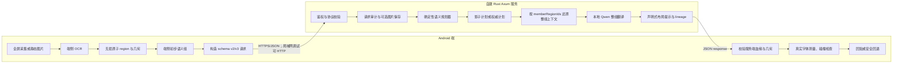
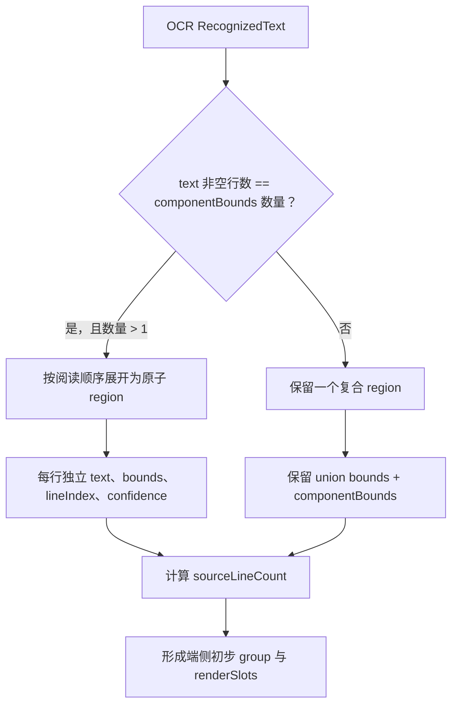
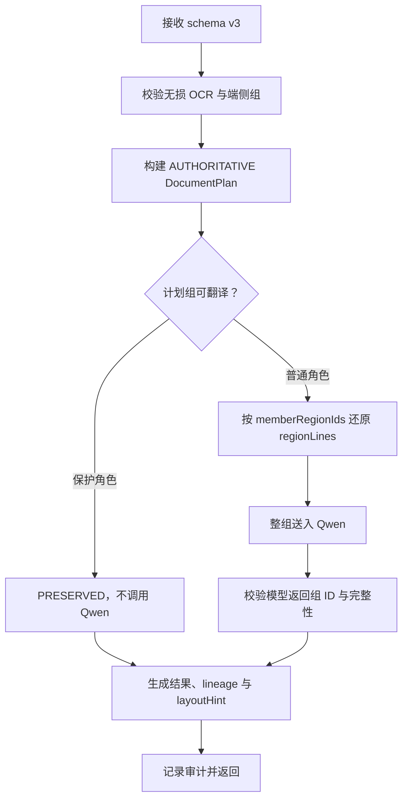
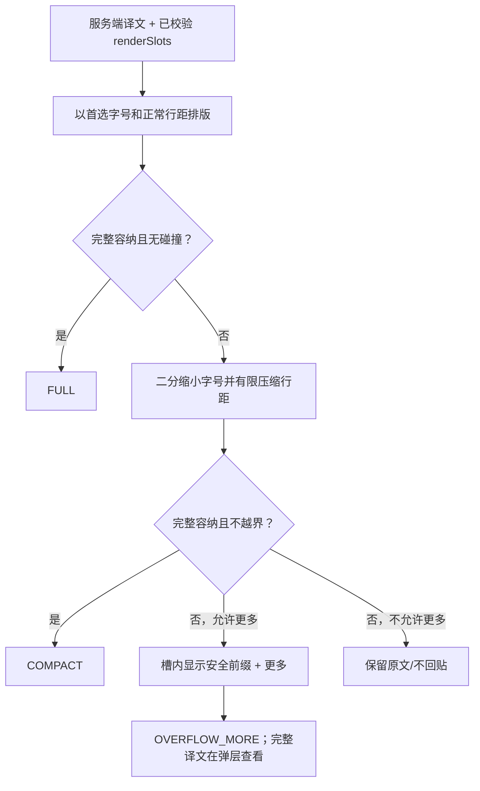
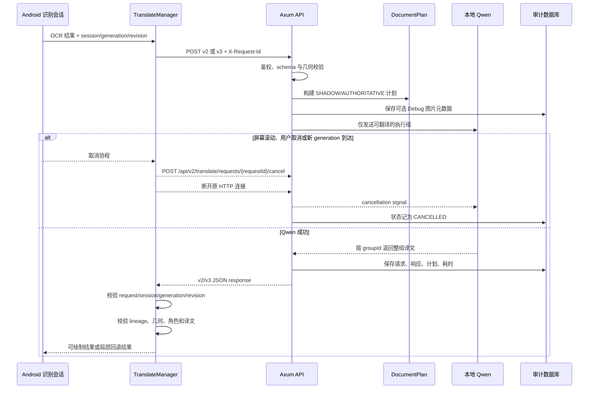

# 端侧与服务端 OCR 语义翻译流程及通信职责

> 日期：2026-08-07
> 范围：Android 全屏/静态图片 OCR 翻译、自建 Rust Axum 服务、Pnuts 兼容链路
> 推荐顺序：无损 OCR 协议与行数修正 -> 服务端影子分组 -> 高置信场景使用服务端权威组 -> 声明式布局计划 -> 可选图片感知

## 1. 文档目的

本文把上述五阶段方案拆成可执行的端侧流程、服务端流程和通信契约，并明确每一层的事实来源、决策权、失败责任及回退方式。

核心结论如下：

1. **端侧拥有 OCR 原始事实。** 文字、原子行、置信度、阅读顺序、屏幕尺寸和真实几何必须由端侧无损上传，服务端不能从提前压扁的大矩形中恢复这些信息。
2. **服务端拥有跨组语义规划权。** 服务端基于全页文本、OCR 几何和端侧初步组，生成影子组或高置信权威组，并以计划组为单位调用 Qwen。
3. **服务端只返回声明式布局计划。** 服务端可返回锚点、可绘制槽位、行数、字号缩放范围、行距、对齐和溢出策略，但不能返回依赖 Android 字体栅格化的最终字形坐标。
4. **端侧拥有最终绘制裁决权。** Android 必须用设备上的真实字体重新测量、检查越界和重叠，并在不安全时执行压缩、“更多”或保留原文。
5. **图片感知不是前四阶段的前置条件。** 当前调试图片只用于审计对照；只有结构化 OCR 无法解决的复杂页面，才应在经过隐私和成本门控后启用图片感知。

## 2. 事实基线与证据边界

本文依据当前工作区代码和 2026-08-07 的实际验证记录整理。当前 Git `HEAD` 为 `6f131e01566354bd3f1128d4f34c3bba6f961c56`，但本轮 OCR 协议、Axum 服务和布局计划大部分仍是未提交工作区内容，因此：

- 当前行为以工作区代码和自动化测试为准；
- Git 历史只用于说明项目此前以端侧翻译与覆盖层稳定性为主，不能证明本轮未提交功能已经发布；
- “已实现”“建议增加”“尚未覆盖”在本文中分开标注。

主要代码证据：

- Android 无损协议映射：`app/src/main/java/com/example/imagetranslate/translate/SemanticTranslationMapper.kt`
- Android 协议模型：`app/src/main/java/com/example/imagetranslate/translate/SemanticTranslationContract.kt`
- Android v3 通信与结果校验：`app/src/main/java/com/example/imagetranslate/translate/SelfHostedSemanticTranslationProvider.kt`
- Android 远端/本地回退：`app/src/main/java/com/example/imagetranslate/translate/TranslateManager.kt`
- Android 合组和回贴：`app/src/main/java/com/example/imagetranslate/screenshot/BackgroundTranslatedImageProcessor.kt`
- Android 形状感知排版：`app/src/main/java/com/example/imagetranslate/ui/ShapeAwareTextLayout.kt`
- 服务端协议校验：`demo-server/src/contract.rs`
- 服务端语义计划：`demo-server/src/planning.rs`
- 服务端 v2/v3、取消与审计：`demo-server/src/routes.rs`
- Qwen 整组翻译：`demo-server/src/qwen.rs`

## 3. 总体架构与数据所有权



### 3.1 职责矩阵

| 能力 | Android 端职责 | 服务端职责 | 最终决策方 |
|---|---|---|---|
| 屏幕/图片采集 | 获取真实像素、宽高、场景和旋转信息 | 不采集设备画面 | Android |
| OCR | 识别文本、置信度、原子几何、行/块线索 | 不重新执行 OCR | Android |
| 初步语义组 | 过滤噪声、形成候选组和 `renderSlots` | 接收为候选而非不可修改事实 | Android 先行 |
| 阅读顺序与跨组合并 | 上传初始顺序 | 全页复核、生成 SHADOW/AUTHORITATIVE 计划 | 服务端规划；Android 校验 |
| 保护内容 | 标记 CODE/IDENTIFIER/TIMESTAMP/METADATA/CONTROL | 禁止跨组并保留原文 | 双方共同约束 |
| 翻译 | 选择后端、发起/取消请求、本地兜底 | 按最终计划组调用 Qwen | 服务端结果，Android验收 |
| 布局计划 | 上传原文形状和槽位 | 返回声明式参数，不计算最终 glyph | 服务端建议 |
| 字体测量与绘制 | 用 Android 字体真实测量、擦除、回流、压缩和重叠检查 | 不控制设备端 Canvas | Android |
| 失败处理 | 丢弃过期响应、局部回退、保留原文 | 返回结构化错误、支持取消、记录审计 | Android 保证画面安全 |
| 调试图片 | 仅 Debug + LIVE_SCREEN + 用户开关时可上传 | 保存、展示，不进入 OCR/Qwen | 用户开关与端侧策略 |
| 请求历史 | 生成请求标识 | 持久化请求、响应、状态、耗时和图片路径 | 服务端 |

### 3.2 不应越界的职责

- 服务端不能根据截图尺寸猜测缺失的原子行位置。
- 服务端不能返回“最终字号 17 px、字符 X 在坐标 Y”并要求端侧盲画，因为字体、缩放密度、fallback font 和字形宽度都由设备环境决定。
- 端侧不能在发送前把多行 OCR 压成只有一个大框且丢弃 `componentBounds`，否则影子分组和布局还原没有可靠输入。
- Android 不能因服务端返回 200 就直接接受权威合并；必须验证来源组、成员、顺序、几何和置信门限。
- 图片不能默认进入模型。当前图片上传只服务于 Debug 审计，图片感知必须另设开关和协议版本。

## 4. 五阶段落地顺序

| 阶段 | 目标 | Android 端变化 | 服务端变化 | 启用条件 |
|---|---|---|---|---|
| 1. 无损 OCR | 不丢文字与几何事实 | 原子行映射；保留复合框明细；上传真实行数 | 严格验证 region/group/viewport | 所有请求 |
| 2. 影子分组 | 离线评估服务端重组精度 | 继续按端侧组翻译和绘制 | v2 返回 `documentPlan.mode=SHADOW` | 默认可开，不影响用户输出 |
| 3. 权威组 | 高置信时整组翻译 | 校验 lineage 后接受新 groupId；失败回退 | v3 用权威计划组调用 Qwen | 指标达标 + 保守规则 |
| 4. 声明式布局 | 让译文按原形状回流 | 真实字体测量与最终布局 | 返回槽位和布局约束 | 权威组校验通过 |
| 5. 图片感知 | 处理结构化 OCR 无法表达的复杂结构 | 明示上传、压缩、隐私门控 | 可选 VLM/版面模型，不替代 OCR 事实 | 前四阶段仍无法解决且样本证明收益 |

顺序不能倒置。若没有阶段 1，服务端得到的是有损输入；若没有阶段 2 的统计，直接启用权威组会把误合并带到翻译和擦除；若端侧没有阶段 4 的真实测量，服务端布局提示无法保证安全回贴。

## 5. 阶段一：无损 OCR 协议与行数修正

### 5.1 Android 端流程



当前实现采用“可证明一一对应才拆行”的保守策略：

- 文本非空行数与有效 `componentBounds` 数量一致时，展开为稳定原子 region；
- 无法证明对应关系时，不猜测行框，保留复合 region、其 `componentBounds` 和 `sourceLineCount`；
- `sourceLineCount` 取原子成员数量、组件数量和文本实际非空行数中的可靠上界；
- `rawText` 与 `corrections` 同时上传，归一化文本用于翻译，原文用于审计。

这样既避免错误拆行，也避免把逐行几何永久丢失。

### 5.2 服务端接收与校验

服务端必须在进入规划器前拒绝以下请求：

- `schemaVersion` 与路径不匹配；
- viewport 非法，或 region/组件框超出 viewport；
- `componentBounds` 不在所属 region 内；
- `regionId` 或 `groupId` 重复；
- group 引用不存在、重复归属或未归属的 region；
- 置信度不在 `[0, 1]`；
- 行数、阅读顺序、字符数或图片大小超过协议上限。

服务端行数不能简单使用 `memberRegionIds.size`。当前算法取：

```text
max(
  request.groups[].sourceLineCount,
  memberRegionIds.size,
  sourceText 的非空行数
)
```

### 5.3 阶段验收

- 同一 OCR 输入经过序列化和反序列化后，文本、region 数量、框、组件框、顺序和行数不变；
- 无法安全拆分的复合 region 仍能在管理页显示内部组件框；
- 所有几何都位于 viewport 内，且 group/region 引用形成完整一对一归属；
- v2/v3 对同一输入计算出的基础行数一致。

## 6. 阶段二：服务端影子分组

### 6.1 目的

影子分组用于回答“服务端是否比端侧分组更可靠”，但不改变用户看到的翻译结果。它是上线权威组之前的精度采样层，不是另一套翻译 UI。

### 6.2 端侧流程

Android 仍发送端侧初步组，调用：

```text
POST /api/v2/translate/groups
schemaVersion=2
```

端侧继续按原 `groups[]` 接受翻译和绘制。响应中的 `documentPlan.mode=SHADOW` 只用于管理页、日志和指标，不参与当前屏幕回贴。

### 6.3 服务端流程

服务端对端侧组按阅读顺序重新评估。当前第一版只尝试合并相邻的两个组，候选必须同时满足：

1. 两组 `translationUnit` 均为 `GROUP`；
2. 角色相同且属于 BODY、LIST_ITEM、TITLE；
3. 原端侧分组置信度均不低于 0.90；
4. 垂直间距相对文字高度处于允许范围；
5. 水平重叠足够，左边界差异不过大；
6. 标点或小写开头等特征表明语义仍在延续；
7. 中间没有 TIMESTAMP、METADATA、CONTROL、CODE、IDENTIFIER 等保护角色。

满足条件时，服务端创建新的计划组，保留：

- `sourceGroupIds`：端侧来源组血缘；
- `memberRegionIds`：原始 OCR 成员血缘；
- `groupingEvidence`：规则证据；
- `groupingConfidence`：不能高于输入事实所支持的置信度；
- 合并后的 `bounds`、`renderSlots`、`sourceLineCount` 和 `layoutShape`。

### 6.4 影子指标

管理页和离线分析至少记录：

| 指标 | 含义 |
|---|---|
| `client_group_count` | 端侧初步组数量 |
| `planned_group_count` | 服务端计划组数量 |
| `merged_group_count` | 本次合并出的计划组数量 |
| `authoritative_eligible_count` | 达到权威门限的计划组数量 |
| `merge_precision` | 人工确认的合并中真正正确的比例 |
| `false_merge_by_role` | 各角色误合并数量 |
| `protected_overlap_px` | 计划形状侵占保护区域的像素量 |
| `outside_source_shape_px` | 计划形状超出原文可占用区域的像素量 |

只有影子样本覆盖新闻、聊天、列表、卡片、多栏和长文本后，才应进入权威组灰度。

## 7. 阶段三：高置信场景使用服务端权威组

### 7.1 服务端权威流程



调用入口：

```text
POST /api/v3/translate/layout-plan
schemaVersion=3
```

v3 与 v2 的主要差异不是字段数量，而是执行语义：

- v2：规划器产生 SHADOW 计划，但 Qwen 仍翻译端侧原组；
- v3：规划器产生 AUTHORITATIVE 计划，Qwen 按计划组整组翻译；
- 新计划 `groupId` 可以与端侧 `groupId` 不同，关联必须依赖 `sourceGroupIds` 和 `memberRegionIds`。

当前分组器是确定性规则，不额外调用一次大模型做分组，因此不会为语义规划增加第二次模型往返。

### 7.2 Android 权威结果验收

端侧收到 v3 后必须逐项验证：

1. `schemaVersion/requestId/sessionId/generation/translationRevision` 与请求完全一致；
2. `sourceGroupIds` 非空、不重复、均来自本次请求；
3. 多个来源组在端侧阅读顺序中连续；
4. 一个端侧来源组最多被一个结果消费；
5. 多组合并置信度不低于 0.90；
6. 多组合并角色一致，且只能是 BODY、LIST_ITEM、TITLE；
7. `memberRegionIds` 与来源组合并后的成员严格相等且顺序一致；
8. `anchorBounds` 等于来源组几何并集；
9. `renderSlots` 与请求携带的来源形状严格一致；
10. 目标语言、译文非空性和基础字符规则通过检查。

任何一项不满足，都不能部分相信该权威结果。端侧应把相关来源组标记为远端失败，再按原组执行本地翻译或保留原文。

### 7.3 “高置信场景”的准确含义

当前实现的高置信门控是**组级规则门控**，包括角色、几何、标点、顺序和 0.90 阈值；目前没有独立的“新闻页/聊天页场景白名单”运行时开关。

建议灰度时增加单独策略层：

```text
authorityEnabled =
  serverPlanValid
  && pageScene in rolloutAllowlist
  && plan.groupingConfidence >= sceneThreshold
  && protectedOverlapPx == 0
  && recentMergePrecision >= target
```

该策略只决定是否采用服务端权威组，不改变无损 OCR 上传、v2 影子统计或 Pnuts 兼容入口。

### 7.4 翻译失败原则

- 服务端 Qwen 整组失败时，长正文必须保留原组原文或按原组重试，禁止把同一长组临时拆成孤立小片段翻译后回贴；
- 响应缺组时，端侧只回退缺失来源组，不覆盖已经验证成功且不重叠的结果；
- 服务端返回无效血缘或几何时，整项权威结果失效；
- 保护角色必须原样返回，不能因模型输出存在就变成译文。

## 8. 阶段四：声明式布局计划

### 8.1 服务端返回什么

每个结果返回以下布局提示：

| 字段 | 含义 | 服务端责任 | Android 责任 |
|---|---|---|---|
| `anchorBounds` | 整组锚点/并集矩形 | 与来源几何一致 | 校验并作为擦除和定位基准 |
| `renderSlots` | 可绘制矩形槽序列 | 继承可靠原文形状，不扩张 | 严格校验后按顺序回流 |
| `layoutShape` | `RECT` 或 `FLOW_SLOTS` | 描述布局形状 | 选择单框或多槽排版 |
| `sourceLineCount` | 原文真实行数下界 | 从无损输入计算 | 防止行数被固定成短段落 |
| `preferredMaxLines` | 建议最大行数 | 按文本、槽位估算 | 可上调到不小于可靠原文行数 |
| `minimumTextScale` | 最小字号比例建议 | 给出保守范围 | 与端侧安全下限共同取更严格值 |
| `maximumTextScale` | 最大字号比例 | 防止译文异常放大 | 真实字体二分搜索 |
| `lineSpacingMultiplier` | 建议行距 | 提供声明式值 | 在安全序列内逐步压缩 |
| `alignment` | START/CENTER/END | 根据原布局给建议 | 映射为 Android Layout.Alignment |
| `overflowStrategy` | 回流、缩放、更多顺序 | 描述策略 | 执行并检查每一步结果 |
| `allowMore` | 是否允许“更多” | 只对大面积长文本开启 | 展示截断入口并保留完整译文 |

### 8.2 Android 最终排版流程



当前端侧排版器按 `renderSlots` 顺序消耗译文，使用 Android `StaticLayout` 和真实 `TextPaint` 测量；在每个槽内受宽度、高度和剩余行数约束。当前端侧最小字号比例还有 0.68 的安全下限，服务端不能通过更小的 `minimumTextScale` 绕过它。

### 8.3 形状与重叠安全

- 合并组的擦除区域使用原成员文字框/槽位并集，不使用任意扩大的外接矩形覆盖图片或邻接 UI；
- 图片绕排应表达为多个不侵占图片的 `renderSlots`，而不是一个横跨图片的大框；
- `renderSlots` 是可用区域声明，不代表每个槽必须写满；
- 最终绘制前应计算译文实际占用形状，与保护区域、非成员文字和 viewport 做碰撞测试；
- 任一实际绘制片段超出来源形状时，先压缩，再使用“更多”，最后保留原文，不能裁切或覆盖邻区。

## 9. 阶段五：可选图片感知

### 9.1 当前事实

当前图片上传满足全部条件才发生：

```text
Debug 构建
&& scene == LIVE_SCREEN
&& backend == SELF_HOSTED
&& 用户启用上传开关
&& 本次存在未命中翻译缓存的组
```

端侧会把图片压缩后放入 `debugCapture`。服务端只保存图片并在管理页展示，不执行 OCR、不参与语义规划，也不送入 Qwen。

### 9.2 未来启用条件

图片感知适合处理以下结构化数据难以表达的情况：

- 文字围绕不规则图片或装饰图形；
- 多栏阅读顺序仅凭局部框不稳定；
- 表格、海报、漫画气泡或旋转文字；
- OCR 框严重缺失，需要图像版面模型辅助判断区域关系。

启用前应新增而不是复用 Debug 语义：

- 明确的 `imageAssistMode` 和协议版本；
- 用户可见授权、脱敏、保存期限和删除策略；
- 图片哈希、尺寸、压缩方式和服务端消费状态；
- 图片模型只能补充角色/关系，不得覆盖端侧 OCR 原文和几何而不保留 lineage；
- 图片感知失败时无条件退回结构化 OCR 流程。

## 10. 前后端通信契约

### 10.1 HTTP 入口

| 方法与路径 | 作用 | 当前状态 |
|---|---|---|
| `GET /healthz` | 服务、数据库、模型和 schema 健康状态 | 已实现 |
| `POST /api/v2/translate/groups` | 端侧原组翻译 + 服务端 SHADOW 计划 | 已实现 |
| `POST /api/v3/translate/layout-plan` | 服务端 AUTHORITATIVE 组 + 声明式布局 | 已实现，自建 Provider 默认使用 |
| `POST /api/v2/translate/requests/{requestId}/cancel` | 取消 v2/v3 活跃翻译 | 已实现；路径暂沿用 v2 |
| `GET /admin/requests` | 请求历史与状态过滤 | 已实现 |
| `GET /admin/requests/{auditId}` | 请求、响应、计划和布局对照 | 已实现 |
| `GET /admin/requests/{auditId}/image` | 查看 Debug 原图 | 已实现 |

Pnuts `/api/v1/translate/regions` 保持独立 Provider 和原格式，不由自建服务替换。

### 10.2 请求顶层字段

| 字段 | 产生方 | 用途与约束 |
|---|---|---|
| `schemaVersion` | Android | v2 路径为 2，v3 路径为 3 |
| `requestId` | Android | 单次请求唯一；HTTP Header 同步发送 `X-Request-Id` |
| `sessionId` | Android | 同一识别会话关联多次 generation |
| `generation` | Android | 屏幕内容变化/新识别批次递增，用于拒绝旧响应 |
| `translationRevision` | Android | 翻译参数或源内容修订号，用于拒绝过期结果 |
| `scene` | Android | `LIVE_SCREEN` 或 `STATIC_IMAGE` 等场景 |
| `viewport` | Android | 屏幕宽高和旋转；所有几何坐标系的唯一基准 |
| `translation` | Android | 模式、源/目标语言、保留标识符和文档上下文选项 |
| `documentContext` | Android | 全页文本和 region 阅读顺序，供整页理解 |
| `groups` | Android | 初步语义组、角色、来源成员和原文形状 |
| `regions` | Android | 无损 OCR 原子/复合元素及几何 |
| `debugCapture` | Android | 可选 Debug 图片；只允许 LIVE_SCREEN |

### 10.3 group 和 region 的关系

```text
viewport
  └── regions[]                         OCR 事实层
        ├── regionId                    全请求唯一
        ├── groupId                     端侧初步归属
        ├── text/rawText/corrections
        ├── readingOrder/blockId/lineIndex
        ├── confidence
        └── bounds/componentBounds

groups[]                                端侧候选语义层
  ├── groupId                           全请求唯一
  ├── memberRegionIds[]                 完整引用 OCR 事实
  ├── role/translationUnit
  ├── sourceText/sourceLineCount
  ├── readingOrder/groupingConfidence
  ├── groupingEvidence
  └── bounds/renderSlots/layoutShape

documentPlan.groups[]                   服务端计划层
  ├── groupId                           可为新 ID
  ├── sourceGroupIds[]                  回指端侧候选组
  ├── memberRegionIds[]                 回指 OCR 事实
  └── 计划后的语义、几何和置信信息
```

`sourceGroupIds` 和 `memberRegionIds` 是跨层可追溯性的关键。不能只依赖文本相等或新旧 `groupId` 相等做映射。

### 10.4 可提交的最小权威合并请求示例

```json
{
  "schemaVersion": 3,
  "requestId": "req-20260807-001",
  "sessionId": "live-session-12",
  "generation": 42,
  "translationRevision": 3,
  "scene": "LIVE_SCREEN",
  "viewport": { "width": 388, "height": 894, "rotationDegrees": 0 },
  "translation": {
    "mode": "ENGLISH_TO_CHINESE",
    "sourceLanguage": "auto",
    "targetLanguage": "zh",
    "preserveIdentifiers": true,
    "useDocumentContext": true
  },
  "documentContext": {
    "text": "Xi Story: Six-foot alley reveals\nChinese wisdom of making room for others\nand brings it into community governance",
    "sourceLanguage": "auto",
    "readingOrderRegionIds": ["story-1", "story-2", "story-3"]
  },
  "groups": [
    {
      "groupId": "group-story",
      "role": "BODY",
      "translationUnit": "GROUP",
      "sourceText": "Xi Story: Six-foot alley reveals\nChinese wisdom of making room for others",
      "memberRegionIds": ["story-1", "story-2"],
      "readingOrder": 10,
      "groupingConfidence": 0.96,
      "groupingEvidence": ["REGION_OCCUPANCY"],
      "sourceLineCount": 2,
      "bounds": { "left": 18, "top": 537, "right": 369, "bottom": 581 },
      "layoutShape": "RECT",
      "renderSlots": [
        { "left": 18, "top": 537, "right": 369, "bottom": 581 }
      ]
    },
    {
      "groupId": "group-story-continuation",
      "role": "BODY",
      "translationUnit": "GROUP",
      "sourceText": "and brings it into community governance",
      "memberRegionIds": ["story-3"],
      "readingOrder": 11,
      "groupingConfidence": 0.96,
      "groupingEvidence": ["PUNCTUATION_CONTINUATION"],
      "sourceLineCount": 1,
      "bounds": { "left": 18, "top": 584, "right": 369, "bottom": 606 },
      "layoutShape": "RECT",
      "renderSlots": [
        { "left": 18, "top": 584, "right": 369, "bottom": 606 }
      ]
    }
  ],
  "regions": [
    {
      "regionId": "story-1",
      "groupId": "group-story",
      "sourceRevision": 1,
      "text": "Xi Story: Six-foot alley reveals",
      "rawText": "Xi Story: Six-foot alley reveals",
      "corrections": [],
      "sourceLanguage": "en",
      "targetLanguage": "zh",
      "readingOrder": 10000,
      "blockId": "story",
      "lineIndex": 0,
      "confidence": 0.97,
      "bounds": { "left": 18, "top": 537, "right": 369, "bottom": 558 },
      "componentBounds": []
    },
    {
      "regionId": "story-2",
      "groupId": "group-story",
      "sourceRevision": 1,
      "text": "Chinese wisdom of making room for others",
      "rawText": "Chinese wisdom of making room for others",
      "corrections": [],
      "sourceLanguage": "en",
      "targetLanguage": "zh",
      "readingOrder": 10001,
      "blockId": "story",
      "lineIndex": 1,
      "confidence": 0.96,
      "bounds": { "left": 18, "top": 560, "right": 369, "bottom": 581 },
      "componentBounds": []
    },
    {
      "regionId": "story-3",
      "groupId": "group-story-continuation",
      "sourceRevision": 1,
      "text": "and brings it into community governance",
      "rawText": "and brings it into community governance",
      "corrections": [],
      "sourceLanguage": "en",
      "targetLanguage": "zh",
      "readingOrder": 11000,
      "blockId": "story",
      "lineIndex": 2,
      "confidence": 0.96,
      "bounds": { "left": 18, "top": 584, "right": 369, "bottom": 606 },
      "componentBounds": []
    }
  ]
}
```

该示例中的每个 `memberRegionId` 都存在并且只属于一个 group，可直接通过当前 schema v3 的结构校验。是否实际合并还取决于服务端规划规则。

### 10.5 对应响应结构示例

```json
{
  "schemaVersion": 3,
  "requestId": "req-20260807-001",
  "sessionId": "live-session-12",
  "generation": 42,
  "translationRevision": 3,
  "provider": "self-hosted-qwen-layout-plan-v3",
  "modelVersion": "qwen3.5:9b",
  "promptVersion": "semantic-translation-qwen-v4-geometry-safe-output",
  "results": [
    {
      "groupId": "server-group-story--group-story-continuation",
      "sourceGroupIds": ["group-story", "group-story-continuation"],
      "memberRegionIds": ["story-1", "story-2", "story-3"],
      "role": "BODY",
      "groupingConfidence": 0.96,
      "status": "TRANSLATED",
      "renderMode": "GROUP",
      "translatedText": "习故事：六英尺小巷彰显中国人让路于人的智慧，并将其融入社区治理",
      "detectedSourceLanguage": "en",
      "targetLanguage": "zh",
      "anchorBounds": { "left": 18, "top": 537, "right": 369, "bottom": 606 },
      "layoutHint": {
        "sourceLineCount": 3,
        "preferredMaxLines": 3,
        "minimumTextScale": 0.86,
        "maximumTextScale": 1.0,
        "lineSpacingMultiplier": 1.0,
        "alignment": "START",
        "overflowStrategy": "REFLOW_THEN_SCALE",
        "allowMore": false,
        "layoutShape": "FLOW_SLOTS",
        "renderSlots": [
          { "left": 18, "top": 537, "right": 369, "bottom": 581 },
          { "left": 18, "top": 584, "right": 369, "bottom": 606 }
        ]
      }
    }
  ],
  "documentPlan": {
    "mode": "AUTHORITATIVE",
    "planVersion": "server-semantic-plan-v2",
    "groups": [
      {
        "groupId": "server-group-story--group-story-continuation",
        "sourceGroupIds": ["group-story", "group-story-continuation"],
        "memberRegionIds": ["story-1", "story-2", "story-3"],
        "role": "BODY",
        "translationUnit": "GROUP",
        "sourceText": "Xi Story: Six-foot alley reveals\nChinese wisdom of making room for others\nand brings it into community governance",
        "readingOrder": 10,
        "groupingConfidence": 0.96,
        "groupingEvidence": [
          "PUNCTUATION_CONTINUATION",
          "REGION_OCCUPANCY",
          "SERVER_SHADOW_REEVALUATION"
        ],
        "sourceLineCount": 3,
        "bounds": { "left": 18, "top": 537, "right": 369, "bottom": 606 },
        "renderSlots": [
          { "left": 18, "top": 537, "right": 369, "bottom": 581 },
          { "left": 18, "top": 584, "right": 369, "bottom": 606 }
        ],
        "layoutShape": "FLOW_SLOTS",
        "authoritativeEligible": true
      }
    ],
    "metrics": {
      "clientGroupCount": 2,
      "plannedGroupCount": 1,
      "mergedGroupCount": 1,
      "authoritativeEligibleCount": 1
    }
  },
  "metrics": {
    "groupCount": 1,
    "translatedGroupCount": 1,
    "preservedGroupCount": 0,
    "failedGroupCount": 0,
    "totalMs": 8392
  }
}
```

## 11. 请求生命周期、取消与过期响应



当前 Android 自建 Provider 的连接超时为 10 秒、读取超时为 60 秒、取消请求超时为 3 秒，并限制最多 2 个并发请求。取消采用两步：先通知服务端取消模型等待，再断开本地连接和任务。

过期响应必须按以下优先级拒绝：

1. `requestId` 不一致；
2. `sessionId` 已切换；
3. `generation` 落后于当前屏幕；
4. `translationRevision` 落后于当前翻译设置；
5. 来源组已经被新的成功结果覆盖。

服务端取消接口当前位于 v2 路径但同时服务 v3。后续可增加无版本别名 `/api/translate/requests/{requestId}/cancel`，在保留旧路径的情况下消除语义歧义。

## 12. 失败与回退决策表

| 失败点 | 服务端动作 | Android 动作 | 用户可见结果 |
|---|---|---|---|
| 请求 schema/几何非法 | 4xx + 结构化错误，不调用 Qwen | 记录协议错误，原组本地回退 | 译文或原文，不错误覆盖 |
| 鉴权失败 | 401/403 | 不重试无效凭据 | 保留原文并提示服务不可用 |
| 服务端规划低置信 | 保留原组，不强制合并 | 按原组处理 | 与端侧基线一致 |
| Qwen 超时/不可用 | 5xx/超时并记录 FAILED | 原组回退；长正文禁止碎片化译文 | 原文优先 |
| 请求被取消 | 记录 CANCELLED，停止等待模型 | 丢弃结果、进入新识别 generation | 不出现旧屏译文 |
| lineage/几何不匹配 | 服务端原则上不应产生 | 拒绝该权威结果 | 原组回退 |
| 译文无法放入槽位 | 无需再次翻译 | FULL -> COMPACT -> MORE -> 原文 | 不裁切、不侵占邻区 |
| 部分结果缺失 | 返回失败或缺项审计 | 只回退未覆盖来源组 | 已验证组仍可显示 |
| 图片上传失败 | 翻译流程继续 | 忽略 Debug 图片失败 | 不影响翻译 |

## 13. 兼容、灰度和回滚

### 13.1 三条并存链路

```text
Pnuts Provider
  └── 保持原 /api/v1/translate/regions 格式

自建 v2
  └── 端侧原组翻译 + SHADOW 服务端计划

自建 v3
  └── AUTHORITATIVE 服务端计划 + 整组 Qwen + 声明式布局
```

三者不能共享错误的部分组缓存。自建 v3 需要完整页面候选组才能做跨组规划，因此当前端侧对自建链路禁用逐组缓存复用是合理的。

### 13.2 建议增加的灰度开关

当前已有后端选择和 Debug 图片上传开关。为控制权威组风险，建议补充：

- `selfHostedPlanMode = SHADOW | AUTHORITATIVE`；
- `authoritySceneAllowlist`；
- `authorityMinimumConfidence`，默认不低于 0.90；
- 服务端 `planVersion` 白名单；
- 紧急回滚开关：仍请求 v3 但只消费端侧一对一组，或直接退回 v2。

回滚不能关闭阶段 1 的无损字段，因为这些字段同时提升 v2 审计、行数和布局质量。

## 14. 分阶段验收门槛

### 14.1 无损 OCR

- `region_text_loss_rate = 0`；
- `component_bounds_loss_rate = 0`；
- `source_line_count_underestimate_rate = 0`；
- 请求/响应 lineage 可完整追溯到 OCR region。

### 14.2 影子分组

- 新闻页、聊天页、卡片页分别标注；
- 保护角色误合并为 0；
- `merge_precision` 达到约定门槛后才开启小流量权威模式；
- 所有影子差异可在管理页与原图并排人工核验。

### 14.3 权威组

- Android 对低置信、未知组、非连续组、重复消费和几何篡改均能拒绝；
- Qwen 只收到最终计划组，返回数量与可翻译计划组一致；
- 长正文模型失败时不产生分片译文；
- 回滚到 v2/Pnuts 不需要改 OCR 和绘制数据模型。

### 14.4 声明式布局

- `protected_overlap_px = 0`；
- `outside_source_shape_px = 0`；
- 分别统计 `FULL/COMPACT/OVERFLOW_MORE/PRESERVED`；
- 多槽绕排不覆盖图片、按钮、时间戳和相邻文本；
- “更多”只用于大面积长文本，一两个单词不得进入该分支。

### 14.5 图片感知

- 默认关闭；
- 用户授权、传输加密、保存期限和删除能力具备后才可灰度；
- 与纯结构化 OCR 基线做同图盲测，收益不足时不启用；
- 图片模型结果必须保留 OCR lineage，并可完全回退。

## 15. 当前验证事实

2026-08-07 已完成以下验证：

```text
Android JVM 单元测试：182 项通过
Rust 单元/API 测试：17 项通过
git diff --check：通过
服务健康：schemaVersion=3, model=qwen3.5:9b, modelAvailable=true
```

v2 影子验证：

```text
requestId=validation-shadow-20260807
documentPlan.mode=SHADOW
clientGroupCount=6
plannedGroupCount=6
mergedGroupCount=0
translated=4
preserved=2
```

该样本正文组之间存在 TIMESTAMP 隔断，服务端没有机械合并，结果符合保护角色边界。

v3 权威合并验证：

```text
requestId=validation-authoritative-merge-20260807b
sourceGroupIds=[group-story, group-story-continuation]
memberRegionIds=[story-1, story-2, story-3]
clientGroupCount=2 -> plannedGroupCount=1
groupingConfidence=0.96
sourceLineCount=3
anchorBounds=[18,537,369,606]
renderSlots=[[18,537,369,581],[18,584,369,606]]
totalMs=8392
```

Qwen 整组返回：

```text
习故事：六英尺小巷彰显中国人让路于人的智慧，并将其融入社区治理
```

管理页显示 `AUTHORITATIVE 2→1组 · FULL 1`，译文生成一个绘制单元并在两个槽位回流。该结果证明协议、权威血缘、整组翻译和声明式回贴已经连通，但不能证明复杂多栏、表格、旋转文字和任意图片绕排已经解决。

## 16. 最终建议

建议保持以下执行主线不变：

```text
端侧 OCR 定位
-> 无损原子 region/复合组件
-> 端侧初步语义组
-> 服务端影子评估
-> 高置信服务端权威组
-> Qwen 整组翻译
-> 服务端声明式布局计划
-> Android 真实字体测量与安全回贴
-> 复杂结构再选择性启用图片感知
```

下一批工作的优先级应是：

1. 用真实新闻页和聊天页新协议请求持续积累 SHADOW/权威对照样本；
2. 增加权威模式场景灰度开关和精度门槛，而不是扩大合并规则；
3. 在管理页固化 `merge_precision/protected_overlap_px/outside_source_shape_px/FULL-COMPACT-MORE` 指标；
4. 对多栏、表格和旋转文字先做失败识别与保守回退；
5. 只有结构化数据的误差无法继续下降时，再设计独立的图片感知协议。

这套边界兼顾了语义完整性和回贴安全：服务端可以利用全页上下文做更好的语义决策，Android 仍保留对真实设备字体、像素区域、屏幕时序和用户画面的最终控制权。

## 17. 复核方式

自动化复核命令：

```bash
./gradlew testDebugUnitTest
cargo test --manifest-path demo-server/Cargo.toml
curl http://127.0.0.1:8090/healthz
```

真实审计记录：

- v2 SHADOW：`/admin/requests/324ffd86-6e80-4b7d-b7da-fc7e36dcfc96`
- v3 AUTHORITATIVE 两组合一：`/admin/requests/1420b0d9-f4b7-4e7f-a47f-bc551e457647`

文档协议示例的两个 JSON 代码块已使用 `jq` 验证为合法 JSON；Markdown 代码围栏共 40 条，配对完整且没有尾随空白。本轮只新增本文档，没有重新执行 Android/Rust 测试；第 15 节测试数字引用 2026-08-07 已完成的实现验证。

## 18. 真实聊天页 v3 追加验证（2026-08-07）

既有 v2 聊天记录与附件真机请求均已通过 v3 验证，前后端职责边界符合本文设计：

| 验证项 | 结果 |
|---|---|
| admin 版本识别 | 从请求 `schemaVersion` 显示 v2/v3，支持与状态组合过滤 |
| v2 数据重放 v3 | 14 组、30 region 无损复用；v3 为 14→14、0 合并 |
| 低置信长组 | 17 行 BODY、置信度 0.82，保持一对一且不可扩权 |
| 附件真机 OCR | 486×1080，ML Kit 输出 29 region、13 端侧组 |
| 服务端计划 | AUTHORITATIVE 13→13、0 合并、12 组可执行 |
| 长正文翻译 | 单组 Qwen 翻译成功，返回 17 行预算和 `allowMore=true` |
| 端侧校验 | 接受 10 组；拒绝 3 个未产生中文的短残缺结果并保留原文 |
| 调试图片 | 仅保存并在 admin 对照，未进入 OCR、规划器或 Qwen |
| 真机安装 | Debug APK 安装、专项测试和主界面冷启动通过 |

该验证补充了一个重要边界：`authoritativeEligible=false` 表示服务端不能把该组参与跨组合并，不等于不能按原组翻译。Android 仍可接受一对一的有效译文和布局提示；只有新 groupId 的多组合并才需要满足 0.90 权威门限。

同时暴露出下一项服务端优化：`MD HD 99`、`Feux Lee t instagram:`、`Instagram Fii` 被 Qwen 原样返回并标记为 TRANSLATED，随后由 Android 短文本目标语言校验拒绝。当前结果安全，但浪费模型和回退成本；服务端应增加“译文与原文等价且未产生目标语言”的校验，将此类短噪声返回 PRESERVED 或 FAILED。

证据：

- `docs/validation/v3-chat-page-2026-08-07/README.md`
- `docs/validation/v3-chat-page-2026-08-07/self-hosted-actual-page.json`
- v3 重放：`/admin/requests/710b380f-9f42-4341-a9e0-e2cc6a8f6617`
- 真机附件：`/admin/requests/2c35970b-4f9a-451d-aa40-1c614b2a3326`
