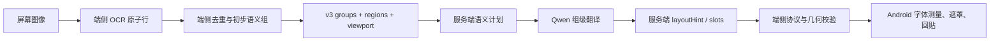
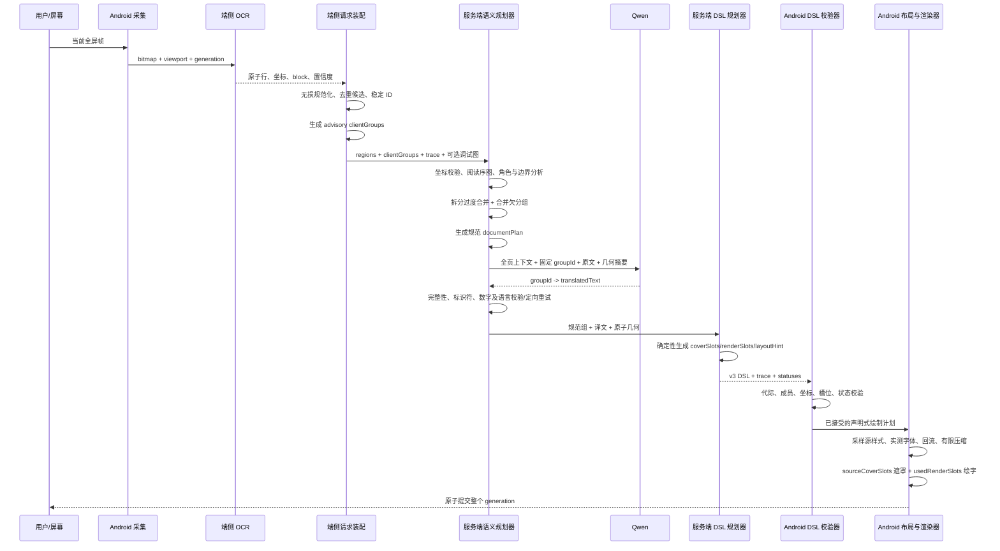
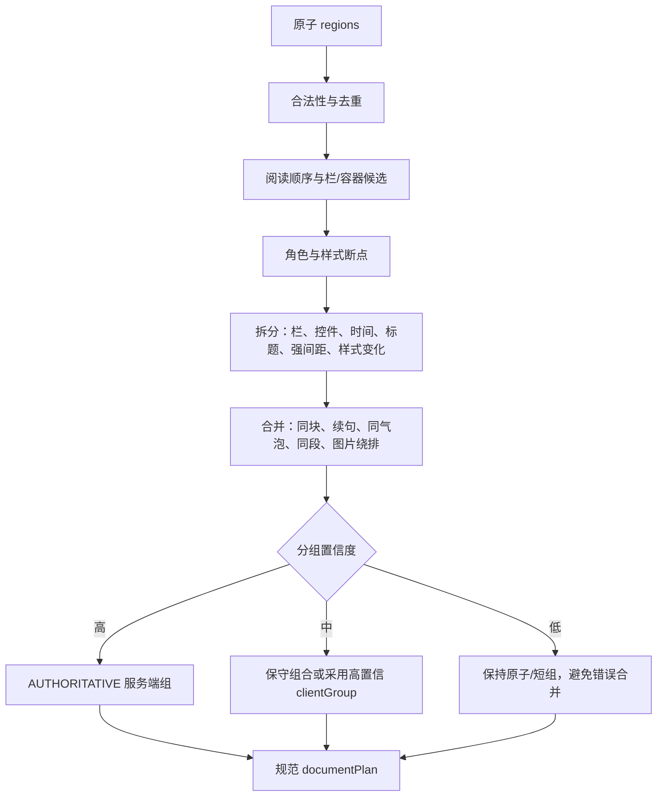
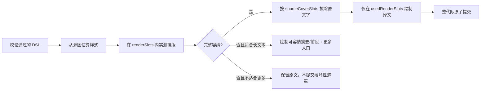
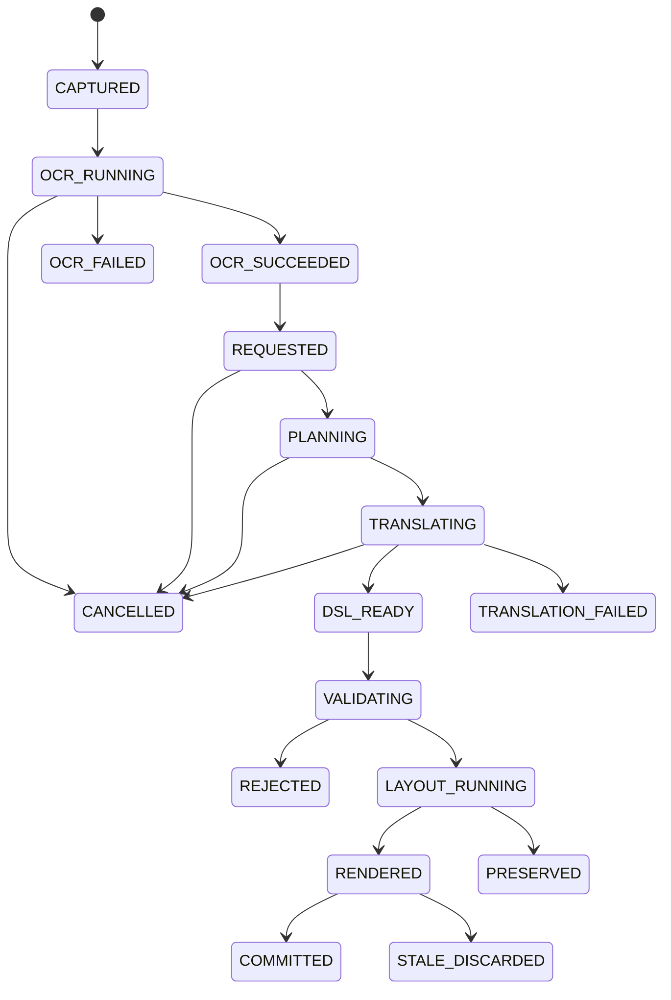
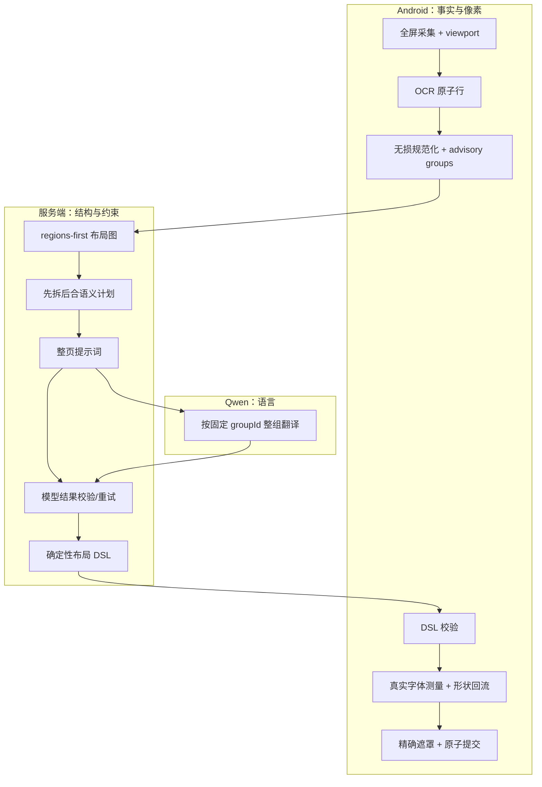

# v3 OCR 翻译与 DSL 回贴全流程设计

> 日期：2026-08-09
> 范围：Android 全屏采集、端侧 OCR、服务端语义重组、Qwen 翻译、布局 DSL、Android 回贴
> 结论类型：结合当前代码、现有 v3 协议和历史验证结果形成的实施设计

## 1. 核心结论

当前项目适合采用以下职责模型：

> **端侧保留无损 OCR 原子事实与最终渲染执行权；服务端掌握规范化语义分组、整页翻译上下文和声明式布局意图。**

三个问题的直接结论如下。

| 问题 | 结论 | 原因 |
| --- | --- | --- |
| OCR 后是否还要在端侧清理、分组 | 要做“最小无损整理”，但不应继续由端侧承担最终语义分组 | 端侧最接近 ML Kit 原始行和屏幕坐标，必须保留原子事实；服务端更适合跨行、跨段、图文绕排和整页上下文分析 |
| 回贴是否只执行服务端 DSL | 语义和布局意图以通过校验的服务端 DSL 为准；实际测量、遮罩和绘制仍由端侧完成 | 服务端无法完全复现 Android 字体、字形回退、密度和 `StaticLayout`；客户端也不能盲信过期或越界 DSL |
| 是否让 AI 同时翻译和计算排版 | AI 负责整页感知下的组级翻译，不负责输出权威像素坐标；服务端确定性算法负责生成布局 DSL | LLM 生成坐标不稳定、难验证、难复现。几何规划应可审计，AI 输出应限制为按组 ID 返回译文和少量语义提示 |

因此，不推荐以下两个极端方案：

1. **端侧只上传纯文本。** 这会丢失行级坐标、原始文本、OCR 置信度、块关系和绘制边界，服务端无法恢复页面结构。
2. **端侧无条件照画服务端像素结果。** 这会绕过请求代际、成员归属、边界及字体测量校验，容易产生错页回贴、越界遮挡和文字裁切。

项目契合度判断：**高度契合，但需要调整当前 v3 的分组入口。** 当前 v3 已具备无损 region、服务端语义计划、renderSlots/sourceCoverSlots、Qwen 组级翻译和端侧形状感知绘制；主要缺口是服务端仍以客户端 group 为起点，擅长合并欠分组，却不能完整拆解端侧已经过度合并的组。

---

## 2. 分析依据与现状边界

### 2.1 当前代码事实

本设计以当前分支 `960f6f2` 及以下代码为依据：

| 模块 | 当前职责与事实 |
| --- | --- |
| `OCRManager.kt` | 从 ML Kit block/line 获取文字、边界、置信度、blockId 和 lineIndex；这是几何与行级来源事实 |
| `SemanticTextGrouper.kt` | 端侧去除无效项、视觉重复行，并结合 OCR block、重叠、对齐、标点、占用形状和绕排关系生成初步语义组 |
| `SemanticTranslationMapper.kt` | 将组映射为可追踪的原子 regions，保留 `rawText`、corrections、componentBounds、sourceLineCount 和 renderSlots |
| `SemanticTranslationContract.kt` | 定义 v3 请求、响应、语义组、region、layoutHint、renderSlots、sourceCoverSlots 及请求代际字段 |
| `BackgroundTranslatedImageProcessor.kt` | 执行 OCR、端侧初分组、请求映射、响应匹配、渲染策略解析、遮罩与回贴提交 |
| `SelfHostedSemanticTranslationProvider.kt` | 校验 schema、request/session/generation/revision、成员映射、连续性、anchor、renderSlots 和 sourceCoverSlots |
| `ShapeAwareTextLayout.kt` | 使用 Android 实际字体测量和 `StaticLayout` 在多个 slot 内回流，有限压缩并处理 `MORE` 溢出 |
| `demo-server/src/planning.rs` | 从请求中的客户端 groups 出发，对相邻组进行服务端权威合并，生成 documentPlan |
| `demo-server/src/qwen.rs` | 给 Qwen 提供整页上下文、组、行和归一化位置；要求模型仅按 groupId 返回翻译，不输出视觉换行 |
| `demo-server/src/contract.rs` | 确定性生成 layoutHint、renderSlots 和精确的 sourceCoverSlots |
| `demo-server/src/routes.rs` | 串联校验、计划、模型请求、结果校验、失败审计、取消和 v3 响应 |

### 2.2 当前 v3 的真实能力

当前流程已经不是“逐 OCR 行直接翻译”：



但存在一个结构性限制：

- 服务端 `DocumentPlan::build()` 当前按客户端 `groups` 排序并尝试合并相邻组。
- 服务端可修复“一个自然段被端侧分成多个组”的欠合并问题。
- 若端侧先把标题、正文、时间或相邻气泡错误合成一个组，服务端缺少从 atomic regions 重新拆组的完整阶段。
- 因此，**当前版本还不能立即删除端侧 groups 字段并只上传 regions**；应通过兼容迁移逐步把客户端组降级为 advisory。

### 2.3 事实、推断和建议的区分

| 类型 | 内容 |
| --- | --- |
| 当前事实 | OCR 原子行、客户端初分组、服务端合并计划、Qwen 组级翻译、服务端 slots、Android 实测绘制均已存在 |
| 工程推断 | 服务端从 regions 重建布局图后，可以同时修复欠分组和过度合并，且更利于审计与持续调参 |
| 设计建议 | 将客户端 groups 改为可选建议；服务端的确定性几何规划成为唯一规范语义计划；AI 不生成权威坐标 |
| 尚待验证 | 不同 App、双栏页面、聊天气泡、图片绕排下的服务端拆分阈值及高置信覆盖率，需要影子运行数据校准 |

---

## 3. 端侧是否需要清理和分组

### 3.1 端侧必须保留的处理

端侧不能退化为“把 ML Kit 的字符串数组上传”。以下处理仍必须保留：

1. **坐标统一**：把 OCR 坐标统一到采集帧坐标系，并携带 viewport 宽高、旋转、密度和采集区域。
2. **原子化**：优先以 OCR line 为可追踪最小单元；当一项包含多个可可靠定位的行时，拆为 component regions。
3. **无损保留**：同时保留 `rawText`、用于语义处理的 `normalizedText/text` 和 corrections，禁止只保留清洗后的字符串。
4. **基础合法性检查**：过滤空文本、零面积、屏幕外无效边界；修正坐标顺序，但不得静默扩大范围。
5. **视觉重复候选处理**：多 OCR pass 重复识别同一行时可选出主结果，但必须保留别名或融合依据，便于服务端追踪。
6. **稳定身份**：生成 requestId、sessionId、generation、revision、regionId、blockId 和 lineIndex，支持取消和防止旧结果回贴。
7. **隐私与采集策略**：图片只在全屏采集且开发开关明确开启时上传；OCR 几何协议不能依赖图片存在。

这些处理属于“采集事实规范化”，不是最终语义判断。

### 3.2 端侧不应继续权威决定的内容

以下工作应迁到服务端成为规范结果：

- CAPTION、BODY、TIMESTAMP、CONTROL 等角色的最终判定；
- 哪些行属于同一自然段、聊天气泡、标题或说明文字；
- 图片左右绕排产生的分段是否应该恢复成同一正文流；
- 多栏、卡片、列表和相邻 UI 控件之间的阅读顺序；
- 是否拆分一个端侧过度合并的组；
- 翻译单位和最终 sourceGroupIds/memberRegionIds；
- renderSlots、sourceCoverSlots 和溢出策略的规范声明。

### 3.3 端侧初分组应保留为何种地位

建议保留 `clientGroups`，但把它从“请求的唯一分组事实”降为“建议与回退信息”：

| 用途 | 是否保留 |
| --- | --- |
| 无网络/旧服务兼容的本地翻译回退 | 保留 |
| 客户端缓存和局部变化检测 | 保留 |
| 服务端影子分组对照与质量评估 | 保留 |
| 限制服务端绝不能拆组或重组 | 不保留 |
| 决定 Qwen 的唯一翻译单位 | 不保留 |

目标请求可以把字段命名明确化：

```json
{
  "schemaVersion": 3,
  "requestId": "...",
  "sessionId": "...",
  "generation": 21,
  "translationRevision": 7,
  "viewport": { "width": 1080, "height": 2400, "rotation": 0 },
  "regions": [
    {
      "regionId": "region-001",
      "rawText": "Meanwhile, the Department of",
      "text": "Meanwhile, the Department of",
      "bounds": { "left": 24, "top": 980, "right": 742, "bottom": 1035 },
      "componentBounds": [],
      "blockId": "mlkit-3-...",
      "lineIndex": 0,
      "readingOrder": 11,
      "confidence": 0.97
    }
  ],
  "clientGroups": [
    {
      "groupId": "client-group-04",
      "memberRegionIds": ["region-001", "region-002"],
      "confidence": 0.81,
      "evidence": ["same_ocr_block", "punctuation_continuation"]
    }
  ]
}
```

兼容期内可继续发送现有 `groups`，同时增加其 advisory 语义；待服务端 regions-first 逻辑稳定后，再在新协议版本中允许省略 groups。

---

## 4. 目标端到端流程

### 4.1 完整时序



### 4.2 核心不变量

无论后续算法如何演进，以下规则不能破坏：

1. 每个参与翻译的原子 region 必须且只能归属于一个响应结果，或明确返回 PRESERVED/FAILED。
2. `memberRegionIds` 必须可追溯到本次请求，不允许模型生成、丢失或重复成员。
3. `sourceCoverSlots` 必须覆盖被翻译成员的原始字形区域，不得借机覆盖相邻控件或未参与翻译的文本。
4. `renderSlots` 必须处于允许的原文占用形状内，除非协议明确声明并通过可扩展容器策略。
5. Qwen 只能改变语言内容，不能改变成员归属、坐标和请求身份。
6. Android 只提交当前 session/generation/revision 的完整结果；取消或滚屏后返回的旧响应不得绘制。
7. 排版无法容纳时优先 `MORE` 或保留原文，禁止裁切译文、覆盖其他内容或降级成失去上下文的逐行翻译。

---

## 5. 服务端如何从屏幕 OCR 恢复结构

手机截图中的服务端输入不是普通文章 DOM，而是一组带文本和矩形的二维观测。正确方式是先构建几何关系图，再形成语义组。

### 5.1 预处理

服务端首先执行确定性处理：

1. 校验 viewport、坐标范围、regionId 唯一性和 readingOrder 合法性。
2. 保留 rawText，生成仅用于比较的规范文本，例如合并 OCR 异常空格，但不覆盖来源值。
3. 识别高度重叠、文字近似的重复候选，选主 region 并记录 alias。
4. 统计全页文字高度中位数、行间距分布、左右边缘分布和可能的栏边界。
5. 将像素坐标归一化到 `[0,1]`，便于跨设备使用统一阈值；实际返回仍绑定原 viewport。

### 5.2 二维布局图

每个 region 是图节点，节点之间建立带权边：

| 证据 | 倾向 |
| --- | --- |
| 同一 OCR block 且行序连续 | 合并 |
| 垂直间距接近正文行距 | 合并 |
| 左右边缘对齐或水平投影高度重叠 | 合并 |
| 上一行未以终止标点结束 | 合并 |
| 下一行从图片右侧开始，随后恢复到左侧 | 合并为绕排正文流 |
| 字号/行高明显变化 | 拆分 |
| 栏边界不同 | 拆分 |
| 大面积垂直空白或分隔线 | 拆分 |
| 时间、按钮、电话号码等短控件位于独立 UI 槽位 | 拆分或 PRESERVED |
| 不相容 role 或背景容器边界 | 拆分 |
| clientGroups 提供高置信连续关系 | 增强证据，但不构成硬约束 |

“图片绕排”场景即使不上传图片，也能从文字占用形状推断：连续行的左边缘突然右移、右边缘受限，随后恢复到整栏宽度，说明左侧可能存在不可侵占区域。该推断能恢复文本流，但不能知道图片真实轮廓、颜色和内容。

### 5.3 先拆后合

推荐顺序必须是“先拆分候选，再执行合并”，否则端侧过度合并无法修复：



需要注意：低置信时“保持更小的安全组”不等于逐行无上下文翻译。Qwen 仍应看到 documentContext 和相邻组，只是响应映射不跨越不确定边界。

### 5.4 角色是辅助信息，不是文章模板

CAPTION、BODY、TIMESTAMP 等角色可以继续存在，但只能作为通用二维页面中的语义提示：

- BODY：连续自然语言正文，可跨多行合并。
- TITLE：视觉显著、通常较短的标题。
- CAPTION：靠近媒体或卡片的说明文字。
- TIMESTAMP：独立时间标签，例如聊天消息时间；包含时间的自然语言句子不能因此整体 PRESERVED。
- IDENTIFIER：URL、型号、专名等需保留或受约束内容。
- CONTROL：按钮、导航标签等独立控件文字。

角色不得以“文章页面”作为默认假设。服务端应先看二维区域、容器和文本性质，再赋予角色；数字或时间只是文本特征之一，不能成为不翻译整段的充分条件。

---

## 6. Qwen 提示词与输出边界

### 6.1 提示词应提供什么

Qwen 需要整页感知，但输入应是压缩且结构化的上下文：

```json
{
  "scene": "mobile_screen",
  "sourceLanguage": "auto",
  "targetLanguage": "zh-CN",
  "documentContext": {
    "readingOrderSummary": "...",
    "pageTopicHint": "...",
    "neighborRelations": ["group-2 follows group-1"]
  },
  "translateGroups": [
    {
      "groupId": "server-semantic-001",
      "role": "BODY",
      "sourceText": "...",
      "requiredLiteralIdentifiers": ["AIMS-Next"],
      "readingOrder": 4,
      "normalizedBounds": { "left": 0.05, "top": 0.31, "right": 0.94, "bottom": 0.55 },
      "layoutShape": "WRAPPED_FLOW",
      "regionLines": [
        { "text": "...", "order": 0, "normalizedBounds": { "left": 0.36, "top": 0.31, "right": 0.94, "bottom": 0.35 } }
      ]
    }
  ]
}
```

几何信息的用途是：

- 判断相邻文本是否属于同一语境；
- 区分标题、正文、控件和独立时间；
- 理解图片绕排导致的断行；
- 在多个短标签之间避免串译。

几何信息不是要求 Qwen 计算像素排版。

### 6.2 模型只返回受限内容

建议维持严格的 keyed JSON：

```json
{
  "translations": [
    {
      "groupId": "server-semantic-001",
      "translatedText": "……",
      "preservedIdentifiers": ["AIMS-Next"]
    }
  ]
}
```

不应要求模型返回以下字段：

- 像素坐标、矩形或多边形；
- Android 字号和具体行距；
- 最终换行位置；
- sourceGroupIds/memberRegionIds；
- 遮罩范围和背景颜色。

这些字段都可以由确定性代码从请求事实和规范分组推导。把它们交给模型会引入 JSON 截断、坐标漂移、成员丢失和不可复现问题。

### 6.3 模型结果校验

服务端在生成 DSL 前必须验证：

1. 每个待翻译 groupId 恰好返回一次，不多不少。
2. 译文非空，语言方向正确。
3. requiredLiteralIdentifiers、数字、金额、型号、URL 等按规则保留。
4. 不接受模型新增分组或跨组拼接。
5. 单组失败时只定向重试该组，并保留整页上下文。
6. JSON 截断或 EOF 应识别为模型输出/上下文预算故障，不能把残缺结果送往客户端。
7. 长正文最终失败时返回 FAILED/PRESERVED，使端侧保留原文；禁止退化为无上下文的分片译文。

---

## 7. 服务端返回的声明式 DSL

### 7.1 DSL 的正确定位

DSL 应描述“画什么、允许画在哪里、可以怎样缩放、失败时怎么处理”，而不是携带服务端假想的 Android 绘制结果。

推荐语义：

> **服务端 DSL 对语义成员、覆盖边界和布局约束具有权威性；Android 对实际字形测量和最终像素栅格化具有权威性。**

### 7.2 建议结构

```json
{
  "schemaVersion": 3,
  "requestId": "...",
  "sessionId": "...",
  "generation": 21,
  "translationRevision": 7,
  "documentPlan": {
    "version": "server-semantic-plan-v3",
    "mode": "AUTHORITATIVE",
    "confidence": 0.94
  },
  "results": [
    {
      "groupId": "server-semantic-001",
      "sourceGroupIds": ["client-group-04", "client-group-05"],
      "memberRegionIds": ["region-001", "region-002", "region-003"],
      "status": "TRANSLATED",
      "role": "BODY",
      "confidence": 0.96,
      "translatedText": "……",
      "anchorBounds": { "left": 24, "top": 980, "right": 1032, "bottom": 1330 },
      "layout": {
        "renderPolicy": "CLIENT_MEASURED",
        "layoutShape": "WRAPPED_FLOW",
        "renderSlots": [
          { "left": 390, "top": 980, "right": 1032, "bottom": 1120 },
          { "left": 24, "top": 1120, "right": 1032, "bottom": 1330 }
        ],
        "sourceCoverSlots": [
          { "left": 394, "top": 982, "right": 1028, "bottom": 1034 },
          { "left": 392, "top": 1037, "right": 1029, "bottom": 1089 },
          { "left": 26, "top": 1122, "right": 1018, "bottom": 1174 }
        ],
        "preferredMaxLines": 8,
        "minFontScale": 0.72,
        "maxFontScale": 1.0,
        "lineSpacingRange": [0.88, 1.0],
        "alignment": "START",
        "overflow": "MORE",
        "allowMore": true,
        "styleStrategy": "MATCH_SOURCE",
        "backgroundStrategy": "MATCH_LOCAL_SURFACE"
      }
    }
  ]
}
```

### 7.3 sourceCoverSlots 与 renderSlots 必须分开

这两个字段不能混为一个大矩形：

| 字段 | 作用 | 边界原则 |
| --- | --- | --- |
| `sourceCoverSlots` | 擦除/遮罩原文字形 | 来源于成员 region 的精确 componentBounds；宁可多个小矩形，不覆盖非成员区域 |
| `renderSlots` | 译文允许占用的流式区域 | 从原文字区域的联合形状、行槽和绕排形状推导，可比 coverSlots 连续，但不可侵入障碍物 |
| `anchorBounds` | 组级定位、命中和调试 | 是外包围盒，不应直接作为整块遮罩 |

对图片绕排正文，renderSlots 应表现为多个横向通道，而不是外包围大矩形。否则端侧会覆盖图片，或错误地把译文绘制到原本没有文字的空白区域。

---

## 8. Android 如何执行 DSL 回贴

### 8.1 不能“盲执行”的校验层

Android 收到响应后先执行：

1. 校验 schemaVersion、requestId、sessionId、generation 和 translationRevision。
2. 校验 groupId 唯一，sourceGroupIds 和 memberRegionIds 均来自本次请求。
3. 校验所有成员不重复、不遗漏，并满足服务端权威模式的置信门限。
4. 校验 anchorBounds、renderSlots、sourceCoverSlots 未越出 viewport。
5. 校验 coverSlots 与成员 componentBounds 一致，不能覆盖不属于该组的 protected regions。
6. 校验响应到达时屏幕仍处于同一代际；滚动、取消或新识别发生后直接丢弃旧响应。

这不是客户端再次做语义分组，而是协议安全和绘制安全校验。

### 8.2 字体和布局必须端侧实测

端侧根据原图和原子 regions：

- 采样原文附近的字体颜色、背景和对比度；
- 根据原文字高估计源字号、粗细、对齐和行高；
- 在 DSL 的 `minFontScale..maxFontScale` 中用真实 Android 字体测量搜索；
- 使用 `StaticLayout` 和 `ShapeAwareTextLayout` 在 renderSlots 中回流；
- 尝试有限行距压缩，不能通过无限缩小字体强塞全文；
- 记录实际使用的 `usedRenderSlots` 和最终文字 bounds。

服务端若返回固定 `fontSizePx`，在不同设备密度、系统字体、字形回退和语言组合下不会稳定复现，因此不建议将固定像素字号作为权威协议。

### 8.3 遮罩与绘制顺序

正确顺序是：



遮罩范围建议为“精确 sourceCoverSlots + 确实使用的译文绘制区域所需背景修补”，禁止简单填充 anchorBounds。这样才能同时满足：

- 原文字不漏出；
- 不遮挡图片、图标、按钮和未翻译文字；
- 译文不越出原文字允许占用形状；
- 组内多个不连续区域能合并绘制但保持外形。

### 8.4 MORE 只用于合适的长文本

`MORE` 适用于大面积、自然语言、存在足够点击区域的正文或聊天气泡。以下内容不应使用：

- 一两个单词的按钮或标签；
- 时间戳、短标识符、电话号码；
- 极小区域或可能与系统手势冲突的位置。

若长译文在最小允许字号和有限行距下仍不能容纳，端侧可显示可读的前段和“更多”入口；展开内容应单独呈现，不应扩大原页面遮罩侵占周围内容。

---

## 9. 端侧与服务端职责清单

| 能力 | Android 端侧 | 服务端 | Qwen |
| --- | --- | --- | --- |
| 屏幕采集、viewport、旋转 | 权威 | 校验/使用 | 不参与 |
| OCR 识别 | 权威来源 | 不重复 OCR | 不参与 |
| rawText 和原子行坐标 | 产生并无损上传 | 校验并持久追踪 | 只读上下文 |
| 最小清理和重复候选 | 执行并保留证据 | 可二次裁决 | 不参与 |
| 初步分组 | advisory、兼容和回退 | 对照使用 | 不参与 |
| 最终拆分、合并、阅读顺序 | 不再权威决定 | 权威确定性规划 | 可提供非权威语义辅助，但不改成员 |
| 整页翻译上下文 | 提供采集事实 | 构造结构化上下文 | 基于上下文执行组级翻译 |
| 译文 | 不自行重组服务端结果 | 校验、重试、映射 | 生成 |
| sourceCoverSlots/renderSlots | 提供原始几何依据 | 权威推导并返回 | 不生成 |
| 字号、字形、真实换行 | 权威实测 | 返回范围和策略 | 不生成 |
| 背景采样、遮罩、绘制 | 权威执行 | 返回边界意图 | 不参与 |
| 取消和旧结果防护 | 发起并拒绝旧代际 | 传播取消并停止模型任务 | 响应中止 |
| 审计与回显 | 上传调试图/回贴图 | 保存请求、模型 I/O、DSL 和对比页 | 原始响应供审计 |

一句话概括：**Android 管事实和像素，服务端管结构和约束，Qwen 管语言。**

---

## 10. 状态、失败与取消流程

建议统一端侧和服务端状态：



处理原则：

- 用户滑动取消后，端侧取消当前 generation，请求服务端取消，服务端继续传播到 Qwen 调用。
- 请求失败、模型 JSON 截断、标识符校验失败或布局不可容纳，都要写入同一 request 审计链。
- 开发模式下，无论回贴成功还是回贴失败，都可上传一次结果截图；生产模式不默认上传。
- FAILED 组不应产生遮罩；PRESERVED 组维持原图；TRANSLATED 组才进入布局和绘制。
- 一个 generation 应尽量原子提交，避免部分新译文与部分旧译文混在同一屏幕。

---

## 11. 分阶段实施规划

### 阶段 1：固化无损 OCR 协议

目标：确保服务端具备独立重建结构所需的全部事实。

- regions 成为不可丢失的权威输入。
- 明确 rawText、normalized text、corrections、componentBounds、blockId、lineIndex 和 confidence。
- 对多行 OCR 项进行稳定原子化。
- 记录客户端 group evidence 和 confidence，但不删除现有 groups。
- 建立 region/member/sourceGroup 全链路审计。

验收：任一服务端结果都能回溯到原始 OCR 行和屏幕位置，覆盖率 100%。

### 阶段 2：服务端 regions-first 影子分组

目标：服务端从 atomic regions 独立生成候选计划，但暂不影响线上回贴。

- 新增拆分阶段、布局关系图和通用角色判断。
- 同时计算 client plan 与 server shadow plan。
- Admin 页面并排显示两种分组、译文输入和槽位。
- 记录合并差异、拆分差异、置信度和人工判定。

验收：聊天、文章、双栏、图片绕排、导航控件等样本均可直观看出差异来源。

### 阶段 3：高置信服务端权威组

目标：仅高置信场景采用服务端拆分/合并结果。

- 高置信结果使用 AUTHORITATIVE。
- 中低置信结果采用保守原子组或 clientGroups 回退。
- Android 继续执行成员、几何和代际校验。
- 统计服务端权威计划的接受率、拒绝原因和视觉结果。

验收：不存在成员丢失、重复、错页回贴；权威组错误率低于客户端基线。

### 阶段 4：声明式布局计划稳定化

目标：DSL 成为 Android 唯一语义回贴入口。

- 固化 sourceCoverSlots 与 renderSlots 的不同含义。
- 服务端输出布局范围、形状、策略，不输出权威像素字号和换行。
- Android 统一通过 ShapeAwareTextLayout 实测，不再按服务端组重新推断语义。
- 完善 MORE、PRESERVED、FAILED 和遮罩安全策略。

验收：无原文漏出、无额外遮挡、无裁切，且 Web 还原与真机结果的结构差异可解释。

### 阶段 5：协议简化与可选图片感知

目标：在兼容窗口完成后，允许请求只包含 regions + optional clientGroups。

- 若属于破坏性字段调整，升级 schemaVersion，而不是悄悄改变 v3 含义。
- 图片上传仍为开发/明确授权能力，服务端不依赖图片执行 OCR。
- 可选图片感知只用于发现视觉容器、媒体障碍和背景，不允许模型直接决定绘制坐标。

验收：关闭图片上传时完整流程仍可工作；开启后只提升复杂布局置信度，不改变安全不变量。

---

## 12. 验证指标与样本矩阵

### 12.1 协议正确性

| 指标 | 目标 |
| --- | --- |
| 请求 region 到响应 memberRegionIds 可追踪率 | 100% |
| 被翻译 region 的唯一归属率 | 100% |
| 旧 generation 结果提交数 | 0 |
| 越界 renderSlots/sourceCoverSlots | 0 |
| Qwen 新增或丢失 groupId | 0 个进入客户端响应 |
| 必须保留标识符丢失 | 0 个进入客户端响应 |

### 12.2 视觉正确性

| 指标 | 检查方式 |
| --- | --- |
| 原文字漏出 | 原图、Web 规划图、真机回贴截图三方对比 |
| 非成员区域被遮挡 | sourceCoverSlots 与 OCR 原子框、图标/媒体区域叠加检查 |
| 译文越界 | translated glyph bounds 必须包含于 renderSlots 容差范围 |
| 文字裁切 | Android 实际 `StaticLayout` 完整性和截图人工核验 |
| 绕排形状保持 | 多槽位占用轮廓与原文文字占用轮廓对比 |
| 字号可读性 | 最小字号比例、行距下限及人工验收 |

### 12.3 必测页面类型

1. 新闻文章：标题、作者、时间、正文和图片绕排。
2. 长聊天气泡：昵称、号码、正文、时间戳和转发标签。
3. 双栏/多栏页面：跨栏内容不能错误合并。
4. 导航与短控件：一两个单词、数字和时间不应被正文策略吞并。
5. 长正文：有限压缩、MORE 和保留原文路径。
6. 快速滚动与取消：服务端取消和端侧 stale rejection。
7. 标识符密集文本：AIMS、型号、金额、URL 和混合数字。
8. OCR 重复/错行：多 pass 重叠结果和过度合并拆分。

---

## 13. 推荐的最终架构



最终流程不是“端侧完全不分组”，也不是“服务端把所有像素计算完让端侧照抄”，而是：

1. 端侧把 OCR 结果整理成无损、稳定、可追踪的原子数据，并保留建议分组。
2. 服务端从原子 regions 恢复二维结构，执行可拆可合的规范语义计划。
3. Qwen 使用整页上下文翻译固定语义组，只返回 keyed translation。
4. 服务端用确定性算法把原始文字占用形状转换成 sourceCoverSlots、renderSlots 和布局约束。
5. Android 校验 DSL 后，以设备真实字体和源图样式完成回流、遮罩与绘制。

这条路径既保留了服务端整体感知和统一演进能力，也保留了端侧对真实屏幕像素、字体引擎、取消状态和绘制安全的控制，是当前项目风险最低且可逐步验证的 v3 演进方式。

---

## 14. 复现与限制说明

- 本文依据 2026-08-09 当前工作树代码和最近 v3 演进提交进行分析，重点提交包括 `cb4fa9f`、`fe05e6d`、`960f6f2`。
- 现状结论来自当前实现，不代表 regions-first 拆分已完成；该部分属于建议改造。
- 不上传截图时，服务端只能从 OCR 文字占用形状推断图片绕排和视觉障碍，无法获知真实媒体轮廓和背景细节。
- Web Admin 的布局还原适合检查成员、槽位和结构，但不能替代 Android 真机字体栅格化结果；最终视觉验收必须包含真机回贴截图。
- 分组阈值不能只靠单一上下间距或水平间距，应通过上述二维图证据、负向边界、角色、文本连续性及影子验证联合校准。
