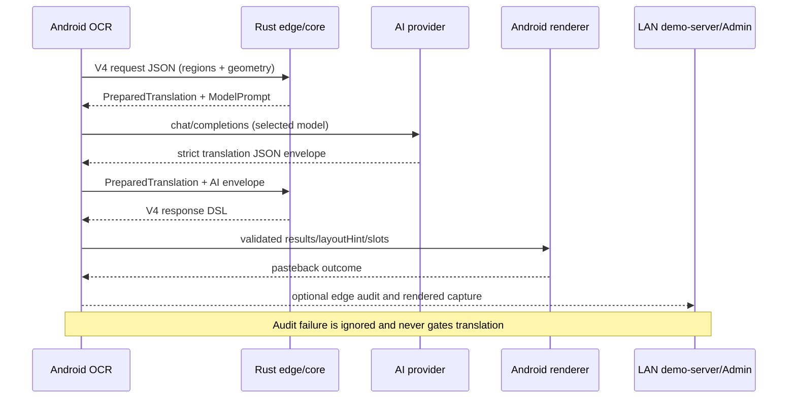

# 端侧 V4 翻译核心 crate 与无感集成设计

日期：2026-08-10

## 结论

本次改造采用“共享纯 Rust 核心 + Android 进程内边缘服务 + Kotlin 网络传输 + 可选 LAN 审计”的结构。`demo-server` 和 Android 不再各自维护 V4 分组规划与提示词；两者共同依赖 `ocr-translation-core`。Android 不在本机监听端口，也不引入 Axum/SQLite，而是通过 JNI 在应用进程内执行两阶段服务：

1. `prepare`：接收无损 OCR V4 JSON，校验协议、执行 regions-first 规划、生成 AI 提示词及严格 JSON Schema。
2. Kotlin transport：按当前选中的 provider/model 调用 OpenAI-compatible HTTPS 接口。
3. `complete`：校验模型响应，生成包含 `documentPlan/results/layoutHint/renderSlots/sourceCoverSlots` 的 V4 DSL。
4. Android 沿用现有 V4 解析、约束校验和回贴渲染。

这种结构保留了现有后端和 Admin：自建 v3/v4 入口不变；新增“端侧 v4”入口独立工作；调试环境若能连接 LAN 后端，则旁路上传请求、模型输入输出和最终 DSL，Admin 按普通 V4 记录查看。LAN 不可用不会影响翻译或回贴。

## 模块职责

| 模块 | 负责 | 不负责 |
| --- | --- | --- |
| `ocr-translation-core` | V4 DTO/校验、regions-first 分组、布局计划、提示词、模型 JSON 校验、DSL 装配 | HTTP、密钥、数据库、Android UI |
| `ocr-translation-edge` | 稳定的 `prepare/complete` API、JNI 边界、stdin CLI | AI 网络请求、Admin |
| `demo-server` | Axum API、provider 传输、取消、Diesel 审计、Admin | 私有 V4 规划副本 |
| Android Kotlin | OCR 采集、provider/model 选择、HTTPS、生命周期/取消、DSL 回贴 | 重新推导服务端布局 |

## 数据流



## 配置和模型切换

Android 高级设置可直接保存 provider、API 根地址、API Key 和模型列表。本机配置优先级最高；首次尚未保存时，Debug 构建再按 `Gradle property > demo-server/.env > 非敏感默认值` 初始化，因此真机后续验证不依赖 `demo-server/.env` 或 LAN 后端持续在线。

| Gradle property | `.env` | 说明 |
| --- | --- | --- |
| `EDGE_AI_PROVIDER` | `TRANSLATION_PROVIDER` | provider 名，默认 `openlux` |
| `EDGE_AI_BASE_URL` | `OPENLUX_BASE_URL` | OpenAI-compatible `/v1` 根地址 |
| `EDGE_AI_API_KEY` | 无服务端回退 | 仅允许本机 Gradle 属性显式注入 Debug APK；Release 始终为空 |
| `EDGE_AI_MODELS` | `OPENLUX_MODELS` | 逗号分隔 allowlist |

当前优先模型列表为 `gemini-3.5-flash-lite`、`gpt-4.1`、`claude-sonnet-3.6`。Android 高级设置中的“端侧 AI 模型”下拉框只允许选择本机配置列表中的模型，选择结果存储在本机偏好中；下一次请求以请求开始时的 provider/model 快照执行。Release 构建不会自动读取或内置 Debug API Key，但允许在端侧手工配置后启用“端侧 v4”。

注意：把 API Key 放进 APK 不能防止有能力的用户提取密钥。当前能力定位为内部调试和真机验证；正式发布应改为短期令牌、系统 Keystore 包装的用户密钥，或可信网关。

## 自动装配

`:app:preDebugBuild` 自动执行：

```text
cargo build -p ocr-translation-edge --target aarch64-linux-android
target/.../libocr_translation_edge.so
  -> app/build/generated/rustJniLibs/arm64-v8a/
  -> Debug APK
```

构建直接使用 Android NDK clang，不依赖额外安装 `cargo-ndk`。本地 CLI 可独立运行：

```bash
cargo run -p ocr-translation-edge -- prepare openlux gpt-4.1 \
  < ocr-translation-core/examples/v4-minimal-request.json
```

`prepare` 和 `complete` 总是返回 `{ok,value,error}` JSON，Rust 错误不会跨 JNI unwind。

## 兼容性

- `/api/v2/translate/groups`、`/api/v3/translate/layout-plan`、`/api/v4/translate/layout-plan` 保持不变。
- 服务端 V4 使用共享核心装配 DSL；v2/v3 仍保留原逻辑，降低本次改动风险。
- 新增 `/api/v4/edge-audits`，仅保存 Android 已完成的 V4 请求/响应，不重复调用 AI。
- Admin 数据库结构和详情页布局不变；模型列使用 `<provider>:<model> (edge)` 区分端侧执行。
- 回贴截图继续使用已有 `/api/v4/translate/requests/{requestId}/rendered-capture`，只有存在可达 LAN 审计记录时才会出现在 Admin；上传失败不影响端侧。

## 后续验证顺序

1. 用最小 V4 fixture 验证 core 的 `prepare -> complete -> DSL`。
2. 运行 Rust 全套测试和 Android JVM 测试，确认旧 v2/v3/v4 行为不回归。
3. Debug APK 检查 `lib/arm64-v8a/libocr_translation_edge.so` 已打包。
4. 真机分别选择三个 OpenLux 模型跑文章、聊天、技术文档的小样本，只验证流程和 DSL 完整性。
5. 断开 LAN 后端重跑，确认翻译仍成功；恢复 LAN 后确认 Admin 出现 `(edge)` 记录和回贴截图。
6. 流程稳定后再扩大场景，逐步优化模型提示词、复杂绕排和极端溢出，而不是在首轮集中调参。

## 本轮实测结果

- Rust：core 21 项、edge 1 项、demo-server 35 项测试通过。
- Android JVM：208 项测试通过；Debug APK 自动完成 Rust arm64 交叉编译和装配。
- APK：确认包含 `lib/arm64-v8a/libocr_translation_edge.so`，产物位于 `app/build/outputs/apk/debug/app-debug.apk`。
- 服务端真实请求：`gemini-3.5-flash-lite` 返回“Rust 是一种系统编程语言。”，V4 响应使用 `semantic-translation-core-v1-regions-first`，包含完整 `layoutHint/renderSlots`。
- Admin：`/api/v4/edge-audits` 写入成功，列表模型字段显示 `openlux:gpt-4.1 (edge)`。
- 真机 `23113RKC6C`：JNI prepare 和端侧直接调用 AI 的完整 `prepare -> OpenLux -> complete -> Android V4 parser` 两项仪器测试均通过，耗时 3.746 秒。
- 故障隔离：真机当时保存的是旧网段 LAN 地址，因此边缘审计未回传，但端侧 AI 翻译仍成功，验证了“LAN 不可用不影响主流程”的要求。

### 2026-08-11 真机复验

- 设备：`23113RKC6C`，ADB 无线连接 `192.168.0.46`。
- 最新 Debug APK 覆盖安装成功，应用主界面启动正常，无 `FATAL EXCEPTION` 或 `UnsatisfiedLinkError`。
- 真机设置页确认“端侧 v4”入口可选，`gpt-4.1` 模型、OpenLux provider/API 地址、脱敏 API Key 和模型列表均由 Android 本机配置展示。
- JNI `prepare` 测试通过：端侧加载 `libocr_translation_edge.so`，生成包含 `regionLines` 和严格 `json_schema` 的 V4 模型请求。
- 端侧直连测试通过：Android 直接调用 OpenLux，再由 Rust `complete` 生成 DSL，Android V4 parser 成功获得 `TRANSLATED`、非空译文和 1 个 `renderSlot`。
- 第一次关闭 LAN 审计地址运行耗时 7.138 秒，翻译仍成功；第二次配置 `http://192.168.0.63:8090` 后运行耗时 6.099 秒，证明审计旁路不会阻塞主链路。
- Admin 成功记录请求 `android-edge-live-test`：审计 ID `fb96de26-470c-4516-8741-5d26c32b9c01`，模型 `openlux:gpt-4.1 (edge)`，服务端记录耗时 5969 ms，1 组/1 区域/39 字符。
- 查看地址：`http://192.168.0.63:8090/admin/requests/fb96de26-470c-4516-8741-5d26c32b9c01`。

### 2026-08-11 Rust Book “Hello, Cargo!” 悬浮窗真机验证

- 目标页：`https://doc.rust-lang.org/book/ch01-03-hello-cargo.html`，真机浏览器深色主题，使用项目自身的“开启识别悬浮窗”入口执行，未使用浏览器自带翻译。
- 端侧链路：`EMBEDDED_V4 -> openlux -> gpt-4.1 -> Rust complete -> Android V4 renderer`。首次启动按 Android 要求选择了浏览器作为屏幕共享对象，随后识别、翻译和回贴自动完成。
- OCR 共识别 25 行；发往翻译核心的可见内容为 23 个区域、972 字符，按页面几何与段落连续性合并为 5 个组：页面标题、`Hello, Cargo!`标题及 3 个正文段落。
- AI 返回 5 个完整译文块，例如 `Hello, Cargo! -> 你好，Cargo！`；三个长段落均保留 `Rust`、`Cargo`、`Rustaceans`、`Hello, world!` 等技术标识，未发生分片译文、译文缺失或标识丢失。
- 端侧运行指标：OCR 885 ms，AI 翻译 6887 ms，渲染 194 ms，总耗时 8019 ms；`translated_regions=5`、`patches=5`、`failed=0`，原文拉丁词保留率仅 2.72%，证明正文遮盖基本完整。
- Admin 审计 ID：`338282d3-917b-40d2-9f20-1c1a8e7a7b97`，记录状态 `SUCCEEDED`，模型 `openlux:gpt-4.1 (edge)`，服务端记录耗时 6703 ms。查看地址：`http://192.168.0.63:8090/admin/requests/338282d3-917b-40d2-9f20-1c1a8e7a7b97`。

人工视觉核验结论：本轮“OCR 行 -> 语义组 -> 整组翻译 -> DSL -> 块级回贴”链路通过，三个大段落都在原文占用区域内完整回贴，没有再出现大面积空白或按 OCR 行碎片化绘制。但当前还有两个明确的视觉优化点：

1. 页面导航标题被 OCR 识别为 `Ea The Rust Program...`，模型因而返回 `Ea Rust 程序...`。根因在 OCR 输入与控件区域分类，不是语义组丢失或 DSL 回贴失败。后续应对顶部导航/截断标题提高 `CONTROL + PRESERVED` 判定优先级，或在 OCR 置信度偏低时禁止翻译。
2. 深色网页上的回贴遮罩为中性灰，与原页近黑背景存在明显色差。当前几何覆盖正确，但视觉还原度不足；后续应将组外围背景的中位色/局部主色用于 `backgroundColor`，同时根据对比度选择译文颜色。

### 2026-08-11 Provider 请求耗时分析

分析对象为 Admin 审计 `338282d3-917b-40d2-9f20-1c1a8e7a7b97`。该请求不是 5 个语义组串行调用 5 次模型，而是一次批量请求，因此组级批处理方向正确，不应拆分为多请求。

| 指标 | 实测值 | 结论 |
| --- | ---: | --- |
| Admin/端侧记录耗时 | 6703 ms | 包含网络、Provider、结果校验和 DSL 完成阶段 |
| Provider `total_duration_ms` | 4020 ms | 模型服务内部的主要耗时 |
| Provider 首 token | 1425 ms | 包含调度/排队，其中引擎 TTFT 仅 99 ms |
| Provider 生成完成 | 4186 ms | 391 个输出 token，引擎内部生成 2848 ms |
| 端到端额外开销 | 约 2.5-2.7 s | HTTPS 往返、JSON 编解码、Rust `complete`、DSL 校验及 LAN 审计 |
| Provider 请求体 | 13739 bytes | 相对 990 字符原文存在明显结构放大 |
| 输入 / 输出 token | 2943 / 391 | 耗时主要受输入预处理、排队和生成影响 |
| 缓存 token | 0 | 系统提示和 Schema 尚未获得 Provider 缓存收益 |

请求放大的主要原因是同一段文字同时出现在 `documentContext`、`translateGroups[].sourceText` 和 `regionLines[].text`；每行又带有几何、阅读顺序和槽位数据。用户消息达 8301 字符，而真实原文仅约 990 字符；动态 `response_format` 另占 2026 字节，且随组数重复同类字段结构。

推荐按以下顺序优化：

1. P0：保留 `translateGroups[].sourceText`作为唯一完整原文；`documentContext` 改为组 ID、角色和短摘要索引，不再复制全文。`regionLines` 仅保留必要的归一化几何和行序，文本可由 `sourceText` 按行序对应。目标是先将输入 token 降低 30%-45%。
2. P0：将按 group ID 动态展开的 Schema 改为稳定的 `translations[]` 数组 Schema，每项使用 `groupId + translatedText + language`，再由本地校验 ID 集合完整性。这能减少 Schema 随组数线性增长，并增加系统提示/Schema 被缓存的可能性。
3. P1：将 `max_tokens=8192` 改为基于原文长度和组数的自适应上限。本例实际仅用 391 token，建议小页面限制在 1024-2048；该项主要降低异常长输出风险，不应预期单独带来数秒收益。
4. P1：对同一屏 OCR 内容与翻译模式建立内容哈希缓存，滚动未改变的语义组直接复用译文。这对持续翻译比单次请求内的微调更有价值。
5. P2：将 Provider 计时细分为 DNS/TCP/TLS、请求上传、TTFT、生成、Rust complete、审计上传，避免仅依赖一个 `duration_ms`猜测。

当前 4.02 秒的 Provider 耗时已经远低于本地 9B Qwen 的分钟级耗时，且单次批量请求结构正确。近期合理目标是通过 P0 压缩将 Provider 部分稳定到约 3-4 秒，再通过连接复用、缓存和细分计时处理额外的 2.5 秒；不建议为追求单次延迟而破坏整页语义上下文。

### 2026-08-11 Provider 请求优化实施与验证

本轮按推荐顺序完成共享 V4 核心、服务端和 Android 端侧改造，提示词版本升级为 `semantic-translation-core-v2-compact-array`：

1. `translateGroups[].sourceText` 成为模型请求中唯一的完整组原文。原 `documentContext` 全文副本改为 `documentOutline[]`，只保留 `groupId/role/readingOrder/sourcePreview`；短预览最多 72 字符。
2. `regionLines[]` 删除重复的 `text`，仅保留 `regionId/readingOrder/normalizedBounds`。几何信息、行序和 `renderSlots` 不变，不影响服务端还原或端侧 DSL 绘制。
3. `response_format` 固定为 `translations[]`，每项包含 `groupId/translatedText/detectedSourceLanguage/targetLanguage`。本地继续严格校验 ID 集合、重复项、空译文和关键标识；解析器仍兼容旧版 keyed object，便于回退和处理历史 Provider 响应。
4. token 上限按 `原文字数 + 96 * 组数 + 384` 估算，限制在 `1024..4096`，并且不超过 Provider 配置上限。990 字符、5 组样本由固定 8192/4096 调整为 1854。
5. 服务端按 `provider + model + 翻译模式 + 源/目标语言 + role + sourceText` 建立逐语义组内容哈希缓存；Android 端使用 SHA-256 和 256 项 LRU。缓存异常全部旁路，译文仍经 Rust `complete` 校验并使用当前请求的 DSL。
6. Admin 保存的模型请求顶层增加 `_timings`，不改变现有 `model/messages/max_tokens/response_format` 路径和复制 curl 功能。记录 Provider 总耗时、响应头/下载、Provider checkpoint 推导的 TTFT/生成、缓存命中/缺失和 Rust complete；审计持久化耗时写入服务日志。当前 `reqwest/HttpURLConnection` 无法可靠拆分连接复用下的 DNS 与 TLS，因此这两项显式记录为 `null`，不使用整段网络耗时冒充。

同一条 Rust Book 审计 `338282d3-917b-40d2-9f20-1c1a8e7a7b97` 的静态请求对比：

| 指标 | 优化前 | 优化后 | 变化 |
| --- | ---: | ---: | ---: |
| 模型请求体 | 13739 bytes | 9837 bytes | -28.4% |
| system prompt | 919 chars | 951 chars | +32 chars，补充数组约束 |
| user prompt | 8301 chars | 7692 chars | -7.3% |
| response Schema | 2026 chars | 562 chars | -72.3% |
| `max_tokens` | 8192（端侧）/4096（服务端） | 1854 | 自适应 |

真实 OpenLux `gpt-4.1` 冷请求 `perf-compact-20260811-2` 成功返回 5/5 组，审计 ID 为 `503cdf2c-50f7-4315-b83b-96d814053f2e`，总耗时 7565 ms，Rust complete 为 2 ms。冷请求受 Provider 排队和生成波动影响，本次没有比 6703 ms 基线更快，因此目前只能确认请求体和预算显著下降，不能据单次样本宣称冷延迟改善。

随后以新 request ID 重放相同语义组，5 组全部命中缓存，HTTP 端到端为 8.5 ms，响应 `metrics.totalMs` 小于 1 ms（整数记录为 0），`cacheHitGroups=5/cacheMissGroups=0/providerTotalMs=0`。这验证了缓存对持续翻译场景的收益，并且返回仍包含完整 5 组 DSL。

首轮冷请求还暴露出 OpenLux `gpt-4.1` 不接受 `reasoning_effort=none`。现在仅在 OpenLux 配置值为 `none` 时省略该字段，Qwen 本地兼容路径仍保留；修复后同一请求成功。Rust 全工作区 59 项测试和 Android Debug JVM 测试均通过。

回退边界：本轮为独立 Git 提交；固定数组解析保留旧对象兼容，缓存为失效即旁路，自适应预算仍受原 Provider 上限保护。若线上模型对数组 Schema 存在兼容问题，可单独回退该提交，不涉及 OCR、语义分组、DSL 或 Android 渲染协议迁移。

### 2026-08-11 Rust Book 三模型无缓存对比

测试页面为 `https://doc.rust-lang.org/book/ch01-03-hello-cargo.html`，复用真机审计 `338282d3-917b-40d2-9f20-1c1a8e7a7b97` 的同一份 V4 OCR 请求：990 个原文字符、23 个 OCR region、5 个服务端语义组。服务重启后按模型顺序执行首次冷请求；服务端缓存按模型隔离，两个成功请求的审计均确认 `cacheHitGroups=0/cacheMissGroups=5`。

| OpenLux 模型 | HTTP 总耗时 | 服务端耗时 | Provider 阶段 | Rust complete | 结果 |
| --- | ---: | ---: | ---: | ---: | --- |
| `gemini-3.5-flash-lite` | 5329 ms | 5307 ms | 5304 ms | 2 ms | 5/5 组成功 |
| `gpt-4.1` | 5577 ms | 5555 ms | 5551 ms | 2 ms | 5/5 组成功 |
| `claude-sonnet-4-6` | 19031 ms | 19014 ms | 未进入可记录完成态 | 未执行 | Provider 返回结构不合约，HTTP 502 |

对应 Admin 审计：

- Gemini：`29af6ccd-fb5a-41ab-85b3-8a889209ec77`
- GPT-4.1：`cf6036dc-c36b-40dc-af3d-62d0c79580b6`
- Claude 4.6：`36e4d485-5778-4c0c-af72-63a67bb248f0`

三个请求的自适应 `max_tokens` 均为 1854。Gemini 比 GPT-4.1 快 248 ms（约 4.5%）；相对于同页面优化前 `gpt-4.1` 审计的 6703 ms，本轮为 5555 ms，单样本下降 1148 ms（17.1%）。但 Provider 排队和生成存在波动，这一数字只能作为本轮实测，稳定冷延迟仍需每模型至少 5 次独立冷请求计算中位数和 P95。

Gemini 与 GPT-4.1 均正确保留 `Rust/Cargo/Hello, world!` 等标识，并返回 5 个完整 DSL 组。首个导航标题仍为 `Ea Rust 程序...`，来源是 OCR 输入本身的 `Ea The Rust Program...`，不属于模型或本次协议压缩回归。

Claude 4.6 的原始响应 `finish_reason=stop`，输入 4334 tokens、输出 919 tokens，不是 `max_tokens` 截断。它忽略严格 JSON Schema，返回 Markdown fenced 裸数组，使用 `translation` 而不是 `translatedText`，缺少 `detectedSourceLanguage/targetLanguage`，文本内部还出现未转义双引号。本地拒绝该响应是正确的安全行为。当前优化可判定为对 Gemini/GPT-4.1 成功；Claude 4.6 暂不应作为 V4 可用模型，后续应优先采用独立的 JSON 修复重试或 Provider 级兼容策略，而不是放松端侧 DSL 完整性校验。

### 2026-08-11 最新 APK 悬浮窗冷启动真机全链路验证

- 设备：`23113RKC6C`，ADB `192.168.0.46:43191`；Debug APK 重新构建并覆盖安装成功，SHA-256 为 `0bdbab7c1bdec1677f1d0fcf4ed34b519ea7fadd8db2b2e0474054607b6ce476`。
- 测试页：`https://doc.rust-lang.org/book/ch01-03-hello-cargo.html`；从悬浮窗“开始识别”进入，完成全屏采集、OCR、V4 语义分组、OpenLux Gemini 翻译、Rust complete、DSL 解析和 Android 块级回贴。
- 本轮为新安装后的首次页面请求，审计明确记录 `cacheHit=false`，Provider 输入也显示 `cached_tokens=0`，因此不包含语义组缓存加速。
- OCR 识别 27 行，上传 25 个 region、1023 个输入字符，服务端还原为 5 个语义组；返回 5 个 DSL 结果，Android 生成 5 个 patch，`failed=0`。

| 阶段 | 实测耗时 | 占端侧总耗时 |
| --- | ---: | ---: |
| OCR | 827 ms | 10.1% |
| 翻译阶段（Android 口径） | 7066 ms | 86.6% |
| Provider 请求至响应头 | 6889 ms | 84.4% |
| Provider 响应下载 | 2 ms | <0.1% |
| Provider 网络总耗时 | 6899 ms | 84.6% |
| Rust complete / DSL 校验组装 | 5 ms | <0.1% |
| LAN 审计上传 | 94 ms | 旁路，不决定回贴成功 |
| Android 绘制 | 198 ms | 2.4% |
| 其他采集/调度开销 | 约 67 ms | 0.8% |
| 从采集到 commit | 8163 ms | - |
| 悬浮窗任务总耗时 | 8158 ms | 100% |
| 回贴原子呈现 | 8 ms | commit 后 |

Provider 使用 `openlux:gemini-3.5-flash-lite (edge)`，自适应 `max_tokens=1907`；请求体约 10.2 KB，输入 4503 tokens、输出 1616 tokens（其中 reasoning 1104）。Provider 的 6899 ms 中 6889 ms 都在等待响应头，下载只有 2 ms；当前主要瓶颈是远端模型排队/首包与生成，不是 OCR、Rust complete 或 Android 绘制。当前 HTTP 客户端在连接复用时无法可靠分离 DNS/TLS，因此审计中两项继续显式记录为 `null`。

视觉核验上，标题和 3 个长正文组均有译文回贴，没有大面积缺失或按 OCR 行碎片化绘制；原文拉丁 token 保留率为 1.95%。但 patch 覆盖率 64.26% 高于原文区域 60.32%，长段落仍使用整块灰色矩形遮罩，存在约 3.94 个百分点的额外覆盖。因此“全部译文可回贴”已通过，但背景颜色还原与非文字区域减遮挡仍是下一阶段的视觉优化项。

Admin 审计 ID：`100f2ea7-846d-4935-a207-6b047909704c`，查看地址：`http://192.168.0.63:8090/admin/requests/100f2ea7-846d-4935-a207-6b047909704c`。本轮 edge 审计成功写入请求、Provider 响应和分段计时，但没有产生 `request_images/rendered_request_images` 记录；真机回贴已通过 ADB 截图人工核验，该图片审计旁路需单独排查，不影响本轮主链路结论。

### 2026-08-11 “直接结构化输出”提示开关与真机 A/B

本轮在 V4 共享协议的 `translation` 中新增 `directStructuredOutput`，默认为 `false`。Android 高级设置增加“直接返回结构化译文”开关；开启时共享 Rust core 在原 system prompt 末尾追加：

```text
Skip analysis, reasoning exposition, and preamble. Execute the JSON instructions directly and return only the requested structured translation result.
```

关闭时不添加该文本。开关值已同时加入服务端和 Android 语义组缓存键，两组实验不会互相命中缓存。这条指令只能约束可见输出，不能保证 Provider 关闭模型内部的 hidden reasoning。

Admin 原“发送给翻译 Provider 的请求”区域已更名为“Provider 交互审计”，并拆分为“实际请求 / 原始响应 / 分段计时”三个折叠区。复制 JSON 和 curl 只读取实际请求；标题旁直接显示“直接输出：开启/关闭”，避免将中文 Provider 响应误认为输入提示词。

真机 `23113RKC6C` 使用同一 Rust Book `Hello, Cargo!` 页面、`openlux:gemini-3.5-flash-lite`、相同 V4 核心和自适应 token 算法。每次通过停止应用进程清空端侧内存缓存，成功记录均由 Admin 确认 `cacheHit=false` 和 Provider `cached_tokens=0`。

| 组别 | 次数 | 结果 | 总耗时 | OCR | 翻译 | 渲染 | Provider | reasoning tokens | completion tokens |
| --- | ---: | --- | ---: | ---: | ---: | ---: | ---: | ---: | ---: |
| 关闭 | 1 | JSON 截断，长组安全回退 | 9811 ms | 716 ms | 8948 ms | 96 ms | 未完成审计 | 未记录 | 触发上限 |
| 关闭 | 2 | 4/4 组成功 | 5916 ms | 415 ms | 5390 ms | 73 ms | 5201 ms | 823 | 1272 |
| 关闭 | 3 | 4/4 组成功 | 10258 ms | 705 ms | 9360 ms | 147 ms | 9225 ms | 1174 | 1623 |
| 开启 | 1 | JSON 截断，长组安全回退 | 7237 ms | 782 ms | 6298 ms | 103 ms | 未完成审计 | 未记录 | 触发上限 |
| 开启 | 2 | 6/6 组成功 | 4723 ms | 552 ms | 4003 ms | 120 ms | 3845 ms | 0 | 578 |
| 开启 | 3 | 4/4 组成功 | 6077 ms | 662 ms | 5217 ms | 154 ms | 5073 ms | 948 | 1408 |

| 统计口径 | 关闭 | 开启 | 变化 |
| --- | ---: | ---: | ---: |
| 3 次总耗时均值 | 8662 ms | 6012 ms | -30.6% |
| 3 次总耗时中位数 | 9811 ms | 6077 ms | -38.1% |
| 成功率 | 66.7% | 66.7% | 无改善 |
| 成功样本总耗时均值 | 8087 ms | 5400 ms | -33.2% |
| 成功样本 Provider 均值 | 7213 ms | 4459 ms | -38.2% |
| 成功样本 reasoning 均值 | 999 | 474 | -52.6% |

上表的平均值看起来有明显收益，但不能直接得出稳定提速结论：开启组的第 2 次虽然处理了更多组，Provider 却随机返回 0 reasoning tokens，这一快样本大幅拉低了均值。仅比较严格一致的 4 组/24 region/1005 字符请求，关闭组两个成功样本 reasoning 平均为 999，开启组为 948，只降低 5.1%；开启后 system prompt 还增加了 24 个输入 token。Provider 耗时由 7213 ms 降为 5073 ms，但其中包含明显的排队/生成波动。

译文质量方面，开启和关闭的成功样本均完整翻译长段落，保留 `Rust`、`Cargo`、`Rustaceans`、`Hello, world!` 等标识，没有总结、分析前缀或跨组借文。因为原流程已有严格 JSON Schema，新指令对可见输出格式没有额外质量收益。两组都有 1/3 请求因模型内部 reasoning 挤占自适应 token 预算而截断，说明指令无法替代截断重试或 Provider 级 reasoning 参数。

当前结论：保留开关作为默认关闭的实验参数，不建议现在改为默认开启。要判定稳定收益，同一模型和固定 OCR fixture 至少需要各 20 次冷请求，统计中位数、P95、JSON 完整率和 reasoning tokens。优先级更高的稳定性改造是：Provider 返回 `length`/非完整 JSON 时执行一次低成本结构化重试，或使用 Provider 确实支持的 reasoning-effort 控制，而不是继续叠加自然语言提示。

成功审计记录：

- 关闭：`8e94c51a-7830-4b50-9f0b-4cd71820f63e`、`b37e0a5c-17d8-4cb5-b254-6fcd695452fb`
- 开启：`92547e20-ff64-4daf-9602-25fa13d9ee26`、`f55dcdec-8547-4b42-820a-d7f994356ca6`

### 2026-08-11 Provider 紧凑几何与 normalizedBounds 降精度验证

本轮优化的边界是“只精简 Provider 输入，不精简 OCR 事实和最终 DSL”。完整的像素 `bounds/componentBounds`、组级 `renderSlots`、`sourceCoverSlots`和 `layoutHint` 仍在 Rust core 本地保留，用于 `complete` 阶段生成 Android 渲染计划。Provider 只需翻译，不再负责计算像素布局。

紧凑模式的每个语义组只发送 `groupId/role/sourceText/sourceLanguage/targetLanguage/requiredLiteralIdentifiers/readingOrder/normalizedBounds`，去掉 Provider 不需要返回的 `regionLines/renderSlots/layoutShape/viewport`等重复几何。`normalizedBounds` 由高精度浮点数量化为三位小数，仅用来表达组在页面中的大致相对位置。在 1440x3200 屏幕上，0.001 对应水平约 1.44 px、垂直约 3.2 px；这个误差不进入最终 DSL，因此不会累积为绘制偏移。

Rust 合约测试同时用紧凑和完整几何模式执行同一请求，并断言 `documentPlan`、最终 `anchorBounds`和 `layoutHint` 完全一致。紧凑模式另断言 Provider JSON 不含 `regionLines/renderSlots/viewport`；完整模式仍保留旧字段，作为可立即回退的对照路径。

Android 高级设置新增“紧凑 Provider 请求”开关，默认开启；关闭后 `compactProviderPrompt=false`，无需改版本或改 DSL 即可回退到完整几何提示词。缓存键包含 prompt 版本和该开关，两种请求不会交叉命中旧结果。

同时对 Gemini 3 系列做了 Provider 级参数收敛：不再发送不必要的 `temperature/seed`，默认使用 `reasoning_effort=low`。若 Provider 以 HTTP 400 拒绝 reasoning 参数，Android 仅重试一次且删除该字段，审计中会记录 `reasoningParameterFallback=true`。本轮实测未触发兼容回退。Provider 审计上传改为译文回贴后的异步旁路，局域网 Admin 不可用时不再阻塞主链路。

真机 `23113RKC6C` 继续使用 `https://doc.rust-lang.org/book/ch01-03-hello-cargo.html`，从悬浮窗触发全屏采集。本轮无缓存，OCR 为 904 ms，翻译为 6259 ms，Android 渲染为 174 ms，总耗时 7337 ms。请求包含 25 个 region、1024 个原文字符，服务端还原为 5 个语义组，5/5 组均返回 `TRANSLATED`，标题和三个长段落均已块级回贴。

| 指标 | 优化前同页审计 | 本轮紧凑请求 | 变化 |
| --- | ---: | ---: | ---: |
| Provider 请求体 | 10210 B | 5058 B | -50.5% |
| Provider user prompt | 8034 字符 | 3124 字符 | -61.1% |
| prompt tokens | 4503 | 1165 | -74.1% |
| completion tokens | 1616 | 509 | -68.5% |
| reasoning tokens | 1104 | 0 | -100% |
| Provider 阶段 | 6899 ms | 6196 ms | -10.2% |
| Rust complete | 5 ms | 6 ms | 基本不变 |

两次 OCR 输入为 1023/1024 字符、5 个语义组，可用于近似同页对比；但 Provider 排队仍有波动，703 ms 的冷延迟下降只是本轮样本，不应外推为稳定 P50/P95。可确定的收益是 Provider 输入 token 显著下降，同时 DSL 像素几何未变。

本轮的译文语义完整，`Rust/Cargo/Rustaceans/Hello, world!` 等标识均保留。页面顶部导航文字被 OCR 识别为 `Ea The Rust Program...`，因此回贴为 `Ea Rust程序...`；这是 OCR 原始文本和 V4 导航控件分类问题，不是 normalizedBounds 降精度或紧凑几何造成的译文回归。后续应单独将低置信应用标题/导航文字标为 `PRESERVED`，不应恢复 Provider 的逐行几何输入。

审计 ID：`44ae9619-96d5-47f0-af67-a1545c49603d`，查看地址：`http://192.168.0.63:8090/admin/requests/44ae9619-96d5-47f0-af67-a1545c49603d`。对应 Debug APK SHA-256 为 `9b1cab7069783dafc48e6f77246945c5b4d0a8015f694d5fb1f0adeeb58d50db`。

### 2026-08-11 thinkingLevel / reasoning_effort 无缓存重跑与真机结论

本轮把推理控制拆成两个互斥字段，而不是把两个名字同时发送给 Provider：

- `REASONING_EFFORT`：请求顶层仅发送 `reasoning_effort`。
- `THINKING_LEVEL`：Gemini 请求仅发送 `google.thinking_config.thinking_level`；`extra_body`
  只用于 OpenAI SDK 调用参数，不属于原始 HTTP JSON。
- `NONE`：两个字段都不发送，作为模型默认行为基线。

共享 V4 协议在 `translation` 中增加 `thinkingControlMode` 和 `thinkingLevel`；服务端环境变量为 `QWEN/OPENLUX_THINKING_MODE` 与 `QWEN/OPENLUX_THINKING_LEVEL`。Android 高级设置提供“未指定 / reasoning_effort / thinkingLevel”与“minimal / low / medium / high”两组选项，并按模型限制实际请求：GPT-4.1 强制为 `NONE`；Gemini 可执行两种互斥实验；当前 Claude/OpenLux 只启用 `reasoning_effort`，`thinkingLevel` 不发送。HTTP 400 时端侧删除推理参数重试一次，审计记录回退标记。

#### Curl 无缓存重跑

测试固定使用审计 `44ae9619-96d5-47f0-af67-a1545c49603d` 的 Rust Book OCR 提示词、`gemini-3.5-flash-lite`、5 个翻译组、1165 prompt tokens 和 1908 `max_tokens`。每个 case 连续请求 3 次，共 27 次；全部 HTTP 200、5/5 组完整返回且 `cached_tokens=0`。

| case | 中位耗时 | 均值 | 范围 | reasoning tokens 中位数 | completion tokens 中位数 |
| --- | ---: | ---: | ---: | ---: | ---: |
| 不传参数 | 7438 ms | 7557 ms | 7156-8077 ms | 1195 | 1710 |
| `reasoning_effort=minimal` | 5895 ms | 6244 ms | 5481-7356 ms | 0 | 511 |
| `reasoning_effort=low` | **5751 ms** | **5847 ms** | 5519-6272 ms | **0** | 509 |
| `reasoning_effort=medium` | 10195 ms | 10318 ms | 9869-10891 ms | 1096 | 1606 |
| `reasoning_effort=high` | 11079 ms | 11056 ms | 9908-12183 ms | 1113 | 1627 |
| `thinkingLevel=minimal` | 7708 ms | 7270 ms | 5616-8486 ms | 1141 | 1662 |
| `thinkingLevel=low` | 7315 ms | 6786 ms | 5628-7415 ms | 1000 | 1521 |
| `thinkingLevel=medium` | 7449 ms | 7488 ms | 7302-7713 ms | 1100 | 1619 |
| `thinkingLevel=high` | 7402 ms | 8078 ms | 6911-9921 ms | 992 | 1504 |

`reasoning_effort=low` 相比不传参数的中位耗时下降 22.7%，并把 reasoning tokens 从 1195 降为 0；它比 `minimal` 快约 2.4%，同时保留更合理的翻译质量余量，因此作为当前 OpenLux Gemini 默认值。`medium/high` 明显增加内部推理和延迟，不适合屏幕翻译。原生 `thinkingLevel` 的四档经当前 OpenLux 转发后没有稳定控制 reasoning tokens，说明官方协议映射能力不能直接等同于该网关已正确透传。

#### 服务端与真机验证

服务端使用同一份 25-region OCR 请求做了三组冷请求：

| 模式 | 服务端耗时 | 结果 | Admin 审计 |
| --- | ---: | --- | --- |
| `NONE` | 6625 ms | 5/5 成功 | `3da23710-0b70-480d-bb75-7521129a78d4` |
| `REASONING_EFFORT/low` | 5089 ms | 5/5 成功 | `7cd6ec5a-a212-417d-942b-b07399c2cbb2` |
| `THINKING_LEVEL/low` | 5228 ms | 输出达到 1893 tokens 后截断，安全失败 | `6a1a0343-ec5c-47ff-916a-9ce939a7db3c` |

Admin 的“Provider 交互审计”现在同时显示配置模式、思考深度、实际发送字段和参数回退状态；实际请求折叠区可直接确认两种字段不会共存。

真机 `23113RKC6C` 使用 `https://doc.rust-lang.org/book/ch01-03-hello-cargo.html` 从悬浮窗触发。OCR 识别 25 个 region，V4 core 生成 5 个语义组和 5 个 patch，全部成功回贴：OCR 910 ms、翻译 4665 ms、Android 渲染 186 ms、端侧总计 5761 ms。Provider 请求至响应为 4601 ms，prompt 1151 tokens、completion 512 tokens、reasoning 0、缓存 0；实际请求只包含 `reasoning_effort=low`。真机 edge 审计为 `fd641655-bccd-4ec9-bce6-af2982c04f8e`。

最终结论：默认保持 `reasoning_effort=low`，`NONE` 保留为基线和回退，`thinkingLevel` 保留为 Gemini 直连或网关能力验证入口，不在当前 OpenLux 路径默认启用。该改造只改变 Provider 推理控制和缓存身份，不改变 `detectedSourceLanguage/targetLanguage`、OCR 几何、文档计划、renderSlots 或最终 DSL；因此可独立回退，不会影响混合语言识别和端侧布局。
