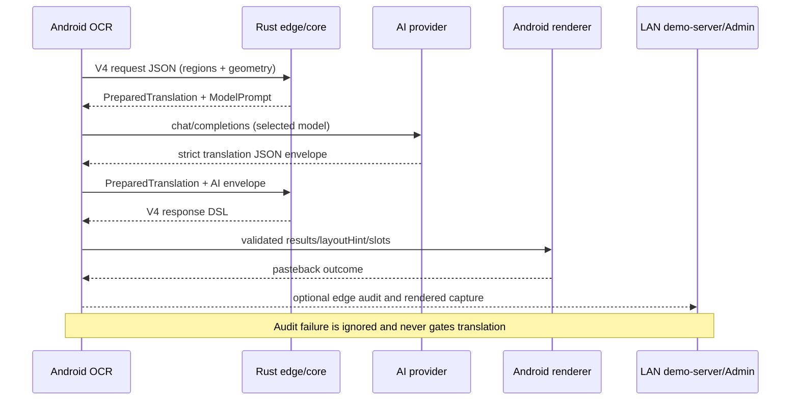

# 端侧 V4 翻译核心 crate 与无感集成设计

日期：2026-08-10

## 结论

本次改造采用“共享纯 Rust 核心 + Android 进程内边缘服务 + Kotlin 网络传输 + 可选 LAN 审计”的结构。`demo-server` 和 Android 不再各自维护 V4 分组规划与提示词；两者共同依赖 `ocr-translation-core`。Android 不在本机监听端口，也不引入 Axum/SQLite，而是通过 JNI 在应用进程内执行两阶段服务：

1. `prepare`：接收无损 OCR V4 JSON，校验协议、执行 regions-first 规划、生成 AI 提示词及严格 JSON Schema。
2. Kotlin transport：按当前选中的 provider/model 调用 OpenAI-compatible HTTPS 接口。
3. `complete`：校验模型响应，生成包含 `documentPlan/results/layoutHint/renderSlots/sourceCoverSlots` 的 V4 DSL。
4. Android 沿用现有 V4 解析、约束校验和回贴渲染。

这种结构保留了现有后端和 Admin：自建 v3/v4 入口不变；新增“端侧 v4”入口独立工作；调试环境若能连接 LAN 后端，则旁路上传请求、模型输入输出和最终 DSL，Admin 按普通 V4 记录查看。LAN 不可用不会影响翻译或回贴。

## 模块职责

| 模块 | 负责 | 不负责 |
| --- | --- | --- |
| `ocr-translation-core` | V4 DTO/校验、regions-first 分组、布局计划、提示词、模型 JSON 校验、DSL 装配 | HTTP、密钥、数据库、Android UI |
| `ocr-translation-edge` | 稳定的 `prepare/complete` API、JNI 边界、stdin CLI | AI 网络请求、Admin |
| `demo-server` | Axum API、provider 传输、取消、Diesel 审计、Admin | 私有 V4 规划副本 |
| Android Kotlin | OCR 采集、provider/model 选择、HTTPS、生命周期/取消、DSL 回贴 | 重新推导服务端布局 |

## 数据流



## 配置和模型切换

Android 高级设置可直接保存 provider、API 根地址、API Key 和模型列表。本机配置优先级最高；首次尚未保存时，Debug 构建再按 `Gradle property > demo-server/.env > 非敏感默认值` 初始化，因此真机后续验证不依赖 `demo-server/.env` 或 LAN 后端持续在线。

| Gradle property | `.env` | 说明 |
| --- | --- | --- |
| `EDGE_AI_PROVIDER` | `TRANSLATION_PROVIDER` | provider 名，默认 `openlux` |
| `EDGE_AI_BASE_URL` | `OPENLUX_BASE_URL` | OpenAI-compatible `/v1` 根地址 |
| `EDGE_AI_API_KEY` | `OPENLUX_API_KEY` | 仅注入 Debug APK |
| `EDGE_AI_MODELS` | `OPENLUX_MODELS` | 逗号分隔 allowlist |

当前优先模型列表为 `gemini-3.5-flash-lite`、`gpt-4.1`、`claude-sonnet-3.6`。Android 高级设置中的“端侧 AI 模型”下拉框只允许选择本机配置列表中的模型，选择结果存储在本机偏好中；下一次请求以请求开始时的 provider/model 快照执行。Release 构建不会自动读取或内置 Debug API Key，但允许在端侧手工配置后启用“端侧 v4”。

注意：把 API Key 放进 APK 不能防止有能力的用户提取密钥。当前能力定位为内部调试和真机验证；正式发布应改为短期令牌、系统 Keystore 包装的用户密钥，或可信网关。

## 自动装配

`:app:preDebugBuild` 自动执行：

```text
cargo build -p ocr-translation-edge --target aarch64-linux-android
target/.../libocr_translation_edge.so
  -> app/build/generated/rustJniLibs/arm64-v8a/
  -> Debug APK
```

构建直接使用 Android NDK clang，不依赖额外安装 `cargo-ndk`。本地 CLI 可独立运行：

```bash
cargo run -p ocr-translation-edge -- prepare openlux gpt-4.1 \
  < ocr-translation-core/examples/v4-minimal-request.json
```

`prepare` 和 `complete` 总是返回 `{ok,value,error}` JSON，Rust 错误不会跨 JNI unwind。

## 兼容性

- `/api/v2/translate/groups`、`/api/v3/translate/layout-plan`、`/api/v4/translate/layout-plan` 保持不变。
- 服务端 V4 使用共享核心装配 DSL；v2/v3 仍保留原逻辑，降低本次改动风险。
- 新增 `/api/v4/edge-audits`，仅保存 Android 已完成的 V4 请求/响应，不重复调用 AI。
- Admin 数据库结构和详情页布局不变；模型列使用 `<provider>:<model> (edge)` 区分端侧执行。
- 回贴截图继续使用已有 `/api/v4/translate/requests/{requestId}/rendered-capture`，只有存在可达 LAN 审计记录时才会出现在 Admin；上传失败不影响端侧。

## 后续验证顺序

1. 用最小 V4 fixture 验证 core 的 `prepare -> complete -> DSL`。
2. 运行 Rust 全套测试和 Android JVM 测试，确认旧 v2/v3/v4 行为不回归。
3. Debug APK 检查 `lib/arm64-v8a/libocr_translation_edge.so` 已打包。
4. 真机分别选择三个 OpenLux 模型跑文章、聊天、技术文档的小样本，只验证流程和 DSL 完整性。
5. 断开 LAN 后端重跑，确认翻译仍成功；恢复 LAN 后确认 Admin 出现 `(edge)` 记录和回贴截图。
6. 流程稳定后再扩大场景，逐步优化模型提示词、复杂绕排和极端溢出，而不是在首轮集中调参。

## 本轮实测结果

- Rust：core 21 项、edge 1 项、demo-server 35 项测试通过。
- Android JVM：208 项测试通过；Debug APK 自动完成 Rust arm64 交叉编译和装配。
- APK：确认包含 `lib/arm64-v8a/libocr_translation_edge.so`，产物位于 `app/build/outputs/apk/debug/app-debug.apk`。
- 服务端真实请求：`gemini-3.5-flash-lite` 返回“Rust 是一种系统编程语言。”，V4 响应使用 `semantic-translation-core-v1-regions-first`，包含完整 `layoutHint/renderSlots`。
- Admin：`/api/v4/edge-audits` 写入成功，列表模型字段显示 `openlux:gpt-4.1 (edge)`。
- 真机 `23113RKC6C`：JNI prepare 和端侧直接调用 AI 的完整 `prepare -> OpenLux -> complete -> Android V4 parser` 两项仪器测试均通过，耗时 3.746 秒。
- 故障隔离：真机当时保存的是旧网段 LAN 地址，因此边缘审计未回传，但端侧 AI 翻译仍成功，验证了“LAN 不可用不影响主流程”的要求。

### 2026-08-11 真机复验

- 设备：`23113RKC6C`，ADB 无线连接 `192.168.0.46`。
- 最新 Debug APK 覆盖安装成功，应用主界面启动正常，无 `FATAL EXCEPTION` 或 `UnsatisfiedLinkError`。
- 真机设置页确认“端侧 v4”入口可选，`gpt-4.1` 模型、OpenLux provider/API 地址、脱敏 API Key 和模型列表均由 Android 本机配置展示。
- JNI `prepare` 测试通过：端侧加载 `libocr_translation_edge.so`，生成包含 `regionLines` 和严格 `json_schema` 的 V4 模型请求。
- 端侧直连测试通过：Android 直接调用 OpenLux，再由 Rust `complete` 生成 DSL，Android V4 parser 成功获得 `TRANSLATED`、非空译文和 1 个 `renderSlot`。
- 第一次关闭 LAN 审计地址运行耗时 7.138 秒，翻译仍成功；第二次配置 `http://192.168.0.63:8090` 后运行耗时 6.099 秒，证明审计旁路不会阻塞主链路。
- Admin 成功记录请求 `android-edge-live-test`：审计 ID `fb96de26-470c-4516-8741-5d26c32b9c01`，模型 `openlux:gpt-4.1 (edge)`，服务端记录耗时 5969 ms，1 组/1 区域/39 字符。
- 查看地址：`http://192.168.0.63:8090/admin/requests/fb96de26-470c-4516-8741-5d26c32b9c01`。

### 2026-08-11 Rust Book “Hello, Cargo!” 悬浮窗真机验证

- 目标页：`https://doc.rust-lang.org/book/ch01-03-hello-cargo.html`，真机浏览器深色主题，使用项目自身的“开启识别悬浮窗”入口执行，未使用浏览器自带翻译。
- 端侧链路：`EMBEDDED_V4 -> openlux -> gpt-4.1 -> Rust complete -> Android V4 renderer`。首次启动按 Android 要求选择了浏览器作为屏幕共享对象，随后识别、翻译和回贴自动完成。
- OCR 共识别 25 行；发往翻译核心的可见内容为 23 个区域、972 字符，按页面几何与段落连续性合并为 5 个组：页面标题、`Hello, Cargo!`标题及 3 个正文段落。
- AI 返回 5 个完整译文块，例如 `Hello, Cargo! -> 你好，Cargo！`；三个长段落均保留 `Rust`、`Cargo`、`Rustaceans`、`Hello, world!` 等技术标识，未发生分片译文、译文缺失或标识丢失。
- 端侧运行指标：OCR 885 ms，AI 翻译 6887 ms，渲染 194 ms，总耗时 8019 ms；`translated_regions=5`、`patches=5`、`failed=0`，原文拉丁词保留率仅 2.72%，证明正文遮盖基本完整。
- Admin 审计 ID：`338282d3-917b-40d2-9f20-1c1a8e7a7b97`，记录状态 `SUCCEEDED`，模型 `openlux:gpt-4.1 (edge)`，服务端记录耗时 6703 ms。查看地址：`http://192.168.0.63:8090/admin/requests/338282d3-917b-40d2-9f20-1c1a8e7a7b97`。

人工视觉核验结论：本轮“OCR 行 -> 语义组 -> 整组翻译 -> DSL -> 块级回贴”链路通过，三个大段落都在原文占用区域内完整回贴，没有再出现大面积空白或按 OCR 行碎片化绘制。但当前还有两个明确的视觉优化点：

1. 页面导航标题被 OCR 识别为 `Ea The Rust Program...`，模型因而返回 `Ea Rust 程序...`。根因在 OCR 输入与控件区域分类，不是语义组丢失或 DSL 回贴失败。后续应对顶部导航/截断标题提高 `CONTROL + PRESERVED` 判定优先级，或在 OCR 置信度偏低时禁止翻译。
2. 深色网页上的回贴遮罩为中性灰，与原页近黑背景存在明显色差。当前几何覆盖正确，但视觉还原度不足；后续应将组外围背景的中位色/局部主色用于 `backgroundColor`，同时根据对比度选择译文颜色。

### 2026-08-11 Provider 请求耗时分析

分析对象为 Admin 审计 `338282d3-917b-40d2-9f20-1c1a8e7a7b97`。该请求不是 5 个语义组串行调用 5 次模型，而是一次批量请求，因此组级批处理方向正确，不应拆分为多请求。

| 指标 | 实测值 | 结论 |
| --- | ---: | --- |
| Admin/端侧记录耗时 | 6703 ms | 包含网络、Provider、结果校验和 DSL 完成阶段 |
| Provider `total_duration_ms` | 4020 ms | 模型服务内部的主要耗时 |
| Provider 首 token | 1425 ms | 包含调度/排队，其中引擎 TTFT 仅 99 ms |
| Provider 生成完成 | 4186 ms | 391 个输出 token，引擎内部生成 2848 ms |
| 端到端额外开销 | 约 2.5-2.7 s | HTTPS 往返、JSON 编解码、Rust `complete`、DSL 校验及 LAN 审计 |
| Provider 请求体 | 13739 bytes | 相对 990 字符原文存在明显结构放大 |
| 输入 / 输出 token | 2943 / 391 | 耗时主要受输入预处理、排队和生成影响 |
| 缓存 token | 0 | 系统提示和 Schema 尚未获得 Provider 缓存收益 |

请求放大的主要原因是同一段文字同时出现在 `documentContext`、`translateGroups[].sourceText` 和 `regionLines[].text`；每行又带有几何、阅读顺序和槽位数据。用户消息达 8301 字符，而真实原文仅约 990 字符；动态 `response_format` 另占 2026 字节，且随组数重复同类字段结构。

推荐按以下顺序优化：

1. P0：保留 `translateGroups[].sourceText`作为唯一完整原文；`documentContext` 改为组 ID、角色和短摘要索引，不再复制全文。`regionLines` 仅保留必要的归一化几何和行序，文本可由 `sourceText` 按行序对应。目标是先将输入 token 降低 30%-45%。
2. P0：将按 group ID 动态展开的 Schema 改为稳定的 `translations[]` 数组 Schema，每项使用 `groupId + translatedText + language`，再由本地校验 ID 集合完整性。这能减少 Schema 随组数线性增长，并增加系统提示/Schema 被缓存的可能性。
3. P1：将 `max_tokens=8192` 改为基于原文长度和组数的自适应上限。本例实际仅用 391 token，建议小页面限制在 1024-2048；该项主要降低异常长输出风险，不应预期单独带来数秒收益。
4. P1：对同一屏 OCR 内容与翻译模式建立内容哈希缓存，滚动未改变的语义组直接复用译文。这对持续翻译比单次请求内的微调更有价值。
5. P2：将 Provider 计时细分为 DNS/TCP/TLS、请求上传、TTFT、生成、Rust complete、审计上传，避免仅依赖一个 `duration_ms`猜测。

当前 4.02 秒的 Provider 耗时已经远低于本地 9B Qwen 的分钟级耗时，且单次批量请求结构正确。近期合理目标是通过 P0 压缩将 Provider 部分稳定到约 3-4 秒，再通过连接复用、缓存和细分计时处理额外的 2.5 秒；不建议为追求单次延迟而破坏整页语义上下文。
