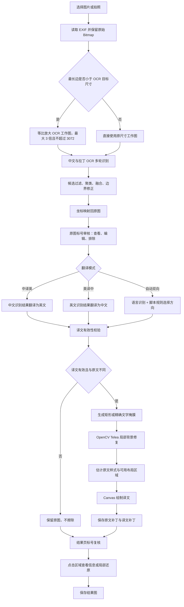
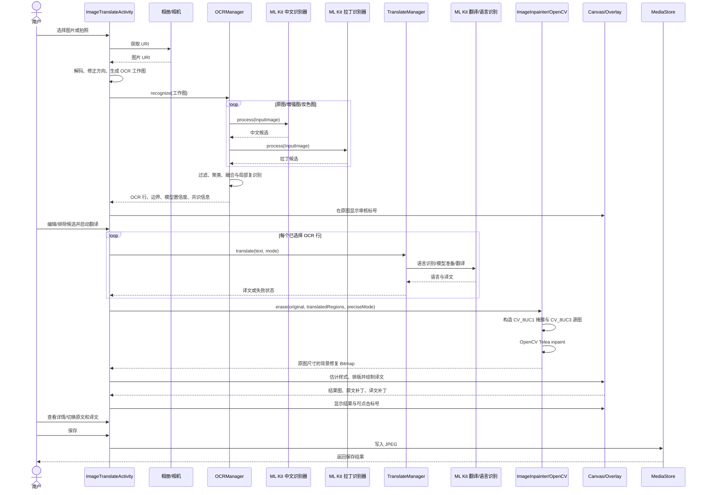
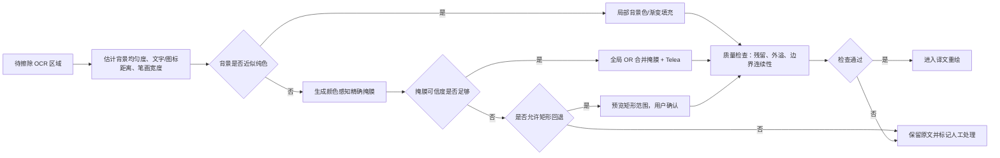
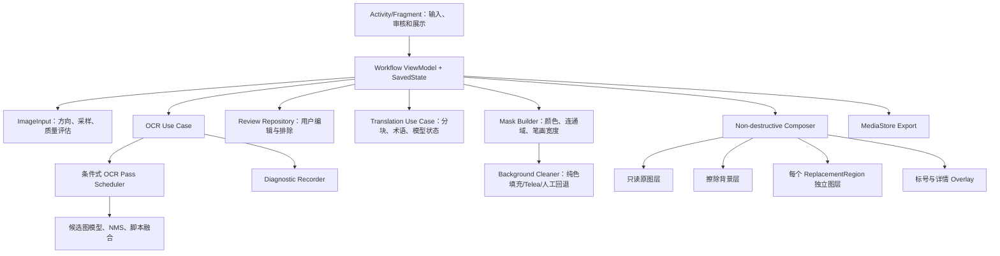
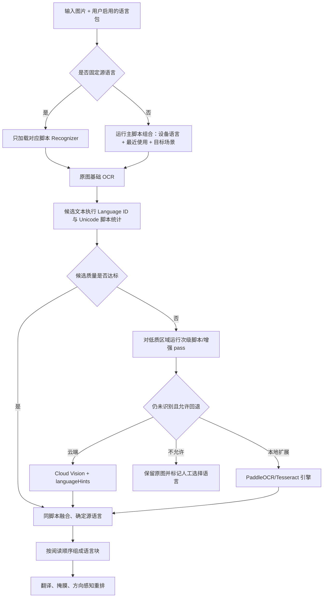

# ImageTranslateOCR 当前功能指导与技术调研报告

> 基线日期：2026-07-22
>
> 主要分析范围：Android 图片 OCR、中英及多语言翻译、OpenCV 文字擦除、译文重绘、标号复核与局部还原
>
> 补充范围：仓库内 iOS/macOS 实现与 Android 的能力差异

## 1. 报告目的

本报告以当前仓库代码和既有调校记录为准，说明项目实际处理流程、核心依赖、OCR 与 OpenCV 擦除策略、交互能力和主要风险，并给出可执行的优化顺序与回归验证方法。

本文刻意区分两类内容：

- **当前实现**：代码中已经存在且本次已核对的行为。
- **建议方案**：尚未全部实现，需要按优先级逐步验证的优化方向。

报告可作为后续版本调校的基线。每轮修改建议继续记录到 [translation-tuning-log.md](translation-tuning-log.md)，并补充样本、参数、结果截图、量化指标和对应提交号。

## 2. 执行摘要

当前 Android 版本已经形成一条完整且可人工复核的图片翻译链路：选择图片或拍照、双模型多轮 OCR、逐行审核、中英方向判断与翻译、仅擦除成功翻译的文字、尽量复用原文字样式重绘、标号查看、局部原文/译文切换、保存结果。当前业务主链仍是中英互译，多语言扩展需要增加脚本路由、语言包管理、双向排版和不支持脚本的 OCR 回退层，不能只向现有翻译下拉框增加语言名称。

项目现阶段的主要矛盾已经不再是“能否运行”，而是以下四类精度和一致性问题：

1. **OCR 候选召回与融合仍不稳定**：小字、深色背景、图标相邻文字、长图中的孤立短中文可能漏识别；多轮结果又可能把图标、品牌或装饰误认为文字。
2. **擦除掩膜在精确与完整之间失衡**：矩形掩膜容易擦除图标和分隔线，精确掩膜可能残留抗锯齿边缘；重叠 ROI 的掩膜合成还存在覆盖而非并集的风险。
3. **译文布局缺少真正的场景约束**：当前能够估计字号、粗细、前景色和背景色，但无法精确还原字体、基线、字距、旋转、阴影，也没有完整的图标/图片安全区，因此可能遮挡邻近图标或溢出。
4. **还原机制是结果位图上的补丁切换，不是非破坏性图层**：普通场景可用，但重叠区域不能保证相互独立，缩放触摸与标号点击也可能发生事件竞争。

最优先的工作不是继续增加固定词典或无条件增加 OCR 轮次，而是先建立可量化的回归基线，再修正掩膜并集、重叠区域合成和长图漏检，最后推进上下文翻译与版面安全区。

## 3. 项目与平台概况

### 3.1 仓库平台矩阵

| 平台 | OCR | 翻译 | 擦除/重绘 | 当前定位 |
| --- | --- | --- | --- | --- |
| Android | ML Kit 中文与拉丁文字识别，多轮预处理和候选融合 | ML Kit Translation，中英单向或自动双向 | OpenCV Inpaint + Android Canvas | 当前最完整、本文重点分析 |
| iOS | Google ML Kit 中文文字识别 | Apple Translation | CoreGraphics | 已有工程骨架，需独立验证功能对齐 |
| macOS | Apple Vision | Apple Translation | CoreGraphics，支持可选 OpenCV 包装 | 桌面实现，算法与 Android 并非完全同源 |

跨平台代码当前没有统一的 OCR 候选、翻译结果、掩膜和样式数据协议。若后续要对齐效果，建议先统一回归样本与指标，不要直接要求不同系统 OCR 输出逐字符一致。

### 3.2 Android 关键模块

| 模块 | 主要职责 | 当前规模/特征 |
| --- | --- | --- |
| `App.kt` | 初始化 OpenCV，维护全局就绪状态 | 同步初始化失败时回退异步初始化 |
| `ImageTranslateActivity.kt` | 图片输入、流程状态、审核、翻译、擦除、重绘、保存与交互 | 当前承担大量编排和 UI 状态职责 |
| `OCRManager.kt` | 中英文多轮 OCR、过滤、融合、边界修正和长图局部复识别 | 核心识别逻辑集中，启发式规则较多 |
| `TranslateManager.kt` | 语言判断、模型准备、中英翻译、失败校验和重试 | 动态翻译，不依赖写死的 `uiTranslations` |
| `ImageInpainter.kt` | 矩形/精确掩膜生成、OpenCV Telea 修复 | 保证 OpenCV 输入通道格式，支持原图局部写回 |
| `ReplacementOverlayView.kt` | 标号、区域状态和点击提示 | 红色表示译文，绿色表示原文或排除项 |
| `ZoomableImageView.kt` | 图片缩放、拖动、双击操作 | 与结果页单击复原手势仍需统一事件分发 |

### 3.3 当前流程状态

Android 页面内部以三个主要阶段组织：

- `READY`：选择图片或拍照，准备 OCR。
- `REVIEW`：在未修改的原图上显示 OCR 标号，用户可查看、编辑或排除候选。
- `RESULT`：显示擦除和重绘结果，用户可点击标号查看原文/译文，并切换局部原图补丁。

这个阶段划分符合人工验证需求，但位图和候选状态主要保存在 Activity 内；发生进程回收或复杂配置变更时，恢复能力不足。

## 4. 构建与依赖分析

### 4.1 当前构建基线

| 项目 | 当前值 | 结论 |
| --- | --- | --- |
| Android Gradle Plugin | 8.7.3 | 官方支持最高 API 35 |
| Gradle Wrapper | 8.13 | 当前机器构建成功，但与 AGP 8.7 官方推荐的 8.9 不一致 |
| JDK | Android Studio JBR 21.0.10 | 当前构建可用；AGP 8.7 官方最低/默认基线为 JDK 17 |
| Kotlin | 2.0.21 | 当前编译通过 |
| `compileSdk` | 35 | 与 AGP 8.7 支持范围一致 |
| `targetSdk` | 34 | 不影响使用 compileSdk 35 编译，但后续上架前需单独评估升级 |
| `minSdk` | 24 | 覆盖 Android 7.0 及以上 |
| Java/Kotlin 字节码目标 | 17 | 与当前 Android 工具链兼容 |

本次使用 Android Studio 自带 JBR 执行 `:app:assembleDebug`，构建通过。README 中记录的 Gradle 8.9 与实际 Wrapper 8.13 存在文档漂移，应统一说明。

### 4.2 Android 直接依赖

| 依赖 | 版本 | 用途 | 分析 |
| --- | --- | --- | --- |
| `androidx.core:core-ktx` | 严格锁定 1.16.0 | Android Kotlin 扩展 | 锁定避免 1.19.0 要求 API 37/AGP 9.1 的元数据错误 |
| `androidx.appcompat:appcompat` | 1.7.1 | Activity 与兼容 UI | 常规依赖 |
| `com.google.android.material:material` | 1.14.0 | Material 控件 | 常规依赖 |
| `androidx.constraintlayout:constraintlayout` | 2.2.1 | 页面布局 | 常规依赖 |
| `androidx.lifecycle:lifecycle-runtime-ktx` | 严格锁定 2.9.2 | 生命周期协程 | 当前可用，流程状态尚未迁入 ViewModel |
| `kotlinx-coroutines-android` | 严格锁定 1.8.1 | 异步 OCR/翻译调度 | 当前大量操作仍按候选顺序串行执行 |
| `com.google.mlkit:text-recognition` | 16.0.1 | 拉丁文字 OCR，应用内打包 | 启动即可用，增加安装包体积 |
| `com.google.mlkit:text-recognition-chinese` | 16.0.1 | 中文文字 OCR，应用内打包 | 中文场景主模型 |
| `play-services-mlkit-text-recognition` | 19.0.1 | GMS 分发的拉丁 OCR | 与 bundled 拉丁 OCR 同时声明，功能层面冗余；Gradle 会做依赖去重，但仍应明确只保留一种交付策略 |
| `com.google.mlkit:language-id` | 17.0.6 | 自动判断源语言 | 短文本和混合文本需结合脚本规则，不能只依赖置信度 |
| `com.google.mlkit:translate` | 17.0.3 | 设备端中英翻译 | 模型按需下载，单语言模型约数十 MB |
| `com.quickbirdstudios:opencv` | 4.5.3.0 | Android OpenCV 打包 | 版本较旧，包含多 ABI 原生库，是 Debug APK 体积主要来源 |

### 4.3 依赖交付建议

1. **OCR 交付方式二选一**：当前已使用 bundled 中文和拉丁模型，若要求离线首开可用，可移除直接声明的 GMS 拉丁 OCR；若更关注 APK 体积，则统一改为 Play Services 动态模型并设计下载状态。
2. **翻译模型显式管理**：当前启动时准备中英两个方向。建议展示模型状态、下载进度和失败原因，仅在用户启用相应方向时下载，并默认限制在 Wi-Fi 或由用户确认移动网络。
3. **OpenCV 体积治理**：Debug APK 约 262 MB，包含 `arm64-v8a`、`armeabi-v7a`、`x86`、`x86_64` 四套 OpenCV 原生库。发布时应使用 AAB 或 ABI split，并评估迁移到当前受维护的 OpenCV Android 分发。
4. **工具链成套升级**：不要只提高 `androidx.core`。要么将 Wrapper 调整到 AGP 8.7 官方组合，要么整体升级 AGP、Gradle、compileSdk 后再放开 AndroidX 版本锁。
5. **16 KB 页大小验证**：当前对 OpenCV 依赖抑制了 `Aligned16KB` 警告。发布前应在 16 KB 页设备/模拟器上实际安装和运行原生库，而不是把警告抑制视为兼容性证明。

## 5. 当前端到端处理流程

### 5.1 操作指导

1. 用户通过“选择图片”或相机获取原图。
2. 应用读取 EXIF 方向并生成方向正确的原始 Bitmap。
3. 应用按图像尺寸生成 OCR 工作图；较小图片会等比放大，最长边受上限约束。
4. `OCRManager` 使用中文与拉丁识别器执行多轮识别，并融合候选。
5. 应用把候选坐标映射回原图，在原图上显示标号进入审核。
6. 用户可点击标号查看 OCR 文本、修改文本、决定是否参与翻译。
7. 应用按“中译英、英译中、自动双向”模式逐项翻译，并校验输出是否有效。
8. 只有译文与原文有效且确实发生变化的区域，才进入擦除列表。
9. OpenCV 在原图副本上生成掩膜并修复背景，随后 Android Canvas 绘制译文。
10. 结果页显示标号；点击标号可查看 OCR 原文、译文和识别证据，并在原文补丁与译文补丁之间切换。
11. 用户确认后保存到系统图片目录。

### 5.2 当前流程图



### 5.3 当前主要时序图



## 6. OCR 识别分析

### 6.1 当前识别策略

当前 `OCRManager` 同时使用中文和拉丁模型，最多执行以下六类整图调用：

| 图像版本 | 中文模型 | 拉丁模型 | 目的 |
| --- | --- | --- | --- |
| 原图 | 是 | 是 | 保留正常字体和颜色信息，作为最高可信来源 |
| 灰度高对比图 | 是 | 是 | 增强低对比、小字和浅色文字 |
| 反色图 | 是 | 是 | 补充深色背景上的浅色文字；候选需通过暗背景条件 |

候选随后经过以下处理：

- 过滤明显非文字元素，按行内间距重新分组。
- 清理行边缘游离字形，并尝试恢复分隔符。
- 以候选最小面积为基准，重叠率达到约 0.45 时聚为一组。
- 综合来源轮次、不同识别器一致性、文本质量、置信度、完整度和宽度评分选择代表候选。
- 对垂直重叠充分且间距较小的碎片进行合并。
- 对短中文标签使用像素墨迹修正边界，减少把左侧图标包含进文字框。
- 长图中的已有中文短文本候选可进入局部放大复识别。

这里显示的“共识分数”是多来源证据的启发式分数，不是经过标定、可直接解释为正确率的概率。

### 6.2 当前策略的优势

- 中文和英文混排场景不依赖单一识别器。
- 对低对比、深色背景和长截图做了针对性补偿。
- 保留原图候选优先级，降低增强图产生伪文字的风险。
- 识别阶段只输出候选，用户可以在写入原图前人工编辑或排除。
- 局部复识别有尺寸上限，避免无限放大和内存失控。

### 6.3 已知局限及原因

#### 6.3.1 明显中文仍可能漏识别

历史样本中的“自然色”“启用自动旋转”“已开启/时钟”等短中文虽然肉眼清晰，仍可能只保留英文结果。主要原因是：

- 文字实际像素高度偏小，图像在整图缩放后笔画不足。
- 中文与英文紧邻时，ML Kit 可能按一条混合行返回，候选融合选择了更完整但中文错误的版本。
- 短中文字符数量少，文本质量和一致性规则容易把它当作弱候选。
- 长图局部复识别只会处理“已经存在的候选”，无法发现所有识别器都完全漏掉的新区域。

ML Kit 官方建议字符在输入图中至少约为 16×16 像素，通常超过 24×24 后继续放大收益有限。当前整图缩放能改善一部分小字，但不能保证每个局部区域都进入合适尺度。

#### 6.3.2 图标相邻文字边界不稳定

“下载记录”等文本左侧存在图标时，ML Kit 可能把图标笔画与汉字连接，或把第一个汉字裁掉。现有短中文墨迹修正可以改善部分案例，但它仍基于阈值和连通结构，面对细线图标、粗体字或相同前景色时没有语义分离能力。

#### 6.3.3 深色背景与反色候选存在误检

反色识别能提高深色按钮上的浅色文字召回，但图标、开关、状态栏符号也会变成高对比轮廓。当前只按源区域亮度和文本质量过滤，无法完全区分“文字形状”和“图标形状”。

#### 6.3.4 候选聚类是顺序相关的启发式方法

候选以重叠率聚类，复杂密集页面中可能：

- 把相邻但不同语义的行合并；
- 把同一行的不同边界版本保留为多个候选；
- 因候选遍历顺序不同而选择不同代表结果。

#### 6.3.5 识别失败缺少可观察性

部分 OCR pass 异常会被吞掉以保证流程继续，但当前没有稳定输出每轮耗时、异常、候选数、过滤原因、最终融合来源等诊断数据。仅看最终截图很难区分“模型未返回”“坐标融合丢弃”还是“业务过滤删除”。

### 6.4 OCR 优化建议

#### 第一阶段：先提高可诊断性

每次识别生成一份可导出的 JSON 诊断记录，至少包含：

- 原图尺寸、OCR 工作图尺寸和缩放比例；
- 每个 pass 的模型、预处理方式、耗时、异常和原始行数；
- 每个候选的文本、边界、脚本、来源、亮度、质量分、模型分和过滤原因；
- 聚类成员、最终代表项、局部复识别前后差异；
- 用户编辑、排除和最终是否翻译/擦除。

这样才能对“4、9、13 没识别”一类问题做根因归类，而不是继续叠加全局阈值。

#### 第二阶段：从“候选内复识别”升级为“区域召回”

1. 对长图按有重叠的瓦片执行基础 OCR，使完全漏掉的局部文字也有机会产生候选。
2. 根据预计字符高度选择 1×、2×、3×局部尺度，使目标字符落入约 16–24 像素有效范围。
3. 第一轮只跑原图；仅对低置信度、暗背景、低对比或小字区域触发增强/反色，降低时延和误检。
4. 增加模糊度、倾斜和透视质量判断；必要时先矫正，再 OCR。

#### 第三阶段：改善候选融合

- 以行基线、字符高度、阅读顺序和脚本连续性构建空间图，再做确定性的 NMS/聚类。
- 中文与拉丁候选允许按字符片段互补，但保留完整来源和置信证据。
- 将图标、品牌 Logo、状态栏符号作为独立类别，而不是仅依赖“是否像文字”。
- 对用户已经修正过的同类模式建立本地纠错记忆，但不要以写死 UI 文案替代翻译。

## 7. 翻译能力分析

### 7.1 当前实现

`TranslateManager` 已经根据识别文本动态翻译，不再以固定的 `uiTranslations` 表作为主要输出。当前支持：

- 中文到英文；
- 英文到中文；
- 自动双向，根据语言识别结果、汉字/拉丁脚本比例选择方向；
- 保留代码、标识符和品牌类文本；
- 翻译模型下载超时与单次翻译超时；
- 空结果、乱码、目标脚本不合理等结果校验；
- 短 UI 文本失败时带场景提示重试；
- 长文本按标点切分后重试；
- 单项失败时保留原文，避免错误擦除。

### 7.2 主要问题

- 逐行翻译缺少跨行上下文。新闻标题、说明段落被 OCR 分成多行后，单行语义会出现 `Diablo mode`、`High-translation` 等字面误译。
- 语言识别对很短的中文、英文缩写、数字和混合脚本不稳定，当前阈值只能缓解，不能解决语义歧义。
- 翻译有效性校验主要检查格式和脚本，不能判断译文是否忠实、自然或符合 UI 术语。
- 启动时准备两个方向的模型会增加首轮资源消耗，且用户对下载进度感知较弱。

### 7.3 建议方案

1. **先分块，再翻译**：按 OCR block、行距、对齐方式和字体尺寸把多行组合成语义块，以整块上下文翻译，再将结果按布局容量回填区域。
2. **术语表而非整句硬编码**：支持品牌、产品词、系统术语和用户纠错词典；词典只约束关键词，不替代真实翻译。
3. **明确失败降级**：翻译失败、目标语言不确定或译文可信度不足时保留原图，并在标号详情中显示失败原因，绝不进入擦除。
4. **模型管理 UI**：展示中英模型是否已下载、占用空间、下载网络条件和删除入口。
5. **人工校对闭环**：标号弹层中允许编辑 OCR 原文和译文，确认后只重算该区域，而非重新跑全图。

## 8. OpenCV 擦除分析

### 8.1 当前实现

应用提供矩形擦除和精确擦除两种策略。

#### 矩形擦除

- 将原图转换为 8 位三通道 RGB Mat。
- 建立 8 位单通道掩膜。
- OCR 边界向外扩约 4 像素并填充矩形。
- 使用 Telea 方法、半径约 4 进行修复。

优点是清除完整，缺点是会把图标、下划线、分隔线和背景纹理一并擦除。

#### 精确擦除

- 在 OCR ROI 周围保留小范围上下文。
- 灰度化后分别构造深色字和浅色字的自适应阈值掩膜。
- 小区域补充 Otsu 阈值候选。
- 根据前景占比选择更合理的掩膜，并进行 3×3 膨胀。
- 使用 Telea 方法、半径约 2 修复。
- 仅把掩膜非零位置从修复图复制回原图副本，掩膜外像素保持与原图一致。

当前实现已修复 OpenCV 4.5.3 曾出现的输入格式异常：`inpaint` 源图使用受支持的 8 位三通道格式，掩膜使用 8 位单通道格式。

### 8.2 OpenCV Inpaint 的适用边界

Telea Inpaint 从待修复区域边界向内传播邻域信息，适合小面积划痕、文字笔画和相对连续背景。它并不理解“按钮、图标、人物、船只或表格线”的语义。因此：

- 纯色或缓慢渐变 UI 背景通常效果较好；
- 细纹理和重复图案可能出现模糊；
- 大字号文字遮挡复杂图片时，无法真实重建被文字覆盖的原始内容；
- 掩膜只要包含非文字对象，算法就会把该对象一起重建掉。

因此，擦除质量的上限主要由掩膜质量决定，而不是单纯提高 inpaint 半径。

### 8.3 当前风险

#### 8.3.1 重叠 ROI 的掩膜可能被后处理覆盖

精确模式按区域把 `selectedMask` 写入总掩膜 ROI。若直接使用覆盖式 `copyTo`，后处理区域中的零值会清掉前一区域已经写入的非零掩膜。重叠文字框、双模型重复框或相邻行扩大后的 ROI 会受影响。

**建议**：每个区域生成局部掩膜后，以 `bitwise_or` 合并到全局掩膜；全局掩膜完成后只执行一次 inpaint。这个修复应列为 P0。

#### 8.3.2 精确模式可能残留抗锯齿边缘

灰度阈值无法稳定覆盖彩色文字和抗锯齿半透明像素；统一 3×3 膨胀对大字号可能不足，对小字号又可能过度。

**建议**：

- 在 Lab 或 HSV 空间估计前景与背景色差，而不仅是灰度差；
- 融合自适应阈值、局部边缘和连通域；
- 根据估算笔画宽度确定膨胀半径；
- 对掩膜边缘生成窄过渡带，专门消除抗锯齿残影；
- 记录“掩膜覆盖率、外溢率、残留墨迹率”，用样本校准参数。

#### 8.3.3 矩形模式过度擦除

矩形只应作为精确掩膜无法稳定生成时的用户可见回退，并应先展示高风险提示或预览。对于图标邻接、表格、卡片边框和图片区域，不宜自动使用矩形擦除。

### 8.4 建议的混合擦除策略



## 9. 样式检测、译文重绘与版面分析

### 9.1 当前能力

应用会从 OCR 区域外围估计背景色，从远离背景色的像素估计前景色，并根据笔画覆盖率判断是否使用粗体。代码或标识符倾向于使用等宽字体，普通文本使用无衬线兼容字体。随后通过 `StaticLayout` 和二分搜索缩小字号，使译文尽量适配可用区域。

布局时会参考其他 OCR 区域避让；深色按钮类区域可能居中，普通列表文本通常从原起点向右/向下扩展。

### 9.2 能检测和不能检测的 style

| 样式属性 | 当前状态 | 说明 |
| --- | --- | --- |
| 前景色 | 近似估计 | 受抗锯齿、渐变和多色文字影响 |
| 背景色 | 近似估计 | 从区域外圈像素统计 |
| 字号 | 根据边界和布局反推 | 译文变长时会缩小 |
| 粗体 | 启发式估计 | 根据墨迹覆盖率判断 |
| 字体类别 | 粗略兼容 | 等宽或无衬线，不能识别原始字体文件 |
| 对齐方式 | 部分支持 | 主要区分深色控件居中和普通左对齐 |
| 字距、基线、行高 | 非精确 | 由 Android 排版近似生成 |
| 旋转、透视、弧形文字 | 未完整支持 | OCR 边界主要按轴对齐矩形处理 |
| 描边、阴影、渐变、透明度 | 未还原 | 可能导致译文与原图风格明显不同 |

### 9.3 遮挡图标的根因

历史样本中“下载记录”的译文遮挡左侧图标，而“Room setting”正常，通常由以下差异共同造成：

- OCR 边界是否把图标包含进文字框；
- 边界修正是否正确找到首字符墨迹；
- 译文起点是否直接继承了错误边界；
- 可用区域只避让其他 OCR 文本，没有图标或非文字对象的安全区；
- 译文长度变化后向左/右扩展策略不同。

因此不能只对某个中文词单独加偏移。建议将图标候选、连通域和原文字首个字符共同用于确定“文字安全起点”，并将图标矩形加入布局障碍列表。

### 9.4 重绘优化建议

1. 每个区域输出 `fitStatus`：完整适配、缩小适配、换行适配、溢出、遮挡风险。
2. 当最小字号仍无法适配时，不应强行裁切；可扩大到空白区、允许合理换行、显示人工确认，或保留原文。
3. 版面障碍从“其他 OCR 框”扩展为文字、图标、图片主体、边框、分隔线、开关和按钮轮廓。
4. 将样式估计结果保存在区域数据中，标号弹层显示字号、颜色、粗体、对齐和匹配置信度，便于人工判断。
5. 对旋转或透视文字使用局部图层变换，而不是仅在轴对齐矩形内排版。

## 10. 标号、人工复核与局部还原

### 10.1 当前交互

- 审核页标号对应 OCR 候选，可查看识别文本、识别来源和共识信息。
- 用户可修改 OCR 文本或排除错误候选。
- 结果页红色标号表示已绘制译文，绿色标号表示显示原文或未参与替换。
- 点击已替换区域会把保存的原图补丁写回结果位图，再次点击可恢复保存的译文补丁。
- 标号弹层显示 OCR 原文和译文，不需要遮挡整个页面。

### 10.2 当前还原模型的问题

补丁是从已经合成的最终位图中截取。两个替换区域一旦重叠，区域 A 的“译文补丁”可能已经包含区域 B 的状态；恢复 A 时可能覆盖 B，反之亦然。因此当前方法无法保证每个替换点真正独立。

### 10.3 建议的非破坏性图层模型

建议保存四类数据，而不是反复覆盖单一结果 Bitmap：

1. `originalBitmap`：只读原图，任何阶段都不修改。
2. `cleanBackgroundBitmap`：所有确认区域完成擦除后的背景层。
3. `ReplacementRegion`：每项包含原文、译文、掩膜、样式、布局、启用状态和 z-order。
4. `composedBitmap`：根据当前区域状态按需重新合成的显示缓存。

点击标号只切换对应区域的 `showTranslation`，然后从背景层和全部区域状态重新合成。这样重叠区域、撤销、保存和再次编辑都有确定行为。

标号位置也应执行碰撞布局：优先放在区域左上角，发生重叠时沿边缘错位，并用短引导线指向真实区域。密集页面还应提供可滚动的文字审核列表，兼顾无障碍和小屏操作。

## 11. 性能、稳定性与维护性分析

### 11.1 内存

当前图片通过 `BitmapFactory.decodeStream` 直接完整解码；OCR 增强图、结果图、OpenCV Mat 和补丁会同时占用内存。长截图或高像素相机照片存在 OOM 风险。

建议：

- 先读取图片边界，根据屏幕审核和 OCR 需求生成采样工作图；
- 原图编辑采用分块或受控尺寸策略，并明确最大像素预算；
- 每个阶段及时释放临时 Bitmap、Mat、Recognizer 和 Translator 资源；
- 记录峰值 Java heap、native heap 和单图耗时。

### 11.2 调度

整图 OCR 最多六次识别，再叠加局部复识别；翻译按行串行，整条流程设置总超时。优点是行为稳定，缺点是长图延迟随候选数线性增长。

建议使用条件式 pass 调度和有界并发：原图先行，只有低质量区域再增强；翻译可按语义块并行，但并发数要限制，避免模型和内存抖动。

### 11.3 生命周期

当前主要 Bitmap、OCR 审核状态、翻译结果和区域切换状态由 Activity 持有，持久化只覆盖部分相机 URI。建议迁移到 ViewModel + SavedState，并把大对象落到缓存文件，以便旋转、切后台和进程重建后恢复。

### 11.4 触摸与缩放

结果页 Activity 自己安装单击手势监听，同时 `ZoomableImageView` 处理缩放、拖动和双击，两套手势可能竞争；图片矩阵变化后 Overlay 也需要同步刷新命中区域。

建议统一由 `ZoomableImageView` 提供单击与矩阵变化回调，Activity 不再抢占 `OnTouchListener`，Overlay 每次矩阵变化都重算显示坐标和点击范围。

### 11.5 保存与权限

当前通过系统选择器获得 URI，通过 FileProvider 拍照，通常不需要直接读取整个媒体库。应重新核对并删除不必要的旧存储读取权限。保存流程建议使用 MediaStore 的原子写入状态，并根据场景提供 PNG/WebP，避免 JPEG 二次压缩损伤小字和后续 OCR。

## 12. 优化路线图

### P0：先修正确性和可回归性

| 项目 | 实施要点 | 验收标准 |
| --- | --- | --- |
| 精确掩膜并集 | 所有局部 mask 使用 OR 合并，禁止重叠 ROI 零值覆盖 | 重叠文字框的最终 mask 等于各局部 mask 并集 |
| 非破坏性区域合成 | 原图、擦除背景、译文区域分层保存，按状态重组 | 任意顺序切换重叠区域，其他区域像素不变化 |
| OCR 诊断记录 | 输出每轮候选、过滤原因、融合结果、耗时和错误 | 单个漏识别样本可定位到具体阶段 |
| 手势统一 | 缩放视图统一消费触摸，Overlay 跟随矩阵刷新 | 缩放、拖动、双击、点击标号互不冲突 |
| 文档/构建对齐 | 修正 README 的 Gradle 基线和诊断页面描述 | README 与 Wrapper、Manifest 和源码一致 |

### P1：提升 OCR 与擦除质量

| 项目 | 实施要点 | 验收标准 |
| --- | --- | --- |
| 长图瓦片召回 | 有重叠切片 OCR，结果映射全图后统一 NMS | 过去完全没有候选的小中文可被召回 |
| 自适应多尺度 | 目标字符高度约 16–24 px，低质区域才放大 | 小字召回提升且总耗时可控 |
| 质量预处理 | 模糊、倾斜、透视检测与条件矫正 | 倾斜/拍照类样本 CER 明显下降 |
| 确定性候选融合 | 使用阅读顺序、基线、脚本和 NMS | 同一输入多次运行候选和编号稳定 |
| 颜色感知掩膜 | Lab/HSV 色差、连通域、笔画宽度自适应膨胀 | 残字率下降且图标外溢擦除不增加 |
| 风险回退 | 复杂背景或低置信 mask 保留原文/请求确认 | 不再静默擦除低可信区域 |

### P1：提升翻译和版面质量

| 项目 | 实施要点 | 验收标准 |
| --- | --- | --- |
| 语义块翻译 | 多行合并带上下文翻译，再回填布局 | 新闻标题、段落不再逐行断义 |
| 术语与纠错记忆 | 品牌/术语约束，保存用户确认修改 | 同类文本重复出现时结果一致 |
| 障碍物安全区 | 识别图标、边框、分隔线、图片主体 | 译文不遮挡左侧图标和右侧箭头 |
| 排版状态 | 识别溢出、裁切、遮挡并可人工处理 | 所有替换项都能说明是否完整适配 |

### P2：性能和工程治理

| 项目 | 实施要点 | 验收标准 |
| --- | --- | --- |
| 工作流分层 | Activity 只处理 UI；OCR、翻译、擦除、合成使用独立 use case/state | 流程可单元测试，旋转后状态可恢复 |
| 内存预算 | 采样解码、分块、缓存文件、及时释放 Mat | 目标最大图片不 OOM，峰值内存有记录 |
| 有界并发与缓存 | 条件 OCR pass、语义块并发翻译、结果缓存 | P95 延迟下降且结果不漂移 |
| 发布体积 | AAB/ABI split、资源压缩、评估 OpenCV 升级 | 下载体积和安装体积达到产品目标 |
| 自动化测试 | 单元测试、黄金图回归、设备 UI 测试 | 核心样本每次提交自动产生指标差异 |

## 13. 回归验证方案

### 13.1 样本集分类

建议把历史截图整理为有版本的黄金样本集，至少覆盖：

- 中文系统设置页：短标签、副标题、灰色小字、开关和右箭头；
- 深色背景按钮：白字、图标与文字混排；
- 图标相邻列表：下载记录、房间设置、分享等；
- 英文新闻标题和长段落：跨行语义与大字号抗锯齿；
- 中英文混排：品牌名、时间、数字、代码和单位；
- 长截图：不同垂直位置的小字和重复布局；
- 图片内文字：复杂照片、半透明水印、低对比字幕；
- 退化场景：旋转、透视、模糊、压缩噪声、彩色文字；
- 密集标号：候选靠近时的编号碰撞与点击命中；
- 重叠区域：验证局部还原的独立性。

每个样本保存：原图、人工标注文本和框、期望翻译、期望擦除掩膜、不可擦除对象、期望样式/对齐、当前结果和对应提交号。

### 13.2 量化指标

| 环节 | 指标 | 建议解释 |
| --- | --- | --- |
| 文本检测 | Precision、Recall、F1，IoU ≥ 0.5 | 标框是否找全且没有把图标当文字 |
| 文字识别 | CER、逐词准确率 | CER 为编辑距离除以人工真值字符数 |
| 边界 | 首字符缺失率、图标侵入率 | 专门衡量图标相邻文字问题 |
| 擦除 mask | 非文字外溢率、文字残留率 | 分别衡量擦多和擦不净 |
| 背景修复 | mask 外像素差、SSIM/PSNR、人工瑕疵率 | mask 外原则上应与原图完全一致 |
| 翻译 | 术语一致率、人工接受率、失败保留率 | 低可信时保留原文也应计为正确降级 |
| 重绘 | 溢出率、遮挡率、字号偏差、颜色差 | 不只比较 OCR 文本是否正确 |
| 还原 | 区域切换像素差、重叠独立性 | 切换 A 不得改变 B 的状态 |
| 性能 | OCR/翻译/擦除 P50/P95、峰值内存 | 按图片像素和候选数分桶统计 |

### 13.3 每轮调校步骤

1. 固定代码提交、设备、模型状态和输入原图。
2. 导出 OCR 全流程诊断 JSON，不先看最终译图。
3. 对照人工真值判断问题属于检测、识别、融合、过滤、翻译、掩膜还是布局。
4. 只调整对应阶段，避免同时改变多个全局阈值。
5. 跑完整黄金集，比较全局指标和重点样本，防止“修好一个样本、破坏另一类样本”。
6. 保存原图、结果图、差异图、指标和耗时。
7. 在调校日志记录参数、结论、失败案例和 Git 提交号。

## 14. 推荐目标架构



该架构的重点不是增加抽象数量，而是让“识别证据、用户审核、擦除掩膜、译文布局、区域状态”分别可测试、可保存、可重算。

## 15. 当前文档与实现差异

- README 写明 Gradle 8.9，但 Wrapper 当前为 8.13。
- 历史调校日志提到 Debug `OcrDiagnosticActivity`，当前源码和 Manifest 中没有该 Activity。若诊断 UI 已被移除，应在日志中注明替代入口；若仍是验证计划，则应重新实现并纳入 Debug source set。
- 当前没有 `app/src/test` 或 `app/src/androidTest` 回归测试，历史效果主要依赖人工截图。
- 目前 Android 主流程已有大量调校规则，但规则的设计依据和适用样本分散在日志中。建议将稳定规则补充为代码级测试用例，调参过程继续保留在日志。

## 16. 多语言识别与替换解决方案

### 16.1 能力边界与支持数据

多语言能力需要分别考察 OCR、语言识别、翻译、排版和字体五层。某种语言能被 `Language Identification` 判断出来，并不意味着当前 OCR 模型能够先把它从图片中识别出来。

#### ML Kit 端侧能力

| 能力 | 官方支持范围 | 对当前项目的含义 |
| --- | --- | --- |
| Text Recognition v2 | 拉丁、中文、天城文、日文、韩文五类脚本 | 可低成本扩展日文、韩文和使用天城文的语言；阿拉伯文等需要其他 OCR |
| 拉丁脚本语言 | 英语、法语、德语、西班牙语、葡萄牙语、越南语等多种语言 | 当前 Latin Recognizer 可继续复用，但要依靠 Language ID 区分具体语种 |
| 中文 | 简体和繁体，`zh`/Hans/Hant | OCR 可共用中文模型；翻译、术语和字体要区分地区标签 |
| 天城文 | 官方支持列表包括印地语、马拉地语、尼泊尔语 | 需增加 Devanagari Recognizer 和相应字体回退 |
| 日文/韩文 | 独立 Recognizer | 不应只用中文模型尝试识别汉字混排日文 |
| Language Identification | 支持大量 BCP-47 语言和多种脚本 | 必须在 OCR 得到文本后使用，不能负责图片文字检测 |
| On-device Translation | 50 多种语言，模型按需下载 | 适合离线和隐私优先场景；非英语语对会经英语中转，需单独验收质量 |

ML Kit 官方给出的 OCR 交付体积参考是：unbundled 方式每种脚本/架构约增加 260 KB 应用体积，但首次使用前要由 Google Play Services 下载模型；bundled 方式每种脚本/架构约增加 4 MB，安装后立即可用。翻译语言模型约 30 MB/种，因此不能默认下载所有语言。

#### 建议首批支持范围

| 优先级 | 语言/脚本 | OCR 方案 | 翻译方案 | 主要额外工作 |
| --- | --- | --- | --- | --- |
| 第一批 | 英语、简繁中文 | 复用当前 Latin + Chinese | 复用 ML Kit | 稳定当前基线、补充 `zh-Hans`/`zh-Hant` |
| 第二批 | 日语、韩语 | 增加 ML Kit Japanese/Korean | ML Kit | CJK 混排融合、字体、竖排测试 |
| 第二批 | 法语、德语、西班牙语、葡萄牙语、越南语 | 复用 Latin | ML Kit | 重音字符、长译文、断词和术语 |
| 第三批 | 印地语、马拉地语、尼泊尔语 | 增加 ML Kit Devanagari | ML Kit | 组合附标边界、字体和行高 |
| 独立专项 | 阿拉伯语、希伯来语 | Cloud Vision/PaddleOCR/Tesseract 之一 | ML Kit 或 Cloud Translation | RTL、双向混排、连写字形和镜像布局 |
| 独立专项 | 西里尔文、泰文等 ML Kit 端侧 OCR 未覆盖脚本 | 云端或自部署 OCR | 依据目标语言选择 | 新引擎、模型、隐私和容量治理 |

这里的“第一批/第二批”是工程风险顺序，不是市场优先级。正式范围应由目标用户语言和黄金样本测试结果决定。

### 16.2 推荐的数据模型

现有候选主要围绕中英脚本判断。多语言后应统一使用 BCP-47 标签，并把“语言”“脚本”“书写方向”“OCR 引擎”分开存储。不能用 `isChinese` 一类布尔值继续扩展。

建议核心数据结构如下：

```kotlin
enum class ScriptFamily {
    LATIN, HAN, JAPANESE, KOREAN, DEVANAGARI,
    ARABIC, HEBREW, CYRILLIC, THAI, UNKNOWN
}

enum class WritingDirection { LTR, RTL, VERTICAL, UNKNOWN }

data class LanguageProfile(
    val languageTag: String,          // BCP-47，例如 en、zh-Hans、ja、ar
    val script: ScriptFamily,
    val direction: WritingDirection,
    val ocrEngineId: String,
    val ocrModelId: String?,
    val translationSupported: Boolean,
    val fontFallbacks: List<String>
)

data class OcrEvidence(
    val engineId: String,
    val modelId: String,
    val preprocessing: String,
    val confidence: Float?,
    val rawText: String,
    val bounds: Rect,
    val cornerPoints: List<Point>
)

data class MultilingualTextRegion(
    val id: String,
    val sourceText: String,
    val sourceLanguageTag: String,    // 未确定时为 und
    val sourceScript: ScriptFamily,
    val sourceDirection: WritingDirection,
    val targetLanguageTag: String,
    val translatedText: String?,
    val evidences: List<OcrEvidence>,
    val maskId: String?,
    val styleId: String?,
    val state: ReplacementState
)
```

需要持久化的语言配置至少包括：

- `sourceMode`：自动识别或固定源语言；
- `targetLanguageTag`：全图默认目标语言；
- `enabledOcrProfiles`：允许参与自动识别的 OCR 脚本包；
- `cloudFallbackPolicy`：禁用、仅询问后使用、自动使用；
- `modelDownloadPolicy`：仅 Wi-Fi、任意网络、手动下载；
- `regionOverrides`：单个标号的源语言、目标语言和译文覆盖；
- `preserveTerms`：品牌、代码、URL、数字和用户术语表。

### 16.3 多语言 OCR 路由

图片在 OCR 前没有可供 Language ID 使用的文本，因此“自动识别全部语言”不能通过先调用 Language ID 实现。推荐采用用户语言包约束下的分层路由：



#### Recognizer 注册表

建议新增 `OcrEngineRegistry`，由语言配置决定创建哪些识别器，而不是在 `OCRManager` 中继续增加固定成员：

| Registry key | ML Kit 依赖 | 覆盖脚本 |
| --- | --- | --- |
| `mlkit-latin` | `com.google.mlkit:text-recognition:16.0.1` | Latin |
| `mlkit-chinese` | `com.google.mlkit:text-recognition-chinese:16.0.1` | Hans/Hant |
| `mlkit-devanagari` | `com.google.mlkit:text-recognition-devanagari:16.0.1` | Devanagari |
| `mlkit-japanese` | `com.google.mlkit:text-recognition-japanese:16.0.1` | Japanese |
| `mlkit-korean` | `com.google.mlkit:text-recognition-korean:16.0.1` | Korean |
| `cloud-vision` | 后端代理 API | 云端支持的多语言和混合语言 |
| `paddle-mobile` | Paddle Lite/原生库和模型 | 由选用模型决定 |
| `tesseract-local` | JNI/原生库和 `traineddata` | 由安装的语言数据决定 |

不建议把云服务凭据直接放在 APK 中。Cloud Vision/Translation 应通过受控后端代理完成鉴权、配额、审计和内容保留策略。

#### Pass 预算

当前中英模式最多会产生 2 个模型 × 3 种整图输入 = 6 次整图调用。若五套 ML Kit 模型全部照搬，则会扩张到 15 次，时延和误检都会明显增加。建议设定硬预算：

| 场景 | 基础 pass | 条件 pass | 建议上限 |
| --- | --- | --- | --- |
| 固定单语言 | 对应脚本原图 | 低质区域增强/反色 | 1 次整图 + 局部 pass |
| 中英/CJK 双脚本 | 两个主模型原图 | 暗背景或冲突区域增强 | 2 次整图 + 局部 pass |
| 自动多语言 | 最近使用的最多两个主脚本 | 低质区域触发一个次级脚本 | 3 次整图以内 |
| 未支持脚本 | 本地结果不足时询问 | 单次云端/扩展引擎 | 不重复跑全部 ML Kit 模型 |

### 16.4 多语言翻译路由

翻译层应从固定的中英两个 `Translator` 改为 `(sourceTag, targetTag)` 客户端缓存：

1. 对 OCR 结果做 Unicode 脚本统计，再调用 Language ID；两者冲突时显示 `und` 并请求用户确认。
2. 使用 `TranslateLanguage.fromLanguageTag()` 检查 ML Kit 是否支持源/目标语言。
3. 查询 `RemoteModelManager`，只下载实际需要的语言模型。
4. 以语义块为单位翻译，标号区域保存块内对齐关系。
5. 非英语到非英语需要标记“英语中转”风险；重要内容允许切换 Cloud Translation 或人工确认。
6. 代码、URL、邮箱、数字、货币、占位符和品牌先占位保护，翻译后再恢复。
7. 每项保留 `engineId`、模型版本/状态、源语言置信度和失败原因，保证结果可追踪。

模型容量可按下面的方式做初始预算：

```text
端侧 OCR bundled 增量 ≈ 启用脚本数 × 每脚本/架构约 4 MB
端侧 OCR unbundled APK 增量 ≈ 启用脚本数 × 每脚本/架构约 260 KB
翻译缓存粗略预算 ≈ 设备上保留的语言模型数 × 约 30 MB
```

实际安装体积、Play Services 模块缓存和不同 ABI 的结果必须通过构建产物与设备存储页面实测，以上数据只用于容量规划。

### 16.5 多语言擦除与重排

OpenCV 掩膜本身不理解语言，但不同文字系统会改变掩膜和排版策略：

| 场景 | 擦除注意点 | 重绘注意点 |
| --- | --- | --- |
| 拉丁重音字符 | 上下附标不能被 ROI 裁掉 | 允许单词断行，保留重音字形 |
| 简繁中文 | 笔画密集，膨胀过大会粘连 | 字号和行高接近原文，区分地区字体 |
| 日文 | 汉字、假名可能由不同模型重复返回 | 以日文阅读顺序融合，处理禁则标点 |
| 韩文 | Hangul 组合块边界需完整 | 使用支持韩文的字体，避免拆分音节块 |
| 天城文 | 顶部横线和组合附标易被切断 | 行高需覆盖上/下附标，不能按拉丁基线裁剪 |
| 阿拉伯文 | 连写字形和点号易被阈值拆散 | RTL 对齐、字形塑形、数字 LTR 子段 |
| 希伯来文 | 元音符号可能远离主体 | RTL 与标点方向隔离 |
| 竖排 CJK | 矩形行假设不适用 | 需保存角点、方向和竖排布局，不应强制横排 |

RTL 文字不能只设置右对齐。应使用 Android 的双向文字算法和 `BidiFormatter` 隔离混合方向片段，并在 `StaticLayout` 中设置正确的 text direction、alignment、locale 和字体。区域的逻辑起点/终点与屏幕左/右必须分开表示。

字体选择建议采用“系统字体优先 + 按脚本配置兼容字体 + `Paint.hasGlyph` 检查”的回退链。不要把完整 Noto 字体全集直接打包进 APK；只对目标市场需要而系统字体缺失的脚本增加字体资源，并记录字体许可证。

### 16.6 多语言 UI 与人工复核

建议把现有中英模式改为以下控件：

- 源语言：`自动` 或固定语言；
- 目标语言：单一目标语言；
- 语言包：管理已启用 OCR 脚本和已下载翻译模型；
- 单项标号弹层：显示 OCR 引擎、识别语言、源文、译文，并允许单项更改源/目标语言；
- 混合语言策略：`只翻译与目标语言不同的区域`，目标语言原文默认保留；
- 云端回退：每张图片首次使用时明确提示，不在后台静默上传。
- 翻译归属：在不遮挡原图审核的前提下，按 ML Kit/Cloud Translation 的适用规范展示服务归属和品牌信息。

混合语言图片中，每个区域独立保存源语言，但整图仍只有一个默认目标语言。例如中英日混排翻译到中文时，原本已经是中文的区域状态应为 `KEEP_TARGET_LANGUAGE`，不擦除、不重绘，也不算翻译失败。

建议的替换状态至少包括：

| 状态 | 是否擦除 | UI 表现 |
| --- | --- | --- |
| `READY_TO_REPLACE` | 是 | 已识别、已翻译、可预览 |
| `KEEP_TARGET_LANGUAGE` | 否 | 原文已是目标语言 |
| `PRESERVE_TOKEN` | 否 | 品牌、代码、URL 等保护项 |
| `NEEDS_LANGUAGE_CONFIRMATION` | 否 | 语言或脚本冲突，等待用户选择 |
| `OCR_UNSUPPORTED` | 否 | 当前引擎不支持该脚本 |
| `TRANSLATION_FAILED` | 否 | 显示失败原因，保留原图 |
| `MASK_LOW_CONFIDENCE` | 否 | 擦除风险过高，等待确认 |

## 17. 可行性方案比较与实施规划

### 17.1 OCR 方案比较

| 方案 | 语言覆盖 | 离线/隐私 | Android 接入成本 | 体积与运行成本 | 适用建议 |
| --- | --- | --- | --- | --- | --- |
| A. 仅 ML Kit 五脚本 | Latin/Chinese/Devanagari/Japanese/Korean | 完全端侧 | 低 | 按脚本增加模型；可 bundled 或 Play Services 下载 | 推荐作为近期主线 |
| B. ML Kit + Cloud Vision | 云端可识别更多语言，支持单图多语言和 language hints | 图片需上传 | 中，需要安全后端 | 按云服务调用计费，依赖网络 | 推荐作为用户授权的低频回退 |
| C. ML Kit + PaddleOCR 端侧 | 上游工具支持 100+ 语言；具体端侧覆盖取决于选用模型 | 完全端侧 | 高，需要 NDK/Paddle Lite、模型转换和 JNI | 原生库、检测/方向/识别模型增加包体与内存 | 适合隐私强、明确需要非 ML Kit 脚本的产品 |
| D. ML Kit + 自托管 PaddleOCR | 由服务端模型决定，可统一 Android/iOS/macOS | 图片发送到自有服务 | 中高，需要推理服务和运维 | 服务器/GPU、带宽、监控成本 | 适合跨平台统一和可训练场景 |
| E. Tesseract 端侧回退 | 官方 `traineddata` 覆盖广，含多种竖排脚本模型 | 完全端侧 | 高，Android 需原生集成和语言包管理 | 每语言数据文件、CPU 延迟 | 适合规则文档或特定脚本实验，不建议未经对比直接替换 ML Kit |

PaddleOCR 官方项目当前宣称支持 100+ 语言，并提供基于 Paddle Lite 的 Android 端侧部署示例；但示例需要 NDK、CMake、原生推理库、模型和字典，不能视为增加一个 Gradle 依赖即可完成。Tesseract 同样应先用本项目 UI 截图样本验证，公开语言包数量不等于移动端场景文字精度。

### 17.2 推荐组合

建议采用分层组合，而不是一次性更换当前引擎：

1. **默认层**：ML Kit bundled Latin + Chinese，保持现有离线首开能力。
2. **可选语言包层**：Japanese、Korean、Devanagari 优先采用 Play Services unbundled 模型，按用户选择下载。
3. **翻译层**：ML Kit 端侧为默认；高质量或不支持语对由用户选择 Cloud Translation。
4. **扩展 OCR 层**：只在目标市场确实需要阿拉伯文、西里尔文、泰文等脚本时，在 Cloud Vision 和 PaddleOCR 之间做样本 A/B 测试。
5. **人工兜底层**：任何引擎低置信时均保留原图，允许标号区域手工框选、输入源文和译文。

这个组合保留了当前项目的离线和隐私优势，又避免为了少量非目标语种把大模型和原生运行时全部打进 APK。

### 17.3 分阶段实施计划

下面工期是假设 1 名熟悉当前代码的 Android 工程师配合测试人员、且不包含云端采购和合规审批时的粗略估算，用于排期讨论而非交付承诺。

| 阶段 | 建议工期 | 交付内容 | 退出条件 |
| --- | --- | --- | --- |
| M0 数据与接口基线 | 3–5 个工作日 | BCP-47 数据模型、Engine Registry、诊断 JSON、语言设置原型 | 当前中英回归无退化，旧数据可迁移 |
| M1 ML Kit 多脚本试点 | 1–2 周 | 日/韩/天城文可选模型、模型管理、按脚本路由 | 目标样本 OCR 指标达到门槛，未启用模型不加载 |
| M2 多语言翻译与排版 | 1–2 周 | Translator 缓存、语言状态、字体回退、长译文布局 | 单项/整图翻译可用，目标语言区域不被重写 |
| M3 RTL 专项 | 1–2 周 | RTL 数据方向、BidiFormatter、右对齐和混排数字测试 | 阿拉伯/希伯来样本无顺序颠倒和标点粘连 |
| M4 扩展 OCR A/B | 2–4 周 | Cloud Vision 或 PaddleOCR 原型、统一候选接口 | 在目标脚本上明显优于保留原图策略，成本可接受 |
| M5 产品化 | 按范围评估 | 下载 UI、配额、隐私提示、监控、自动回归 | 性能、费用、合规和发布体积均满足目标 |

### 17.4 多语言验证数据规划

建议不要先追求几十种语言的“可选”，而是为每个目标脚本建立最小可用数据集。

#### 每个脚本的试点数据

最小试点建议每个脚本 100 张原始图片；进入稳定发布前建议扩展到至少 300 张，并保留真实设备截图而非全部使用合成图。

| 场景 | 最小样本占比 | 目的 |
| --- | --- | --- |
| 浅色普通 UI | 25% | 建立基础检测和识别准确率 |
| 深色/彩色背景 | 15% | 验证反色、颜色感知 mask |
| 图标相邻和按钮 | 15% | 验证边界与不可擦除对象 |
| 小字/长截图 | 15% | 验证瓦片、多尺度和性能 |
| 多语言混排 | 15% | 验证脚本路由、Language ID 和阅读顺序 |
| 图片/复杂纹理文字 | 10% | 验证擦除风险回退 |
| 旋转、透视、模糊 | 5% | 验证质量检查和人工兜底 |

每张图片应标注：文字框/角点、真实文本、BCP-47 语言、脚本、阅读方向、是否允许翻译、期望译文、文字像素 mask、图标/边框保护 mask 和期望排版区域。

#### 建议发布门槛

以下是清晰 UI 截图的建议目标，不适用于无法恢复背景的复杂照片：

| 指标 | 试点目标 | 说明 |
| --- | --- | --- |
| 文本检测 Precision | ≥ 95% | 图标、Logo、装饰不应大量进入替换链 |
| 文本检测 Recall | ≥ 92% | 清晰目标文字不应明显漏标 |
| Latin CER | ≤ 3% | 按各语言分别统计，不合并平均掩盖问题 |
| CJK/Devanagari CER | ≤ 5% | 组合字和短标签需单独列出 |
| 目标语言误重写率 | 0% | 已是目标语言的区域不能擦除重绘 |
| 非文字 mask 外溢率 | ≤ 0.5% | 以人工文字 mask 外被修改像素计 |
| 区域还原一致性 | 100% | 局部还原后该区域原图像素完全一致 |
| 译文人工接受率 | ≥ 90% | 对产品定义的普通 UI/短文案样本 |
| 崩溃/OOM | 0 | 在定义的最大图片和语言包组合下 |

这些门槛需要按语言分别展示 P50/P95 和失败样本，不能只给全语言平均值。

### 17.5 可行性决策门

在引入新的 OCR 引擎前依次回答：

1. 目标用户是否真实需要该脚本，样本占比是多少？
2. ML Kit 已支持脚本能否满足，不满足点是检测、识别还是排版？
3. 图片是否允许上传，用户是否能明确授权，保留周期如何定义？
4. 新引擎在同一黄金集上的 CER、边界、耗时、内存是否显著优于当前方案？
5. 额外 APK/模型体积、云调用费用和工程维护成本是否可接受？
6. 低置信失败时是否能够保留原图并人工完成，而不是错误擦除？
7. 翻译归属、品牌展示、隐私披露和云端图片保留策略是否已经进入 UI 与发布检查？

若问题 1 没有明确数据，或问题 4 没有对比优势，应暂缓增加引擎，先完善人工框选和编辑能力。

## 18. 官方资料与依据

- [ML Kit Text Recognition v2 for Android](https://developers.google.com/ml-kit/vision/text-recognition/v2/android)：模型交付方式、输入图像与文字尺寸建议、Block/Line/Element/Symbol 结构。
- [ML Kit Text Recognition v2 supported languages](https://developers.google.com/ml-kit/vision/text-recognition/v2/languages)：拉丁、中文、天城文、日文、韩文脚本及对应 BCP-47 支持列表。
- [ML Kit Translation for Android](https://developers.google.com/ml-kit/language/translation/android)：设备端翻译依赖、动态模型下载、网络条件与资源释放建议。
- [ML Kit Translation overview](https://developers.google.com/ml-kit/language/translation)：50 多种端侧翻译语言，以及非英语语对通过英语中转的质量限制。
- [ML Kit Translation supported languages](https://developers.google.com/ml-kit/language/translation/translation-language-support)：端侧翻译可使用的 BCP-47 语言代码清单。
- [ML Kit on-device Translation usage guidelines](https://developers.google.com/ml-kit/language/translation/translation-terms)：应用内翻译归属、布局和品牌规范。
- [ML Kit Language Identification supported languages](https://developers.google.com/ml-kit/language/identification/langid-support)：Language ID 支持的语言标签和脚本范围。
- [ML Kit model installation paths](https://developers.google.com/ml-kit/tips/installation-paths)：bundled 与 Google Play Services 模型交付差异。
- [Cloud Vision OCR language support](https://cloud.google.com/vision/docs/languages)：多语言图片识别、BCP-47 `languageHints`、支持/实验/映射语言层级。
- [Cloud Vision pricing](https://cloud.google.com/vision/pricing)：云端 OCR 调用成本核算入口。
- [Cloud Translation language support](https://cloud.google.com/translate/docs/languages)：云翻译的语言、地区标签、罗马化和转写能力。
- [Cloud Translation pricing](https://cloud.google.com/translate/pricing)：云翻译按字符/模型核算成本的当前价格入口。
- [PaddleOCR official repository](https://github.com/PaddlePaddle/PaddleOCR)：多语言 OCR 能力、模型和版本说明。
- [PaddleOCR on-device deployment](https://paddlepaddle.github.io/PaddleOCR/main/en/version3.x/deployment/on_device_deployment.html)：基于 NDK、CMake 和 Paddle Lite 的 Android 端侧部署步骤。
- [Tesseract traineddata files](https://tesseract-ocr.github.io/tessdoc/Data-Files.html)：按语言加载的 LSTM/legacy 数据文件。
- [Tesseract language/script support](https://tesseract-ocr.github.io/tessdoc/Data-Files-in-different-versions.html)：语言、脚本和竖排模型列表。
- [Android `BidiFormatter`](https://developer.android.com/reference/android/text/BidiFormatter)：不同书写方向混排时的方向隔离和估计。
- [Unicode Bidirectional Algorithm](https://www.unicode.org/reports/tr9/)：RTL/LTR 双向文本顺序的标准依据。
- [BCP 47 / RFC 5646](https://www.rfc-editor.org/rfc/rfc5646)：语言、脚本和地区标签的数据规范。
- [OpenCV `inpaint` API](https://docs.opencv.org/4.x/d7/d8b/group__photo__inpaint.html)：源图和掩膜格式、Telea/Navier-Stokes 方法及半径参数。
- [OpenCV Inpainting tutorial](https://docs.opencv.org/4.x/df/d3d/tutorial_py_inpainting.html)：掩膜语义和 Telea 从边界向内修复的基本机制。
- [Android Gradle Plugin 8.7 release notes](https://developer.android.com/build/releases/agp-8-7-0-release-notes)：API、Gradle 和 JDK 兼容基线。
- [Android 16 KB page size guidance](https://developer.android.com/guide/practices/page-sizes)：原生库页面大小兼容验证要求。

## 19. 结论

当前项目已经具备可用的“原图审核、动态中英翻译、OpenCV 擦除、样式近似重绘、标号查看和局部还原”闭环。多语言扩展推荐先把现有中英逻辑改造成脚本/语言/方向无关的数据模型，再逐步增加 ML Kit 语言包；对于 ML Kit 不支持的图片脚本，通过用户授权的云端 OCR 或经过黄金集验证的本地引擎回退。继续优化应从可测量、可回退和非破坏性三个原则展开：

1. 先用诊断数据确认错误发生在哪一阶段。
2. 先修正掩膜并集和区域图层模型，避免底层像素状态不确定。
3. 用长图瓦片和条件式多尺度补充 OCR 召回，不再无条件堆叠整图 pass。
4. 用语义块改善翻译，用图标/边框安全区改善重绘。
5. 用固定黄金样本和量化指标验证每次调校，所有结果绑定 Git 提交记录。

按照 P0、P1、P2 顺序推进，可以先解决当前最影响可信度的过度擦除、重叠还原和漏识别，再逐步改善语义与视觉一致性，同时控制性能和包体积。
