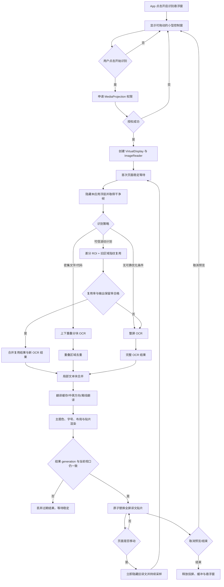
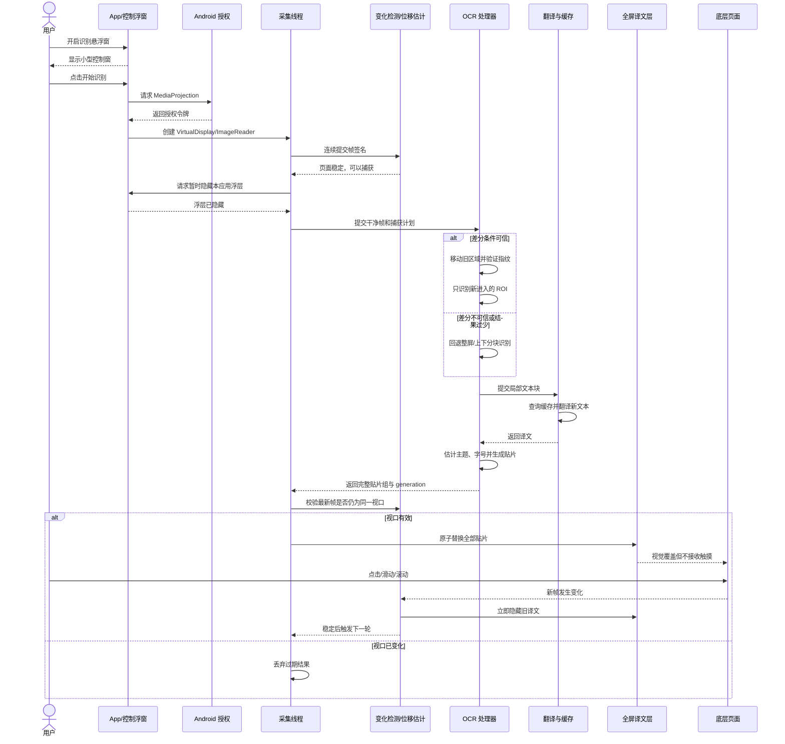

# 实时屏幕识别与悬浮翻译实验账本

> 建立日期：2026-07-26
>
> 当前代码基线：`b5e4c4d perf: add live OCR strategy benchmarks`
>
> 适用范围：Android 录屏采集、页面运动检测、OCR、翻译、译文贴片与悬浮窗交互

## 1. 文档用途

本文是实时屏幕翻译能力的统一事实来源，用于：

- 解释差分识别、帧缓冲、稳定帧、切分、复用率等术语。
- 描述当前已经落地的屏幕采集、识别、翻译和展示流程。
- 记录每次实验的假设、参数、设备、Git 节点、量化结果和最终决策。
- 约束后续优化必须先建立可回退节点，再通过同设备、同页面、同手势对比决定保留或回退。

图片 OCR、擦除和结果图重绘的历史仍见 [图片文字翻译与替换调校记录](translation-tuning-log.md)；系统截图监听和主动截屏入口见 [OCR 与截图识别完整报告](ocr-and-screenshot-recognition-complete-report.md)。本文重点维护持续录屏识别和悬浮译文实验。

## 2. 当前结论摘要

当前默认配置为“自适应场景 + 高频采样 + 单缓冲 + 自动差分”。实际交互遵循以下原则：

1. App 入口只开启小型悬浮控制窗，不立即申请录屏。
2. 用户点击“开始识别”后才申请 `MediaProjection` 权限并建立录屏会话。
3. 识别前短暂隐藏本应用浮层，避免悬浮窗进入采集画面。
4. 页面滚动时立即隐藏旧译文，触摸和滚动事件继续传递给底层应用。
5. 页面稳定后优先差分识别新增区域；可信度不足时自动回退整屏识别。
6. OCR、翻译和贴片渲染完成后一次性替换整组结果，不逐块闪烁刷新。
7. 取消预览会移除全屏译文层并停止自动刷新，只保留必要的悬浮入口。

参考视频表现出比普通跨应用 OCR 更强的内容几何或滚动同步能力，但仅凭录像不能确定它内部使用 DOM、无障碍节点、OCR 跟踪还是组合方案。当前项目不能控制底层页面布局，因此目标是接近它的交互节奏：控制条稳定、语言切换原子提交、底层触摸不受阻；在没有可靠 Track ID 前，滚动中隐藏旧译文，稳定后快速、完整地提交新译文。

### 2.1 参考视频交互与功能拆解

参考视频 `/Users/lee/Desktop/a390d28b47747a7c0f403dd5da8d54a0.mp4` 为 33.11 秒、720×1280、约 30fps。可确认的行为如下：

1. 翻译控制条固定在屏幕底部，页面长距离滚动时位置与尺寸保持稳定，不随内容漂移。
2. 原文和译文可以在同一视口反复切换；切换时图片、标题和段落锚点基本保持，文字结果整组切换，没有逐行刷出。
3. 页面仍可直接拖动和惯性滚动，翻译能力没有占用正文区域的点击与滑动事件。
4. 滚动中的过渡帧会短暂出现模糊或内容弱化，稳定后得到完整、清晰的文字布局，说明展示层允许在运动期间降级而不是强行提交半成品。
5. 图片和页面层级被保留，译文尽量占用原文字区而不是堆叠一个覆盖整屏的大面板。
6. 录像显示译文能在滚动时保持较强同步，但无法从像素结果证明其内部机制。对本项目更稳妥的等价实现是“运动开始隐藏、停稳后原子重建”；只有引入稳定 Track ID 并验证跟随误差后，才重新实验滚动中同步移动译文。

对应到当前实现：底部可拖动控制窗、触摸透传、运动期隐藏、稳定门、同视口失效校验和原子提交方向正确；主要差距是文字覆盖完整性、排版重建能力，以及稳定后结果出现的 P90 延迟。

## 3. 术语表

### 3.1 采集与缓冲

| 术语 | 含义 | 当前实现与作用 |
| --- | --- | --- |
| `MediaProjection` | Android 经用户授权提供的屏幕内容采集能力 | 只在用户点击悬浮窗“开始识别”后申请；会话结束或系统回收后必须重新授权 |
| `VirtualDisplay` | 将屏幕内容输出到指定 Surface 的虚拟显示器 | 输出到 `ImageReader.surface`，旋转后会重新配置尺寸 |
| `ImageReader` | 接收 RGBA 屏幕帧的缓冲队列 | 单缓冲配置 `maxImages=2`，多缓冲配置 `maxImages=3` |
| 单缓冲模式 | 队列较浅，只保留足够的新帧 | 延迟低、旧帧堆积少，适合阅读、代码和普通滚动，是默认方案 |
| 多缓冲模式 | 允许同时持有更多帧 | 对短时抖动和高动态页面更有容错，但可能增加内存、排队和过期帧风险 |
| 背压 | 处理速度低于产帧速度时，帧在队列中积压 | 当前通过较浅 `ImageReader`、主动关闭旧帧、处理中的队列门控来限制 |
| 采集频次 | 从帧流中进行变化检测的采样间隔 | 低/中/正常/高/极高分别为 150/100/75/50/32ms；它影响运动响应，不等同于每帧都执行 OCR |
| 稳定帧缓冲 | 保存滚动停止后的连续稳定签名 | 当前至少积累多个稳定样本，再从缓冲结果生成捕获计划，降低在回弹或尾部动画中误识别 |
| 丢帧/取最新帧 | 主动忽略已经过期的中间帧 | 对实时翻译是正确策略，因为用户关心当前视口，不关心完整视频帧序列 |

### 3.2 页面运动与差分

| 术语 | 含义 | 当前实现与作用 |
| --- | --- | --- |
| 帧签名 | 对屏幕采样点亮度的低成本摘要 | 用于快速判断重复画面、页面变化和识别完成后的视口失效，不直接参与 OCR |
| 变化率 | 两个帧签名中亮度变化超过阈值的采样点比例 | 超过阈值判定页面正在运动；极小变化可判定重复帧 |
| 稳定门 | 页面在一定时间和连续样本内不再明显变化后才允许识别 | 首次授权、页面切换、旋转和滚动结束都使用稳定等待，防止识别过渡帧 |
| 位移估计 | 根据前后帧的水平采样带估计内容垂直移动距离 | 输出 `contentShiftY`、置信度、重叠率、配准误差和多带共识率 |
| 差分识别 | 复用仍在视口中的旧译文，只 OCR 新进入屏幕的区域 | 大幅减少滚动后的重复 OCR；不能通过验证时自动回退整屏 |
| 差分 ROI | 差分识别中真正需要 OCR 的新内容矩形 | 根据滚动方向、位移量和安全重叠边距确定 |
| 理论存活区域 | 旧结果按估计位移移动后，仍完整落在当前内容区内的区域 | 差分复用率必须以它为分母，不能把已经滚出屏幕的旧区域计为失败 |
| 指纹 | 从文字区域网格采样得到的亮度数组 | 在预计位置附近搜索匹配，验证旧译文确实对应当前页面内容 |
| 复用率 | 成功通过指纹校验的区域数 / 理论存活区域数 | 当前至少复用 3 个区域且比例达到阈值，才接受差分结果 |
| 输出保留率 | 差分合并后的区域数与旧快照区域数之比 | 防止差分结果过少导致大面积漏译；不足时回退整屏 |
| 配准误差 | 前后帧对齐后的平均差异 | 越低越可信；与置信度、重叠率和共识率共同决定是否尝试差分 |
| 共识率 | 多条水平采样带对同一位移方向和幅度的一致程度 | 用来排除横幅动画、局部视频等非整页滚动造成的假位移 |
| 结果失效 | OCR 期间页面再次发生变化，当前结果不再对应最新视口 | 通过 generation 和最新帧签名丢弃，不能展示过期译文 |
| 合并/去抖 | 多次滚动变化只在最终稳定后触发一次识别 | 避免一次手势触发多轮 OCR 和译文刷屏 |

### 3.3 OCR、切分与展示

| 术语 | 含义 | 当前实现与作用 |
| --- | --- | --- |
| 整屏识别 | 对当前完整屏幕执行 OCR | 覆盖完整、逻辑简单，但滚动后重复计算最多；也是所有优化路径的安全回退 |
| 上下分块 | 将屏幕切成上下两个带重叠的垂直区块分别 OCR | 适合密集文字和代码，小字有效像素更多；需要去除重叠区重复结果 |
| 自适应切分 | 根据差分计划和场景在差分 ROI、整屏、上下分块之间选择 | 默认方案，在效率与完整性之间动态取舍 |
| 快速 OCR | 实时悬浮模式使用较轻的识别尺度和路径 | 降低延迟；结果过少或不可信时仍应回退，而不是展示稀疏译文 |
| OCR 尺度策略 | 在清晰度、耗时和内存之间选择识别位图尺寸 | 小字密集页面需要更高有效分辨率，普通页面优先控制耗时 |
| 文本块合并 | 将相邻 OCR 行按间距、对齐和语义局部分组 | 减少逐行翻译造成的语义断裂，同时避免一个超大背景覆盖整段页面 |
| 翻译缓存 | 以规范化原文为键复用已得到的译文 | 对滚动中重复出现的标题、菜单和段落降低翻译耗时 |
| 主题色估计 | 从文字周边采样局部背景明暗和颜色 | 生成与当前页面协调的译文材质，并保证暗黑模式下的对比度 |
| 译文贴片 | 包含背景材质和译文的局部 Bitmap | 按原文位置绘制到全屏透明覆盖层；覆盖层本身不可触摸 |
| 原子提交 | 完整结果准备好后一次性替换全部贴片 | 避免 OCR 区域逐块出现、页面闪烁或新旧译文混排 |
| 触摸透传 | 覆盖层不消费点击、滑动和滚动事件 | 译文层使用不可触摸 Window；只有小型控制浮窗接收操作 |
| 默认模式 | 仅依赖图像帧变化检测驱动自动刷新 | 权限少、适用范围广，是默认体验 |
| 增强模式 | 可选使用无障碍滚动事件辅助识别页面移动 | 触发更及时，但需要额外权限；图像稳定与结果失效检查仍是最终依据 |

## 4. 当前屏幕识别方案

### 4.1 输入方案

| 方案 | 数据来源 | 适用场景 | 是否持续 | 当前定位 |
| --- | --- | --- | --- | --- |
| 图片/相册 | 用户选择的静态图片 | 精细 OCR、审核、擦除和保存 | 否 | 图片翻译主链 |
| 系统截图监听 | `MediaStore` 中新增的截图文件 | 保留系统截图习惯，截图后交给 App | 否 | 辅助入口 |
| 主动录屏识别 | `MediaProjection` 帧流 | 跨应用实时阅读、滚动后自动更新 | 是 | 本文重点 |

### 4.2 主动录屏识别原理

1. `OneShotScreenCaptureService` 先创建小型控制浮窗。
2. 用户点击开始后，系统授权 Activity 返回 `MediaProjection` 令牌。
3. 服务创建 `VirtualDisplay + ImageReader`，按当前方向和分辨率接收 RGBA 帧。
4. 采集线程将帧压缩为低成本签名，`ScreenFrameChangeDetector` 判断移动、稳定和重复。
5. 移动开始时立即隐藏旧译文；持续移动只更新位移估计，不执行 OCR。
6. 稳定门满足后生成 `ScrollCapturePlan`，暂时隐藏控制浮窗并读取干净帧。
7. 自适应识别器优先验证差分路径：移动旧区域、指纹匹配理论存活区域、OCR 新进入的 ROI。
8. 差分不可信、输出太稀疏或 ROI 不合理时，自动执行整屏或上下分块识别。
9. OCR 结果经过局部文本块合并、翻译缓存和中英方向处理，生成带主题材质的译文贴片。
10. 提交前再次检查 generation 和最新视口；仍有效才原子替换覆盖层并恢复控制浮窗。

### 4.3 场景预设与用户配置

| 场景 | 频次 | 缓冲 | 切分 | 推荐用途 |
| --- | --- | --- | --- | --- |
| 自适应 | 高频 50ms | 单缓冲 | 自动差分 | 默认；普通网页、文档与混合页面 |
| 阅读 | 正常 75ms | 单缓冲 | 自动差分 | 长文章，优先稳定与低功耗 |
| 密集文字 | 正常 75ms | 多缓冲 | 上下分块 | 字号小、段落密集、扫描文档 |
| 代码 | 高频 50ms | 单缓冲 | 上下分块 | 代码编辑器、终端、技术文档 |
| 动态页面 | 极高 32ms | 多缓冲 | 整屏识别 | 动画多、局部内容变化频繁；耗时和功耗最高 |
| 自定义 | 用户选择 | 用户选择 | 用户选择 | 实验和特殊页面，不保证优于自适应 |

结论：配置入口值得保留，但默认值必须足够可靠。用户配置用于处理特殊页面，不应把算法正确性和防漏译责任转移给用户。

## 5. 流程图



## 6. 时序图



## 7. 已验证方向与 Git 节点

下表的“保留”表示该方向仍存在于当前主分支。历史节点缺少量化数据的，不补造数字；后续必须按第 9 节模板补齐。

| 日期 | Git 节点 | 实验方向 | 验证结论 | 决策 |
| --- | --- | --- | --- | --- |
| 2026-07-24 | `cf95afb` | 连续录屏识别与全屏译文层基线 | 建立悬浮控制、帧变化检测和连续翻译主链 | 保留 |
| 2026-07-24 | `8e3ba39` | 悬浮入口与录屏授权解耦 | 开启悬浮窗不立即录屏，点击开始后再授权 | 保留 |
| 2026-07-24 | `5552b85` | 控制条拖动、收起和贴片视觉 | 形成底部状态胶囊和可拖动控制入口 | 保留 |
| 2026-07-24 | `1ea73ba` | 译文与原页面视觉分层 | 使用独立材质承载译文，降低原文译文混杂 | 保留 |
| 2026-07-24 | `de28552` | 控制浮窗触摸范围收敛 | 非必要区域不拦截底层操作 | 保留 |
| 2026-07-25 | `dc3a2b7` | 全屏译文层触摸透传 | 译文贴片层改为不可触摸 Window | 保留 |
| 2026-07-25 | `48ced0e` | 页面主题色与暗色适配 | 按局部表面色生成译文材质 | 保留 |
| 2026-07-25 | `ec4274b` | App 开启悬浮入口，悬浮窗启动录屏 | 操作路径与目标视频更一致 | 保留 |
| 2026-07-25 | `c728d8b` | OCR 行合并为局部文本块 | 改善逐行碎片化，同时控制背景覆盖范围 | 保留 |
| 2026-07-25 | `07dd0d4` | 帧差、位移估计与滚动后加速 | 建立差分识别基础和移动期隐藏策略 | 保留 |
| 2026-07-25 | `6908a48` | 识别跟踪与交互细节 | 优化文本块、布局、运动估计和控制状态 | 保留 |
| 2026-07-25 | `75f24f9` | 稳定帧缓冲 | 使用滚动结束后的多帧共识生成捕获计划 | 保留 |
| 2026-07-25 | `c5d18b9` | 默认/增强模式 | 无障碍滚动事件作为可选触发信号，图像校验仍兜底 | 保留，默认模式优先 |
| 2026-07-25 | `c2642b1` | 滚动期间结果失效和展示稳定性 | 限制过期结果、避免滑动时译文漂移 | 保留 |
| 2026-07-25 | `edf98cc` | 滚动事件合并 | 一次手势停稳后只提交一轮识别，减少重复刷屏 | 保留 |
| 2026-07-25 | `7b29844` | 首次稳定等待、旋转、暗黑和实时 OCR 尺度 | 提升首次授权和方向变化后的可靠性 | 保留 |
| 2026-07-26 | `49821fc` | 稀疏差分结果保护 | 结果覆盖不足时拒绝提交并回退，防止大面积漏译 | 保留 |
| 2026-07-26 | `836ceea` | 滚动交互再收敛 | 滚动中隐藏，稳定后原子恢复，控制窗保持稳定 | 保留 |
| 2026-07-26 | `b6ccae1` | 频次、单双缓冲、切分和场景预设 | 配置入口和 AI 推荐场景完成；默认采用自适应 | 保留 |
| 2026-07-26 | `7b028b7` | 大幅滚动差分准入与理论存活区域复用率 | 两次连续实机滚动均命中差分且未见大面积漏译 | 保留 |
| 2026-07-26 | `b5e4c4d` | 同视口 A/B、结构化性能日志与覆盖率指标 | 建立可重复基准；严格 A/B 发现差分虽快约 36%，面积召回仅约 78% | 基准设施保留，差分结论降级为受保护实验路径 |

### 7.1 `7b028b7` 受控实机结果

验证条件：Xiaomi `23113RKC6C`，1440×3200，系统浏览器 Rust Book Introduction 页面，纵向滑动，配置为自适应/高频/单缓冲/自动差分。

| 场景 | 总耗时 | OCR + 翻译 | 差分 | 位移 | 复用/新识别 | 结果 |
| --- | ---: | ---: | --- | ---: | --- | --- |
| 初始整屏基线 | 1357ms | 1087ms | 否 | 0 | 0 / 22 | 覆盖完整 |
| 第一次受控滚动 | 1077ms | 822ms | 是 | -1550px | 3 / 21 | 未见大面积漏译 |
| 第二次连续滚动 | 876ms | 631ms | 是 | -1395px | 4 / 19 | 未见大面积漏译 |

第二次相对整屏基线总耗时下降约 35%，OCR + 翻译耗时下降约 42%。第一次相对整屏基线总耗时下降约 21%，OCR + 翻译耗时下降约 24%。这证明“大幅滚动 + 理论存活区域作为复用率分母”在当前样本上有效。

安全边界没有移除：大幅滚动只获得“尝试差分”的资格，区域指纹、最少复用数、复用率、输出保留率和结果 generation 仍可触发整屏回退。

### 7.2 已否定或限制使用的方向

| 方向 | 问题 | 当前处理 |
| --- | --- | --- |
| 滚动时让旧译文跟随位移 | 位移估计误差会累计，原文滑动与译文移动不同步时非常混乱 | 不采用；滚动开始立即隐藏旧译文 |
| 每次帧变化都触发 OCR | 造成多次刷屏、排队、卡顿和过期结果 | 不采用；变化只标记 dirty，稳定后合并触发 |
| 差分结果无条件展示 | 可能出现大面积未识别 | 不采用；复用与输出覆盖不足时整屏回退 |
| 用全部旧区域计算复用率 | 滚出屏幕的区域必然匹配失败，导致大滚动永远无法差分 | 已修正为只统计理论存活区域 |
| 默认使用多缓冲和极高频 | 内存、功耗和旧帧排队增加，不保证 OCR 更快 | 仅动态页面或密集场景按需使用 |
| 用大块统一背景覆盖整段页面 | 可读性提高但遮挡范围过大，破坏原页面层级 | 使用局部文本块和受约束材质范围 |
| 将差分 ROI 重叠边距从屏高 `1/18` 扩至 `1/12` | 同视口面积召回由约 78.4% 下降至约 78.0%，没有改善边界漏识别 | 已在提交前恢复 `1/18` |
| 无条件保留所有指纹通过的 ROI 内旧区域 | 三轮面积召回为 77.9%–78.5%，覆盖通过率仍为 0 | 已在提交前恢复 ROI 内新结果优先的去重规则 |

## 8. 下一阶段演进路线

### P0：可重复的性能与完整性基线（已建立）

1. **自动化受控滚动基准**
   固定网页、起始位置、滑动坐标、持续时间和等待时间；自动收集 `totalMs`、`ocrTranslateMs`、`renderMs`、差分命中率、回退率、复用数、识别数和空结果重试数。
2. **译文覆盖率指标**
   不能只看耗时。用 OCR 文本框面积、区域数量和上一稳定视口输出保留率建立“疑似漏译”告警；低于门限自动保存诊断截图并回退整屏。
3. **同视口 A/B**
   在完全相同的稳定帧上分别运行整屏、上下分块和差分策略，比较耗时、区域召回、重复框和译文一致性，避免把不同页面位置误当作算法收益。
4. **结构化实验日志**
   将关键参数和阶段耗时输出为单行 JSON，便于 ADB 自动汇总，不再依赖人工阅读大量翻译模型日志。

验收建议：连续 30 次受控滚动无过期译文提交、无大面积漏译；P50/P90 延迟、差分命中率和回退原因均可统计。

`b5e4c4d` 已完成同视口单轮/批量脚本、JSON 日志、区域与面积召回、源文字/贴片覆盖率以及速度优先级低于覆盖率的决策门。当前只完成单设备、单页面的小样本验证；30 次、多页面、横屏和暗黑模式矩阵仍需补齐。

### P1：从“整块差分”演进到“脏区网格”

1. 将内容区划分为低分辨率网格，维护每格的变化热度和稳定时间。
2. 对新进入区域和真正变化的网格生成多个 ROI，而不是一个覆盖整宽的大矩形。
3. 为 OCR 文本块分配稳定 Track ID，结合位置、文本和指纹跨帧匹配。
4. 仅对新增或内容变化的 Track 执行翻译，位置变化但文字不变时复用译文和贴片。
5. 多 ROI 总面积过大、网格变化分散或跟踪置信度低时自动回退整屏。

预期收益：页面含固定标题、侧栏或局部动态区域时减少无效 OCR。主要风险是 ROI 过碎导致 OCR 缺少上下文，因此必须保留重叠边距和整屏回退。

### P1：流水线并发与调度

建议拆成有界流水线，而不是无限并发：

```text
采集/签名线程 -> 最新稳定帧槽位 -> OCR Worker -> 翻译缓存/Worker -> 渲染 -> 主线程原子提交
```

- 每一阶段只保留最新 generation，旧任务协作取消。
- OCR 识别器实例按其线程安全约束串行或受限并发，不能盲目多线程调用。
- 不同文本块的缓存查询和贴片渲染可以并行，但最终必须按同一 generation 合并提交。
- 翻译模型预热和常用译文缓存应在用户授权后的稳定等待期完成。

验收建议：滚动期间主线程无长任务；连续快速滑动不会形成任务队列；稳定后 P90 首个完整结果时间下降且结果覆盖率不降低。

### P1：自适应参数从固定预设升级为运行时决策

输入特征可以包括：页面变化率、滚动速度、文字密度、平均字号、暗色比例、差分历史成功率、设备 OCR 耗时和内存压力。输出仍限制为现有几个离散档位，避免不可解释的连续参数漂移。

推荐策略：

- 连续差分成功且覆盖稳定：保持单缓冲、高频和差分。
- 连续两次差分回退：临时切换整屏，重新建立可靠快照。
- 小字密集且上下分块召回明显更高：会话内切换上下分块。
- 设备处理持续超时或内存紧张：降低频次和识别尺度，不增加缓冲。
- 动态区域分散：暂时禁用差分，等待下一次完整稳定快照。

### P2：语义与可访问性混合输入

对允许读取无障碍节点文本的页面，可实验“节点文本 + OCR 坐标校验”的混合方案：节点提供更准确的字符串和阅读顺序，OCR 提供跨应用统一的视觉位置与不可访问内容兜底。该方向需要额外权限、隐私说明和严格的应用范围，不应替代默认 OCR 方案。

### P2：更强的运动模型

当前垂直位移估计适合阅读页面。后续可在受控实验中比较：

- 相位相关或相关匹配：适合刚性平移，计算量可控。
- 稀疏光流：适合局部运动，但容易被视频、广告和动画干扰。
- 多区域一致性模型：分别估计正文、固定栏和动态区，只对正文主运动生成差分计划。

只有当新模型在同视口 A/B 中显著提高差分命中率且不增加误复用，才应替换当前方案。

## 9. 后续实验记录规范

### 9.1 Git 节点规则

每轮实验使用两个可追溯节点：

1. **基线节点**：实验开始前记录 `git rev-parse --short HEAD`。若工作区已有相关未提交修改，先提交为可运行基线。
2. **实验代码节点**：只提交本次实现和测试，例如 `perf: experiment tiled live OCR`。
3. 完成构建、ADB 安装和实机对比后，在本文追加记录。
4. **实验记录节点**：提交文档和证据索引，例如 `docs: record tiled live OCR experiment`，并在表格中引用实验代码节点。
5. 效果较差时使用 `git revert <实验代码节点>` 生成可审计回退，不改写历史；文档仍保留失败结论和回退节点。

不把 IDE 设备选择、Device Streaming 缓存等本地文件混入实验提交。

### 9.2 每轮必测项

| 类别 | 必测内容 |
| --- | --- |
| 构建 | `testDebugUnitTest`、`assembleDebug`、`assembleDebugAndroidTest` |
| 安装 | ADB 覆盖安装主 APK 和测试 APK |
| 自动化 | 仪器测试结果与用例数量 |
| 设备 | 型号、系统、分辨率、方向、明暗模式、连接序列号 |
| 配置 | 场景、频次、缓冲、切分、默认/增强模式、翻译方向 |
| 交互 | 首次授权、取消授权、滚动、快速连续滚动、取消预览、结束、浮窗拖动、触摸透传 |
| 正确性 | 大面积漏译、重复译文、过期译文、错位、原文译文混排、暗黑对比度 |
| 性能 | 总耗时、OCR+翻译、渲染、差分命中/回退、空结果重试、内存和卡顿 |
| 证据 | 日志路径、前后截图/视频路径、测试命令和结果摘要 |

### 9.3 实验记录模板

复制以下模板到“实验追加记录”顶部，最新实验放在最前：

```markdown
## YYYY-MM-DD：实验名称

- 状态：计划 / 进行中 / 保留 / 部分保留 / 已回退
- 基线 Git：`<hash> <subject>`
- 实验代码 Git：`<hash> <subject>`
- 记录 Git：`<hash> <subject>`（提交本文后补充到下一条记录或提交说明）
- 回退 Git：`<hash>`（没有则写“无”）
- 假设：
- 修改范围：
- 设备与系统：
- 页面与固定操作：
- 悬浮配置：
- 对照组参数：
- 实验组参数：
- 自动化结果：
- 对照组数据：
- 实验组数据：
- 正确性观察：
- 性能观察：
- 截图/视频/日志：
- 风险与异常：
- 决策及原因：
- 下一步：
```

## 10. 实验追加记录

### 2026-07-26：同视口 A/B、结构化日志与覆盖率指标

- 状态：部分保留
- 基线 Git：`101b6eb feat: add on-demand OCR models`
- 实验代码 Git：`b5e4c4d perf: add live OCR strategy benchmarks`
- 记录 Git：由本次文档提交建立
- 回退 Git：无；两个低收益参数实验在代码提交前恢复，因此没有污染可运行节点
- 假设：把候选策略和整屏参考放到完全相同的当前帧上执行，并同时比较耗时与覆盖率，可以揭示肉眼检查和不同视口计时掩盖的漏译问题。
- 修改范围：新增 Debug A/B Activity；同一基线/当前截图的双处理器隔离执行；固定页面与滑动的 ADB 单轮/批量脚本；单行 JSON 性能日志；译文框并集覆盖率、区域召回、面积召回和自动决策门；JVM 与仪器测试。
- 设备与系统：Xiaomi `23113RKC6C`，Android 16，1440×3200，纵向亮色模式，ADB `192.168.1.4:37527`。
- 页面与固定操作：系统浏览器 Rust Book Introduction；从同一起始页面执行 `(720,2200) -> (720,1200)`、650ms 纵向滑动，停稳 2 秒；每轮重新加载页面，候选和参考交替先运行。
- 悬浮配置：英文 OCR、英译中；候选为自适应差分或上下分块；参考固定整屏。
- 对照组参数：同一当前 Bitmap 上执行 `FULL_FRAME`。
- 实验组参数：同一当前 Bitmap 上执行 `ADAPTIVE/DIFFERENTIAL` 或 `VERTICAL_BANDS`；差分使用同一基线 Bitmap 建立独立快照和真实位移估计。
- 自动化结果：`testDebugUnitTest`、`assembleDebug`、`assembleDebugAndroidTest` 全部通过；主/测试 APK 均通过 ADB 覆盖安装；除系统录屏授权入口外的仪器测试 `18/18` 通过；脚本语法、JSON 解析和 P50/P90 汇总通过。
- 对照组数据：最终两轮整屏为 1444ms、1390ms；此前分块对照轮为 1352ms。
- 实验组数据：最终两轮差分为 922ms、892ms，速度提升 36.15%、35.83%；区域召回均为 90%，面积召回为 78.21%、78.91%，覆盖门通过率 0/2。上下分块为 1553ms，区域召回 100%，面积召回 98.28%，相对整屏慢 14.87%。
- 正确性观察：严格同帧比较发现差分稳定少一个参考文字区，相对整屏参考的译文字框面积缺口约 21%；该比例不是屏幕空白面积。此前“肉眼未见大面积漏译”不足以证明覆盖等价。上下分块覆盖接近整屏，但没有性能收益。
- 性能观察：差分的约 36% 延迟收益是真实的；上下分块在当前英文网页上更慢。A/B 决策先检查覆盖，再检查至少 5% 的有效加速，因此差分判为 `ACCURACY_REGRESSION`，分块判为 `NO_MEANINGFUL_SPEEDUP`。
- 截图/视频/日志：参考视频为 `/Users/lee/Desktop/a390d28b47747a7c0f403dd5da8d54a0.mp4`；最终结构化样本见 [`experiments/live-recognition-ab-2026-07-26.json`](experiments/live-recognition-ab-2026-07-26.json)；脚本临时图片位于 `/tmp/imagetranslate-ab.*`，运行结束自动清理；正式复现命令已加入 README。
- 风险与异常：当前覆盖参考也是 ML Kit 整屏结果，不是人工黄金真值；80% 门限用于发现明显策略退化，不代表产品验收线。当前样本量和页面类型不足以决定所有场景的默认策略。
- 决策及原因：保留 A/B、结构化日志和覆盖指标；上下分块保留为密集文字/代码场景选项，不作为当前网页默认；不保留扩大 ROI 和无条件复用旧区域两个实验。差分仍保留既有指纹、复用率、输出保留率和整屏回退保护，但在补齐 Track ID/脏区边界前不根据这组速度数据放宽准入。
- 下一步：先用 30 次、多页面、横竖屏和明暗模式批测建立分布；随后以“脏区网格 + 稳定 Track ID + ROI 上下文扩边”解决当前稳定缺失的边界文字区，并要求面积召回不低于整屏参考的 90% 后再比较速度。

### 2026-07-26：OCR 模型按需下载与识别语言选择

- 状态：保留
- 基线 Git：`557db8c docs: add live screen translation experiment ledger`
- 实验代码 Git：当前工作区，尚未提交
- 记录 Git：当前工作区，尚未提交
- 回退 Git：无
- 假设：中英文 OCR 模型改由 Google Play services 按需安装，可以移除 APK 中重复的 bundled 模型；独立的识别语言设置可减少固定语言场景的误识别和无效模型加载。
- 修改范围：Android bundled OCR 依赖替换为 unbundled 中英文模块；移除未使用的 Language ID；增加自动/中文/英文识别模式、持久化、模型状态与显式下载入口；识别前准备必需模型；细分下载错误提示。
- 设备与系统：Xiaomi `23113RKC6C`，1440×3200，纵向，亮色系统模式。
- 悬浮配置：默认模式、自适应、高频、单缓冲、自动差分。
- 自动化结果：`testDebugUnitTest` 与 `assembleDebug` 通过；新增 OCR 模式/模型映射单元测试；最终 Debug APK 已 ADB 覆盖安装。`lintDebug` 因 Lifecycle lint 检查器与 Kotlin 分析 API 二进制不兼容而崩溃，不是源码告警。
- 正确性观察：设置菜单及两级子菜单在真机无溢出或遮挡；自动、仅中文、仅英文选项和中文/英文模型状态均可见；模型失败路径可恢复操作且不启动空 OCR。
- 截图/视频/日志：本轮临时截图位于 `/tmp/imagetranslate-ocr-settings.png`、`/tmp/imagetranslate-ocr-language-menu.png`、`/tmp/imagetranslate-ocr-model-menu.png`；构建产物为 `app/build/outputs/apk/debug/app-debug.apk`。
- 风险与异常：当前真机的中文模块下载被 Google Play services 拒绝，界面按失败路径提示；unbundled OCR 依赖 Google 认证设备、可用的 Google Play services 与网络，国内或无 GMS 设备不能保证下载成功。
- 决策及原因：Android 保留按需下载和中英文模式，收益与官方支持路径明确；不扩展日文/韩文等当前无法翻译的 OCR；iOS ML Kit 只支持构建期静态链接，macOS Vision 模型由系统提供，均不做伪动态下载。
- 下一步：在 Google 认证 Pixel 设备上补充中英文模块首次下载成功、冷启动复用与无网复用测试；发布前根据目标渠道决定是否提供 bundled OCR 产品变体。

### 2026-07-26：大幅滚动差分复用修正

- 状态：保留
- 基线 Git：`b6ccae1 feat: add configurable live capture strategies`
- 实验代码 Git：`7b028b7 perf: enable differential OCR for large scrolls`
- 记录 Git：由本次文档提交建立
- 回退 Git：无
- 假设：真实页面大幅滚动时，差分长期不命中主要不是位移估计完全失效，而是准入门限偏严且错误地把已滚出屏幕区域计入复用失败。
- 修改范围：大滚动差分准入；复用率分母改为理论存活区域；增加实机参数和方向共识单元测试。
- 设备与系统：Xiaomi `23113RKC6C`，1440×3200，纵向，亮色系统模式。
- 页面与固定操作：系统浏览器 Rust Book Introduction 页面，固定纵向滑动。
- 悬浮配置：自适应、高频、单缓冲、自动差分。
- 对照组参数：首次稳定视口整屏识别。
- 实验组参数：两次连续大幅纵向滚动后的差分识别。
- 自动化结果：JVM 测试及 Debug/AndroidTest 构建通过；ADB 主/测试 APK 安装成功；仪器测试 17/17 通过。
- 对照组数据：总耗时 1357ms，OCR+翻译 1087ms，识别 22 个区域。
- 实验组数据：第一次 1077/822ms，复用 3、新识别 21；第二次 876/631ms，复用 4、新识别 19。
- 正确性观察：两次结果均未观察到大面积漏译；存在个别离线 OCR/翻译词义问题，但不属于差分错位。
- 性能观察：第二次相对基线总耗时约下降 35%，OCR+翻译约下降 42%。
- 截图/视频/日志：本轮临时证据位于 `/tmp/rust_diff_controlled_1.png`、`/tmp/rust_after_valid_second_scroll.png` 和当轮 ADB logcat；后续实验应将需要长期保留的证据放入仓库外固定实验目录或 CI artifact。
- 风险与异常：差分收益受页面重复区域、滚动幅度和翻译缓存影响；目前不是严格同帧 A/B。
- 决策及原因：保留。连续两次命中且覆盖完整，收益明确；同时保留整屏回退保护。
- 下一步：建立同一稳定帧的整屏/分块/差分自动 A/B，补充 P50/P90 和覆盖率指标。

## 11. 当前实验基线

截至 2026-07-26，本轮结束状态：

| 项目 | 状态 |
| --- | --- |
| 代码节点 | `b5e4c4d` |
| 默认配置 | 自适应 / 高频 / 单缓冲 / 自动差分 |
| 主 APK | 已通过 ADB 覆盖安装 |
| 测试 APK | 已通过 ADB 覆盖安装 |
| JVM/构建 | 通过 |
| 仪器测试 | 18/18 通过（排除系统录屏授权入口用例） |
| 录屏会话 | 验证结束后关闭 |
| 无障碍增强 | 验证结束后关闭 |
| 当前推荐下一项 | 30 次多场景基线 + 脏区网格/Track ID/ROI 上下文 A/B |
