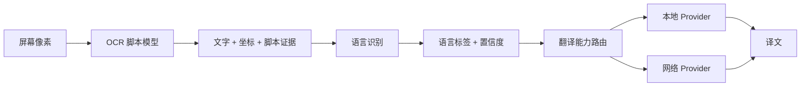
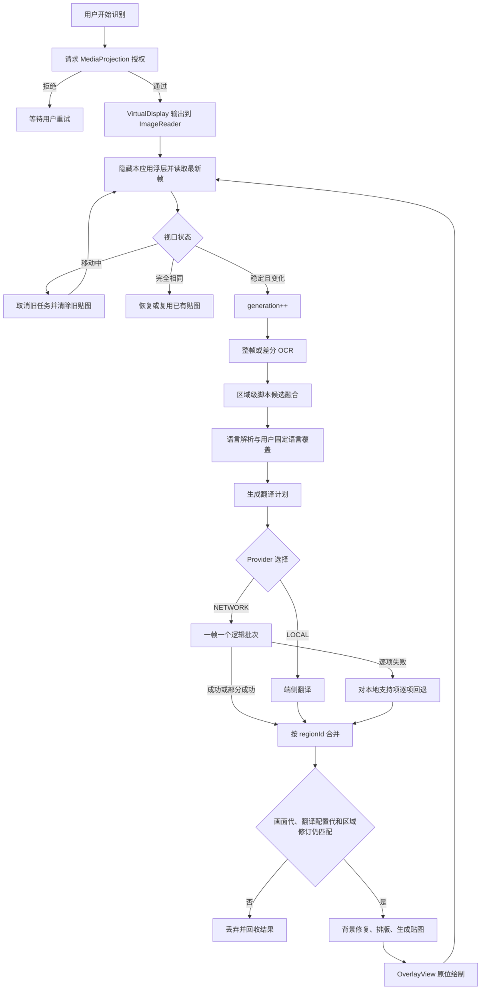
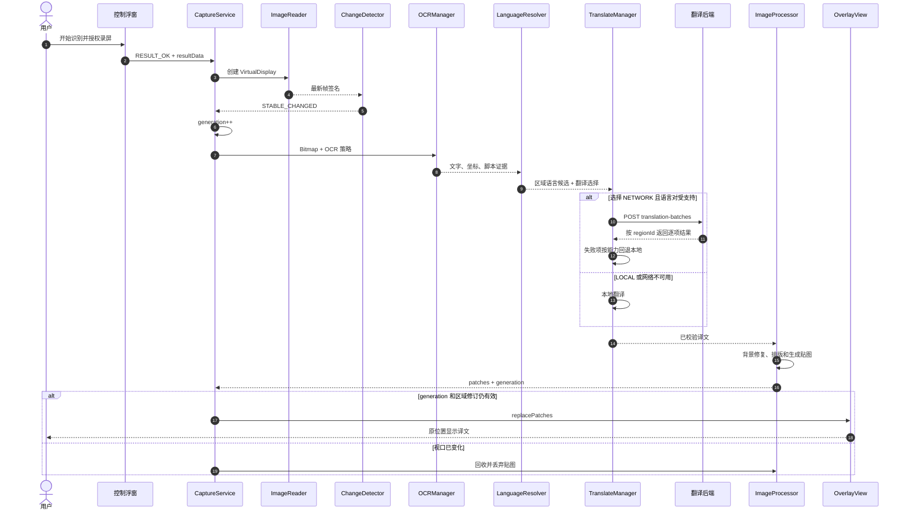
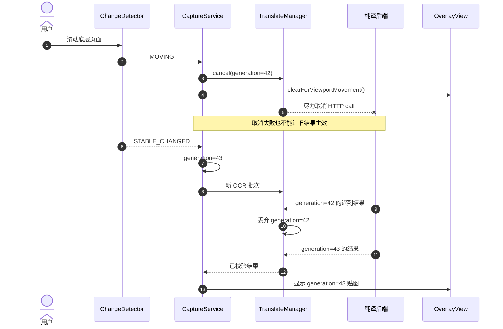

# 手机屏幕 OCR、语言选择与服务端翻译协议分析

> 版本：2.0  
> 日期：2026-07-30  
> 适用范围：Android 手机内录、端侧 OCR、语言识别、本地/网络翻译、端侧贴图  
> 协议边界：默认只上传结构化 OCR 文本与必要元数据，不上传截图、裁剪图或贴图 Bitmap

> 前后端联调请以独立文档 [OCR 识别数据与服务端翻译接口契约](./ocr-translation-backend-contract.md) 为准。本文保留架构分析、能力边界和方案决策，不作为字段变更的唯一来源。

## 1. 文档目的与结论口径

本文基于当前代码重新审查采集、OCR、翻译和贴图链路，同时给出可落地的目标协议。为避免把设计目标误写成现有能力，全文使用以下标记：

- **现状**：当前代码已经具备的行为。
- **目标**：需要开发后才能具备的行为。
- **决策**：建议冻结的架构或协议选择。
- **不建议**：已分析但不应采用的方案。

本文回答五个问题：

1. 手机内录到 OCR、翻译、贴图的真实流程是什么。
2. 当前 OCR 能识别哪些文字，能否自动判断多种自然语言。
3. 如何让用户任意设置原文语言和译文语言。
4. 本地翻译和网络翻译如何共存，并能替换具体供应商。
5. 客户端与后端应交换什么数据，如何避免旧译文贴到新画面。

## 2. 执行结论

### 2.1 是否调整

| 项目 | 结论 | 原因 |
|---|---|---|
| ML Kit OCR 依赖版本 | **暂不调整** | 当前拉丁模型 `19.0.1`、中文模型 `16.0.1`已与官方 Android 文档一致 |
| OCR 引擎 | **暂不替换** | 当前主要风险不在单模型精度，而在脚本路由、语言建模、批量协议和过期结果控制 |
| OCR 自动模式 | **需要调整** | 当前 AUTO 是拉丁/中文二选一回退，不是真正的多语言区域融合 |
| 原文/译文语言模型 | **必须调整** | `AUTO_BIDIRECTIONAL`只在中英场景勉强成立，扩展到三种以上语言后目标语言不再唯一 |
| 网络翻译协议 | **已完成v1批量兼容，仍需迁移v2** | 已支持批量和逐项回退，但缺少真实代际、区域修订、坐标和 OCR证据 |
| HTTP/WebSocket | **采用可取消的 HTTP批量请求** | 只在最终稳定视口请求，不需要服务端持续推送；HTTP/2连接复用、幂等和移动网络恢复更合适 |
| 本地/网络切换 | **保留并增强** | Provider 边界方向正确，但应按能力选择和逐项回退，而不是只做全局布尔切换 |
| 贴图和坐标处理 | **保持端侧** | 后端返回图片或重算坐标会引入缩放、滚动代际和隐私问题 |

### 2.2 最终架构决策

1. OCR、语言识别、翻译是三个不同阶段，不能用一个“语言”枚举代替。
2. OCR 选择的是**文字脚本模型**，例如 `LATIN`、`CHINESE`；语言识别输出的是 BCP-47 自然语言标签，例如 `en`、`fr`、`zh-Hans`。
3. 目标语言必须由用户明确选择；源语言可以是固定语言，也可以按 OCR 区域自动检测。
4. 一次稳定视口只创建一个逻辑翻译批次；网络拆包时仍属于同一 `generation`，但每个 HTTP 请求必须有独立 `requestId`。
5. 结果关联使用 `sessionId + generation + translationRevision + regionId + sourceRevision`。`generation`约束画面，`translationRevision`约束用户语言及 Provider 配置；`sourceTextHash`只作为可选完整性字段。
6. 网络逐项失败时仅回退失败项；视口已变化时整批丢弃，不再浪费本地翻译和贴图计算。
7. 继续保留 ML Kit 本地翻译作为离线能力；网络 Provider 负责更广语言、上下文或更高质量能力。

## 3. 现状事实与目标差距

| 维度 | 当前代码事实 | 目标状态 | 不调整的后果 |
|---|---|---|---|
| OCR 模型 | 仅接入中文和拉丁模型 | 按配置运行一个或少量脚本模型 | 日文、韩文、天城文无法可靠识别 |
| OCR AUTO | 拉丁优先，覆盖不足时改用中文结果 | 区域级候选融合，不让一个模型整帧覆盖另一个模型 | 中英混排页面可能丢失某一类区域 |
| “英语”OCR | 实际调用拉丁脚本模型 | UI 和数据模型命名为“拉丁文字” | 法语、德语等会被误认为英语 |
| 语言判断 | 有汉字即中文，否则有 ASCII 字母即英文 | 脚本预判 + 区域/上下文语言识别 + `und`兜底 | 法语、西语、越南语等被错误送入英语翻译方向 |
| 翻译方向 | 中到英、英到中、自动双向 | `source=AUTO/FIXED` + 明确 `targetLanguageTag` | 三种以上语言时无法确定译文目标 |
| 网络调用 | 图片、后台截图和实时 OCR已走统一批量入口；分区识别仍可能多批次 | 每个稳定视口一个逻辑批次 | 分区场景仍有额外往返，上下文不完整 |
| 结果校验 | 主要在采集/渲染阶段校验当前画面 | 同时校验画面代、翻译配置代和区域修订 | 网络乱序或切换目标语言时存在错误贴图风险 |
| 回退 | 网络异常回退本地 | 仅对失败且本地支持的区域回退 | 不支持的语言可能被静默错误翻译 |

重要结论：文档第 10 节以后的完整批量协议是**目标协议**，不是当前 `RemoteTranslationProvider` 已完全实现的协议。后端可以按目标协议开发，但客户端必须按第 20 节同步迁移后才能联调。

## 4. 语言能力分析

### 4.1 “识别文字”和“识别语言”不是同一能力

OCR 模型回答“图中有哪些字符及其坐标”；语言识别器回答“这段文字最可能是什么自然语言”；翻译器回答“是否支持该源语言到目标语言”。三者关系如下：



端到端支持语言不是任一 SDK 的语言列表，而是以下能力的交集：

```text
可用语言集合
= OCR 能识别其文字脚本
∩ 语言识别器能可靠分类
∩ 选中翻译 Provider 支持该语言对
∩ 端侧字体和排版能正确显示
```

### 4.2 当前 OCR 实际能识别什么

当前工程只接入：

```kotlin
implementation("com.google.android.gms:play-services-mlkit-text-recognition:19.0.1")
implementation("com.google.android.gms:play-services-mlkit-text-recognition-chinese:16.0.1")
```

- 拉丁脚本模型覆盖英语、法语、德语、西班牙语、葡萄牙语、意大利语、越南语等多种拉丁文字语言。
- 中文模型覆盖简体和繁体中文字符识别。
- 当前工程没有接入日文、韩文和天城文 OCR 模型，因此不能把这些语言列为稳定支持。
- 拉丁 OCR 能读出法语字符，不等于当前业务知道它是法语；当前翻译逻辑仍会把它当作英语。

因此，当前产品准确表述应是：

> 可自动尝试识别中文和拉丁文字；业务级自动翻译方向目前只可靠支持中文与英文。

不应表述为“能自动识别并翻译所有拉丁语言”。

### 4.3 当前 AUTO 的结构性问题

当前 AUTO 不是对每个区域独立保留中文和拉丁候选，而是先运行拉丁模型，根据覆盖情况决定是否用中文结果替换整组候选。它在纯中文或纯拉丁页面上成本较低，但对中英混排存在两个问题：

1. 一个模型对整帧“足够好”时，另一个模型可能不运行或结果不进入融合。
2. 即使 OCR 得到混合文字，翻译方向仍通过汉字/ASCII 规则压缩为中文或英文。

推荐改为两级策略：

1. **快速脚本路由**：根据采样、用户偏好和上一个稳定视口，决定先运行哪个模型。
2. **区域级补识别**：只对低置信、脚本冲突或疑似混排区域运行第二模型，再按坐标和文本质量融合，而不是替换整帧结果。

这比每帧无条件并行所有 OCR 模型更节省延迟、电量和内存。

### 4.4 自动识别多种自然语言需要的处理

推荐增加 ML Kit Language Identification，并保持它与 OCR 解耦：

```kotlin
implementation("com.google.mlkit:language-id:17.0.6")
```

处理顺序：

1. OCR 先输出 `text`和`recognizerScript`。
2. 纯数字、URL、代码、单字符和极短文本不做语言识别，标记为 `und`。
3. 明确为汉字、假名、韩文等脚本时，先用确定性脚本规则缩小候选。
4. 对拉丁文字或混合文字调用语言识别器，保留前 2 至 3 个候选及置信度。
5. 短区域优先与同一 `contextGroupId`的相邻文本合并判断，再把结果回填到区域。
6. 置信度低于阈值时使用 `und`，不得强行当成英语。
7. 用户固定源语言时跳过自动识别，直接标记 `detectionSource=USER_FIXED`。

ML Kit Language Identification 能识别单段文本的主要语言，但不能可靠拆分一条字符串内部的多种语言。因此混合文本应按 OCR 行/块拆分，或交由支持混合语言的网络 Provider 处理。

脚本规则也不是语言结论。例如只包含汉字的短文本可能是中文，也可能是日文中的汉字词；必须结合假名、相邻区域、用户固定语言或语言识别结果，不能仅因 `script=HAN`就强制写成 `zh-Hans`。

建议初始阈值为 `0.50`，但必须用真实手机截图数据校准，不应把 SDK 置信度直接当作产品准确率。

### 4.5 任意设置原文和译文的改造

废弃把方向编码为业务枚举的做法：

```kotlin
enum class TranslationMode {
    CHINESE_TO_ENGLISH,
    ENGLISH_TO_CHINESE,
    AUTO_BIDIRECTIONAL
}
```

替换为正交配置：

```kotlin
enum class SourceLanguageMode { AUTO_PER_REGION, FIXED }

data class TranslationSelection(
    val sourceMode: SourceLanguageMode,
    val sourceLanguageTag: String?,
    val targetLanguageTag: String
)
```

约束：

- `sourceMode=FIXED`时 `sourceLanguageTag`必填。
- `sourceMode=AUTO_PER_REGION`时 `sourceLanguageTag`为空，可设置 `fallbackLanguageTag`。
- `targetLanguageTag`始终必填，使用 BCP-47 标签，例如 `en`、`fr`、`zh-Hans`。
- 源语言与目标语言相同时默认返回 `PRESERVED`，不调用翻译模型。
- UI 中“原文”和“译文”各自是独立选择器，并提供交换按钮；OCR 脚本策略放在高级设置中，不与原文语言选择器混用。

交换按钮也需要确定性规则：固定源语言与固定目标语言可以直接交换；源语言为自动时，只有当前视口所有可翻译区域都得到同一个高置信源语言，才可将该语言作为新目标，否则应打开目标语言选择器，不能猜测用户意图。

`AUTO_BIDIRECTIONAL`只能作为旧配置迁移入口。固定“中到英”和“英到中”可以无损迁移；旧“中英双向”没有唯一目标语言，首次升级时必须让用户确认目标语言，或以界面语言作为一次性默认值并明确展示，不能静默保留为新协议模式。

## 5. 系统职责边界

| 能力 | 手机端 | 翻译后端 |
|---|---:|---:|
| MediaProjection 授权与屏幕帧采集 | 是 | 否 |
| 页面移动、稳定和代际判断 | 是 | 否 |
| OCR、坐标回映射和区域跟踪 | 是 | 否 |
| OCR 脚本证据 | 是 | 可复核但不可覆盖本地坐标 |
| 源语言自动识别 | 首选 | 可复核 |
| 本地翻译 | 本地模式负责 | 否 |
| 网络翻译及跨区域上下文 | 否 | 网络模式负责 |
| 背景修复、字体、排版和贴图 | 是 | 否 |
| 过期结果最终裁决 | 是 | 只能回显关联字段 |

翻译请求不得包含：原始 Bitmap、OCR 裁剪图、贴图 Bitmap、MediaProjection 授权 Intent、本地文件 URI、广告 ID、IMEI或其他稳定硬件标识。

## 6. 当前组件

| 组件 | 主要职责 |
|---|---|
| `ScreenCapturePermissionActivity` | 请求系统录屏授权 |
| `OneShotScreenCaptureService` | 管理 MediaProjection、帧稳定、generation和任务生命周期 |
| `ScreenFrameChangeDetector` | 判断移动、恢复、稳定和滚动位移 |
| `OCRManager` | ML Kit 快速/完整 OCR、脚本路由和候选融合 |
| `BackgroundTranslatedImageProcessor` | 差分 OCR、区域跟踪、翻译、背景生成和贴图渲染 |
| `TranslateManager` | 翻译路由、结果校验和网络失败本地回退 |
| `TranslationProvider` | 翻译供应商抽象 |
| `RemoteTranslationProvider` | 当前兼容网络实现 |
| `ScreenTranslationOverlayView` | 按源画面坐标缩放绘制贴图 |
| `ActiveScreenCaptureOverlayController` | 控制工具条和全屏透明翻译层 |

## 7. 手机内录、OCR、翻译和贴图流程



## 8. 首次识别时序



## 9. 滚动、取消和过期结果时序



## 10. 目标端侧领域模型

网络 DTO 不应直接序列化 Android `Rect`、`Bitmap`或内部枚举。建议先补齐以下领域数据：

```kotlin
data class OcrRegion(
    val regionId: String,
    val sourceRevision: Long,
    val text: String,
    val bounds: PixelBounds,
    val readingOrder: Int,
    val script: OcrScript,
    val ocrEvidence: OcrEvidence,
    val language: LanguageEvidence?,
    val contextGroupId: String?
)

data class LanguageEvidence(
    val languageTag: String,       // BCP-47 或 und
    val confidence: Float?,
    val source: LanguageEvidenceSource,
    val candidates: List<LanguageCandidate>
)

enum class LanguageEvidenceSource {
    USER_FIXED, SCRIPT_RULE, ML_KIT_LANGUAGE_ID, SERVER, UNKNOWN
}
```

字段语义：

- `regionId`：同一录屏 session 内稳定的区域轨迹 ID。
- `sourceRevision`：当该 `regionId`的源文发生变化时单调增加；服务端必须原样回显。
- `script`：OCR 证据，例如 `HAN`、`LATIN`、`MIXED`、`UNKNOWN`，不是自然语言。
- `languageTag`：自然语言 BCP-47 标签；无法可靠判断时为 `und`。
- `confidence`：识别器的相对置信度，不代表业务准确率。

`sourceRevision`优于只依赖文本哈希：它没有跨平台 Unicode 规范化歧义，也不会把“同一轨迹文字已变更”的判断交给服务端。哈希仍可用于诊断或缓存，但不是主关联键。

批次还需要独立的 `translationRevision`。当用户切换源语言模式、目标语言、LOCAL/NETWORK策略或影响输出的翻译选项时递增；仅改变画面时递增 `generation`。两者不能合并，否则同一静止画面上切换译文语言时，旧网络响应仍可能通过 generation 校验。

## 11. 目标批量翻译请求

### 11.1 接口

```http
POST /api/v2/translation-batches
Authorization: Bearer <short-lived-access-token>
Content-Type: application/json
Accept: application/json
X-Request-Id: <requestId>
Idempotency-Key: <requestId>
```

采用 `/api/v2`是因为语言选择语义和区域修订字段与当前兼容请求不向后等价。不要在 `/api/v1`中悄悄改变 `AUTO_BIDIRECTIONAL`含义。

### 11.2 请求示例

```json
{
  "schemaVersion": 2,
  "requestId": "0198a8ca-5b3a-7b4d-89ea-18d7ae7583fb",
  "sessionId": "session-b81fa7a9",
  "generation": 42,
  "translationRevision": 7,
  "batchPartIndex": 0,
  "batchPartCount": 1,
  "scene": "LIVE_SCREEN",
  "capture": {
    "sourceWidth": 1080,
    "sourceHeight": 2400,
    "orientation": "PORTRAIT",
    "capturedAtEpochMs": 1785404123456,
    "segmentation": "DIFFERENTIAL",
    "contentShiftY": -286,
    "registrationConfidence": 0.94
  },
  "translation": {
    "source": {
      "mode": "AUTO_PER_REGION",
      "languageTag": null,
      "fallbackLanguageTag": null
    },
    "target": {
      "languageTag": "zh-Hans"
    },
    "mixedLanguagePolicy": "PER_REGION",
    "preserveIdentifiers": true,
    "useContext": true
  },
  "regions": [
    {
      "regionId": "track-1042",
      "sourceRevision": 3,
      "role": "TRANSLATE",
      "text": "Start recognition",
      "script": "LATIN",
      "readingOrder": 0,
      "bounds": { "left": 64, "top": 318, "right": 512, "bottom": 376 },
      "ocr": {
        "engine": "ML_KIT_V2",
        "model": "LATIN",
        "modelConfidence": 0.94,
        "consensusScore": 0.82,
        "passCount": 3
      },
      "language": {
        "detectedTag": "en",
        "confidence": 0.91,
        "detectionSource": "ML_KIT_LANGUAGE_ID",
        "candidates": [
          { "languageTag": "en", "confidence": 0.91 },
          { "languageTag": "de", "confidence": 0.05 }
        ],
        "userOverride": false
      },
      "contextGroupId": "toolbar"
    },
    {
      "regionId": "track-1041",
      "sourceRevision": 1,
      "role": "CONTEXT_ONLY",
      "text": "Screen Translate",
      "script": "LATIN",
      "readingOrder": 1,
      "bounds": { "left": 64, "top": 240, "right": 480, "bottom": 300 },
      "ocr": { "engine": "ML_KIT_V2", "model": "LATIN" },
      "language": { "detectedTag": "en", "confidence": 0.97, "detectionSource": "ML_KIT_LANGUAGE_ID", "candidates": [], "userOverride": false },
      "contextGroupId": "toolbar"
    }
  ],
  "client": {
    "platform": "ANDROID",
    "appVersion": "1.0",
    "locale": "zh-CN"
  }
}
```

### 11.3 顶层与批次字段

| 参数 | 类型 | 必需 | 说明 |
|---|---|---:|---|
| `schemaVersion` | integer | 是 | v2 固定为 `2` |
| `requestId` | string | 是 | 每次 HTTP 请求唯一，用于追踪和幂等 |
| `sessionId` | string | 是 | 每次录屏会话生成的随机临时 ID |
| `generation` | integer | 是 | 稳定视口代数，响应必须原样返回 |
| `translationRevision` | integer | 是 | 翻译配置修订号；语言或 Provider 策略变化时递增 |
| `batchPartIndex` | integer | 是 | 拆批后的分片序号，从 `0`开始 |
| `batchPartCount` | integer | 是 | 当前 generation 的总分片数 |
| `scene` | enum | 是 | `LIVE_SCREEN`、`SCREENSHOT`、`PHOTO`、`LONG_IMAGE` |
| `capture` | object | 是 | 屏幕尺寸及差分元数据，不含像素 |
| `translation` | object | 是 | 源语言策略、明确目标语言和上下文策略 |
| `regions` | array | 是 | 待翻译区域和可选上下文区域 |
| `client` | object | 是 | 协议兼容信息，不含稳定设备标识 |

当 413 或本地限制触发拆批时，所有分片保持相同 `sessionId`、`generation`和`translationRevision`，但必须使用不同 `requestId`和幂等键。否则服务端可能把第二个分片当作第一个请求的重放。

### 11.4 `translation`字段

| 参数 | 类型 | 必需 | 说明 |
|---|---|---:|---|
| `source.mode` | enum | 是 | `FIXED`或`AUTO_PER_REGION` |
| `source.languageTag` | string/null | 条件必需 | `FIXED`时必填 |
| `source.fallbackLanguageTag` | string/null | 否 | 仅允许用户或产品策略显式配置；为空且识别为 `und`时该项失败 |
| `target.languageTag` | string | 是 | 明确的 BCP-47 目标语言，禁止 `auto` |
| `mixedLanguagePolicy` | enum | 是 | 当前固定 `PER_REGION` |
| `preserveIdentifiers` | boolean | 是 | 保留 URL、数字 ID、代码和品牌标识 |
| `useContext` | boolean | 是 | 是否允许利用同组相邻区域理解语义 |

### 11.5 区域字段

| 参数 | 类型 | 必需 | 说明 |
|---|---|---:|---|
| `regionId` | string | 是 | session 内稳定轨迹标识 |
| `sourceRevision` | integer | 是 | 当前区域源文修订号 |
| `role` | enum | 是 | `TRANSLATE`或`CONTEXT_ONLY` |
| `text` | string | 是 | UTF-8 OCR 原文 |
| `script` | enum | 是 | `HAN`、`LATIN`、`HIRAGANA`、`KATAKANA`、`HANGUL`、`DEVANAGARI`、`MIXED`、`UNKNOWN` |
| `readingOrder` | integer | 是 | 当前视口阅读顺序，从 `0`开始 |
| `bounds` | object | 是 | 源 Bitmap 像素坐标，不是 dp |
| `ocr` | object | 是 | OCR 引擎、模型和可选置信证据 |
| `language` | object/null | 否 | 端侧语言判断；后端可以复核 |
| `contextGroupId` | string/null | 否 | 同组区域可共同参与语义判断 |

`CONTEXT_ONLY`用于差分视口：已翻译区域无需再次计费，但可把原文作为新区域的上下文。服务端只为 `TRANSLATE`区域返回结果。

坐标必须满足：

```text
0 <= left < right <= sourceWidth
0 <= top < bottom <= sourceHeight
```

## 12. 目标响应格式

### 12.1 成功或部分成功示例

```json
{
  "schemaVersion": 2,
  "requestId": "0198a8ca-5b3a-7b4d-89ea-18d7ae7583fb",
  "sessionId": "session-b81fa7a9",
  "generation": 42,
  "translationRevision": 7,
  "batchPartIndex": 0,
  "status": "COMPLETED",
  "results": [
    {
      "regionId": "track-1042",
      "sourceRevision": 3,
      "status": "TRANSLATED",
      "detectedSourceLanguage": "en",
      "targetLanguage": "zh-Hans",
      "translatedText": "开始识别",
      "provider": "server-default",
      "modelVersion": "translation-2026-07",
      "cached": false,
      "error": null
    }
  ],
  "timing": { "queueMs": 4, "translationMs": 81, "totalMs": 92 }
}
```

### 12.2 响应约束

| 参数 | 必需 | 约束 |
|---|---:|---|
| `schemaVersion` | 是 | 必须为客户端支持版本 |
| `requestId` | 是 | 必须等于当前 HTTP 请求值 |
| `sessionId` | 是 | 必须等于请求值 |
| `generation` | 是 | 必须等于请求值 |
| `translationRevision` | 是 | 必须等于请求值和客户端当前配置代 |
| `batchPartIndex` | 是 | 必须等于请求值 |
| `status` | 是 | `COMPLETED`、`PARTIAL`或`FAILED` |
| `results` | 是 | 每个 `TRANSLATE`区域恰好一项，不包含 `CONTEXT_ONLY` |
| `regionId` | 是 | 必须来自请求且不能重复 |
| `sourceRevision` | 是 | 必须等于请求区域值 |
| `status` | 是 | `TRANSLATED`、`PRESERVED`、`SKIPPED`或`FAILED` |
| `translatedText` | 条件必需 | `TRANSLATED`时非空；`PRESERVED`时可返回原文或空值但需统一约定 |
| `detectedSourceLanguage` | 否 | BCP-47 或 `und` |
| `targetLanguage` | 条件必需 | 成功项必须等于请求目标语言 |
| `provider`、`modelVersion` | 是 | 用于诊断和缓存隔离 |
| `error` | 条件必需 | `FAILED`时返回稳定错误码和 `retryable` |

后端不得返回修改后的坐标、贴图 URL或图片 Base64。客户端始终使用本地 OCR 坐标。

### 12.3 客户端校验顺序

1. HTTP 状态和响应体可解析。
2. `schemaVersion`受支持。
3. `requestId`、`sessionId`、`generation`、`translationRevision`、`batchPartIndex`全部匹配。
4. 当前采集状态的 generation 和当前翻译配置的 translationRevision 仍与响应一致。
5. 每个 `TRANSLATE`区域恰好返回一项，`regionId`不重复且没有未知项。
6. `sourceRevision`仍等于本地区域当前修订号。
7. 成功项的 `targetLanguage`等于当前用户选择；译文非空且通过通用文本校验。
8. 仅对失败、遗漏或非法且本地 Provider 支持的区域执行本地回退。
9. 渲染前再次检查 generation 和 translationRevision；变化则回收所有新贴图。

响应数组顺序没有语义，只能按 `regionId`关联。

## 13. 可选文本哈希规范

若后端缓存或审计确实需要 `sourceTextHash`，必须固定算法，否则 Android、后端不同语言运行时可能产生不同值：

```text
1. Unicode 规范化为 NFC
2. CRLF 和 CR 转换为 LF
3. 不自动 trim，不折叠内部空白
4. UTF-8 编码
5. SHA-256，小写十六进制，前缀 sha256:
```

哈希不具有匿名化效果。短文本、验证码和常用词可以被字典反推，因此日志和隐私策略必须把它视为潜在敏感数据。

## 14. 通用翻译接口和 Provider 路由

当前已实现 `TranslationProvider`、`LocalTranslationProvider`和`SwitchingTranslationProvider`，本地及网络共用相同批量结果模型；下一步仍需给请求补齐代际和区域修订：

```kotlin
interface TranslationProvider : AutoCloseable {
    val id: String
    suspend fun translate(request: TranslationRequest): TranslationResult
    suspend fun translateBatch(
        requests: List<TranslationRequest>
    ): TranslationBatchResult
}
```

推荐结构：

```text
TranslateManager
    ├── TranslationCapabilityResolver
    ├── LocalTranslationProvider
    │       └── ML Kit Translation
    ├── RemoteTranslationProvider
    │       └── /api/v2/translation-batches
    └── PerRegionFallbackPolicy
```

路由顺序：

1. 根据用户的 LOCAL/NETWORK 选择首选 Provider。
2. 检查 Provider 是否支持每个区域的源语言到目标语言。
3. 不支持时不应强行改成英语，按策略选择另一个 Provider 或返回明确错误。
4. 网络批次部分失败时，仅将失败项交给本地 Provider。
5. 源目标相同、纯数字或无需翻译的标识返回 `PRESERVED`。

翻译缓存键至少包含规范化源文、实际源语言、目标语言、Provider、模型版本和影响输出的选项。`generation`、`regionId`不应进入可跨视口复用的内容缓存键，但缓存命中后的结果仍必须经过当前代际与区域修订校验。

替换 Google、百度、自建模型或其他服务时，只新增或替换 Provider，不修改 `OCRManager`、MediaProjection、坐标映射、背景修复或 Overlay。

领域层统一使用规范化 BCP-47 标签，具体 Provider Adapter 再映射到供应商代码。例如 ML Kit 端侧翻译只公开 `zh`，没有分别承诺 `zh-Hans`和`zh-Hant`输出；因此本地 Provider 不应声称能保证简繁目标变体。若产品必须精确选择简体或繁体，需要网络 Provider 原生支持该变体，或增加独立且可验证的简繁转换阶段。

## 15. 本地/网络开关与能力降级

当前高级设置已提供“使用网络翻译”开关并持久化。目标 UI 仍保留该开关，但行为必须透明：

```text
LOCAL
  -> 只使用本地模型
  -> 未下载模型时提示下载或返回不可用

NETWORK
  -> 首选网络批量翻译
  -> 网络失败时，仅对本地支持且模型可用的区域回退
  -> 本地也不支持时显示明确失败状态，不伪装为成功
```

建议最终增加三种内部策略但 UI 可先保持两档：

- `LOCAL_ONLY`
- `NETWORK_WITH_LOCAL_FALLBACK`
- `NETWORK_ONLY`，适合对数据出口有明确控制的企业环境

网络服务地址继续通过构建属性注入。生产环境只允许 HTTPS；本地调试 HTTP仅允许 `localhost`、`127.0.0.1`和`10.0.2.2`。

## 16. 本地翻译的语言边界

ML Kit 端侧翻译支持 50 多种语言，但存在两个工程约束：

1. 每个语言需要按需下载模型，任意源/目标选择意味着必须增加模型状态、下载、删除、存储空间和蜂窝网络策略。
2. 非英语到非英语的翻译可能以英语作为中间语言，质量可能下降。

因此“SDK 列表中存在”不等于“产品已支持”。本地可用语言对必须同时满足：

```text
OCR 脚本已接入
&& 语言已可靠识别或用户固定
&& 源/目标翻译模型已下载
&& 当前 Provider 声明支持
```

第一阶段建议开放当前 OCR 能覆盖的中文和拉丁语言，并通过能力接口和真实语料测试逐步形成白名单，而不是一次性展示全部语言。“任意设置”应理解为可在当前端到端能力交集中自由组合，而不是允许选择系统实际不能识别或翻译的语言对。

## 17. 能力接口

```http
GET /api/v2/translation/capabilities
GET /health/ready
```

示例：

```json
{
  "schemaVersion": 2,
  "supportsAutoDetection": true,
  "supportsPerRegionLanguage": true,
  "supportsContextOnlyRegions": true,
  "supportedLanguagePairs": [
    { "source": "en", "target": "zh-Hans" },
    { "source": "fr", "target": "zh-Hans" },
    { "source": "zh-Hans", "target": "en" }
  ],
  "limits": {
    "maxRegionsPerBatch": 64,
    "maxCodePointsPerRegion": 2000,
    "maxCodePointsPerBatch": 16000,
    "maxRequestBytes": 262144
  },
  "server": {
    "apiVersion": "2.0",
    "modelVersion": "translation-2026-07"
  }
}
```

客户端按短 TTL缓存能力，不在每一帧前查询。语言选择器应展示客户端与当前 Provider 能力的交集；Provider 切换后重新计算可用组合。

## 18. 限制、错误和重试

建议限制：

| 限制 | 建议值 |
|---|---:|
| 每批最大区域数 | 64 |
| 单区域最大 Unicode code points | 2,000 |
| 每批最大 Unicode code points | 16,000 |
| JSON 请求体最大值 | 256 KiB |
| 实时连接超时 | 1.5 秒 |
| 实时总超时 | 3 秒 |
| 普通截图总超时 | 8 秒 |
| 同一实时 session 在途 generation | 1 |

HTTP 处理：

| HTTP | 客户端处理 |
|---|---|
| `200` | 合并成功项，失败项按能力回退 |
| `400` | 不重试，记录契约错误 |
| `401/403` | 刷新短期凭据一次，随后降级 |
| `409` | 幂等冲突，不复用旧 requestId |
| `413` | 拆批；新分片使用新 requestId |
| `422` | 按错误项降级，不修改用户语言选择 |
| `429` | 实时场景立即降级，不阻塞画面 |
| `500/502/503/504` | 进入短时熔断并降级 |

稳定业务错误码至少包括：

```text
INVALID_REQUEST
TOO_MANY_REGIONS
TEXT_TOO_LONG
UNSUPPORTED_SOURCE_LANGUAGE
UNSUPPORTED_TARGET_LANGUAGE
LANGUAGE_UNDETERMINED
EMPTY_TRANSLATION
CONTENT_REJECTED
RATE_LIMITED
PROVIDER_TIMEOUT
PROVIDER_UNAVAILABLE
STALE_GENERATION
INTERNAL_ERROR
```

客户端只依赖 `code`和`retryable`，不得解析自然语言 `message`。新 generation 到达时取消旧请求；实时翻译不得对旧 generation 自动重试。

## 19. 安全与隐私

屏幕 OCR 可能包含聊天、账号、验证码和支付信息：

1. 联网翻译必须由用户明确开启，并说明 OCR 文本会发送到服务器。
2. 生产环境全程 HTTPS，使用短期令牌，不把服务端长期密钥写入 APK。
3. 默认不上传图片、裁剪图、本地 URI、应用包名和稳定设备 ID。
4. 服务端默认不记录源文、译文、语言候选或文本哈希。
5. 请求和响应不得进入崩溃日志、代理日志或第三方分析 SDK。
6. 客户端可对密码框、验证码和支付敏感模式执行默认过滤，但不能承诺仅靠正则识别所有敏感信息。
7. 后端必须声明地域、第三方供应商、保留周期和删除策略。

## 20. 实施计划与依赖关系

### M0：冻结真实基线和契约测试

- 为当前中英路径保存代表性截图、OCR 区域和贴图回归样例。
- 用 OpenAPI/JSON Schema冻结 v2 请求、响应、枚举和限制。
- 覆盖乱序、重复、遗漏、迟到、部分失败、413拆批和 generation 变化。

### M1：先重构语言领域模型，不改变现有中英效果

- 引入 `TranslationSelection`、BCP-47 标签和 Provider 能力判断。
- 把 UI 旧三档迁移为独立原文/译文选择。
- 将“ENGLISH OCR”改名为“LATIN OCR”，避免脚本和语言混淆。
- 移除通用结果校验中的中文/英文硬编码。

### M2：增加自动语言识别

- 接入 Language Identification。
- 增加短文本分组、`und`兜底、候选置信度和用户固定源语言覆盖。
- 先验证中文、英文及优先级最高的拉丁语言，不直接宣称支持全部语言。

### M3：完成真正的整帧网络批量

- 组装 `sessionId`、`generation`、`translationRevision`、`sourceRevision`、bounds、OCR和语言证据。
- 一帧一个逻辑批次，支持 `TRANSLATE`与`CONTEXT_ONLY`。
- 实现响应逐项校验、逐项本地回退、取消和短时熔断。

### M4：改进 OCR AUTO

- 从整帧模型替换改成区域级补识别和融合。
- 根据目标市场决定是否按需增加日文、韩文、天城文模型。
- 评估耗时、APK/动态模型、首帧可用性、内存和电量后再开放。

依赖关系：M1 是 M2 和 M3 的前置。若先接更多 OCR 模型而不重构语言模型，新识别出的文字仍会被错误路由到中英翻译，投入不能形成端到端收益。

## 21. 验收标准

| 指标 | 门槛 |
|---|---|
| 请求与响应区域关联完整率 | 100% |
| 过期 generation 展示率 | 0 |
| 过期 translationRevision 展示率 | 0 |
| sourceRevision 不匹配结果展示率 | 0 |
| 重复或未知 regionId 接受率 | 0 |
| 目标语言与用户选择不一致展示率 | 0 |
| 网络部分失败的本地逐项回退 | 对本地支持项 100% |
| 不支持语言被静默当作英语 | 0 |
| 页面滚动后的旧贴图残留 | 无肉眼可见残留 |
| 请求中图片字节或本地 URI | 0 |
| 服务端默认日志中的业务文本 | 0 |

性能指标应按机型和网络分层统计，建议初始目标为实时网络请求 P95 不超过 3 秒；最终门槛需要用真实链路数据校准。

## 22. 风险与取舍

| 方案 | 收益 | 代价/风险 | 结论 |
|---|---|---|---|
| 每帧并行所有 OCR 模型 | 混排召回率可能提高 | 延迟、耗电和内存线性上升 | 不建议默认使用 |
| 目标语言也设为 AUTO | UI简单 | 三种以上语言时语义不确定，结果不可预测 | 禁止进入 v2 协议 |
| 只使用服务端语言检测 | 客户端简单 | 增加网络依赖，离线模式行为不一致 | 端侧先判，服务端复核 |
| 只用 sourceTextHash 关联 | 字段看似简单 | 规范化歧义，不能表达轨迹修订 | 使用 sourceRevision 为主 |
| 网络失败整批本地重翻 | 实现简单 | 重复计算成功项，延迟和功耗增加 | 按区域回退 |
| 立即替换 PaddleOCR/其他引擎 | 可能提升特定语料精度 | 不能解决语言路由和协议问题 | 先完成语言与协议重构，再基准测试 |

## 23. 最终建议

1. 当前不升级或替换 ML Kit OCR 版本；先解决语言建模和批量协议的确定性问题。
2. 产品语言能力改为“明确目标语言 + 固定/逐区域自动源语言”，停止扩展 `AUTO_BIDIRECTIONAL`。
3. 将 OCR 脚本、自然语言、翻译语言对拆成独立数据，所有语言使用 BCP-47 标签。
4. 后端按 `/api/v2/translation-batches`实现，客户端完成 M1、M2、M3 后再把它作为正式协议启用。
5. 以 `sessionId + generation + translationRevision + regionId + sourceRevision`为结果正确性的硬门槛，渲染前再次校验。
6. 保留本地/网络 Provider；网络部分失败时只回退本地真正支持的区域，绝不把未知语言默认成英语。
7. 是否增加日文、韩文、天城文或替换 OCR 引擎，应由真实手机截图基准决定，而不是由 SDK 宣称的语言数量决定。
8. 连续滑动期间不发送中间帧；最终稳定后只发送一次 HTTP批次。v2客户端需使用可显式取消底层 call 的 HTTP实现，当前不引入 WebSocket。

## 24. 官方资料

- [ML Kit Text Recognition v2 for Android](https://developers.google.com/ml-kit/vision/text-recognition/v2/android)
- [ML Kit Text Recognition v2 supported languages](https://developers.google.com/ml-kit/vision/text-recognition/v2/languages)
- [ML Kit Language Identification for Android](https://developers.google.com/ml-kit/language/identification/android)
- [ML Kit Language Identification supported languages](https://developers.google.com/ml-kit/language/identification/langid-support)
- [ML Kit Translation for Android](https://developers.google.com/ml-kit/language/translation/android)
- [ML Kit Translation supported languages](https://developers.google.com/ml-kit/language/translation/translation-language-support)
