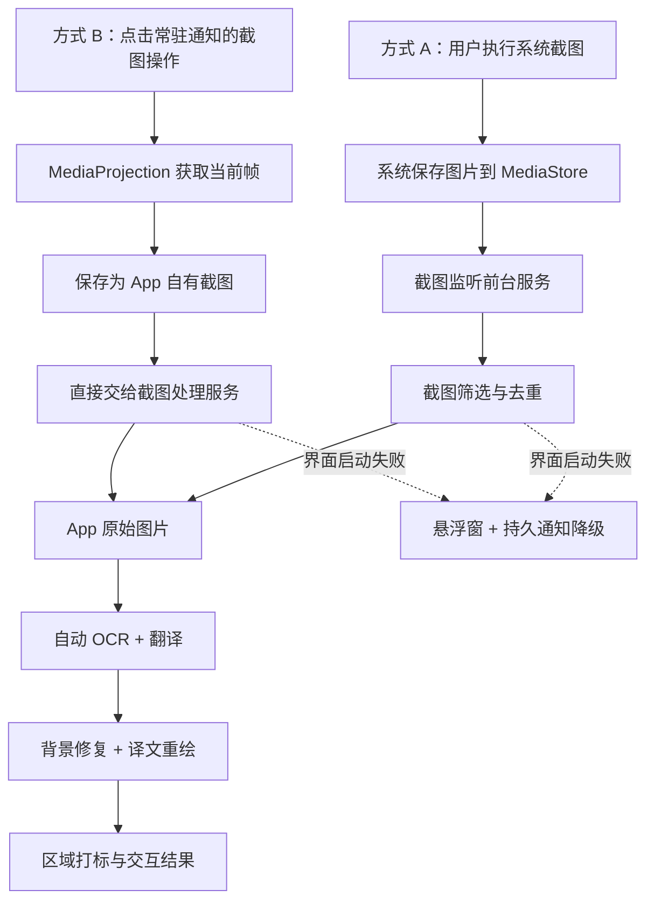

# ImageTranslateOCR OCR 与截图识别完整调研及实施报告

> 报告日期：2026-07-24
> 适用版本：当前工作区 `debug` 版本
> 报告范围：OCR 识别、系统截图监听、App 主动截屏、原图直达翻译、悬浮窗降级、自动化与真机验证

## 1. 报告目的

本报告汇总本轮围绕“如何读取手机屏幕、如何监听用户截图，以及如何把截图直接交给 App 完成 OCR、翻译与区域打标”的完整调研和实施结论。

文中的“截图识别”包含两个不同概念：

1. **截图事件识别**：判断媒体库中新生成的图片是否为用户通过系统快捷键、控制中心等方式生成的截图。
2. **截图内容识别**：读取截图位图，通过 OCR 得到文字和位置，再执行翻译、擦除、重绘或结果通知。

二者不能混为一谈。当前项目已经实现两种截图输入方式，并让它们复用同一套后续处理能力。

## 2. 结论摘要

当前可行且已经落地的方案是“双入口、单处理链”：

- **方式 A：监听系统截图照片**。后台前台服务监听 `MediaStore` 图片新增事件，在系统截图已经写入相册后识别文件名、路径、时间和 MIME 类型，再将 URI 直接交给 App。它适合用户继续使用手机原有的截图习惯。
- **方式 B：App 主动截取屏幕**。用户从 App 入口启动系统 `MediaProjection` 授权，授权后建立持续截屏会话；常驻通知提供“截图”操作，点击后直接读取当前屏幕帧、保存图片并交给 App。它适合频繁截图翻译，避免每次重新授权。
- **统一处理链**。新增“检测到截图时显示悬浮窗”开关，默认关闭。关闭时两种方式都把截图载入主界面的“原始图片”并自动完成 OCR、翻译、修复、重绘和区域打标；开启时截图到达后停留在悬浮窗供用户选择操作。
- **OCR 方案**。当前同时运行 ML Kit 中文和拉丁文字识别器，并对原图、增强图、深色区域反色图进行多轮识别，再按位置重叠、文本一致度、模型置信度和脚本适配度融合结果；较小中文文本还会局部放大复识别。
- **平台边界**。普通第三方 App 不能在用户无感知的情况下拦截系统截图，也不能绕过系统授权持续读取整个手机屏幕。Android 14 的截图检测回调只在本 App 的可见 Activity 内提供事件，而且不返回截图图片，因此不能替代当前后台 `MediaStore` 方案。

## 3. 当前工程与能力边界

当前工程参数：

| 项目 | 当前值 |
| --- | --- |
| 最低系统 | Android 7.0，API 24 |
| 编译 SDK | API 35 |
| 目标 SDK | API 34 |
| 语言级别 | Java/Kotlin 17 |
| OCR | ML Kit Text Recognition v2，中文模型 + 拉丁模型 |
| 翻译 | ML Kit Language ID + On-device Translation |
| 图像修复 | OpenCV inpaint + Android Canvas 重绘 |
| 截图监听 | `MediaStore` + `ContentObserver` + 轮询兜底 |
| 主动截屏 | `MediaProjection` + `VirtualDisplay` + `ImageReader` |

完整能力矩阵：

| 能力 | 系统截图监听 | App 主动截屏 |
| --- | --- | --- |
| 使用系统截图快捷键 | 支持 | 不需要 |
| 读取截图图片 | 图片写入相册后读取 | 直接读取授权会话的屏幕帧 |
| App 退到后台后使用 | 支持 | 支持，授权会话和前台通知必须仍存在 |
| App 最近任务被划掉后恢复 | 尽力恢复监听 | 当前投屏会话会结束，需要重新授权 |
| 开机恢复 | 支持恢复截图监听配置 | 不支持静默恢复投屏授权 |
| 是否必须显示前台通知 | 是 | 是 |
| 是否需要媒体库读取权限 | 需要完整图片读取权限 | Android 10+ 读取本 App 自己保存的图片不需要额外媒体读取权限 |
| 是否需要悬浮窗权限 | 仅开启“显示悬浮窗”时需要 | 仅开启“显示悬浮窗”时需要 |
| 是否需要系统录屏授权 | 不需要 | 需要，且由系统界面明确确认 |
| 能否处理 `FLAG_SECURE` 内容 | 不能 | 不能，通常得到黑屏或受保护区域 |

## 4. 总体架构

架构上的关键决定是：主动截屏保存后的文件名使用 `ImageTranslate_capture_` 前缀，并由系统截图监听策略排除，随后通过显式服务 Action 直接进入处理。这避免同一张图片同时被“主动截屏回调”和 `MediaStore` 监听重复消费。

## 5. OCR 识别方案

### 5.1 输入与缩放

App 支持相册、相机、系统截图监听和主动截屏四种图片来源。图片进入 OCR 前会校正方向，并保留原图用于最终图像处理。

- 原图最长边小于 1600 像素时，OCR 副本最多放大 3 倍，最长边不超过 3072 像素，提高小字可读性。
- OCR 在放大图上返回坐标后，坐标会按比例映射回处理原图。
- OCR 副本和中间增强图用完即回收，避免长期占用大图内存。

### 5.2 双识别器、多轮识别

`OCRManager` 同时持有中文和拉丁文字识别器，每轮均尝试两种脚本模型：

1. **原图轮次**：作为最主要、最稳定的证据。
2. **灰度高对比轮次**：降低背景色和低对比文字的影响。
3. **反色轮次**：只保留原图深色区域中的候选，补偿深底浅字。

任一增强轮次或其中一个脚本识别器失败时，其他轮次仍可继续，不会因为单模型失败丢弃整张图。

### 5.3 候选过滤与融合

每个 OCR 行结果包含文字、边界框、模型置信度、参与融合的轮次数和识别脚本。融合流程包括：

- 过滤空文本、极小边界框、低有效字符占比和孤立非中文单字符。
- 按边界框重叠将多轮候选聚类。
- 根据文字质量、不同候选的一致度、模型置信度、文字完整度、边界宽度覆盖率和脚本匹配度选择主候选。
- 中文内容优先提高中文模型证据权重，拉丁内容优先提高拉丁模型权重；两种模型共同参与时标记为融合结果。
- 合并同一行被拆开的相邻片段，同时保留拉丁词必要空格。
- 对短中文标签分析前景墨迹列，降低相邻图标、装饰线或孤立边缘字符被误并入文字的概率。

融合结果中的 `consensusScore` 反映多轮证据和文本一致性，但它不是严格统计意义上的准确率，不能直接解释为“识别正确概率”。

### 5.4 小中文局部复识别

当原图尺寸较大、候选是长度有限的小中文文本且文字高度较小时，App 会：

1. 扩展候选区域进行局部裁剪；
2. 将裁剪区域放大；
3. 使用中文模型对原裁剪图和增强裁剪图再次识别；
4. 比较位置重叠、文本相似度、置信度变化和噪声去除效果；
5. 只有局部结果更可信时才替换原候选。

该策略主要改善手机 UI 中的短按钮、菜单标题和小字号中文，不会无条件覆盖完整度更好的原始文本。

### 5.5 OCR 审核、翻译与图像重建

在 App 内查看时，识别结果会先进入人工审核阶段，用户可以选择是否让某个文字区域参与翻译。之后的处理顺序为：

1. ML Kit Language ID 判断文本语言；
2. 根据自动双向或用户指定模式选择源语言和目标语言；
3. 逐段执行设备端翻译，单段失败不阻塞其他段；
4. 对确实发生翻译的区域使用精细遮罩或矩形遮罩执行 OpenCV inpaint；
5. 根据原区域计算字号、行数、颜色、对齐和安全边距；
6. 通过 Canvas 写入译文；
7. 允许用户检查结果、恢复局部原文或保存到相册。

后台翻译为了控制耗时，对去重后的前 24 段文字执行翻译；通知最多展示前 6 行、700 个字符。完整图片翻译和排版仍应通过“翻译并查看”进入 App 完成。

### 5.6 OCR 已知限制

- 极小字号、强透视、运动模糊、手写体、艺术字、复杂纹理背景仍可能漏字或错字。
- 中拉混排、代码、URL、品牌词和生僻字容易出现脚本竞争或错误分段。
- OCR 置信度和多轮共识只能帮助排序，无法替代人工检查。
- ML Kit 本地翻译适合日常短文本；长句、专业术语和上下文密集内容仍可能需要云端高质量翻译方案。

## 6. 方式 A：后台监听用户的系统截图

### 6.1 工作原理

此方式不拦截按键，也不在截图生成前取得屏幕。实际流程是：

1. 用户使用电源键 + 音量减、控制中心或系统手势截图；
2. 系统截图工具将图片写入共享媒体库；
3. `ContentObserver` 收到 `MediaStore.Images` 变化；
4. 服务读取候选图片的显示名、相对路径、写入时间、MIME 类型和 `IS_PENDING`；
5. 文件仍在写入时按 120 ms 间隔重试，最多 8 次；
6. 同时每 750 ms 轮询一次最近图片，弥补部分厂商系统不稳定的观察者回调；
7. 通过截图关键词、时间范围、图片 MIME 类型和主动截屏前缀排除规则判断；
8. 以 URI 为键去重，然后直接将截图交给 App 的完整图片翻译链路。

识别的常见文件名或目录标记包括 `screenshot`、`screen_shot`、`screen-shot`、`screen capture`、`截屏`、`截图`。

### 6.2 后台生存与自启动

- 截图监听以 `specialUse` 类型前台服务运行，通知用于持续告知用户。
- 服务返回 `START_STICKY`；任务被划掉或服务异常销毁时，会按策略调度恢复。
- 用户启用“后台监听”和“开机自启动”后，`BOOT_COMPLETED` 和 `MY_PACKAGE_REPLACED` 接收器会按保存配置恢复监听。
- 用户在 App 内主动关闭监听时，同时清除后台监听和开机启动配置，不再自动拉起。

“划掉最近任务”与“系统设置中强行停止 App”不是同一件事。强行停止后，Android 会冻结该包的后台组件，直到用户再次主动打开 App；普通 App 无法绕过这一系统约束。

### 6.3 权限与交互

首次开启监听需要：

- 明示功能用途并取得用户确认；
- Android 13+ 的图片读取权限，且必须是足以读取后续新截图的完整访问；
- 悬浮窗权限，仅在用户开启“检测到截图时显示悬浮窗”后申请；
- Android 13+ 的通知权限。

检测到截图后，服务构造显式 Activity Intent，将截图 URI 作为 `data` 传给主界面，并携带“立即翻译”Action。主界面随后：

- 解码并校正截图，把位图设置到“原始图片”；
- 自动启动 OCR，生成文字、位置和置信度候选；
- 自动翻译确认后的文字区域；
- 使用 OpenCV 修复原文字背景并用 Canvas 重绘译文；
- 生成可点击的替换区域标记，展示完整结果。

未开启悬浮窗时，如果显式界面启动失败，服务只保留持久通知操作入口，不创建悬浮窗。开启悬浮窗后，截图到达即显示左上角可拖动预览；关闭开关会立即移除当前浮层。

### 6.4 优点、缺点与适用场景

优点：沿用用户原有截图方式；不需要系统录屏授权；截图天然保存在相册；App 不必处于前台。

缺点：必须等图片落库后才能处理；不同厂商的截图目录和媒体事件存在差异；需要读取共享图片；无法在生成前拦截；延迟通常高于直接取帧。

适用场景：偶发截图翻译、希望保留系统原始截图、希望使用硬件键或系统手势的用户。

## 7. 方式 B：App 主动截取整个手机屏幕

### 7.1 工作原理

用户在 App 点击“截屏并翻译”后：

1. App 请求通知和悬浮窗等必要权限；
2. 调用系统 `createScreenCaptureIntent()` 显示系统授权界面；
3. 用户选择整个屏幕并确认；
4. `mediaProjection` 类型前台服务启动；
5. 创建一套持续存在的 `MediaProjection`、`VirtualDisplay` 和 `ImageReader`；
6. 常驻通知显示“截图”和“结束”操作；
7. 用户点击“截图”后，先立即隐藏上一张截图悬浮窗，再等待约 500 ms 让通知栏收起；
8. 从 `ImageReader` 获取最新可见帧，去除行对齐产生的额外像素；
9. 检测纯黑帧并继续等待有效画面；
10. 将 PNG 写入 `Pictures/Screenshots`，然后直接交给截图处理服务；
11. 显示在主界面的“原始图片”，并自动执行与方式 A 相同的完整翻译和打标操作。

同一授权会话内可以多次点击通知截图，不重复创建虚拟显示，也不重复弹出系统授权框。用户点击“结束”、系统撤销共享、锁屏、其他投屏会话抢占或进程结束时，服务释放 `VirtualDisplay`、`ImageReader`、线程和投屏令牌。

### 7.2 为什么不能静默截屏

`MediaProjection` 是 Android 为第三方 App 提供的标准整屏读取能力。它要求：

- 系统界面向用户显示截屏/录屏授权；
- 目标 Android 14 的应用在获得授权后启动 `mediaProjection` 类型前台服务；
- 活跃会话有系统可见状态，用户可以随时撤销；
- 会话失效后重新取得屏幕内容必须重新授权。

因此，“App 在后台无提示地持续截图”“开机后静默恢复整屏读取”“用户从未授权但 App 直接读取其他 App 屏幕”都不属于普通第三方 App 的可行方案。

### 7.3 优点、缺点与适用场景

优点：直接读取当前屏幕帧；不依赖厂商截图目录和系统截图命名；同一授权会话可连续操作；从通知到悬浮窗的路径较短。

缺点：需要明确的系统授权和常驻通知；系统或用户可以随时终止会话；受保护内容不可截取；授权会话不能在重启或强停后静默恢复。

适用场景：连续进行多张屏幕翻译、希望不使用硬件组合键、希望从通知一键截图的用户。

## 8. 两种方式的建议交互

推荐保留两种入口，不应互相替代：

| 用户目标 | 推荐方式 | 原因 |
| --- | --- | --- |
| 偶尔翻译一张系统截图 | 系统截图监听 | 沿用原有操作，原始截图已在相册 |
| 连续翻译多个 App 页面 | 主动截屏会话 | 一次授权，多次从通知触发 |
| 希望完成后直接看到图片结果 | 两者均可 | 截图会自动进入 App 的完整 OCR 和图像重建流程 |
| 需要逐段审核和修改结果 | 两者均可 | 处理完成后主界面保留区域标记与交互结果 |
| 对隐私敏感，不希望 App 读相册 | 主动截屏 | 只处理会话中由本 App 创建的截图，但仍需系统投屏授权 |

建议的日常流程：

1. 首次使用时在首页明确选择“后台监听系统截图”或“启动主动截屏会话”。
2. 检测到图片后立即交给主界面，并先显示在“原始图片”位置。
3. 图片加载成功后自动执行 OCR、翻译、修复、重绘和区域打标。
4. 未开启悬浮窗且界面启动失败时只使用常驻结果通知降级，避免违反用户的显示选择。
5. 对主动截屏提供明确的“结束”通知操作，避免用户误以为屏幕读取已停止。

## 9. 隐私、安全与发布风险

- 截图可能包含聊天、验证码、支付、健康等敏感信息；权限说明、常驻通知和清晰的停止入口必须保留。
- 当前 OCR 和翻译主要使用设备端 ML Kit 模型；首次翻译模型下载需要网络，模型就绪后文本翻译可在设备端运行。
- 不应上传截图或识别文本，除非未来新增功能时单独取得用户明确同意并提供数据删除机制。
- `SYSTEM_ALERT_WINDOW`、长期前台服务和广泛图片读取都是应用商店审核关注点，需要在商店说明、隐私政策和 App 内披露中保持一致。
- Android 15+ 对后台启动前台服务和开机广播继续收紧。当前主动截屏没有从开机广播启动；截图监听的 `specialUse` 合规性仍需在提高 `targetSdk` 或上架前重新审查。

## 10. 自动化测试覆盖

当前测试覆盖以下关键规则：

- 截图文件名、路径、时间、MIME 类型和主动截屏去重策略；
- 截图检测重试和轮询时间策略；
- 后台翻译的去重、数量上限、单段失败隔离和取消传播；
- 截图监听异常退出、自启动和用户主动停止后的恢复策略；
- 悬浮窗左上角初始位置和边界限制；
- 主动截屏入口和系统授权取消路径；
- 主动截屏常驻通知的内容点击、“截图”和“结束”操作；
- 结果通知的处理态、等待态、完成态及后台/查看 Action 路由；
- 悬浮窗主要图片布局、自动翻译开关和操作区域；
- Manifest 中两种前台服务类型、权限和接收器声明。

测试分层：

| 层级 | 数量 | 目标 |
| --- | ---: | --- |
| JVM 单元测试 | 19 | 验证无设备依赖的策略和后台文本处理 |
| Android 仪器测试 | 15 | 验证通知、布局、Manifest、主动入口和截图直达 Intent |
| 真机端到端 | 2 条主链路 | 验证系统截图监听与主动截屏均能进入实际 OCR/交互流程 |

## 11. 本轮验证记录

验证设备为小米 23113RKC6C，Android 16，分辨率 1440×3200。测试先完成报告梳理，再执行自动化和真机端到端操作。

| 验证项 | 结果 | 说明 |
| --- | --- | --- |
| `testDebugUnitTest` | 通过 | 19 项 JVM 策略测试通过 |
| `assembleDebug` | 通过 | Debug APK 构建成功 |
| `assembleDebugAndroidTest` | 通过 | 仪器测试 APK 构建成功 |
| Android 仪器测试 | 本轮相关用例通过 | 截图直达、服务 Manifest 和主动截屏通知相关测试共 8 项通过；全部 15 项均编译成功 |
| 方式 A：系统截图监听 | 通过 | Pnuts 保持前台触发系统截图后，App 自动切回并将截图载入“原始图片”，完成 OCR、翻译、重绘和 6 段区域替换 |
| 方式 B：主动截屏 | 通过 | 系统授权后常驻通知触发取帧，生成 1440×3200 PNG；通知栏和旧悬浮窗未进入截图，随后识别 17 段、翻译 17 段 |
| 悬浮窗可选展示 | 通过 | 未勾选时 Pnuts 截图后无本应用浮层，仅保留通知；勾选后 Pnuts 保持前台并显示 `TYPE_APPLICATION_OVERLAY`；取消勾选立即关闭当前浮层 |
| `lintDebug` | 已知工具异常 | Kotlin/Lint 分析器在未修改的 `App.kt` 上发生二进制兼容崩溃，不是源码 lint 结论 |

### 11.1 Android 16 查询兼容修复

Android 16 真机曾发现，`ScreenshotMonitorService.queryCandidate(null)` 把 `LIMIT 8` 拼入 `sortOrder`，会被新版 `MediaProvider` 的严格 SQL 语法检查拒绝，异常为 `IllegalArgumentException: Invalid token LIMIT`。

本轮已修复：查询只使用 `DATE_ADDED DESC`，并在读取 Cursor 时最多检查前 8 条候选，不再向 `sortOrder` 注入 SQL 片段。修复后的系统截图监听与 750 ms 轮询运行日志均未再出现该异常。

### 11.2 后台界面启动差异

HyperOS 还提供独立的“后台弹出界面”控制。未开放时，`startActivity()` 可能正常返回、系统却只把 Intent 排入停止态 Activity。当前实现要求 Activity 收到 URI 后向服务回执；1.2 秒内未回执且悬浮窗开关关闭时只发布持久通知，开关开启时显示悬浮窗。用户开启厂商权限后，真机验证可从 Pnuts 自动切入 App 并完成整条处理链。

## 12. 后续修改建议

### P0：上线前必须完成

1. 在更多厂商真机验证截图目录、权限弹窗、后台界面启动、媒体事件延迟和前台服务存活，包括华为、OPPO、vivo、三星。
2. 为截图监听增加可观测指标：检测来源、从落库到 Activity 回执或降级悬浮窗的耗时、重试次数、失败原因；仅保存匿名技术指标，不记录图片内容。
3. 修复或升级 Android Gradle Plugin、Kotlin 和 Lint 的版本组合，恢复 `lintDebug` 作为正式质量门禁。
4. 补充隐私政策、后台监听披露、权限用途和应用商店前台服务声明。

### P1：体验和稳定性

1. 将“检测耗时、预览解码、OCR 耗时、翻译耗时”分段统计，针对慢点优化，而不是继续盲目缩短固定延时。
2. 对超长截图、大分辨率截图增加采样和分区 OCR，控制峰值内存。
3. 为同一截图的重复通知、快速连续截图和并发操作增加仪器级压力测试。
4. 在悬浮窗增加最小化状态，使预览不遮挡当前页面，同时保留可恢复入口。
5. 对自动翻译增加“仅 Wi-Fi 下载模型”和模型未就绪提示，避免首次操作长时间无反馈。

### P2：识别质量

1. 建立固定 OCR 回归图片集，按漏字、错字、边界偏差、脚本类型记录指标。
2. 对漫画气泡、竖排文字、代码、游戏 UI 等场景采用分场景预处理策略。
3. 对专业翻译增加可选云端引擎，但必须独立披露截图/文本上传范围并默认关闭。
4. 将 OCR 共识分数用于“建议人工审核”，不要直接作为准确率展示给用户。

## 13. 官方依据

- [Android：Media projection](https://developer.android.com/media/grow/media-projection)
- [Android：MediaProjectionManager API](https://developer.android.com/reference/android/media/projection/MediaProjectionManager)
- [Android：前台服务类型](https://developer.android.com/develop/background-work/services/fgs/service-types)
- [Android 14：截图检测 API](https://developer.android.com/about/versions/14/features/screenshot-detection)
- [Android：访问共享媒体文件](https://developer.android.com/training/data-storage/shared/media)
- [ML Kit：Text Recognition v2](https://developers.google.com/ml-kit/vision/text-recognition/v2)
- [ML Kit：Android 文字识别](https://developers.google.com/ml-kit/vision/text-recognition/v2/android)
- [ML Kit：语言识别](https://developers.google.com/ml-kit/language/identification)
- [ML Kit：设备端翻译](https://developers.google.com/ml-kit/language/translation)

## 14. 关键实现索引

| 模块 | 文件 |
| --- | --- |
| OCR 多轮识别与融合 | `app/src/main/java/com/example/imagetranslate/ocr/OCRManager.kt` |
| 翻译模型管理 | `app/src/main/java/com/example/imagetranslate/translate/TranslateManager.kt` |
| 系统截图监听 | `app/src/main/java/com/example/imagetranslate/screenshot/ScreenshotMonitorService.kt` |
| 主动截屏会话 | `app/src/main/java/com/example/imagetranslate/screenshot/OneShotScreenCaptureService.kt` |
| 截图筛选与去重 | `app/src/main/java/com/example/imagetranslate/screenshot/ScreenshotMediaPolicy.kt` |
| 截图悬浮窗 | `app/src/main/java/com/example/imagetranslate/screenshot/ScreenshotOverlayController.kt` |
| 后台 OCR 与翻译 | `app/src/main/java/com/example/imagetranslate/screenshot/BackgroundScreenshotTranslator.kt` |
| 结果通知 | `app/src/main/java/com/example/imagetranslate/screenshot/ScreenshotResultNotificationFactory.kt` |
| 主界面 OCR 审核与重建 | `app/src/main/java/com/example/imagetranslate/ui/ImageTranslateActivity.kt` |

## 15. 最终结论

项目当前已经形成可用的两种截图识别方式。系统截图监听更自然，但依赖图片落库和厂商媒体实现；主动截屏更直接、更适合连续使用，但必须尊重 `MediaProjection` 的系统授权和可见前台会话。两种方式并存、复用统一的 OCR 与翻译交互，是当前在功能、隐私、Android 平台约束和日常使用体验之间最可行的方案。
