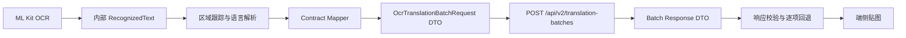
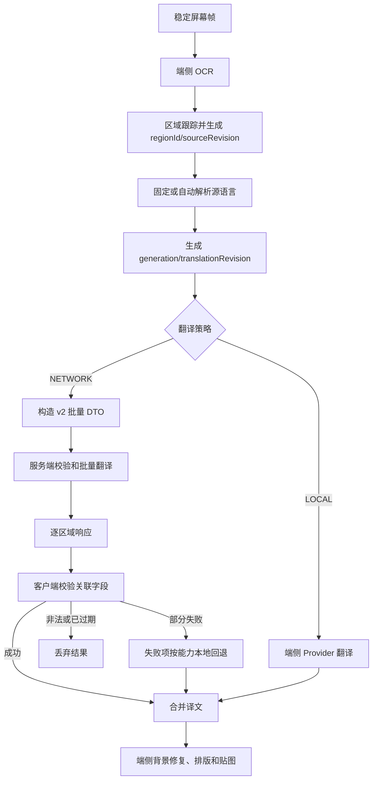
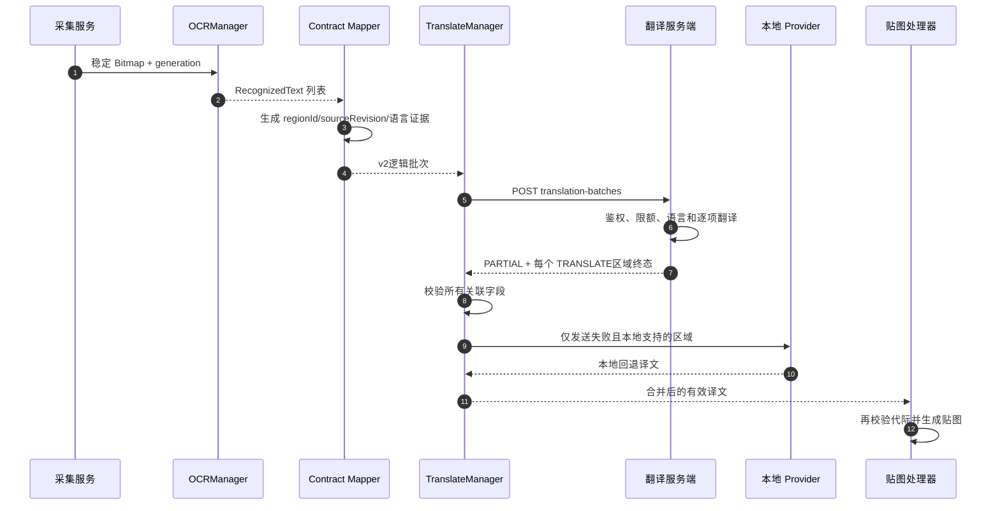
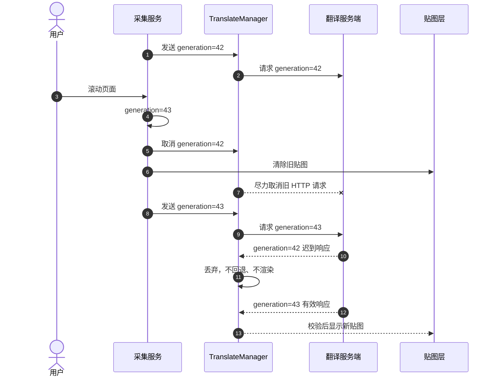
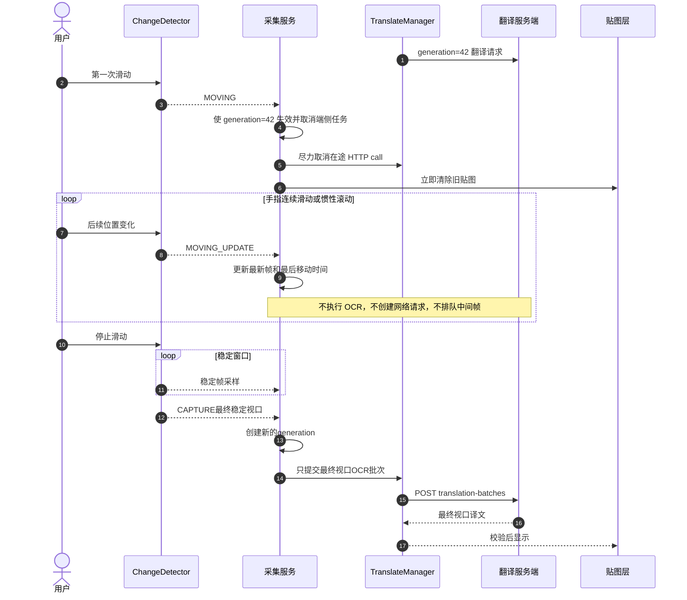
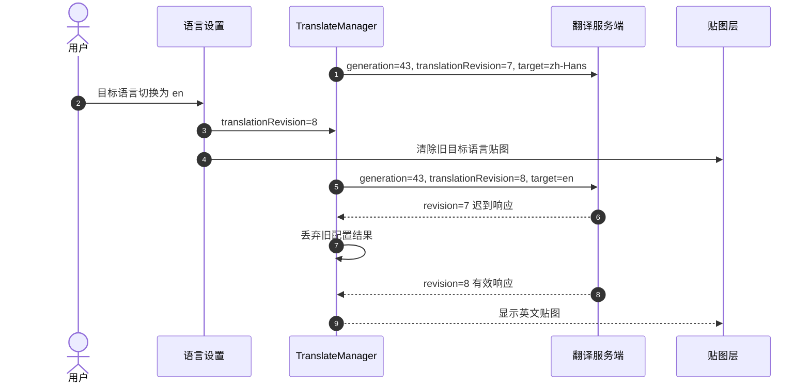

# OCR 识别数据与服务端翻译接口契约

> 协议版本：2.0  
> 文档日期：2026-07-30  
> 参与方：Android 客户端、翻译服务端  
> 状态：目标联调协议；当前客户端 `/api/v1`兼容实现尚未完整支持本文字段

## 1. 文档用途

本文是前后端联调的唯一接口口径，包含：

1. 手机端 OCR 结果如何转换为可传输数据。
2. 客户端发送翻译批次的接口、字段和约束。
3. 服务端返回译文、部分失败和错误的格式。
4. 正常识别、页面滚动、语言切换、弱网及拆批场景的处理流程。
5. 前后端各自必须完成的校验和验收项。

完整架构分析、OCR 语言能力和方案取舍见 [手机屏幕 OCR、语言选择与服务端翻译协议分析](./ml-kit-upgrade-and-server-translation-api-analysis.md)。

## 2. 协议范围

### 2.1 本协议负责

- 上传已经在手机端识别出的 OCR 文字、坐标和识别证据。
- 指定源语言策略和明确的目标语言。
- 服务端按 OCR 区域批量翻译并逐项返回结果。
- 处理乱序、迟到、重复、部分失败、超时和页面变化。

### 2.2 本协议不负责

- 屏幕录制授权和 Bitmap 采集。
- 服务端 OCR。
- 图片上传、图片存储或图片翻译。
- OCR 坐标修正、背景修复、文字排版和贴图渲染。
- 客户端悬浮窗和页面滚动检测。

服务端只接收结构化文本，不接收原始截图、OCR 裁剪图、贴图 Bitmap、本地 URI 或 MediaProjection 授权数据。

## 3. 前后端职责

| 阶段 | Android 客户端 | 翻译服务端 |
|---|---|---|
| 屏幕采集 | 采集并判断画面是否稳定 | 不参与 |
| OCR | 识别文字、坐标和脚本证据 | 不参与 |
| 语言 | 提供固定语言或端侧检测候选 | 自动模式下可复核 |
| 请求 | 生成会话、代际、区域修订和幂等键 | 校验协议、鉴权和限制 |
| 翻译 | LOCAL模式处理；网络失败时按能力回退 | NETWORK模式批量处理 |
| 结果 | 校验、合并、排版和贴图 | 只返回逐区域文本和状态 |
| 过期控制 | 最终裁决，旧结果永不显示 | 原样回显关联字段 |

## 4. 数据处理边界

客户端内部 OCR 对象与网络 DTO 必须隔离：



网络层不得直接序列化：

- Android `Rect`、`Bitmap`、`Uri`。
- `RecognizedText`等内部类。
- 当前业务枚举 `TranslationMode`。
- OCR 引擎私有对象或 SDK 返回对象。

建议客户端代码边界：

```text
translate/contract/
    OcrTranslationBatchRequestDto.kt
    OcrTranslationBatchResponseDto.kt
    OcrTranslationContractMapper.kt
    OcrTranslationContractValidator.kt
```

## 5. 端侧 OCR 原始结构

当前端侧 OCR 核心结果：

```kotlin
data class RecognizedText(
    val text: String,
    val bounds: Rect,
    val consensusScore: Float,
    val passCount: Int,
    val modelConfidence: Float,
    val recognizerScript: RecognizerScript
)

enum class RecognizerScript {
    CHINESE,
    LATIN,
    FUSED
}
```

| 字段 | 含义 | 是否直接发送 |
|---|---|---:|
| `text` | OCR 原文 | 是，映射为 `regions[].text` |
| `bounds` | OCR 输入 Bitmap 像素坐标 | 是，转换为普通整数对象 |
| `consensusScore` | 多模型/多 pass 融合共识 | 可选 |
| `passCount` | 参与融合的证据数 | 可选 |
| `modelConfidence` | OCR 候选置信度 | 可选 |
| `recognizerScript` | OCR 模型证据 | 是，映射为协议脚本枚举 |

`RecognizerScript`表示 OCR 证据，不表示自然语言。`LATIN`不能直接解释为英语，`CHINESE`也不能单独决定简体或繁体目标语言。

## 6. 传输数据结构

### 6.1 Kotlin DTO 参考

```kotlin
data class OcrTranslationBatchRequestDto(
    val schemaVersion: Int,
    val requestId: String,
    val sessionId: String,
    val generation: Long,
    val translationRevision: Long,
    val batchPartIndex: Int,
    val batchPartCount: Int,
    val scene: String,
    val capture: CaptureDto,
    val translation: TranslationOptionsDto,
    val regions: List<OcrRegionDto>,
    val client: ClientDto
)

data class OcrRegionDto(
    val regionId: String,
    val sourceRevision: Long,
    val role: String,
    val text: String,
    val script: String,
    val readingOrder: Int,
    val bounds: PixelBoundsDto,
    val ocr: OcrEvidenceDto,
    val language: LanguageEvidenceDto?,
    val contextGroupId: String?
)
```

这些是协议 DTO 示例，不要求服务端使用 Kotlin，也不要求字段名与客户端内部类一致。

### 6.2 标识和修订号

| 字段 | 生成方 | 生命周期 | 规则 |
|---|---|---|---|
| `requestId` | 客户端 | 单次 HTTP 请求 | UUID；每次请求和拆分后的每个分片都必须不同 |
| `sessionId` | 客户端 | 一次录屏/识别会话 | 随机临时 ID，不得使用设备硬件标识 |
| `generation` | 客户端 | 一个稳定视口 | 画面有效变化时递增；滚动后新画面必须使用新值 |
| `translationRevision` | 客户端 | 一组翻译配置 | 源语言、目标语言、Provider策略或影响输出的选项变化时递增 |
| `regionId` | 客户端 | session 内区域轨迹 | 优先由 `trackId`生成；没有轨迹时在当前 generation 内唯一 |
| `sourceRevision` | 客户端 | 单个 `regionId` | 同一轨迹的 OCR 原文变化时递增 |

服务端必须原样返回这些关联字段，不得自行生成或修改。

## 7. 实时批量翻译接口

### 7.1 请求

```http
POST /api/v2/translation-batches
Authorization: Bearer <short-lived-access-token>
Content-Type: application/json; charset=utf-8
Accept: application/json
X-Request-Id: <requestId>
Idempotency-Key: <requestId>
```

一次稳定视口对应一个逻辑批次。正常情况下只发一个 HTTP 请求；超过限制时可以拆成多个分片。

### 7.2 通信方式决策：HTTP 还是 WebSocket

**结论：当前版本采用 HTTPS + JSON 的 HTTP 请求/响应模式，不采用 WebSocket。优先使用 HTTP/2连接复用；后端或网关只支持 HTTP/1.1时必须启用 keep-alive。**

推荐交互参数：

| 项目 | 选择 |
|---|---|
| 应用层协议 | HTTP `POST`请求/响应 |
| 传输安全 | TLS，生产环境只允许 HTTPS |
| HTTP版本 | HTTP/2优先，HTTP/1.1 keep-alive可兼容 |
| 数据格式 | UTF-8 JSON |
| 请求粒度 | 每个最终稳定视口一个逻辑批次，不是每个 OCR 区域一个请求 |
| 并发策略 | 同一 session 最多一个在途 generation |
| 取消策略 | 客户端取消 HTTP call；`generation`校验作为最终保障 |
| 重试策略 | 仅当前 generation 有效时，使用同一幂等键安全重试 |

方案对比：

| 维度 | HTTP批量请求 | WebSocket长连接 | 当前场景判断 |
|---|---|---|---|
| 交互模型 | 一次稳定视口对应一次请求/响应 | 双向持续消息 | HTTP匹配 |
| 服务端主动推送 | 不擅长 | 擅长 | 当前不需要 |
| 连接成本 | HTTP/2或keep-alive后可复用 | 长连接持续占用 | HTTP足够 |
| 取消 | 取消底层call + 代际失效 | 发送取消消息 + 代际失效 | 两者都不能省略代际校验 |
| 幂等和重试 | 标准Header和状态码 | 必须自定义消息ID、ACK和重放 | HTTP更简单 |
| 断线恢复 | 下一请求自然恢复 | 需要重连和未确认消息恢复 | HTTP更适合移动网络 |
| 背压 | 客户端限制在途请求即可 | 双端都要实现消息队列背压 | HTTP更简单 |
| 网关和扩缩容 | 标准无状态处理 | 需处理长连接和可能的会话路由 | HTTP更成熟 |
| 流式局部结果 | 需额外采用流式响应 | 原生适合 | 当前要求是批量终态，不需要 |
| 本期结论 | **采用** | **不采用** | 保持HTTP |

选择 HTTP 的理由：

1. 本业务是“画面稳定后发起一次批量翻译”，不是逐视频帧上传，也不需要服务端主动推送。
2. 连续滑动期间不产生请求，只在最终稳定视口产生一个批次，消息频率不足以抵消 WebSocket 的状态管理成本。
3. HTTP 天然适配鉴权、幂等、限流、超时、网关、负载均衡和可观测性。
4. HTTP/2或 keep-alive可以复用连接，不需要为每个稳定视口重新建立 TCP/TLS连接。
5. 手机网络切换、应用进入后台和 NAT空闲回收时，HTTP恢复成本和失败语义更简单。
6. 即使使用 WebSocket，也仍必须保留 generation、translationRevision和sourceRevision，WebSocket本身不能防止旧结果展示。

WebSocket 的额外成本：

- 需要定义连接恢复、心跳、鉴权续期、消息 ACK、重复消息和断线重放。
- 需要实现客户端和服务端双向背压，防止滑动时请求队列堆积。
- 多实例部署可能需要会话路由或共享连接状态。
- “发送取消消息”和“服务端已停止模型执行”之间仍存在竞态，不能替代客户端过期校验。

只有出现以下需求并经性能数据证明 HTTP 已成为瓶颈时，才重新评估 WebSocket：

- 服务端需要主动推送译文更新。
- 需要逐区域或逐 token流式返回并立即局部贴图。
- 需要在一个长连接内持续交换大量增量 OCR事件。
- 服务端需要维护强会话上下文，且已经具备断线恢复和背压机制。

当前客户端网络实现使用 `HttpURLConnection`。兼容层已经在协程取消时主动 `disconnect()`并中断执行线程，可用于 `/api/v1`阶段；迁移 v2 时仍建议使用支持连接池、HTTP/2和明确 `cancel()`语义的 HTTP 客户端，例如 OkHttp。无论底层客户端如何选择，本文 JSON 契约保持不变。

v2迁移仍必须满足：

1. generation失效时调用底层 HTTP call 的显式取消方法。
2. 已失效调用不能继续占用翻译串行锁并阻塞最终稳定视口。
3. 取消异常不触发本地回退，也不展示失败提示。
4. 即使底层取消失败，响应仍因 generation不匹配被丢弃。

因此，结论是“保留 HTTP，替换为适合可取消实时请求的 HTTP 客户端实现”，而不是为了取消功能改用 WebSocket。

### 7.3 完整请求示例

```json
{
  "schemaVersion": 2,
  "requestId": "0198a8ca-5b3a-7b4d-89ea-18d7ae7583fb",
  "sessionId": "session-b81fa7a9",
  "generation": 42,
  "translationRevision": 7,
  "batchPartIndex": 0,
  "batchPartCount": 1,
  "scene": "LIVE_SCREEN",
  "capture": {
    "sourceWidth": 1080,
    "sourceHeight": 2400,
    "orientation": "PORTRAIT",
    "capturedAtEpochMs": 1785404123456,
    "segmentation": "DIFFERENTIAL",
    "contentShiftY": -286,
    "registrationConfidence": 0.94
  },
  "translation": {
    "source": {
      "mode": "AUTO_PER_REGION",
      "languageTag": null,
      "fallbackLanguageTag": null
    },
    "target": {
      "languageTag": "zh-Hans"
    },
    "mixedLanguagePolicy": "PER_REGION",
    "preserveIdentifiers": true,
    "useContext": true
  },
  "regions": [
    {
      "regionId": "track-1042",
      "sourceRevision": 3,
      "role": "TRANSLATE",
      "text": "Start recognition",
      "script": "LATIN",
      "readingOrder": 0,
      "bounds": {
        "left": 64,
        "top": 318,
        "right": 512,
        "bottom": 376
      },
      "ocr": {
        "engine": "ML_KIT_V2",
        "model": "LATIN",
        "modelConfidence": 0.94,
        "consensusScore": 0.82,
        "passCount": 3
      },
      "language": {
        "detectedTag": "en",
        "confidence": 0.91,
        "detectionSource": "ML_KIT_LANGUAGE_ID",
        "candidates": [
          { "languageTag": "en", "confidence": 0.91 },
          { "languageTag": "de", "confidence": 0.05 }
        ],
        "userOverride": false
      },
      "contextGroupId": "toolbar"
    },
    {
      "regionId": "track-1043",
      "sourceRevision": 1,
      "role": "TRANSLATE",
      "text": "Profil",
      "script": "LATIN",
      "readingOrder": 1,
      "bounds": {
        "left": 64,
        "top": 402,
        "right": 250,
        "bottom": 458
      },
      "ocr": {
        "engine": "ML_KIT_V2",
        "model": "LATIN",
        "modelConfidence": 0.86,
        "consensusScore": 0.74,
        "passCount": 2
      },
      "language": {
        "detectedTag": "fr",
        "confidence": 0.63,
        "detectionSource": "ML_KIT_LANGUAGE_ID",
        "candidates": [],
        "userOverride": false
      },
      "contextGroupId": "profile-menu"
    },
    {
      "regionId": "track-1041",
      "sourceRevision": 1,
      "role": "CONTEXT_ONLY",
      "text": "Screen Translate",
      "script": "LATIN",
      "readingOrder": 2,
      "bounds": {
        "left": 64,
        "top": 240,
        "right": 480,
        "bottom": 300
      },
      "ocr": {
        "engine": "ML_KIT_V2",
        "model": "LATIN"
      },
      "language": {
        "detectedTag": "en",
        "confidence": 0.97,
        "detectionSource": "ML_KIT_LANGUAGE_ID",
        "candidates": [],
        "userOverride": false
      },
      "contextGroupId": "toolbar"
    }
  ],
  "client": {
    "platform": "ANDROID",
    "appVersion": "1.0",
    "locale": "zh-CN"
  }
}
```

## 8. 请求字段说明

### 8.1 顶层字段

| 字段 | 类型 | 必需 | 说明 |
|---|---|---:|---|
| `schemaVersion` | integer | 是 | 当前固定为 `2` |
| `requestId` | string | 是 | 当前 HTTP 请求的追踪和幂等键 |
| `sessionId` | string | 是 | 当前识别会话 |
| `generation` | integer | 是 | 当前稳定画面代数 |
| `translationRevision` | integer | 是 | 当前翻译配置代数 |
| `batchPartIndex` | integer | 是 | 分片序号，从 `0`开始 |
| `batchPartCount` | integer | 是 | 当前逻辑批次的分片总数 |
| `scene` | enum | 是 | `LIVE_SCREEN`、`SCREENSHOT`、`PHOTO`或`LONG_IMAGE` |
| `capture` | object | 是 | 屏幕尺寸和差分信息，不含像素 |
| `translation` | object | 是 | 语言和翻译策略 |
| `regions` | array | 是 | 待翻译和上下文 OCR 区域 |
| `client` | object | 是 | 协议兼容信息，不含稳定设备标识 |

### 8.2 `capture`

| 字段 | 类型 | 必需 | 说明 |
|---|---|---:|---|
| `sourceWidth` | integer | 是 | OCR 源 Bitmap 宽度，像素 |
| `sourceHeight` | integer | 是 | OCR 源 Bitmap 高度，像素 |
| `orientation` | enum | 是 | `PORTRAIT`或`LANDSCAPE` |
| `capturedAtEpochMs` | integer | 是 | 客户端采集时间，只用于诊断，不用于排序 |
| `segmentation` | enum | 是 | `FULL_FRAME`、`VERTICAL_BANDS`或`DIFFERENTIAL` |
| `contentShiftY` | integer/null | 否 | 相对上一稳定视口的纵向位移 |
| `registrationConfidence` | number/null | 否 | 位移配准置信度，范围 `0..1` |

排序和过期判断必须使用 `generation`，不能依赖客户端时间。

### 8.3 `translation`

| 字段 | 类型 | 必需 | 说明 |
|---|---|---:|---|
| `source.mode` | enum | 是 | `FIXED`或`AUTO_PER_REGION` |
| `source.languageTag` | string/null | 条件必需 | `FIXED`时必须是 BCP-47 标签 |
| `source.fallbackLanguageTag` | string/null | 否 | 自动判断为 `und`时的显式兜底；默认空 |
| `target.languageTag` | string | 是 | 明确目标语言；禁止使用 `auto` |
| `mixedLanguagePolicy` | enum | 是 | 当前固定为 `PER_REGION` |
| `preserveIdentifiers` | boolean | 是 | 保留 URL、代码、数字 ID和品牌标记 |
| `useContext` | boolean | 是 | 是否允许同组区域作为翻译上下文 |

语言使用规范化 BCP-47 标签，例如 `en`、`fr`、`zh-Hans`。具体供应商代码由服务端 Adapter 转换。

### 8.4 `regions`

| 字段 | 类型 | 必需 | 说明 |
|---|---|---:|---|
| `regionId` | string | 是 | session 内稳定区域标识 |
| `sourceRevision` | integer | 是 | 当前 OCR 原文修订号 |
| `role` | enum | 是 | `TRANSLATE`或`CONTEXT_ONLY` |
| `text` | string | 是 | UTF-8 OCR 原文 |
| `script` | enum | 是 | 见第 8.5 节 |
| `readingOrder` | integer | 是 | 当前视口阅读顺序，从 `0`开始 |
| `bounds` | object | 是 | OCR 源 Bitmap 像素坐标 |
| `ocr` | object | 是 | OCR 引擎和可选证据 |
| `language` | object/null | 否 | 端侧语言判断证据 |
| `contextGroupId` | string/null | 否 | 同组文字可以共同参与语义判断 |

`CONTEXT_ONLY`区域只提供上下文，不需要翻译、不计入响应结果数量。坐标必须满足：

```text
0 <= left < right <= sourceWidth
0 <= top < bottom <= sourceHeight
```

### 8.5 枚举

| 字段 | 可选值 |
|---|---|
| `script` | `HAN`、`LATIN`、`HIRAGANA`、`KATAKANA`、`HANGUL`、`DEVANAGARI`、`MIXED`、`UNKNOWN` |
| `ocr.engine` | 当前 `ML_KIT_V2`；后续可扩展但不能改变既有值语义 |
| `role` | `TRANSLATE`、`CONTEXT_ONLY` |
| `language.detectionSource` | `USER_FIXED`、`SCRIPT_RULE`、`ML_KIT_LANGUAGE_ID`、`UNKNOWN` |

`language.detectedTag`无法确定时使用 `und`，不能默认为英语。

### 8.6 `ocr`

| 字段 | 类型 | 必需 | 说明 |
|---|---|---:|---|
| `engine` | string | 是 | OCR 引擎稳定标识，当前为 `ML_KIT_V2` |
| `model` | string | 是 | 实际模型，例如 `LATIN`、`CHINESE`、`FUSED` |
| `modelConfidence` | number/null | 否 | OCR 模型候选置信度，范围 `0..1` |
| `consensusScore` | number/null | 否 | 客户端多模型/多 pass 融合共识，范围 `0..1` |
| `passCount` | integer/null | 否 | 参与融合的识别证据数，最小为 `1` |

服务端可以把 OCR 证据用于质量路由或诊断，但不得据此修改 `regionId`、`sourceRevision`或坐标。

### 8.7 `language`

| 字段 | 类型 | 必需 | 说明 |
|---|---|---:|---|
| `detectedTag` | string | 是 | 端侧候选 BCP-47 标签；无法确定为 `und` |
| `confidence` | number/null | 否 | 端侧语言判断置信度，范围 `0..1` |
| `detectionSource` | enum | 是 | 用户固定、脚本规则、Language ID或未知 |
| `candidates` | array | 是 | 可为空；每项包含 `languageTag`和`confidence` |
| `userOverride` | boolean | 是 | 是否由用户固定源语言 |

当 `source.mode=FIXED`时，服务端必须使用 `source.languageTag`作为有效源语言，不得因为自动检测结果不同而静默改变翻译方向。服务端可以在诊断字段中报告冲突。

当 `source.mode=AUTO_PER_REGION`时，服务端可以结合端侧候选和上下文复核语言，并在结果中返回实际采用的 `effectiveSourceLanguage`。

### 8.8 `client`

| 字段 | 类型 | 必需 | 说明 |
|---|---|---:|---|
| `platform` | string | 是 | 当前固定为 `ANDROID` |
| `appVersion` | string | 是 | 客户端应用版本，用于兼容性诊断 |
| `locale` | string | 是 | 客户端界面 locale，不代表源语言 |

`client`不得加入广告 ID、IMEI、Android ID或其他稳定设备标识。

### 8.9 服务端请求校验顺序

1. 鉴权通过，请求体大小未超过限制。
2. JSON 可解析，`schemaVersion=2`。
3. Body `requestId`、`X-Request-Id`和`Idempotency-Key`三者一致。
4. `sessionId`非空，所有代数和修订号为非负整数。
5. `0 <= batchPartIndex < batchPartCount`，且 `batchPartCount >= 1`。
6. `target.languageTag`存在且不是 `auto`。
7. `source.mode`与 `source.languageTag`满足条件必填规则。
8. `regions`数量、字符数和请求体均未超过限制。
9. `regionId`在当前请求内唯一，`text`非空且是有效 Unicode 文本。
10. bounds合法且没有超出 `capture`尺寸。
11. 语言标签、脚本、role和 scene 均为受支持枚举。

请求级结构错误返回 HTTP 400。单个区域在结构合法但语言或内容无法处理时，优先使用 HTTP 200并返回该区域的 `FAILED`终态，使其他区域仍可成功。

## 9. 服务端响应

### 9.1 部分成功示例

```json
{
  "schemaVersion": 2,
  "requestId": "0198a8ca-5b3a-7b4d-89ea-18d7ae7583fb",
  "sessionId": "session-b81fa7a9",
  "generation": 42,
  "translationRevision": 7,
  "batchPartIndex": 0,
  "status": "PARTIAL",
  "results": [
    {
      "regionId": "track-1042",
      "sourceRevision": 3,
      "status": "TRANSLATED",
      "effectiveSourceLanguage": "en",
      "detectedSourceLanguage": "en",
      "targetLanguage": "zh-Hans",
      "translatedText": "开始识别",
      "provider": "server-default",
      "modelVersion": "translation-2026-07",
      "cached": false,
      "error": null
    },
    {
      "regionId": "track-1043",
      "sourceRevision": 1,
      "status": "FAILED",
      "effectiveSourceLanguage": "fr",
      "detectedSourceLanguage": "fr",
      "targetLanguage": "zh-Hans",
      "translatedText": null,
      "provider": "server-default",
      "modelVersion": "translation-2026-07",
      "cached": false,
      "error": {
        "code": "PROVIDER_TIMEOUT",
        "message": "Translation provider timed out",
        "retryable": true
      }
    }
  ],
  "timing": {
    "queueMs": 4,
    "translationMs": 81,
    "totalMs": 92
  }
}
```

请求中的 `CONTEXT_ONLY`区域 `track-1041`不得出现在 `results`中。

### 9.2 顶层状态

| 状态 | 含义 |
|---|---|
| `COMPLETED` | 所有 `TRANSLATE`区域都得到终态，且没有 `FAILED` |
| `PARTIAL` | 部分区域成功或保留，部分区域失败 |
| `FAILED` | 所有 `TRANSLATE`区域失败 |

### 9.3 单项状态

| 状态 | `translatedText` | `error` | 含义 |
|---|---|---|---|
| `TRANSLATED` | 必须为非空译文 | `null` | 翻译成功 |
| `PRESERVED` | 必须等于请求原文 | `null` | 源目标相同或按策略保留 |
| `SKIPPED` | `null` | 可选 | 明确不处理，例如只有控制字符 |
| `FAILED` | `null` | 必须存在 | 翻译失败，客户端决定是否本地回退 |

每个 `TRANSLATE`请求区域必须有且只有一个结果。响应顺序没有语义，只能通过 `regionId`关联。

### 9.4 响应字段

顶层字段：

| 字段 | 类型 | 必需 | 说明 |
|---|---|---:|---|
| `schemaVersion` | integer | 是 | 必须为 `2` |
| `requestId` | string | 是 | 原样返回当前 HTTP 请求值 |
| `sessionId` | string | 是 | 原样返回请求值 |
| `generation` | integer | 是 | 原样返回请求值 |
| `translationRevision` | integer | 是 | 原样返回请求值 |
| `batchPartIndex` | integer | 是 | 原样返回请求值 |
| `status` | enum | 是 | `COMPLETED`、`PARTIAL`或`FAILED` |
| `results` | array | 是 | 只包含 `TRANSLATE`区域，每个区域恰好一项 |
| `timing` | object/null | 否 | 服务端阶段耗时，不包含移动网络耗时 |

单项字段：

| 字段 | 类型 | 必需 | 说明 |
|---|---|---:|---|
| `regionId` | string | 是 | 原样返回请求区域 ID |
| `sourceRevision` | integer | 是 | 原样返回请求区域修订号 |
| `status` | enum | 是 | 见第 9.3 节 |
| `effectiveSourceLanguage` | string/null | 条件必需 | 成功或保留时必须返回实际使用的源语言 |
| `detectedSourceLanguage` | string/null | 否 | 服务端自动检测结果；固定源语言时也可用于诊断 |
| `targetLanguage` | string | 是 | 必须等于请求目标语言 |
| `translatedText` | string/null | 条件必需 | 由单项状态决定 |
| `provider` | string | 是 | 稳定供应商标识，不暴露密钥或内部地址 |
| `modelVersion` | string | 是 | 实际模型版本，用于诊断和缓存隔离 |
| `cached` | boolean | 是 | 是否命中服务端翻译缓存 |
| `error` | object/null | 条件必需 | `FAILED`时包含 `code`、`message`和`retryable` |

`timing`建议包含 `queueMs`、`translationMs`和`totalMs`，均为非负整数毫秒值。

## 10. HTTP 错误响应

非 `2xx`响应使用统一错误结构：

```json
{
  "schemaVersion": 2,
  "requestId": "0198a8ca-5b3a-7b4d-89ea-18d7ae7583fb",
  "error": {
    "code": "INVALID_REQUEST",
    "message": "target.languageTag is required",
    "retryable": false,
    "details": {
      "field": "translation.target.languageTag"
    }
  }
}
```

客户端只能依赖 `code`和`retryable`，不得解析 `message`。稳定错误码：

```text
INVALID_REQUEST
TOO_MANY_REGIONS
TEXT_TOO_LONG
UNSUPPORTED_SOURCE_LANGUAGE
UNSUPPORTED_TARGET_LANGUAGE
LANGUAGE_UNDETERMINED
EMPTY_TRANSLATION
CONTENT_REJECTED
RATE_LIMITED
PROVIDER_TIMEOUT
PROVIDER_UNAVAILABLE
STALE_GENERATION
INTERNAL_ERROR
```

## 11. 客户端响应校验

客户端必须按顺序执行：

1. HTTP 状态可处理，JSON 能解析。
2. `schemaVersion`是客户端支持的版本。
3. `requestId`、`sessionId`、`generation`、`translationRevision`和`batchPartIndex`与请求一致。
4. 当前页面仍是同一个 `generation`。
5. 当前语言和 Provider 配置仍是同一个 `translationRevision`。
6. 每个 `TRANSLATE`区域恰好一项，不允许重复、未知或遗漏的 `regionId`。
7. 每项 `sourceRevision`等于请求值和本地当前值。
8. 成功项 `targetLanguage`等于当前用户选择。
9. `TRANSLATED`和`PRESERVED`的文本满足对应状态约束。
10. 只对失败且本地 Provider 确实支持的区域执行本地回退。
11. 贴图渲染前再次检查 `generation`和`translationRevision`。

任意一项关联字段不匹配时，不得尝试“猜测”对应关系。

## 12. 主流程图



## 13. 正常与部分失败时序图



## 14. 页面滚动和迟到响应时序图

### 14.1 单次滑动



### 14.2 连续多次快速滑动

连续滑动采用“首次移动立即失效、移动期间只保留最新帧、最终稳定后只请求一次”的合并策略：



如果两次滑动之间的停顿已经满足稳定门槛，客户端可能启动一次中间视口请求；下一次滑动必须立即让该 generation 失效并取消请求。服务端可能仍完成计算，但客户端必须丢弃迟到响应。

`generation`只要求单调增加，不要求连续。移动失效和后续采集都可能递增内部 generation，服务端不得通过 `generation + 1`推断下一次请求。

当前客户端默认稳定策略是：慢速移动约 420 ms、快速移动约 520 ms的稳定延迟，至少 4个稳定帧采样，并受约 900 ms最小采集间隔约束。这些是端侧可调性能参数，不属于服务端协议冻结字段。

### 14.3 连续滑动的背压规则

1. 同一 session 同时最多保留一个在途 generation。
2. 移动期间只保留最新帧语义，不建立待翻译 FIFO队列。
3. `MOVING_UPDATE`不能触发 OCR或网络请求。
4. 首次 `MOVING`只执行一次取消和清理，后续更新只延后稳定判断。
5. 最终稳定后，整帧或差分 OCR完成才生成网络 DTO。
6. 客户端取消 HTTP call是资源优化，关联字段校验才是正确性保障。
7. 服务端不需要额外的 WebSocket取消消息，也不要求提供独立取消接口。

## 15. 语言或 Provider 切换时序图



`generation`没有变化，因为屏幕画面未变；这正是必须单独维护 `translationRevision`的原因。

## 16. 必要场景说明

| 场景 | 客户端行为 | 服务端行为 | 结果 |
|---|---|---|---|
| 首次稳定画面 | 新 generation，整帧批量请求 | 逐区域翻译 | 校验后贴图 |
| 画面完全相同 | 复用有效缓存，不重复请求 | 无请求 | 保留现有贴图 |
| 页面滚动 | 立即增加 generation、取消请求、清贴图 | 可尽力取消；迟到响应仍正常返回 | 客户端丢弃旧代结果 |
| 连续快速滑动 | 合并中间帧，只保留最新画面；最终稳定后请求一次 | 滑动期间通常无新请求 | 不产生请求风暴和中间贴图 |
| 两次滑动间短暂停顿 | 未达到稳定门槛时继续等待 | 无请求 | 与连续滑动相同 |
| 两次滑动间长暂停 | 达到稳定门槛可启动请求；再次移动立即失效 | 可能收到取消或产生迟到响应 | 旧代结果被丢弃 |
| 差分 OCR | 新区域为 `TRANSLATE`，已翻译相邻区域可为 `CONTEXT_ONLY` | 只返回 `TRANSLATE`结果 | 减少重复翻译并保留上下文 |
| 网络部分失败 | 校验成功项，失败项按本地能力回退 | 返回 `PARTIAL`和逐项错误 | 已成功区域不重复翻译 |
| 网络超时/断网 | 取消或熔断；本地支持项回退 | 请求可能未完成 | 不阻塞下一帧 |
| 源语言无法确定 | 发送 `und`或不发送该项；不得默认英语 | 无显式 fallback 时返回 `LANGUAGE_UNDETERMINED` | 用户固定语言或保持原文 |
| 源目标相同 | 可在客户端直接保留 | 若收到则返回 `PRESERVED` | 不调用翻译模型 |
| 用户切换目标语言 | `translationRevision++`并重新翻译当前画面 | 原样回显新修订号 | 旧目标语言响应被丢弃 |
| 请求超过限制 | 拆分请求，每片新 requestId | 分片分别幂等处理 | 同 generation 合并有效分片 |
| 重复 requestId | 只用于同一请求的安全重试 | 返回相同结果或幂等冲突 | 不重复计费/处理 |
| 用户选择 LOCAL | 不调用服务端 | 无请求 | 完全端侧处理 |

## 17. 拆批、幂等和重试

建议限制：

| 限制 | 建议值 |
|---|---:|
| 每批最大区域数 | 64 |
| 单区域最大 Unicode code points | 2,000 |
| 每批最大 Unicode code points | 16,000 |
| 请求体最大值 | 256 KiB |
| 实时连接超时 | 1.5 秒 |
| 实时请求总超时 | 3 秒 |
| 普通截图总超时 | 8 秒 |
| 同一 session 在途 generation | 1 |

拆批规则：

1. 所有分片保持相同 `sessionId`、`generation`和`translationRevision`。
2. 每个分片使用不同 `requestId`和 `Idempotency-Key`。
3. `batchPartIndex`从 `0`连续递增，`batchPartCount`保持一致。
4. 每个 `regionId`只能出现在一个 `TRANSLATE`分片；上下文可按需要重复。
5. 合并前每个分片都要独立通过响应校验。

实时屏幕场景只允许在当前 generation 仍有效时重试。新 generation 出现后，旧请求即使错误标记为 `retryable=true`也不得重试。

## 18. HTTP 状态处理

| HTTP | 含义 | 客户端处理 |
|---|---|---|
| `200` | 完成、部分完成或业务失败 | 按逐项状态合并和回退 |
| `400` | 格式或字段错误 | 不重试，作为契约缺陷记录 |
| `401/403` | 凭据无效或无权限 | 刷新一次短期凭据，失败后降级 |
| `409` | 幂等键与请求内容冲突 | 不复用该 requestId |
| `413` | 请求过大 | 按第 17 节拆批 |
| `422` | 语言或文本无法处理 | 读取稳定错误码并逐项降级 |
| `429` | 限流 | 实时场景立即降级，不阻塞画面 |
| `500/502/503/504` | 服务异常或超时 | 短时熔断并按能力回退 |

## 19. 可选能力接口

为动态生成语言选择列表，建议提供：

```http
GET /api/v2/translation/capabilities
Authorization: Bearer <short-lived-access-token>
Accept: application/json
```

最低响应字段：

```json
{
  "schemaVersion": 2,
  "supportsAutoDetection": true,
  "supportsPerRegionLanguage": true,
  "supportsContextOnlyRegions": true,
  "supportedLanguagePairs": [
    { "source": "en", "target": "zh-Hans" },
    { "source": "fr", "target": "zh-Hans" },
    { "source": "zh-Hans", "target": "en" }
  ],
  "limits": {
    "maxRegionsPerBatch": 64,
    "maxCodePointsPerRegion": 2000,
    "maxCodePointsPerBatch": 16000,
    "maxRequestBytes": 262144
  },
  "server": {
    "apiVersion": "2.0",
    "modelVersion": "translation-2026-07"
  }
}
```

客户端按短 TTL缓存，不得每帧调用。没有能力接口时，双方必须通过发布配置固定支持的语言对和限制。

## 20. 安全和日志

1. 生产环境只允许 HTTPS。
2. 使用短期访问令牌，不在 APK 中保存服务端长期密钥。
3. 默认不上传图片、裁剪图、应用包名、稳定设备 ID和本地 URI。
4. 服务端默认不记录 `regions[].text`、`translatedText`或语言候选原文。
5. 客户端和服务端均不得把完整请求/响应写入普通日志、崩溃日志或分析 SDK。
6. 日志只保留 requestId、区域数量、字符数、耗时、状态和错误码。
7. 联网翻译必须由用户明确开启，并披露文本会发送到服务端。

## 21. 当前 `/api/v1`与目标 `/api/v2`差异

| 项目 | 当前客户端 `/api/v1` | 本文目标 `/api/v2` |
|---|---|---|
| 调用粒度 | OCR结果已批量提交；分区/差分识别仍可能形成多个批次 | 一个稳定视口一个逻辑批次 |
| 传输方式 | `HttpURLConnection` + HTTP POST | HTTPS POST；HTTP/2连接复用优先 |
| 底层取消 | 取消时主动断开连接并中断执行线程 | generation失效时显式取消 HTTP call |
| `sessionId` | 无 | 必需 |
| `generation` | 固定发送 `0` | 必须发送真实画面代 |
| `translationRevision` | 无 | 必需 |
| `sourceRevision` | 无 | 每个区域必需 |
| 语言 | 顶层仍为 `mode/auto`，区域附带中英源/目标提示 | 固定/区域自动源语言 + 明确目标语言 |
| 坐标和 OCR 证据 | 无 | 必需/可选结构化字段 |
| 部分失败 | 已按 regionId仅回退失败、缺失或非法项 | 同左，并增加完整协议错误语义 |
| 响应关联 | 检查 requestId、未知/重复 regionId及结果合法性 | 增加画面代、配置代和区域修订校验 |
| 鉴权 | 未内置 | 短期 Bearer token |

联调结论：后端可以先实现 `/api/v2`和契约测试，但当前客户端不能在只切换 URL 后直接兼容。客户端必须先完成 DTO、批次组装和校验迁移。

## 22. 联调验收清单

### 22.1 Android 客户端

- 一次稳定视口只创建一个逻辑批次。
- 正确生成五层关联字段：session、画面代、翻译配置代、区域 ID、源文修订。
- 不发送 Bitmap、裁剪图或 Android 私有对象。
- 能处理响应乱序、重复、遗漏、未知 regionId和旧修订。
- 网络部分失败只回退失败项。
- 页面滚动或语言切换后旧响应展示率为 0。

### 22.2 翻译服务端

- 对请求字段、枚举、坐标、区域数量和字符数执行校验。
- 原样回显所有关联字段。
- 每个 `TRANSLATE`区域返回且只返回一个终态。
- 不返回 `CONTEXT_ONLY`结果，不修改坐标。
- 支持幂等键、部分失败和稳定错误码。
- 默认日志中不出现源文和译文。

### 22.3 联合测试用例

| 用例 | 预期结果 |
|---|---|
| 2个成功区域 + 1个上下文区域 | 返回2项，状态 `COMPLETED` |
| 1个成功 + 1个失败 | 返回2项，状态 `PARTIAL` |
| 重复 regionId | `400 INVALID_REQUEST` |
| 越界 bounds | `400 INVALID_REQUEST` |
| 未填写目标语言 | `400 INVALID_REQUEST` |
| 自动源语言为 `und`且无 fallback | 单项 `LANGUAGE_UNDETERMINED` |
| response sourceRevision被修改 | 客户端丢弃该项 |
| 滚动后返回旧 generation | 客户端整批丢弃 |
| 切换目标语言后返回旧 translationRevision | 客户端整批丢弃 |
| 同一幂等键重放相同请求 | 服务端返回同一结果且不重复处理 |
| 同一幂等键发送不同内容 | `409` |
| 65个区域 | 客户端预拆批或服务端 `413` |

## 23. 协议冻结项

前后端开始开发前必须共同确认：

1. 使用 HTTPS JSON请求/响应，当前阶段不使用 WebSocket。
2. 正式路径使用 `/api/v2/translation-batches`。
3. `schemaVersion=2`。
4. 目标语言禁止 `auto`。
5. `CONTEXT_ONLY`不进入结果数组。
6. 业务部分失败使用 HTTP 200 + `status=PARTIAL`。
7. 每个 `TRANSLATE`区域始终返回一个终态。
8. 结果关联字段必须原样回显。
9. `PRESERVED`返回原文，`FAILED`和`SKIPPED`返回 `null`。
10. 请求限制、超时和鉴权方式。
11. 服务端数据保留及第三方翻译供应商策略。

上述字段一旦冻结，破坏兼容性的修改必须升级 `schemaVersion`或 API 主版本，不得静默改变既有枚举和字段语义。

## 24. Android兼容层实施状态

截至 2026-07-30，客户端已经完成以下兼容改造：

| 能力 | 实施状态 | 对应实现 |
|---|---|---|
| 统一翻译接口 | 已完成 | `TranslationProvider`、`TranslationBatchResult` |
| 本地翻译适配 | 已完成 | `LocalTranslationProvider`包装现有 ML Kit/实验引擎 |
| 本地/网络选择 | 已完成 | `SwitchingTranslationProvider`读取 `TranslationBackendSettings` |
| 服务端批量调用 | 已完成 v1兼容 | `RemoteTranslationProvider`调用 `/api/v1/translation-batches` |
| 部分失败回退 | 已完成 | 网络成功项保留，失败/缺失/非法项才调用本地 Provider |
| 请求取消 | 已完成兼容处理 | 取消时断开活动 `HttpURLConnection`并中断工作线程 |
| OCR调用批量化 | 已完成第一阶段 | 图片、后台截图、实时 OCR均调用 `TranslateManager.translateBatch()` |
| v2完整关联字段 | 未完成 | 尚未发送真实 session、generation、translationRevision和sourceRevision |
| OCR坐标/证据 DTO | 未完成 | v1当前主要发送 regionId、text和中英语言提示 |
| v2鉴权与能力接口 | 未完成 | 等待后端鉴权方案和 `/capabilities`冻结 |

服务端参考实现已经新增至 [`translation-service`](../translation-service/README.md)：使用Rust Axum、`diesel-async`和PostgreSQL，兼容当前v1客户端并实现v2批量接口、能力接口、幂等校验和Hy-MT2 OpenAI兼容模型适配。真实联调已覆盖项目v1 Mock、v2关联字段和Android真机访问；当前连接的Hy-MT2-1.8B 1.25-bit极限量化模型仍未通过品牌保留与长句语义质量门，不能把协议联调通过视为生产质量通过。

兼容层保持旧 `TranslateManager.translate(text, mode)`方法，内部转成单项批次，因此已有调用方可以不修改；新增 OCR流程应优先使用 `translateBatch()`。

## 25. 基于连续滑动测试页面的 v1 Mock

### 25.1 样本来源和适用范围

本节样本来自项目连续滑动真机验证页面：

- 页面源文件：[continuous-scroll.html](./validation/live-scroll-atomic-2026-07-29/fixtures/continuous-scroll.html)
- 取样截图：[source-visible.png](./validation/live-rapid-human-scroll-2026-07-30/default-final-v8/source-visible.png)
- 可见位置：`Observation 22`，标题为 `Visible completion is the real delivery point`
- 截图尺寸：`1440 x 3200`

这是根据真机测试页面可见文字生成的**可重放 Mock**，不是正式服务端抓包。测试产物只记录了区域数量和耗时，没有保存逐区域 OCR原文；因此本示例从页面源文件和截图提取文字，并按语义聚合为4个区域。ML Kit在不同缩放、换行和设备上可能把同一段落拆成不同数量的区域。

本节严格对应客户端当前 `/api/v1`序列化结果，而不是第7节目标 v2协议：

1. 请求路径为 `/api/v1/translation-batches`。
2. `generation`当前固定为 `0`。
3. 不包含 `sessionId`、`translationRevision`、`sourceRevision`、坐标和 OCR证据。
4. `AUTO_BIDIRECTIONAL`根据字符脚本把本页英文区域标记为 `sourceLanguage=en`、`targetLanguage=zh`。
5. `requestId`和 `regionId`为固定 Mock值，便于幂等重放；真实客户端每批都会重新生成 UUID。

独立数据文件：

- [v1请求 JSON](./mock/continuous-scroll-observation-22.v1.request.json)
- [v1响应 JSON](./mock/continuous-scroll-observation-22.v1.response.json)

### 25.2 OCR区域取样

| readingOrder | 区域 | 页面原文 | Mock处理 |
|---:|---|---|---|
| 0 | 页头品牌 | `Atlas Operations` | 翻译并保留品牌词 `Atlas` |
| 1 | Observation 22标题 | `22. Visible completion is the real delivery point` | 网络翻译 |
| 2 | Observation 22正文 | `Performance matters after correctness...` | 网络翻译 |
| 3 | Kotlin代码块 | `suspend fun commit(frame: Frame)...` | 服务端返回 `PRESERVED`，客户端保留原文 |

当前 v1不发送 `readingOrder`和坐标；表中的顺序仅用于说明 `regions`数组顺序。客户端通过 `regionId`关联响应，不依赖服务端返回顺序。

### 25.3 实际 HTTP请求 Mock

```http
POST /api/v1/translation-batches HTTP/1.1
Content-Type: application/json; charset=utf-8
Accept: application/json
X-Request-Id: bcb31972-6c09-4f7b-9a0c-220000000011
Idempotency-Key: bcb31972-6c09-4f7b-9a0c-220000000011
```

```json
{
  "schemaVersion": 1,
  "requestId": "bcb31972-6c09-4f7b-9a0c-220000000011",
  "generation": 0,
  "scene": "ANDROID_CLIENT",
  "translation": {
    "mode": "AUTO_BIDIRECTIONAL",
    "sourceLanguage": "auto",
    "targetLanguage": "auto",
    "preserveIdentifiers": true,
    "useContext": true
  },
  "regions": [
    {
      "regionId": "region-0-bcb31972-6c09-4f7b-9a0c-220000000011",
      "text": "Atlas Operations",
      "sourceLanguage": "en",
      "targetLanguage": "zh"
    },
    {
      "regionId": "region-1-bcb31972-6c09-4f7b-9a0c-220000000011",
      "text": "22. Visible completion is the real delivery point",
      "sourceLanguage": "en",
      "targetLanguage": "zh"
    },
    {
      "regionId": "region-2-bcb31972-6c09-4f7b-9a0c-220000000011",
      "text": "Performance matters after correctness and completeness. Track the time until the whole visible result is committed, not the first partial line that happens to appear.",
      "sourceLanguage": "en",
      "targetLanguage": "zh"
    },
    {
      "regionId": "region-3-bcb31972-6c09-4f7b-9a0c-220000000011",
      "text": "suspend fun commit(frame: Frame) {\n  require(frame.generation == current)\n  publish(\"stable viewport 22\", frame)\n}",
      "sourceLanguage": "en",
      "targetLanguage": "zh"
    }
  ]
}
```

### 25.4 HTTP 200响应 Mock

```http
HTTP/1.1 200 OK
Content-Type: application/json; charset=utf-8
X-Request-Id: bcb31972-6c09-4f7b-9a0c-220000000011
```

```json
{
  "requestId": "bcb31972-6c09-4f7b-9a0c-220000000011",
  "results": [
    {
      "regionId": "region-0-bcb31972-6c09-4f7b-9a0c-220000000011",
      "status": "TRANSLATED",
      "translatedText": "Atlas 运维",
      "provider": "mock-nmt-v1",
      "detectedSourceLanguage": "en",
      "targetLanguage": "zh"
    },
    {
      "regionId": "region-1-bcb31972-6c09-4f7b-9a0c-220000000011",
      "status": "TRANSLATED",
      "translatedText": "22. 可见的完成才是真正的交付点",
      "provider": "mock-nmt-v1",
      "detectedSourceLanguage": "en",
      "targetLanguage": "zh"
    },
    {
      "regionId": "region-2-bcb31972-6c09-4f7b-9a0c-220000000011",
      "status": "TRANSLATED",
      "translatedText": "性能应建立在正确性和完整性之上。应跟踪整个可见结果提交完成所需的时间，而不是仅记录偶然先出现的第一行局部结果。",
      "provider": "mock-nmt-v1",
      "detectedSourceLanguage": "en",
      "targetLanguage": "zh"
    },
    {
      "regionId": "region-3-bcb31972-6c09-4f7b-9a0c-220000000011",
      "status": "PRESERVED",
      "provider": "mock-nmt-v1",
      "detectedSourceLanguage": "en",
      "targetLanguage": "zh"
    }
  ]
}
```

客户端收到上述响应后的处理结果：

| `regionId`序号 | 响应状态 | 客户端行为 |
|---:|---|---|
| 0..2 | `TRANSLATED` | 使用 `translatedText`进行贴图 |
| 3 | `PRESERVED` | 忽略服务端译文并使用原始代码文本贴图 |

响应必须满足：`requestId`与请求一致、每个 `regionId`已请求且不重复、`TRANSLATED`的 `translatedText`非空。响应数组可以乱序，客户端仍按请求区域顺序合并。

### 25.5 本地回放

后端 Mock服务配置为返回第25.4节响应后，可以直接执行：

```bash
export TRANSLATION_BASE_URL="http://127.0.0.1:8080"

curl --fail-with-body \
  --request POST \
  --header "Content-Type: application/json; charset=utf-8" \
  --header "Accept: application/json" \
  --header "X-Request-Id: bcb31972-6c09-4f7b-9a0c-220000000011" \
  --header "Idempotency-Key: bcb31972-6c09-4f7b-9a0c-220000000011" \
  --data-binary @docs/mock/continuous-scroll-observation-22.v1.request.json \
  "${TRANSLATION_BASE_URL}/api/v1/translation-batches"
```

校验重点：HTTP状态为 `200`；响应 `requestId`一致；4个 `regionId`均有唯一终态；前三项有非空译文；代码区域为 `PRESERVED`。正式 v2联调时不能继续复用此 v1结构，应按第7节补齐关联字段、坐标和 OCR证据。
