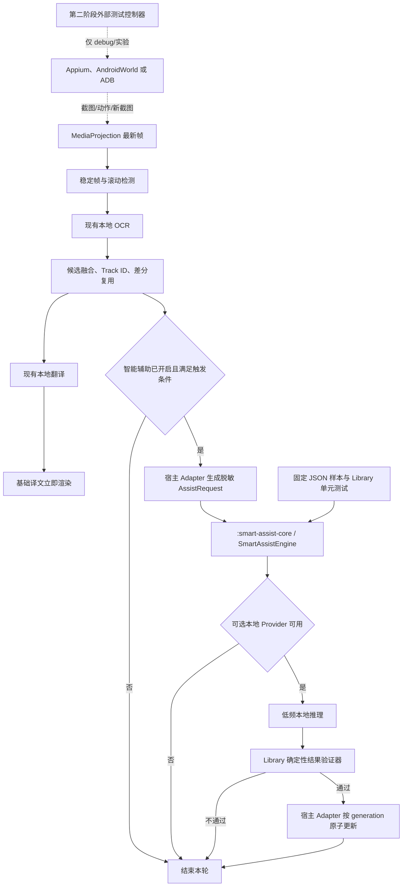

# ImageTranslateOCR 离线优先智能辅助规划实施文档

> 文档日期：2026-07-27
> 适用范围：Android 实时屏幕 OCR、翻译和译文悬浮展示
> 文档性质：规划基线，不代表相关智能模型已经接入
> 核心决策：保留现有本地实时翻译主链；智能辅助先作为独立 Library 完成功能和逻辑，再统一接入宿主 App；功能完全可选、默认关闭、优先离线；自动操作只在外部测试环境验证

## 1. 文档目的

本文把“本地实时 OCR + 可插拔低频智能层”的调研结论转换为可以实施、测试和验收的工程规划，解决以下问题：

1. 在不破坏现有实时翻译速度、稳定性和隐私边界的前提下，提高 OCR 结果复核、上下文组织、翻译一致性和译文展示质量。
2. 将智能能力设计为用户主动选择的可选功能；用户关闭后，应用行为必须与当前版本一致。
3. 明确“离线优先”的产品含义、模型交付方式、设备兼容性和无网络回退规则。
4. 将 Gemini Computer Use Mobile、Mobile-Agent、Appium 和 AndroidWorld 限定在合适的阶段，避免把研究型自动操作能力直接带入线上 APK。
5. 为后续编码、实机 A/B、隐私评审和是否继续投入提供统一的准入与退出标准。
6. 将智能辅助的业务协议、调度、规则、验证和测试数据从 Android 宿主中解耦，先形成可独立构建和验证的 Library，最后通过薄适配层统一集成。

## 2. 执行结论

### 2.1 总体结论

项目应采用“双路径、可旁路”的架构：

- **基础路径**：继续使用 `MediaProjection -> 稳定帧/差分 -> ML Kit OCR -> ML Kit 设备端翻译 -> 本地贴片渲染`。它始终可用，是唯一必须保证的生产主链。
- **智能辅助路径**：只在稳定视口、低置信度或用户明确请求时接收结构化 OCR 快照，生成候选修正、上下文分组、术语提示和布局建议。它不得阻塞第一版译文展示，也不得直接执行设备操作。
- **自动操作路径**：第二阶段仅通过 Appium/AndroidWorld、ADB 或云手机实验环境验证。生产 APK 不扩大无障碍读取或手势权限，不提供无人值守跨 App 点击。

实现顺序采用 **Library First**：

1. 先建立不依赖宿主 App 的 `:smart-assist-core` Library，完成协议、触发策略、确定性 Provider、结果验证、缓存和测试夹具。
2. 再建立可选的本地模型 Provider 模块，分别验证 Gemini Nano 和 LiteRT，不让模型依赖进入核心 Library。
3. Library 的单元测试、离线测试和固定样本验收通过后，才新增宿主 Adapter，一次性接入当前实时翻译链路。
4. 最终集成只负责数据映射、生命周期、用户设置和局部渲染，不把核心逻辑重新复制回 `:app`。

### 2.2 离线结论

离线必须作为默认和优先路径，但需要区分两个等级：

| 离线等级 | 定义 | 本项目目标 |
| --- | --- | --- |
| 运行时离线 | OCR、翻译和智能推理所需模型已准备后，断网仍可正常工作 | 第一阶段必须达到 |
| 首次安装零网络 | APK 安装后从未联网也具备全部模型 | 作为独立发行变体评估，不作为普通 APK 的默认承诺 |

当前 ML Kit OCR、翻译模型和部分端侧生成模型可能需要首次下载。产品文案必须写成“模型准备完成后可离线使用”，不能笼统承诺所有设备首次启动即完全离线。

### 2.3 模型结论

- Gemini Computer Use Mobile 是云端 GUI Agent，不能作为默认离线智能层。
- Mobile-Agent 只有在本地部署视觉模型、规划器和执行器时才属于离线方案；在普通手机上直接嵌入完整模型的资源成本需要单独验证。
- Gemini Nano/AICore 适合 App 自身处于最前台时进行本地上下文分析，但 ML Kit GenAI API 当前禁止后台推理。跨 App 悬浮翻译时，本 App 不是最前台，因此不能把 Gemini Nano 作为实时悬浮服务的唯一实现。
- 跨 App 离线智能增强优先评估 LiteRT/MediaPipe 或其他可控的端侧小模型运行时；不支持模型的设备必须无感回退到基础路径。
- 第一阶段应先完成与模型无关的接口、规则增强、快照、验证器和 A/B 基础设施，再选择具体模型，避免模型能力与业务链路强耦合。

### 2.4 Library 形态结论

第一阶段建议创建一个纯 Kotlin/JVM Library：`:smart-assist-core`。它是智能辅助能力的唯一公共入口，不依赖 Android UI、`MediaProjection`、无障碍服务、ML Kit 或宿主 App 类型。

模型运行时属于可选插件，不直接放进核心 Library：

- `:smart-assist-provider-gemini-nano`：Android Library，API 26+，只在兼容设备和 App 前台场景装配。
- `:smart-assist-provider-litert`：Android Library，承载跨 App 场景的本地模型实验。
- `:smart-assist-agent-lab`：debug/测试模块，承载 Appium、AndroidWorld、ADB 和 Mobile-Agent 的动作实验协议。

如果第一阶段只实现确定性增强，则仓库只新增 `:smart-assist-core`，其余 Provider 模块在进入相应里程碑时再创建，避免提前增加依赖和构建成本。

## 3. 当前基线与不变边界

### 3.1 已有能力

当前 Android 工程已经具备：

- 用户授权后的 `MediaProjection` 跨 App 屏幕采集。
- 移动检测、稳定帧等待、滚动位移估计、脏区/差分 ROI 和整屏回退。
- 中文与拉丁 OCR、候选融合、Track ID、翻译缓存和过期 generation 丢弃。
- ML Kit 设备端中英翻译、局部背景处理、译文贴片渲染和触摸透传。
- 结构化实机性能日志、同视口 A/B 和可见渲染复核。

### 3.2 不变边界

智能辅助实施不得改变以下边界：

1. 用户未开启智能辅助时，不加载智能模型、不创建网络请求、不增加权限、不改变 OCR/翻译结果。
2. 第一版可见译文由现有本地链路生成，不等待智能辅助完成。
3. 智能结果必须绑定宿主映射后的 generation、视口签名和 Track ID；过期结果一律丢弃。
4. 智能模型只产生建议，确定性验证器拥有最终否决权。
5. 不读取密码框、键盘建议、通知敏感内容等不必要数据；受保护屏幕继续遵守 `FLAG_SECURE`。
6. 不增加线上版本的 `canRetrieveWindowContent` 或 `canPerformGestures`。
7. 不把截图、OCR 文本或译文自动上传云端，也不设置静默云端回退。

### 3.3 名称澄清

当前设置中的“AI 自适应”实际是基于场景预设、帧变化和差分策略的确定性调度，并未调用生成式模型。智能辅助上线前建议将其改名为“自动适配”，避免与本规划中的“智能辅助”混淆。

## 4. 产品开关与用户控制

### 4.1 推荐设置结构

在“识别策略设置”中新增独立的“智能辅助”区域：

| 设置项 | 默认值 | 说明 |
| --- | --- | --- |
| 智能辅助 | 关闭 | 总开关；关闭时完全旁路 |
| 仅在本机处理 | 开启 | 默认锁定；只有用户主动选择在线实验时才能关闭 |
| OCR 疑难复核 | 开启 | 仅处理低置信度、冲突或小字候选 |
| 上下文翻译 | 开启 | 按段落/列表/控件组提供上下文，不逐帧调用 |
| 译文展示优化 | 开启 | 只提供布局提示，最终仍由现有渲染器约束 |
| 处理范围 | 仅稳定页面 | 不在滚动中推理 |
| 本地模型 | 自动选择 | 显示可用、需下载、不支持、空间占用和删除入口 |
| 在线实验能力 | 隐藏 | 仅开发者版本可见，默认关闭 |

### 4.2 状态显示

智能辅助必须明确显示以下状态，不能让用户猜测当前是否离线：

- `关闭`：只使用当前本地 OCR 与翻译。
- `本地模型未准备`：可选择 Wi-Fi 下载，基础功能不受影响。
- `本机处理中`：本轮没有发送数据。
- `设备不支持`：自动使用基础路径。
- `受系统前台限制`：Gemini Nano 当前场景不可调用，已使用其他本地能力或基础路径。
- `在线实验`：必须有持续可见标识，并单独说明发送的数据类型。

### 4.3 用户决策原则

- 应用不能因为检测到模型可用而自动开启智能辅助。
- 下载模型与开启功能是两个独立动作。
- 关闭智能辅助后，应取消正在进行的推理并清除只为本轮生成的图像裁剪和提示上下文。
- 卸载本地智能模型不能删除现有 OCR 和翻译模型，反之亦然。
- 云端能力不得作为本地模型失败时的自动兜底。

## 5. 目标架构



Library 与宿主之间只允许两个方向的数据流：宿主提交不可变请求，Library 返回不可变结果。Library 不回调 Activity、Service 或 View，也不持有宿主 Bitmap。

### 5.1 关键调度策略

智能辅助不是逐帧 Agent。它只在以下任一条件满足时触发：

1. 视口已经稳定且基础译文已提交。
2. OCR 候选共识、脚本判断或翻译有效性低于门限。
3. 同一段落存在多个 Track，需要上下文合并或术语统一。
4. 译文在现有边界中出现明显溢出、字号过小或多行拥挤。
5. 用户主动点击“智能优化本页”。

同一视口、同一配置和相同 OCR 文本的智能结果应缓存；滚动中停止新推理，并取消尚未提交的旧 generation。

## 6. 第一阶段：可选的离线识别与展示增强

### 6.1 阶段目的

在不执行任何设备动作的情况下，证明低频端侧智能层能够稳定提高以下至少一项指标，同时不显著损害实时主链：

- 低置信度 OCR 文本正确率。
- 段落、列表、菜单和控件的阅读顺序。
- 相同术语在同一视口中的翻译一致性。
- UI 短词在页面语境中的译义。
- 译文贴片的换行、字号和邻近图标避让效果。

### 6.2 功能拆分

#### A. OCR 疑难复核

输入仅包含低置信度候选、相邻文本、边界信息和必要的小尺寸局部裁剪。输出为候选文本和原因，不直接覆盖 OCR：

- 多模型文本冲突选择。
- 小字、深色背景、图标相邻文本的候选排序。
- 品牌、URL、代码和无需翻译内容标记。
- 断行、列表序号和被拆分控件文本的合并建议。

验证器至少检查脚本、长度、边界、编辑距离、相邻 Track 和原始 OCR 证据。无法证明更优时保留原结果。

#### B. 上下文组织与翻译提示

智能层不直接替换翻译引擎，而是先输出：

- 页面场景：阅读、聊天、商品、设置、代码、动态或未知。
- 文本组：标题、正文段落、列表、按钮组、导航、标签/值对。
- 源语言和目标语言建议。
- 不翻译词、品牌词、术语表和同义词约束。
- 每个 Track 的上下文组 ID 和阅读顺序。

随后仍由本地翻译引擎执行翻译。需要实验“带上下文整段翻译再映射回 Track”时，必须保留 Track 数量和顺序，并设置无法可靠回映时的逐 Track 回退。

#### C. 译文展示建议

智能层只提供语义级提示：优先单行、允许缩写、段落合并、标题强调、导航不合并等。现有渲染器继续拥有最终控制权：

- 不得超出屏幕或源区域安全边界。
- 不得遮挡已知图标和相邻文字。
- 不得将多个非相邻区域合并成一个大背景块。
- 字号低于可读下限时，回退到当前贴片策略或详情查看，不强行压缩。

### 6.3 Provider 选择与离线适配

| Provider | 运行位置 | 适用场景 | 限制与结论 |
| --- | --- | --- | --- |
| `DeterministicAssistProvider` | App 本地 | 场景规则、段落分组、术语和布局硬约束 | 所有设备可用，作为第一步和模型回退 |
| `GeminiNanoAssistProvider` | AICore 本地 | App 内图片审核、结果页优化、用户打开 App 后的批处理 | API 26+、设备名单和配额受限；本 App 不在最前台时不能推理，因此不作为跨 App 实时悬浮主 Provider |
| `LiteRtTextAssistProvider` | App 进程/本地运行时 | OCR 文本分组、术语、短上下文翻译提示 | 需要选择小模型并验证内存、温度、耗电和厂商 GPU 兼容性 |
| `LiteRtVisionAssistProvider` | App 进程/本地运行时 | 低置信度局部图像复核、页面类型和图标安全区 | 资源成本最高，只处理裁剪和稳定帧，首版可不发布 |
| `CloudAssistProvider` | 云端 | 对照实验 | 默认不实现生产入口；不能静默启用，不能作为离线失败兜底 |

具体模型不在架构层写死。Provider 必须先报告能力：

```kotlin
internal data class SmartAssistCapabilities(
    val available: Boolean,
    val offline: Boolean,
    val supportsText: Boolean,
    val supportsImages: Boolean,
    val supportsBackgroundExecution: Boolean,
    val requiresModelDownload: Boolean,
    val unavailableReason: String? = null
)
```

### 6.4 输入协议

建议统一为 Library 自有的不可变请求，避免 Provider 直接依赖 `Bitmap`、Android `Rect`、Activity 或 Overlay：

```kotlin
data class AssistRequest(
    val requestId: String,
    val generation: Long,
    val viewportSignature: String,
    val viewportWidth: Int,
    val viewportHeight: Int,
    val tracks: List<AssistTextTrack>,
    val evidence: List<AssistImageEvidence> = emptyList(),
    val options: AssistOptions
)

data class AssistTextTrack(
    val trackId: Long,
    val text: String,
    val bounds: AssistRect,
    val script: AssistScript,
    val consensusScore: Float?,
    val translatedText: String?
)
```

约束：

- 默认只发送 OCR 文本和几何，不传整屏位图。
- 图像复核只提供必要裁剪，裁剪在完成或取消后立即回收。
- 不把应用包名、通知内容或状态栏信息加入提示，除非某项功能明确需要且用户已知情。
- Provider 返回结果时必须携带原始 `requestId`、`generation` 和 `trackId`。

### 6.5 输出协议

```kotlin
data class AssistResult(
    val requestId: String,
    val generation: Long,
    val scene: AssistScene,
    val groups: List<AssistTextGroup>,
    val suggestions: List<AssistSuggestion>,
    val diagnostics: AssistDiagnostics
)

data class AssistSuggestion(
    val trackId: Long,
    val correctedText: String? = null,
    val translationHint: String? = null,
    val layoutHint: AssistLayoutHint? = null,
    val confidence: Float,
    val evidence: AssistEvidence
)
```

不要依赖模型自由文本直接驱动 UI。即使使用 Gemini Nano Structured Output，也要经过内部协议映射和验证；该 Structured Output API 当前仍为 Alpha，必须允许替换实现。

### 6.6 两阶段展示

推荐用户体验：

1. `T0`：页面停稳，现有链路开始 OCR/翻译。
2. `T1`：基础译文原子显示，用户已经可以继续阅读和滑动。
3. `T2`：智能辅助在后台处理低置信度区域。
4. `T3`：若视口未变化且建议通过验证，只更新受影响 Track；否则丢弃。

智能更新不得让全部贴片闪烁或重新出现。若局部更新可能造成整体布局跳变，应等待下一次完整稳定视口再应用。

## 7. 第二阶段：外部环境验证自动操作

### 7.1 阶段目的

验证 Agent 是否能够在受控 Android 环境完成“观察 -> 规划 -> 单步动作 -> 新截图 -> 结果校验”，不以线上用户设备自动化为目标。

### 7.2 实验架构

- **设备侧**：当前 APK、测试网页/应用、现有 MediaProjection 或 Appium 截图。
- **执行侧**：Appium UiAutomator2、AndroidWorld 或 ADB，运行在开发机/CI/模拟器。
- **规划侧**：Mobile-Agent 本地部署优先；Gemini Computer Use Mobile 只作为可选在线对照组。
- **记录侧**：保存每步截图哈希、OCR 结果、动作、坐标、意图、预期后置条件、执行结果和停止原因。

### 7.3 离线实验等级

| 配置 | 是否严格离线 | 用途 |
| --- | --- | --- |
| 本地 Mobile-Agent/本地 VLM + 本地 Appium/ADB + 模拟器 | 是，模型预置后可断网 | 首选自动操作研究路径 |
| AndroidWorld + 本地模型 | 是，模型和任务预置后可断网 | 可重复基准和回归 |
| Gemini Computer Use Mobile + 本地执行器 | 否 | 云端能力上限对照，不进入默认产品设计 |
| Mobile-Agent 云 API/云手机 | 否 | 快速验证，不作为离线结论证据 |

### 7.4 动作协议

第二阶段只允许一个动作一个闭环：

```kotlin
internal data class ProposedUiAction(
    val observationId: String,
    val type: UiActionType,
    val normalizedX: Int? = null,
    val normalizedY: Int? = null,
    val direction: ScrollDirection? = null,
    val intent: String,
    val confidence: Float,
    val expectedPostcondition: String,
    val risk: UiActionRisk
)
```

首轮允许列表：

- `SCROLL_FORWARD`
- `SCROLL_BACKWARD`
- `BACK`
- `WAIT`
- `STOP`

首轮禁止列表：

- 输入账号、密码、验证码和隐私数据。
- 发送消息、发布内容、授权登录。
- 下单、支付、订阅和签署协议。
- 删除、卸载、修改系统设置。
- 在动作后置条件无法验证时继续执行下一步。

### 7.5 基准任务

至少建立以下固定任务，每项包含成功条件和最大步数：

1. 连续滚动文章，直到检测到结尾，并输出已覆盖 Track 数。
2. 在长页面中找到指定关键词，只高亮不点击。
3. 滚动后验证译文已针对新视口刷新，旧 generation 未提交。
4. 在列表页找到指定文本所在行，报告坐标但不操作。
5. 遇到弹窗、登录或敏感页面时停止并返回原因。

### 7.6 与生产 APK 的隔离

- 自动操作代码放在 `debug`/测试源码集或独立工具仓库。
- Release Manifest 不声明新增无障碍能力。
- Release UI 不出现无人值守开关。
- Agent 测试失败不得改变生产路径的默认参数。
- 只有在技术指标、隐私、政策和用户价值全部通过独立评审后，才另立生产化方案；该决策不属于本规划的默认范围。

## 8. Library First 模块规划

### 8.1 第一阶段仓库结构

第一阶段只创建一个可独立构建的纯 Kotlin/JVM Library，不接入 `:app`：

```text
smart-assist-core/
├── build.gradle.kts
└── src/
    ├── main/kotlin/com/example/smartassist/
    │   ├── SmartAssistEngine.kt
    │   ├── SmartAssistEngineFactory.kt
    │   ├── api/
    │   │   ├── AssistRequest.kt
    │   │   ├── AssistResult.kt
    │   │   ├── AssistCapabilities.kt
    │   │   └── AssistProvider.kt
    │   ├── model/
    │   │   ├── AssistTextTrack.kt
    │   │   ├── AssistRect.kt
    │   │   ├── AssistTextGroup.kt
    │   │   └── AssistSuggestion.kt
    │   ├── engine/
    │   │   ├── DefaultSmartAssistEngine.kt
    │   │   ├── AssistTriggerPolicy.kt
    │   │   ├── AssistResultValidator.kt
    │   │   └── AssistResultCache.kt
    │   └── provider/
    │       └── DeterministicAssistProvider.kt
    └── test/
        ├── kotlin/com/example/smartassist/
        └── resources/fixtures/
            ├── reading/
            ├── settings/
            ├── mixed-language/
            └── code/
```

计划中的 Gradle 名称为 `:smart-assist-core`。它先以同仓库模块交付；当 API 稳定且确实需要在其他项目复用时，再决定是否发布本地 Maven artifact，不在第一阶段引入发布流程。

### 8.2 Library 依赖规则

核心 Library 必须遵守以下依赖方向：

```text
:app ---------------> :smart-assist-core
                          ^
optional providers -------|

:smart-assist-core -X-> :app
:smart-assist-core -X-> Android View/Service/Bitmap/Rect
:smart-assist-core -X-> ML Kit/LiteRT/Appium/网络 SDK
```

具体约束：

1. 不引用 `com.example.imagetranslate` 下的任何类。
2. 不使用 Android `Rect`，改用 Library 自有的 `AssistRect`。
3. 不使用 `Bitmap` 作为公共协议；图像证据使用明确尺寸、格式和生命周期的 `ByteArray`/只读载荷，并允许完全不传图像。
4. 不引用 `TranslationMode`、`LiveCaptureScenePreset` 等宿主枚举；Library 定义稳定、最小的领域枚举，由 Adapter 映射。
5. 不读取 `SharedPreferences`，不持有 `Context`，不申请权限，不发起模型下载。
6. 不依赖宿主线程和生命周期；调用方通过协程取消和 `close()` 管理任务。
7. 核心 Library 默认不得包含网络客户端，保证依赖图层面不存在静默云端回退。

### 8.3 Library 公共入口

宿主只面向一个 Facade，避免最终集成时理解内部 Provider 和验证规则：

```kotlin
interface SmartAssistEngine : AutoCloseable {
    fun capabilities(): AssistCapabilities

    suspend fun analyze(request: AssistRequest): AssistResult

    override fun close()
}

data class AssistRequest(
    val requestId: String,
    val generation: Long,
    val viewportSignature: String,
    val viewportWidth: Int,
    val viewportHeight: Int,
    val tracks: List<AssistTextTrack>,
    val options: AssistOptions
)
```

`SmartAssistEngine` 的稳定契约是：

- 相同请求和相同 Provider 版本应尽量产生可复现结果。
- `generation` 和 `requestId` 原样返回，供宿主拒绝过期结果。
- 分析失败返回类型化失败或空建议，不抛出会中断基础翻译链路的未处理异常。
- Provider 结果必须先经过 Library 内部验证器，宿主不会接收到未验证的自由文本动作。

### 8.4 Library 内先完成的功能

在接入 App 之前，Library 独立完成：

- 文本 Track 的上下邻接、列、行、段落和列表分组。
- 阅读顺序和场景分类的确定性基线。
- URL、代码、数字、品牌和无需翻译候选保护。
- OCR 修正建议的脚本、长度、编辑距离和置信度验证。
- 翻译提示、布局提示的结构化输出和边界验证。
- latest-wins 所需的请求标识、结果缓存键和取消语义。
- Provider 能力协商和不可用回退。
- 不含原文的指标事件结构。

不在 Library 中实现：屏幕采集、OCR 模型、实际翻译、Bitmap 裁剪、贴片绘制、悬浮窗、用户设置页面和设备操作。

### 8.5 固定样本与独立验收

Library 开发不等待 App 集成。使用脱敏 JSON Fixture 驱动单元测试：

```json
{
  "viewport": { "width": 1080, "height": 2400 },
  "tracks": [
    {
      "id": 1,
      "text": "Settings",
      "bounds": { "left": 48, "top": 120, "right": 310, "bottom": 184 },
      "script": "LATIN",
      "consensusScore": 0.92
    }
  ],
  "expected": {
    "scene": "SETTINGS",
    "groupCount": 1,
    "protectedTrackIds": []
  }
}
```

Fixture 只存放公开测试页面、人工构造内容或已脱敏数据。Library 验收命令应可以独立执行，例如：

```bash
./gradlew --offline :smart-assist-core:test
```

### 8.6 可选 Provider 模块

只有核心 Library 通过验收后，才按需要增加模型模块：

```text
smart-assist-provider-gemini-nano/  # Android Library，API 26+
smart-assist-provider-litert/       # Android Library，本地文本/VLM
smart-assist-agent-lab/             # debug/测试模块，外部 Agent 动作实验
```

Provider 模块实现 `AssistProvider`，但不能绕过核心验证器。Gemini Nano 与 LiteRT 不应同时成为 `:app` 的强制依赖；最终由产品 flavor、动态能力或独立发行变体选择装配。

### 8.7 最终统一集成

Library 和 Provider 达到验收门后，才在宿主新增薄适配层：

```text
app/src/main/java/com/example/imagetranslate/assist/
├── LiveSmartAssistAdapter.kt
├── SmartAssistPreferences.kt
├── SmartAssistSettingsMapper.kt
└── SmartAssistResultApplier.kt
```

Adapter 的职责仅包括：

- 把现有 OCR region/Track 映射为 `AssistRequest`。
- 把 Android `Rect` 映射为 `AssistRect`，必要时生成受控的局部图像载荷。
- 读取用户开关并选择已安装 Provider。
- 绑定 `captureGeneration`、视口签名、协程取消和 Service 生命周期。
- 把已验证结果映射为现有翻译提示或局部贴片更新。
- 将 Library 指标接入现有 `LiveRecognitionTelemetry`。

Adapter 不重新实现分组、验证、缓存和 Provider 路由。

### 8.8 最终接入点

| 现有模块 | 最终集成阶段的最小改动 |
| --- | --- |
| `settings.gradle.kts` | `include(":smart-assist-core")`，按选型增加 Provider 模块 |
| 根 `build.gradle.kts` | 声明 Kotlin/JVM 或 Android Library 插件，版本与现有 Kotlin/AGP 对齐 |
| `app/build.gradle.kts` | 依赖核心 Library；Provider 依赖按 flavor/变体选择 |
| `LiveCaptureSettings.kt` | 增加独立智能辅助设置，不混入采样频率和切分策略 |
| `BackgroundTranslatedImageProcessor.kt` | 基础结果完成后由 Adapter 构造请求，不直接依赖具体 Provider |
| `OneShotScreenCaptureService.kt` | 调度/取消 Adapter；基础渲染和失败回退保持现状 |
| `ActiveScreenCaptureOverlayController.kt` | 显示用户开关、模型状态和离线状态 |
| `ScreenTranslationOverlayView.kt` | 只应用经过验证的局部更新 |

### 8.9 最终集成准入门

满足全部条件后才能让 `:app` 依赖 Library：

1. `:smart-assist-core:test` 全部通过。
2. 固定样本中基础 OCR 文本没有被高风险规则错误修改。
3. Library 不依赖 Android、宿主 App、网络 SDK 或模型 SDK。
4. 离线依赖审计通过，默认依赖图中不存在云端客户端。
5. Provider 不可用、超时、取消和异常路径均返回基础回退结果。
6. 公共 API 已冻结一个版本，输入输出 Fixture 可作为契约测试。
7. 关闭功能时宿主无需调用 `analyze()`，不会产生 Library 运行开销。

## 9. 离线、隐私和模型治理

### 9.1 网络规则

1. 默认构建中，智能辅助运行期间不发出推理网络请求。
2. 模型下载必须由用户触发，可配置仅 Wi-Fi，并显示大小、状态和删除入口。
3. 断网时不得弹出“改用云端”的诱导确认；直接继续基础路径。
4. 在线实验 Provider 使用单独 build flag、设置页和数据同意，不复用普通“智能辅助”开关。
5. 自动化测试应在飞行模式或网络阻断条件下验证完整基础路径和本地辅助路径。

### 9.2 数据最小化

- 文本模型优先只接收 OCR 文本、Track ID 和归一化几何。
- 视觉模型只接收疑难区域裁剪，不接收完整屏幕。
- 日志记录哈希、长度、耗时、分数和错误码，不记录完整 OCR 原文。
- 本地缓存按视口签名和文本哈希索引，设置容量上限，会话结束后可清除。
- 不为智能辅助新增媒体库、通讯录、通知读取或无障碍节点权限。

### 9.3 模型交付策略

| 发行方式 | 优点 | 缺点 | 建议 |
| --- | --- | --- | --- |
| 首次按需下载 | APK 较小，用户可决定是否占用空间 | 首次需要网络 | 普通版本默认 |
| Play Feature/模型包 | 可拆分交付 | 仍依赖商店和首次下载 | 可评估 |
| 完全 bundled 离线包 | 首次安装后零网络 | APK/AAB、安装空间和升级成本高 | 企业或专项发行变体 |
| AICore 共享 Gemini Nano | 不占用应用独立模型存储，端侧隐私好 | 设备、前台状态和配额限制 | 只用于兼容场景，不作为唯一 Provider |

## 10. 性能与正确性验收

### 10.1 关闭状态验收

智能辅助关闭时必须满足：

- 与当前基线使用相同的 OCR、翻译和贴片结果。
- 不加载 Provider，不检查云端，不分配模型 Bitmap 裁剪。
- 不产生新增网络流量或权限提示。
- P50/P90 总耗时回归不超过 3%。
- 现有单元测试、仪器测试和实机 A/B 全部通过。

### 10.2 开启状态验收

首阶段建议采用以下准入门：

| 指标 | 初始目标 |
| --- | --- |
| 基础译文首屏时间 | 不晚于未开启辅助的基线 + 3% |
| 过期智能结果提交 | 0 |
| 错误修正接受率 | 人工真值集上净改善，不允许总体 CER/WER 退化 |
| 高置信度 OCR 被错误改写 | 0 或维持极低且可解释的上限，正式阈值由真值集确定 |
| 贴片越界/重叠新增 | 0 |
| 断网可用性 | 模型准备后 100% 完成，无云端回退 |
| 辅助失败影响基础路径 | 0 |
| 原始屏幕内容写入日志 | 0 |

智能辅助自身延迟不作为首屏阻塞指标。需要单独统计 `assistQueueMs`、`assistInferenceMs`、`assistValidationMs` 和局部重绘耗时，并按设备等级给出 P50/P90。

### 10.3 测试矩阵

至少覆盖：

- Android 7/8 基础回退、Android 13、14、15、16/17。
- AICore 支持、不支持、模型未下载、配额忙和后台禁止。
- 高中低端设备、2 种国产厂商、Pixel 和三星。
- 中文、英文、中英混排、代码、URL、品牌词和数字列表。
- 阅读、设置、聊天、商品、暗色页面、横屏和动态内容。
- 无网络、弱网、下载中断、低电量、温控和内存压力。
- 快速连续滚动、旋转、悬浮窗移动、会话结束和进程回收。

## 11. 自动操作实验验收

第二阶段至少记录：

- 任务成功率和每任务步数。
- 滚动终点判断准确率。
- 关键词定位召回率和坐标误差。
- 错误点击次数，首轮目标必须为 0。
- 敏感场景正确停止率，目标 100%。
- 每步规划、执行、页面稳定和后置条件验证耗时。
- 离线配置下的网络连接数，目标 0。

只有当固定任务集稳定通过后，才扩展 `TAP`；在此之前只验证滚动、返回、等待和停止。

## 12. 实施里程碑

### M0：Library 骨架与契约

- [x] 新建纯 Kotlin/JVM `:smart-assist-core`，此时 `:app` 不依赖它。
- [x] 建立 `SmartAssistEngine`、请求、结果、能力和 Provider 接口。
- [x] 定义 Library 自有 `AssistRect`、场景、脚本和失败类型，不引用 Android/宿主类型。
- [x] 建立依赖规则测试，禁止网络、ML Kit、LiteRT 和 `:app` 反向依赖。
- [x] 建立公开 API 的 JSON Fixture 和序列化/契约测试格式。

完成条件：`./gradlew --offline :smart-assist-core:test` 可独立执行；尚未修改实时录屏、OCR、翻译和悬浮层代码。

### M1：Library 确定性功能和逻辑

- [x] 实现场景、文本组、阅读顺序、品牌/URL/代码保护规则。
- [x] 实现 Trigger Policy、Result Validator、请求取消语义和结果缓存。
- [x] 实现 `DeterministicAssistProvider` 和 Provider 不可用回退。
- [x] 建立阅读、设置、混排、代码和异常输入 Fixture。
- [x] 输出 Library 级正确率、误修正、耗时和内存报告。

完成条件：Library 在固定样本上至少改善一项上下文指标，且不错误改写高置信度基线；仍不接入 `:app`。

实施结果：M0/M1 已于 2026-07-27 完成，离线执行 14 个测试全部通过；详细范围、指标和下一决策点见 [Smart Assist Core M0/M1 实施报告](smart-assist-core-m0-m1-implementation-report.md)。M2 及后续里程碑尚未启动。

### M2：可选端侧模型 Provider

- [ ] 以独立 Android Library 原型验证 Gemini Nano，并处理 `AVAILABLE/DOWNLOADABLE/UNAVAILABLE` 和前台限制。
- [ ] 以独立 Android Library 原型验证 LiteRT 文本小模型的跨 App 可行性。
- [ ] Provider 只实现 Library SPI，不能绕过核心验证器。
- [ ] 只在文本模型确有增益时评估局部图像/VLM Provider。
- [ ] 建立模型大小、内存、温度、耗电、延迟和质量报告。

完成条件：选择一个可装配的本地 Provider，或形成“确定性增强已足够、暂不发布生成模型”的明确结论；Provider 失败不影响核心 Library 测试。

### M3：统一接入宿主 App

- [x] 新增 `LiveSmartAssistAdapter`，集中完成宿主与 Library 类型映射。
- [x] 在悬浮窗设置中增加默认关闭的“离线智能辅助”开关并持久化。
- [ ] 在基础译文提交后按 generation 调用 Library，不阻塞首屏。
- [x] 接入取消、超时、过期丢弃、局部结果应用和现有遥测。
- [x] 将“AI 自适应”改名为“自动适配”。
- [ ] 建立关闭状态零开销、无网络和基线结果不变测试。

完成条件：集成改动只存在于 Adapter 和明确列出的接入点；Library 内无宿主代码，智能辅助关闭时现有链路行为不变。

当前进度：已完成确定性离线 Provider 的可选接入，详细行为和验证见 [离线智能辅助 App 接入报告](smart-assist-app-integration-report.md)。端侧模型 Provider 和“基础结果先展示、智能结果异步局部更新”的完整 M3 路径尚未实施，因此 M3 未整体完成。

### M4：外部自动操作实验

- [ ] 建立 `:smart-assist-agent-lab` 或独立工具模块。
- [ ] 建立 Appium/AndroidWorld 任务集和动作轨迹格式。
- [ ] 优先运行本地模型 + 本地执行器离线实验。
- [ ] 将 Gemini Computer Use Mobile 作为可选在线上限对照。
- [ ] 输出任务成功、错误动作、停止安全和性能报告。

完成条件：只形成研究结论，不修改 Release 权限和自动操作能力。

### M5：产品决策

- [ ] 根据质量、设备覆盖、安装体积、功耗和用户使用率决定是否默认展示智能辅助入口。
- [ ] 决定核心 Library 是否需要发布为本地 Maven artifact 或继续保持仓库内模块。
- [ ] 独立决定是否提供 bundled 离线发行变体。
- [ ] 独立评审任何设备操作产品化提案；默认结论仍为不进入 Release。

## 13. 主要风险与处置

| 风险 | 影响 | 处置 |
| --- | --- | --- |
| 模型幻觉修改正确 OCR | 错译和错误覆盖 | 只处理疑难候选，结构化输出 + 确定性验证 + 原结果回退 |
| 本地模型太慢或过热 | 影响滚动和电量 | 稳定帧低频触发、只处理裁剪、latest-wins、设备能力门 |
| AICore 后台禁止 | 跨 App 悬浮场景不可用 | Gemini Nano 只用于 App 前台；跨 App 评估自带运行时 |
| 设备支持碎片化 | 设置不可预测 | 能力探测、清晰状态、基础路径始终可用 |
| 首次模型下载被误认为在线推理 | 隐私信任下降 | 区分模型下载与推理，显示下载来源和离线状态 |
| Structured Output API 变更 | 接口升级成本 | 内部协议隔离，不让业务层依赖 Alpha 注解类型 |
| 智能更新造成闪烁 | 展示体验退化 | 基础结果先显示，只局部原子更新，过期结果丢弃 |
| 自动操作触发政策风险 | 无法上架或误操作 | 第二阶段外部测试隔离，不扩大 Release 无障碍权限 |

## 14. 最终决策建议

1. **立即实施 M0 和 M1，但不接入宿主 App**：先把协议、确定性功能、验证器、缓存和 Fixture 做成独立 `:smart-assist-core` Library，以独立测试结果决定是否进入集成阶段。
2. **M2 采用插件式双轨验证**：Gemini Nano 用于 App 内前台审核；LiteRT/MediaPipe 小模型用于跨 App 悬浮场景。模型 SDK 只存在于可选 Provider 模块，不进入核心 Library。
3. **M3 才统一集成**：宿主只新增一个薄 Adapter 和必要设置/渲染接入点，不在 `:app` 中复制 Library 逻辑；智能辅助关闭时现有链路保持不变。
4. **Gemini Computer Use Mobile 与 Mobile-Agent 不进入第一阶段 APK**：前者非离线，后者端侧资源和执行环境尚需验证。两者只通过统一 Provider/实验协议保持可插拔，不形成生产运行时依赖。
5. **自动操作坚持外置执行器**：Appium/AndroidWorld/ADB 完成实验，线上版本不新增无障碍内容读取或手势权限。
6. **用户始终拥有决定权**：智能辅助默认关闭；开启后默认仅本机处理；设备不支持、模型失败或用户关闭时，现有实时翻译链路继续正常工作。

因此，本项目的推荐产品定位不是“自动控制手机的 Agent”，而是“离线实时屏幕翻译工具 + 用户可选的本地智能复核与展示增强”。这个定位能够在识别质量、隐私、实时性、设备兼容和应用商店约束之间保持可执行的平衡。

## 15. 资料依据

- 当前实时链路、实机数据和后续 Track/脏区计划：[实时屏幕识别与悬浮翻译实验账本](live-screen-translation-experiment-log.md)
- 当前 OCR、翻译、截图和权限边界：[OCR 与截图识别完整报告](ocr-and-screenshot-recognition-complete-report.md)
- 当前整体架构与多语言/离线分析：[当前功能指导与技术调研报告](current-architecture-and-optimization-report.md)
- ML Kit Text Recognition v2：<https://developers.google.com/ml-kit/vision/text-recognition/v2>
- ML Kit On-device Translation：<https://developers.google.com/ml-kit/language/translation>
- Gemini Nano 与 AICore：<https://developer.android.com/ai/gemini-nano>
- ML Kit GenAI API、设备支持、配额和前台限制：<https://developers.google.com/ml-kit/genai>
- ML Kit Prompt API：<https://developers.google.com/ml-kit/genai/prompt/android/get-started>
- ML Kit Structured Output API：<https://developers.google.com/ml-kit/genai/prompt/android/structured-output>
- Google AI Edge Gallery/LiteRT 端侧样例：<https://github.com/google-ai-edge/gallery>
- Gemini Computer Use Mobile：<https://ai.google.dev/gemini-api/docs/computer-use>
- Mobile-Agent：<https://github.com/X-PLUG/MobileAgent>
- AndroidWorld：<https://github.com/google-research/android_world>
- Appium MCP：<https://github.com/appium/appium-mcp>
- Google Play Accessibility API 政策：<https://support.google.com/googleplay/android-developer/answer/17190352>
