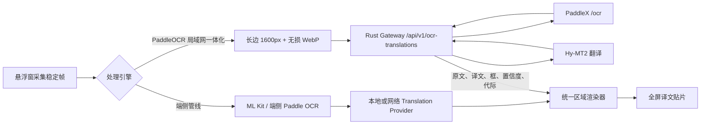

# PaddleOCR 局域网一体化引擎改造与实施记录

## 结论

当前项目适合增加独立的“采集图 -> 服务端 OCR+翻译 -> 区域译文回贴”引擎，但不应把它伪装成现有 `OcrEngine`。原接口只产出源文字，接入后仍会触发端侧翻译，形成重复翻译。此次实现新增一体化引擎契约，并保留原端侧管线为默认值。

实现基于 Git `6f131e01566354bd3f1128d4f34c3bba6f961c56` 的脏工作区分析，未改写既有用户改动。真实联调环境为 Apple Silicon M4、24GB 内存，Android 仪器测试设备为 Android 16 真机。

## 改造后流程



远程路径直接处理完整稳定帧，不执行端侧 OCR、端侧翻译、差分 OCR 或离线智能辅助。它仍复用现有的采集代际、视口变更检测、过期结果丢弃、贴片渲染和透明悬浮层，因此旧请求不能覆盖新画面。

## 可插拔边界

- `LiveOcrTranslationEngine` 定义一体化请求和统一区域结果。
- `LiveOcrTranslationEngineFactory` 负责解析某一引擎的配置并创建实例。
- `LiveOcrTranslationEngineRegistry` 负责按类型注册、配置变化重建和关闭活动实例。
- `PaddleNetworkOcrTranslationEngine` 只关心压缩、HTTP、鉴权、响应校验和坐标恢复。
- `BackgroundTranslatedImageProcessor` 只选择端侧管线或注册表中的一体化引擎，并把结果交给现有渲染器。

后续增加其他 OCR+翻译服务时，实现一个 factory 和 engine 并加入注册表即可；服务特有配置不进入图像处理器。

## 图像采集与压缩

网络引擎不会上传原始 RGBA 缓冲区，也不会把 Base64 落库或写日志：

1. 采集图长边不超过 1600px 时保持尺寸；超过时等比缩小到 1600px。
2. Android 11 及以上使用无损 WebP；旧版本使用兼容 WebP quality 100。
3. Base64 上限为 7MiB；超过时依次退到 1280px WebP、1280px JPEG quality 92，Gateway 请求体上限为 8MiB。
4. Gateway 将上传图交给 PaddleX，并设置检测最长边 1280px、最低识别分数 0.35。
5. 服务返回上传图坐标，Android 按比例映射回原始采集尺寸后再回贴。

1440x3200 屏幕会先变成 720x1600，像素量降为原来的 25%。这与 Paddle 检测侧 1280px 限制匹配，可降低端侧编码内存、局域网上行和服务端预处理成本。代价是极小文字可能损失细节，因此 1600px 是当前性能优先的起点，需用同屏样本继续验证检测召回率。

## 配置与安全

主程序“翻译设置”增加“PaddleOCR 局域网服务”入口，可配置：

- Gateway 服务基址，例如 `http://192.168.0.63:8090`；客户端固定追加 `/api/v1/ocr-translations`。
- 可选 Bearer Token。
- 是否将悬浮窗切换到一体化引擎。

悬浮窗设置也提供处理引擎选择；未配置地址时局域网选项禁用。Debug 允许访问 localhost 和 RFC1918 私网 HTTP，Release 只允许 HTTPS。PaddleX 原始 `8081` 端口只监听 `127.0.0.1`，局域网设备仅访问带鉴权、大小限制和超时的 Rust Gateway `8090`。

当前 Token 保存在应用私有 SharedPreferences 中且不写日志，适合可信开发局域网。生产环境应使用 HTTPS、短期令牌和系统密钥保护，不应把长期静态密钥或 PaddleX 原始端口暴露到公网。

## 失败与回退

- 配置缺失：设置层回退到端侧管线，菜单禁用远程选项。
- HTTP、超时、协议或尺寸校验失败：本次采集失败，不静默上传后再执行端侧双重计算。
- 页面已移动或 generation 变化：取消客户端连接并丢弃返回结果。
- 单区域翻译失败：计入失败数，其他成功区域继续展示。
- `PRESERVED` 区域不覆盖原文，避免标识符或不可翻译内容产生无意义贴片。

不做自动端侧回退是有意选择：它可避免一次交互同时承担网络超时和本地模型延迟，也让“图片是否离开设备”的行为保持可预测。用户可在悬浮窗中显式切回端侧管线。

## 实测

执行：

```bash
scripts/run-local-ocr-translation-stack.sh
scripts/verify-local-ocr-translation-service.sh
```

`docs/assets/2026-07-21-control-source.png` 的真实结果：

| 指标 | 结果 |
| --- | ---: |
| 输入尺寸 | 447x152 |
| OCR 区域 | 6 |
| 返回区域 | 6 |
| OCR | 1244ms |
| 翻译 | 807ms |
| 总计 | 2051ms |

传输和关联字段全部通过；Android 真机临时 HTTP 服务测试通过了 WebP、Bearer、固定路由、session/generation 回传和区域解析。1600px 尺寸策略与坐标映射由 JVM 单元测试覆盖；最终真机重跑在安装阶段被设备的 `INSTALL_FAILED_USER_RESTRICTED` 阻止，未进入测试代码。

质量仍需独立验收。该样本中短标签“分享/编辑/删除”翻译正确，但低置信度长句出现 OCR 误识，说明网络引擎已经可运行，不代表当前 Paddle medium 模型已达到全屏上线质量。

## 后续门槛

1. 用同一批 20-50 张原始屏幕图比较端侧 ML Kit、端侧 Paddle 和网络一体化引擎的检测召回、CER、框 IoU、P50/P95 和峰值 PSS。
2. 分别验证 1280、1600、1920 上传长边，选择小字召回与端到端延迟的平衡点。
3. 连续滚动 10 分钟，确认取消连接、服务端并发上限和旧 generation 丢弃行为。
4. 在 API 24/25 验证旧 WebP 编码，在 Release 验证 HTTPS 和证书配置。
5. 上线前增加短期令牌、反向代理 TLS、速率限制和请求并发指标。
