# 图片文字翻译与替换调校记录

本文档按时间顺序记录 OCR、翻译、文字擦除和译文回填的修改原因、效果与验证信息，供后续效果对比和问题回溯使用。

## 项目目标

将图片中的中文识别并翻译为英文，在尽量保留原图布局、背景、字号层级和文字颜色的前提下擦除原文并写入译文。

## 验证环境

| 项目 | 当前配置 |
| --- | --- |
| 操作系统 | macOS 26.5.2 arm64 |
| Android Studio JBR | OpenJDK 21.0.10 |
| Android Gradle Plugin | 8.7.3 |
| Gradle Wrapper | 8.9 |
| Kotlin | 2.0.21 |
| compileSdk / targetSdk | 34 / 34 |
| OCR | ML Kit Chinese Text Recognition 16.0.1 |
| 翻译 | ML Kit Translation 17.0.3 |
| 图像修复 | OpenCV 4.5.3 Telea Inpaint |
| 测试设备画面 | Pixel 3 模拟器截图 |

命令行构建：

```bash
JAVA_HOME="/Applications/Android Studio.app/Contents/jbr/Contents/Home" ./gradlew :app:assembleDebug
```

## 2026-07-20：处理链路稳定化

提交：`1d41503 fix(android): stabilize image translation pipeline`

### 原始问题

- OpenCV 和图片处理运行在主线程，大图处理可能阻塞界面。
- 使用原文字符串作为译文 Map 的键，相同文字可能互相覆盖。
- 译文被限制为单行，较长英文会缩小到难以阅读。
- 精确遮罩存在 Android `Rect` 与 OpenCV `Rect` 类型混用问题。
- 小尺寸 OCR 区域可能无法满足自适应阈值的 block size 要求。
- OpenCV 异步初始化失败时仍可能被标记为成功。
- ML Kit 回调可能在协程取消后重复恢复 continuation。

### 修改内容

- 将图片解码、缩放、OpenCV 修复和 Canvas 绘制移到后台线程。
- 将译文与每个 OCR 区域直接绑定。
- 初步增加 `StaticLayout` 多行排版和字号适配。
- 修正精确遮罩的坐标裁剪、动态阈值与 Mat 释放。
- 修正 OpenCV `BaseLoaderCallback` 初始化回调。
- OCR 最长边处理上限由 1024 px 提高到 2048 px。
- 升级构建工具并补齐完整 Gradle Wrapper，以兼容当前 JDK 21 环境。

### 构建异常及处理

旧的 AGP 8.2.0 + Gradle 8.5 在 JDK 21 下生成 Android JDK image 时失败：

```text
ModuleTarget is malformed: platformString missing delimiter: android
```

升级至 AGP 8.7.3 + Gradle 8.9 后，`:app:compileDebugJavaWithJavac` 和 `:app:assembleDebug` 均通过。

### OpenCV 运行时异常及处理

`Utils.bitmapToMat()` 输出四通道 RGBA Mat，而 OpenCV 4.5.3 的 `Photo.inpaint()` 不接受四通道输入：

```text
Unsupported format or combination of formats
8-bit 3-channel input/output images are supported in function 'icvInpaint'
```

矩形遮罩和精确遮罩路径均改为先执行 `COLOR_RGBA2RGB`，再将三通道 Mat 传给 `Photo.inpaint()`。修复后 Debug APK 构建通过。

## 2026-07-21：第一轮视觉效果分析

### 对比素材

原图：


稳定化版本输出结果：


### 截图确认的问题

1. 英文长度通常大于中文，但译文被限制在中文原始行框内，正文被缩小到约原字号的一半。
2. 所有译文统一使用粗黑字体，原图中的标题、正文和紫色强调文字层级丢失。
3. 原图存在充足横向空白，但排版没有利用这些空间。
4. 短 UI 文案缺少上下文，出现 `分享分享`、`Editor`、`Day removal` 等不自然结果。
5. 文字擦除后的背景整体较干净，本轮主要问题集中在译文排版和术语质量。

## 2026-07-21：可用空间排版调校

提交：`d58282b feat(rendering): preserve source text appearance`

### 修改内容

- 不再把译文严格裁剪在中文原始边界内。
- 从 OCR 区域左侧开始使用右侧空白，并检测、避让同行的其他文字区域。
- 向下最多扩展三个原文字高度，并避让下方具有水平重叠的文字区域。
- 字号以原文字高度为基准，优先保持约 `0.9 * OCR 区域高度`。
- 最小字号限制为约 `0.62 * OCR 区域高度`，避免无限缩小。
- 使用常规字重替代统一粗体。
- 从原图区域的背景主色与前景像素差异估算文字颜色。
- 增加常见 Android UI 术语映射，如 `Share`、`Edit`、`Delete`、`Auto-rotate`。
- 其他文本仍由 ML Kit 离线翻译模型处理。

### 当前验证结果

- `git diff --check`：通过。
- `:app:compileDebugKotlin`：通过。
- `:app:compileDebugJavaWithJavac`：通过。
- `:app:assembleDebug`：通过。
- APK：`app/build/outputs/apk/debug/app-debug.apk`。
- 新排版的真机截图：待复核。当前只能确认实现和构建有效，视觉改善程度需要使用同一张原图重新处理后比较。

### 后续重点观察

- 长段落是否仍因逐行翻译产生语义割裂或行间拥挤。
- 动态扩展区域是否会覆盖图标、开关或非文字控件。
- 浅色文字、彩色文字和复杂背景下的颜色估算是否稳定。
- 底部按钮等居中文字是否需要单独判断对齐方式。
- 精确遮罩在浅色文字、深色背景和纹理背景上的擦除完整度。
- 是否需要将 OCR 行按 ML Kit TextBlock 合并后翻译，以改善长段落上下文。

## 2026-07-21：第二轮控件标签调校

提交：`8390693 fix(rendering): constrain translated control labels`

### 局部对比素材

原图局部：


可用空间排版版本的输出：


### 截图确认的问题

1. `分享 分享` 未命中精确术语表；模型失败或 OCR 重复时直接保留了中文。
2. `删除` 被模型误译为 `Day removal`，说明孤立短词缺少 UI 上下文。
3. `Edit` 和 `Day removal` 的前景色偏灰，与原按钮白色标签不一致。
4. 第一轮自由空间扩展适合页面正文，但不适合胶囊按钮，长译文会侵入右侧控件。
5. 底部低对比度设置项存在中文残留或错误字符，需要用常见系统短语纠正低质量 OCR 输入。

### 修改内容

- 识别“深色背景 + 较短 OCR 区域”为控件标签。
- 控件标签保持原 OCR 中心和水平边界，不再使用页面级自由扩展。
- 控件标签使用居中排版；普通页面文字继续使用左对齐动态空间。
- 前景色提取改为优先选择与背景距离最大的像素，减少抗锯齿像素导致的灰色偏差。
- 深色背景无法可靠提取前景时回退为白色，浅色背景回退为黑色。
- 对较短 OCR 文本进行关键词归一化，包含 `分享`、`编辑`、`删除` 时分别固定为 `Share`、`Edit`、`Delete`。
- 增加 `连接或断开电源时唤醒` 的系统设置译法 `Wake on power connection`。

### 当前验证结果

- `git diff --check`：通过。
- `:app:compileDebugKotlin`：通过。
- `:app:assembleDebug`：通过。
- 修复后的按钮截图：待使用同一原图重新处理后补充。

### 下一轮观察项

- `Share`、`Edit`、`Delete` 是否在按钮内保持居中且不覆盖图标。
- 白色标签是否恢复足够对比度。
- 底部电源设置是否完整替换为英文且原中文被彻底擦除。
- 深色普通背景上的正文是否会被误判为控件标签。

## 2026-07-21：乱码过滤与深色背景 OCR 增强

提交：`96bddfb feat(ocr): filter noise and enhance dark text regions`

### 问题判断

- 单次原图 OCR 对深色按钮上的浅色文字识别不稳定，错误文字会继续进入翻译模型。
- 仅靠术语映射无法覆盖所有 OCR 错字。
- 英文翻译结果可能残留汉字或包含大量符号，继续回填会形成明显乱码。
- 旧流程在翻译失败后仍擦除原图并重绘 OCR 原文，可能把原本正确的像素替换成识别错误文字。

### 修改内容

- 保留原图 OCR，并增加一次整图反色 OCR。
- 反色候选仅用于原图判断为深色背景的区域，避免普通浅色页面产生重复识别框。
- 原图和反色结果按区域重叠率合并；深色背景优先采用反色结果，其他区域按文本质量评分选择。
- OCR 候选要求至少 60% 的非空白字符为字母、数字或汉字，过滤符号型噪声。
- 对长度不超过 8 的 UI 短词执行编辑距离匹配，允许一个 OCR 字符错误后仍匹配已知术语。
- ML Kit 翻译结果必须包含足够比例的字母或数字，并且不能残留汉字。
- 未通过翻译质量检查的区域不再进入遮罩和绘制步骤，直接保留原图像素。

### 取舍

- 双 OCR 会增加识别阶段耗时和一次同尺寸临时 Bitmap 的内存占用。
- 当前策略倾向于保守：无法确定译文质量时宁可保留中文，也不写入乱码。
- 文本质量规则只能过滤字符结构异常，无法判断语义正确性；常见 UI 术语仍需要结合实际样本迭代。

### 当前验证结果

- `git diff --check`：通过。
- `:app:compileDebugKotlin`：通过。
- `:app:assembleDebug`：通过。
- 本次构建实际使用本机未提交的 Gradle Wrapper 8.13 配置。
- 深色区域识别准确率和过滤效果：待使用相同样本重新截图复核。

### 下一轮观察项

- 双 OCR 后 `Share`、`Edit`、`Delete` 的源文字是否稳定。
- 是否仍出现英文中夹杂汉字或无意义符号。
- 被过滤区域是否正确保留完整中文原图，而不是留下擦除痕迹。
- OCR 阶段增加的耗时是否处于可接受范围。

## 2026-07-21：动态翻译、三路 OCR 与自适应擦除

提交：`e6d6b27 feat(pipeline): add adaptive OCR translation and inpainting`

### 动态翻译

- 新增 ML Kit Language Identification 17.0.6。
- 每段 OCR 文本先识别 BCP-47 源语言，目标语言当前统一为英文。
- 已经是英文的文字保持不变；其他 ML Kit 支持语言按需创建“源语言 → 英文”Translator。
- Translator 按语言对缓存，模型只在首次使用时下载，并在 Activity 销毁时统一关闭。
- 短文本返回 `und` 时根据是否包含汉字回退为中文或目标语言。
- 中文 UI 术语规则只在源语言为中文、目标语言为英文时启用。

### OCR 精度增强

- 原图 OCR：保留颜色和正常对比度信息，作为主要结果。
- 灰度高对比 OCR：增强低对比度正文和浅灰系统文字。
- 反色 OCR：增强深色按钮或深色背景上的浅色文字。
- 三路候选根据矩形重叠率、背景明暗和文本质量评分合并。
- 反色结果只允许补充深色区域，防止浅色页面出现重复 OCR 框。

ML Kit 中文 OCR 模型仍使用官方 bundled `16.0.1`。官方说明输入字符应至少约 16×16 px，超过约 24×24 px 通常不会继续提高准确率，因此本项目把改进重点放在对比度和极性预处理，而不是继续无上限放大图片。

### OpenCV Inpaint 增强

- 精确遮罩同时生成深色文字遮罩和浅色文字遮罩。
- 根据前景像素占区域面积的比例选择更接近文字笔画分布的遮罩。
- 对极小区域保留 Otsu 阈值回退。
- 选定遮罩后继续执行形态学膨胀和 Telea Inpaint。
- 解决旧实现只使用 `THRESH_BINARY_INV`、对白字深底擦除不完整的问题。

### 构建依赖整理

- `compileSdk` 调整为本机已安装且 AGP 8.7.3 支持的 API 35。
- 新增 `com.google.mlkit:language-id:17.0.6`。
- AndroidX Core 固定为 1.16.0，Lifecycle 固定为 2.9.2。
- Coroutines 固定为与 Kotlin 2.0.21 元数据兼容的 1.8.1。
- 移除源码未使用的 OkHttp 和 Gson，避免无关依赖提升 compileSdk 要求。

### 取舍与限制

- 三次 OCR 会明显增加识别耗时，峰值内存包含两个依次创建并释放的同尺寸临时 Bitmap。
- ML Kit Language Identification 对非常短的词可能返回 `und`，已增加文字脚本回退，但不能完全消除误判。
- 目标语言目前仍是英文；后续可增加 UI 选择器，将目标语言作为参数传入现有动态翻译接口。
- ML Kit 离线翻译适合常见表达，但不具备云端大模型的完整上下文能力。

### 当前验证结果

- `git diff --check`：通过。
- `:app:checkDebugAarMetadata`：通过。
- `:app:compileDebugKotlin`：通过。
- `:app:compileDebugJavaWithJavac`：通过。
- `:app:assembleDebug`：通过。
- 新 OCR 和遮罩效果：待使用相同样本进行真机截图对比。

## 2026-07-21：Android 依赖严格锁定

提交：`e658304 fix(build): strictly pin Android-compatible dependencies`

### 问题

依赖声明再次被升级为 AndroidX Core 1.19.0。该版本要求 compileSdk 37 和 AGP 9.1，而当前稳定构建环境为 compileSdk 35 和 AGP 8.7.3；Lifecycle 2.11.0 与 Coroutines 1.11.0 还会引入 Kotlin 2.2 元数据，与 Kotlin 插件 2.0.21 不兼容。

### 处理

- 使用 Gradle `strictly` 将 AndroidX Core 锁定为 1.16.0。
- 将 Lifecycle 严格锁定为 2.9.2。
- 将 Coroutines 严格锁定为 1.8.1。
- 严格约束会阻止传递依赖或 IDE 升级建议将构建静默提升到不兼容版本。

### 验证

- `dependencyInsight` 确认 `core-ktx:{strictly 1.16.0} -> 1.16.0`。
- 执行 `:app:clean :app:assembleDebug`，构建通过。

## 2026-07-21：深色按钮单点误识别修复

提交：`edc4ac2 fix(ocr): prevent bad dark-pass candidate overrides`

### 对比素材

原图局部：

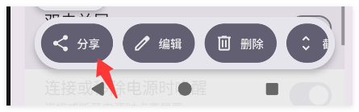

异常结果：

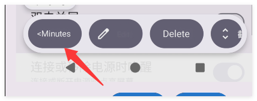

### 根因

同一组深色按钮中，`编辑` 和 `删除` 的反色 OCR 候选正确，但 `分享` 的反色候选错误。旧融合逻辑只要判断为深色区域，就无条件用反色候选覆盖原图或高对比度候选，导致原本可能正确的 `分享` 被替换为时间类文本，随后产生 `<Minutes`。这是候选融合优先级错误，不是单纯的翻译错误。

### 修改内容

- 反色 OCR 不再无条件覆盖深色区域的现有候选。
- 深色增强候选的质量分必须比现有结果至少高 0.08 才能替换。
- 普通高对比候选继续使用更严格的 0.15 提升门槛。
- 文本质量评分增加首尾异常符号惩罚。
- 中英文混合脚本按占比扣分，降低乱码候选优先级。
- 翻译结果以 `<`、`>`、`=` 或 `|` 开头时判定异常，保留原图区域。

### 验证

- `git diff --check`：通过。
- `:app:compileDebugKotlin`：通过。
- `:app:assembleDebug`：通过。
- 相同样本的修复后截图：待复核。

## 2026-07-21：短按钮标签低对比度修复

提交：`9fb8b4a fix(rendering): preserve contrast for short control labels`

### 对比素材

原图局部：

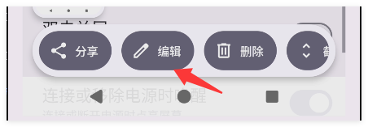

异常结果：

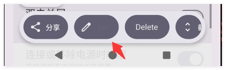

### 根因

`Edit` 已被识别和绘制，并非 OCR 返回空值。由于中文 `编辑` 的 OCR 框很紧，文字像素在框内占比较高，旧算法可能把文字灰阶误判为背景主色，最终估算出与深色按钮接近的前景颜色，视觉上表现为标签消失。

### 修改内容

- 文字前景继续从 OCR 框内部提取。
- 背景主色改为从 OCR 框外围约三分之一文字高度的环形区域采样。
- 外围区域不可用时才回退到框内背景统计。
- 前景与背景亮度差小于 90 时启用可读性保护：深色背景使用白色，浅色背景使用黑色。
- 本轮不修改 OCR 候选融合，避免影响上一轮 `Share` 误识别修复。

### 验证

- `git diff --check`：通过。
- `:app:compileDebugKotlin`：通过。
- `:app:assembleDebug`：通过。
- 修复后 `Edit` 标签截图：待复核。

## 2026-07-21：清晰短中文未替换修复

提交：`44a3432 fix(translation): classify short Han labels deterministically`

### 对比素材

原图局部：

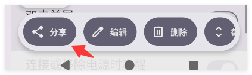

异常结果：

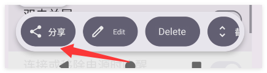

### 根因

`分享` 已被 OCR 正确识别，颜色和绘制也正常；未替换发生在翻译阶段。Language Identification 对两个汉字的样本可能返回 `und` 或误判为其他东亚语言，导致中文 UI 术语没有执行，后续模型失败后触发了“保留原图”保护。相邻的 `编辑`、`删除` 恰好被正确判定，所以表现不一致。

### 修改内容

- 目标为英文且文本包含汉字时，优先执行已知中文 UI 术语匹配。
- 汉字脚本 OCR 直接归类为中文，不再把极短文本交给统计语言识别。
- 拉丁文、韩文等不含汉字的内容继续使用动态 Language Identification。
- 将中文 UI 规则提取为单一函数，避免语言识别前后存在两套不同逻辑。

### 验证

- `git diff --check`：通过。
- `:app:compileDebugKotlin`：通过。
- `:app:assembleDebug`：通过。
- 修复后 `Share` 截图：待复核。

## 2026-07-21：`<分淳` 异常与 OCR 共识融合

提交：`6e43543 feat(ocr): fuse recognition passes by consensus`

### 问题

深色按钮上的 `分享` 被识别为 `<分淳`。其中 `<` 来源于相邻图标或笔画边缘，`淳` 是 `享` 的形近字误识。原有一个字符容错无法同时承担“删除边界符号”和“替换形近字”两个编辑操作。

### 修改内容

- 短中文匹配前移除首尾非字母、数字、汉字的噪声字符。
- `<分淳` 先归一化为 `分淳`，再以一个字符编辑距离匹配 `分享`。
- 原图、灰度高对比和反色 OCR 从顺序覆盖改为候选聚类投票。
- 候选按区域重叠率聚类，并综合原图可靠度、字符质量和跨分支文本相似度评分。
- 只有增强分支发现的浅色区域孤立候选会被过滤。
- 深色区域孤立候选可以保留，以维持白字深底的召回率。
- 多个识别分支结果一致时获得额外评分，降低单次偶发误识覆盖正确结果的概率。

### 验证

- `git diff --check`：通过。
- `:app:compileDebugKotlin`：通过。
- `:app:assembleDebug`：通过。
- `<分淳` 样本重新识别结果：待真机复核。

## 2026-07-21：移除写死 UI 翻译

提交：`7071ae9 refactor(translation): remove hardcoded UI translations`

### 修改原因

`TranslateManager` 中维护具体中文 UI 词语及固定英文结果，会让样本效果依赖业务词表，无法泛化到未知图片，也会掩盖真实 OCR 错误。需求调整为所有识别文本均使用自动语言识别和 ML Kit 翻译。

### 修改内容

- 删除 `uiTranslations` 及全部固定中文到英文映射。
- 删除 UI 关键词包含判断和基于词表的编辑距离纠错。
- 所有非目标语言文本统一经过源语言识别、模型准备和 ML Kit Translation。
- 保留不涉及语义的通用 OCR 清理：含汉字且不超过 10 个字符的短文本，会去除首尾 `<`、`>`、`=`、`|`、`·`、`•` 噪声。
- 英文目标结果的汉字残留、异常首字符和有效字符比例检查保持不变。

### 取舍

- 新图片不再依赖预置词表，行为更通用。
- 孤立的 UI 短词缺少上下文，ML Kit 离线模型可能给出不符合界面语境的译文。
- OCR 形近字错误不再由翻译词表修正，必须依靠三路 OCR 共识融合提高源文本准确率。

### 验证

- 已确认翻译模块不存在 `uiTranslations`、`Share`、`Edit`、`Delete` 等固定结果。
- `git diff --check`：通过。
- `:app:compileDebugKotlin`：通过。
- `:app:assembleDebug`：通过。

## 2026-07-21：缩放文档小字识别与长句翻译失败

提交：`226032f fix(pipeline): upscale small text before OCR`

### 对比素材

手机画面中的缩放文档：

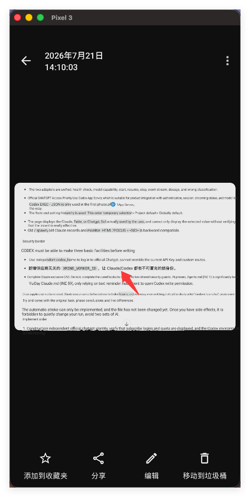

原始文档中箭头文字行：

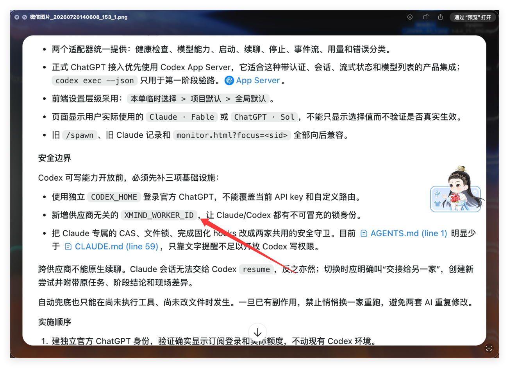

### 根因

原始文档中文字清晰，但在手机截图中整份文档被缩放到约 440 px 宽，实际 OCR 输入里的单字高度约为 5–8 px。当前流程只限制大图最长边，从不放大小图，未满足 ML Kit 建议的约 16×16 px 字符像素条件。技术文本还混有 `XMIND_WORKER_ID`、`Claude/Codex` 等标识符，模型可能保留少量源字符，旧的“英文结果不能含任何汉字”规则会使整行翻译失败。

### 修改内容

- 将 OCR 输入与 OpenCV/输出处理图分离。
- 最长边不足 1600 px 的图片，仅在 OCR 阶段临时放大，最大三倍且最长边不超过 3072 px。
- OCR 结束后按 X/Y 比例将识别框映射回处理图坐标，并立即释放临时 Bitmap。
- 长度不少于 16 的译文若首次质量检查失败，按中英文句号、分号、问号和感叹号切分后逐段重试。
- 英文结果允许最多 10% 汉字，兼容模型保留的少量专有内容；超过阈值仍判定失败。
- 只有翻译成功的区域进入 OpenCV 遮罩。失败区域保留原始像素，不执行擦除。

### 取舍

- 小图 OCR 的临时放大和三路识别会增加识别时间与峰值内存。
- 放大只服务于识别，最终图片尺寸不随 OCR 输入放大。
- 源图本身没有足够笔画像素时，插值放大不能恢复真实细节，只能帮助模型利用现有轮廓。

### 验证

- `git diff --check`：通过。
- `:app:compileDebugKotlin`：通过。
- `:app:assembleDebug`：通过。
- 箭头长句识别、翻译和擦除效果：待同图复核。

## 2026-07-21：原图分辨率替换与单点还原

提交：`fbc59e0 feat(editor): toggle translated regions on the original image`

### 目标

- 不再把最长边 2048 px 的 OCR 工作图作为最终输出。
- 在原图分辨率上执行 OpenCV 擦除和译文回填。
- 支持点击单个替换点查看擦除替换前的原始内容，并可再次切回译文。

### 修改内容

- OCR 临时图只用于识别；识别框按 X/Y 比例映射回原图坐标。
- OpenCV Inpaint、Canvas 绘制和保存均使用原始图片尺寸。
- 绘制时记录每段译文实际占用范围，并与原文字擦除范围合并。
- 结果图点击坐标通过 `ImageView.imageMatrix` 逆变换映射到原图坐标。
- 点击命中的最小替换区域时，从原图复制像素实现局部还原。
- 再次点击同一区域时，从译文区域快照恢复翻译效果。
- 保存操作直接保存当前可见状态，允许混合保留原文和译文。
- 为控制内存，不保留第三张完整译图，只为每个替换区域保存小尺寸译文 patch。
- 加载新图片或 Activity 销毁时主动回收区域 patch。

### 交互状态

- 首次点击译文区域：显示该区域原文。
- 再次点击同一区域：恢复该区域译文。
- 点击没有替换记录的位置：不修改图片。
- 外层滚动视图仍可截获拖动手势，单击用于区域切换。

### 取舍

- 原图分辨率 OpenCV 处理会比 2048 px 工作图使用更多时间和峰值内存。
- 区域还原采用矩形像素 patch，重叠译文区域可能存在相互覆盖，当前通过优先命中面积最小区域降低影响。
- 极高分辨率照片后续可增加“原图质量/内存优化”模式选择。

### 验证

- `git diff --check`：通过。
- `:app:compileDebugKotlin`：通过。
- `:app:assembleDebug`：通过。
- 原图分辨率、单点点击和保存当前状态：待真机交互复核。

## 2026-07-21：保守擦除与替换区域编号

提交：`5226c42 feat(editor): constrain inpainting and mark editable regions`

### 问题

- 精确遮罩的深色/浅色候选都不可信时，旧逻辑仍默认选择深色遮罩。
- 全局 5×5 膨胀会把文字附近的图标、边框或纹理纳入擦除范围。
- 虽然 OpenCV 理论上保持 mask 外像素，但旧代码直接把整张 Inpaint 输出转成 Bitmap，缺少逐像素不变的显式保证。
- 可点击还原区域没有视觉提示，用户无法快速判断哪些位置已被擦除重写。

### 擦除调整

- 精确遮罩候选的允许前景比例从 1%–55% 收紧为 1.5%–42%。
- 深色和浅色候选都不在可信范围时跳过该区域，不执行擦除。
- OCR 区域外围扩展从 3 px 收紧为 2 px。
- 形态学膨胀核由 5×5 收紧为 3×3。
- Telea 半径由 3.0 收紧为 2.0。
- 默认启用“精确遮罩”；矩形遮罩保留为手动备选。

### 原图合成保证

- 原始 RGBA Mat 克隆为最终合成底图。
- OpenCV 在 RGB 工作图上生成修复结果。
- 修复结果转换回 RGBA 后，只通过单通道文字 mask 复制到合成底图。
- mask 外像素直接来自原图，不使用 Inpaint 输出替代整张图片。

### 编号与还原提示

- 新增独立 `ReplacementOverlayView`，在替换区域左上角显示编号。
- 红色编号表示当前显示译文，绿色编号表示该区域已还原原文。
- 点击编号对应区域可在原文和译文之间切换。
- 新增“标号”复选框，可随时隐藏提示层。
- 编号层不绘制到 Bitmap，因此不会出现在保存图片中。

### 构建

- OpenCV 和 ML Kit 原生库使 Debug APK 约 246 MB，2 GB Gradle 堆在 Zipflinger 打包时发生 OOM。
- `org.gradle.jvmargs` 调整为 4 GB 后完整打包通过。

### 验证

- `git diff --check`：通过。
- `:app:compileDebugKotlin`：通过。
- `:app:compileDebugJavaWithJavac`：通过。
- `:app:assembleDebug`：通过。
- 编号位置、滚动手势和单点还原：待真机交互复核。

## 2026-07-21：图标误标与文字边界分离

提交：

- `a59f895 fix(markers): label only actual text replacements`
- `ded5d39 fix(ocr): isolate text elements from adjacent icons`

### 对比素材

原图：

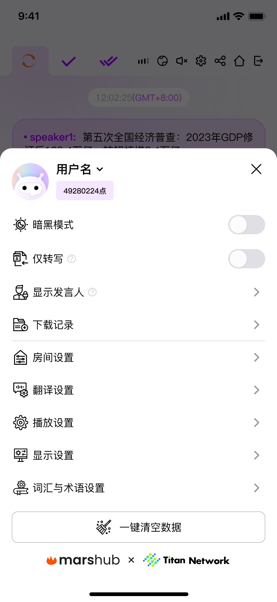

异常编号结果：

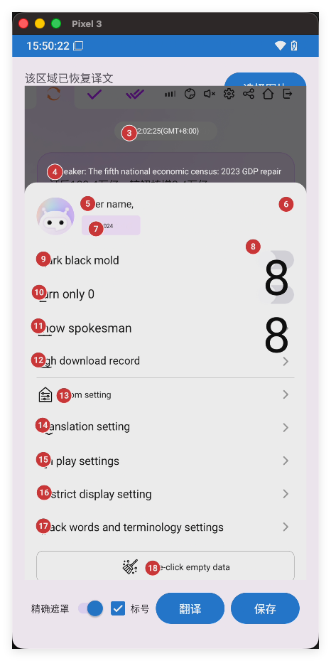

### 问题分类

1. 标号 8 对应图标或开关，被 OCR 当成单个拉丁字符/数字。翻译接口因源语言已经是英文而返回原文本，但旧 Activity 仍把调用成功视为翻译成功，进而擦除、重写并编号。
2. 标号 9–17 多数对应真实文字，但旧编号画在 OCR 框左上角，覆盖了图标或译文开头，形成类似缺字的视觉结果。
3. ML Kit 的 `Line.boundingBox` 有时同时包住前置图标、正文和尾部箭头。即使移动编号，使用整行框仍可能把图标纳入 OpenCV 遮罩。

### 实际替换判定

- 单个非汉字的拉丁字母、数字或符号 OCR 候选直接过滤。
- 译文去除首尾空白后必须与 OCR 原文不同，才标记为实际替换。
- 只有实际替换区域会进入 OpenCV mask、Canvas 绘制、还原 patch 和编号列表。
- 目标语言原本就是英文且模型返回原文本时，不擦除、不重写、不编号。
- 翻译失败和无需翻译分别统计，状态栏不再把无需翻译内容计为失败。

### 编号位置

- 编号半径由 10 dp 减少为 8 dp。
- 编号统一放在图片左侧提示栏，Y 坐标与替换行中心对齐。
- 编号不再覆盖前置图标和译文首字。

### element 级文字边界

- 从 ML Kit `Line` 下钻到 `Element`，不再直接使用整行文本和整行边界。
- 按横向间距将 elements 划分为连续组，超过约 0.4 个行高的空隙视为分组边界。
- 选择有效文字字符总量最大的组作为正文。
- 组首或组尾为孤立单字符、且与正文间距明显时，将其作为图标噪声剔除。
- 中英混合长句根据元素间距恢复必要空格。
- 最终 OCR 文本边界为正文 elements 的矩形并集，直接控制擦除、重写、点击还原和编号。

### 验证

- `git diff --check`：通过。
- `:app:compileDebugKotlin`：通过。
- `:app:assembleDebug`：通过。
- 标号 8 消失、9–17 图标保留和编号关联：待同图真机复核。

## 2026-07-21：标识符字号与品牌 Logo 保护

提交：`2797829 fix(translation): preserve identifiers and target-script brands`

### 对比素材

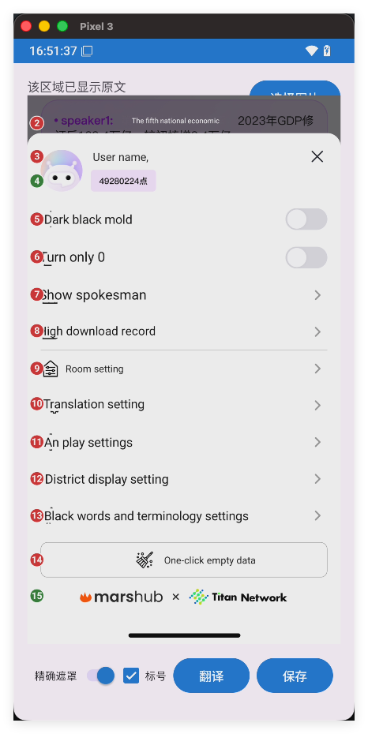

### 标号 4 分析

标号 4 对应 `49280224点`，内容以数字为主体，更接近用户名、账号或业务标识符，而不是自然语言。自动翻译会把末尾汉字扩展为英文单词，使字符串明显变长，原胶囊区域无法容纳时字号被缩小。对标识符执行翻译和重排在语义与视觉上都不合理。

### 标号 15 分析

Logo 中的 `marshub × Titan Network` 确实是可识别文字，因此 ML Kit OCR 检出它本身合理。但目标语言已经是英文，品牌专名不应因为短文本语言识别误判而再次翻译，也不应执行 OpenCV 擦除。该场景应作为“检测到文字但无需替换”处理。

### 修改内容

- 目标语言为英文时，完全由拉丁字母、数字和符号组成且包含拉丁字母的文本直接保留。
- 数字不少于 4 个、最多包含一个汉字、且数字占有效字符至少 65% 时，判定为标识符并保留。
- 保留发生在语言识别和模型翻译之前。
- 返回原文后，Activity 的“译文必须与原文不同”规则会阻止擦除、重写、patch 和编号。

### 取舍

- 规则保护英文品牌、代码、用户名、账号和产品名。
- 当前目标固定为英文，因此拉丁脚本的法语、西班牙语等内容也会被视为目标脚本并保留。若后续需要多语言到英文，应在 UI 中明确选择源语言，或增加高置信度语言检测模式。

### 验证

- `git diff --check`：通过。
- `:app:compileDebugKotlin`：通过。
- `:app:assembleDebug`：通过。
- 标号 4、15 消失且原图像素保持：待同图真机复核。

## 2026-07-21：译文样式估算与兼容字体

提交：`9c0b02c feat(rendering): infer source text style for translations`

### 能力边界

ML Kit Text Recognition 不返回字体名称、字号、字重、字距或斜体等排版元数据。位图也无法可靠反推出原字体文件，因此实现采用像素级样式估算，并使用 Android 字体 fallback，而不是声称恢复精确字体。

### 可估算样式

- 文字前景颜色：根据 OCR 框外围背景主色与框内高差异像素计算。
- 深浅背景：用于对比度保护和控件标签判断。
- 字号层级：根据每个 OCR 区域的字高恢复，标题和正文分别计算。
- 常规/粗体：根据文字框内与背景存在明显差异的笔画像素覆盖率估算。
- 对齐：深色控件标签保持居中，普通页面文字保持左对齐。
- 代码倾向：不含汉字并带下划线、URL 或代码字符组合时使用等宽 fallback。

### 字体选择

- 普通文本使用 Android `sans-serif`。
- 代码型文本使用 Android `monospace`。
- 根据笔画覆盖率选择 `NORMAL` 或 `BOLD`。
- 原字体缺失或译文包含原字体不支持的字符时，由 Android 系统字体链自动补齐。
- 含汉字的普通菜单不会被代码启发式误判为等宽字体。

### 字号调整

- 常规文字首选字号约为 OCR 字高的 1.12 倍。
- 粗体文字首选字号约为 OCR 字高的 1.05 倍。
- 最小字号提高到 OCR 字高的 0.68 倍。
- 最终仍受可用绘制区域约束，避免译文覆盖相邻内容。

### 无法可靠恢复的样式

- 精确字体家族和字体版本。
- 字体 hinting、字偶距和 OpenType 特性。
- 斜体角度、下划线、删除线和文字阴影。
- 渐变、纹理、描边和逐字多色效果。

### 验证

- `git diff --check`：通过。
- `:app:compileDebugKotlin`：通过。
- `:app:assembleDebug`：通过。
- 标题、正文、粗体和颜色的视觉匹配程度：待样本截图复核。

## 后续记录模板

每次调校追加以下内容，不覆盖已有记录：

```markdown
## YYYY-MM-DD：调校主题

提交：`<commit> <message>`

### 输入与现象
- 使用的原图/设备/模式
- 观察到的具体差异

### 根因判断
- 代码或算法层面的原因

### 修改内容
- 参数、算法和涉及文件

### 验证
- 构建结果
- 原图与结果图
- 已改善项和残留项
```
