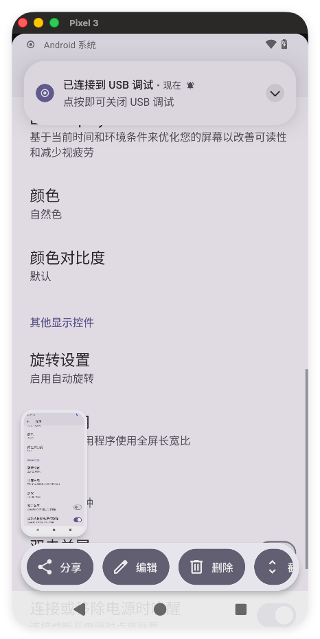
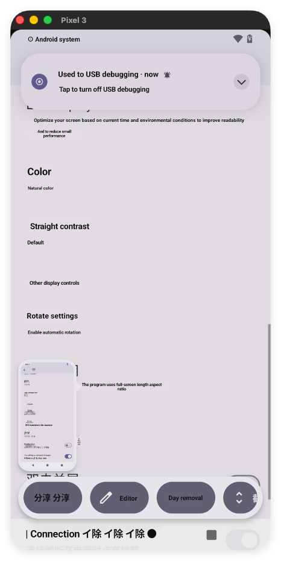
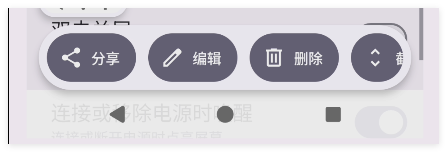
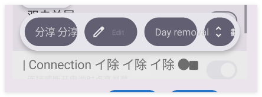

# 图片文字翻译与替换调校记录

本文档按时间顺序记录 OCR、翻译、文字擦除和译文回填的修改原因、效果与验证信息，供后续效果对比和问题回溯使用。

## 项目目标

将图片中的中文识别并翻译为英文，在尽量保留原图布局、背景、字号层级和文字颜色的前提下擦除原文并写入译文。

## 验证环境

| 项目 | 当前配置 |
| --- | --- |
| 操作系统 | macOS 26.5.2 arm64 |
| Android Studio JBR | OpenJDK 21.0.10 |
| Android Gradle Plugin | 8.7.3 |
| Gradle Wrapper | 8.9 |
| Kotlin | 2.0.21 |
| compileSdk / targetSdk | 34 / 34 |
| OCR | ML Kit Chinese Text Recognition 16.0.1 |
| 翻译 | ML Kit Translation 17.0.3 |
| 图像修复 | OpenCV 4.5.3 Telea Inpaint |
| 测试设备画面 | Pixel 3 模拟器截图 |

命令行构建：

```bash
JAVA_HOME="/Applications/Android Studio.app/Contents/jbr/Contents/Home" ./gradlew :app:assembleDebug
```

## 2026-07-20：处理链路稳定化

提交：`1d41503 fix(android): stabilize image translation pipeline`

### 原始问题

- OpenCV 和图片处理运行在主线程，大图处理可能阻塞界面。
- 使用原文字符串作为译文 Map 的键，相同文字可能互相覆盖。
- 译文被限制为单行，较长英文会缩小到难以阅读。
- 精确遮罩存在 Android `Rect` 与 OpenCV `Rect` 类型混用问题。
- 小尺寸 OCR 区域可能无法满足自适应阈值的 block size 要求。
- OpenCV 异步初始化失败时仍可能被标记为成功。
- ML Kit 回调可能在协程取消后重复恢复 continuation。

### 修改内容

- 将图片解码、缩放、OpenCV 修复和 Canvas 绘制移到后台线程。
- 将译文与每个 OCR 区域直接绑定。
- 初步增加 `StaticLayout` 多行排版和字号适配。
- 修正精确遮罩的坐标裁剪、动态阈值与 Mat 释放。
- 修正 OpenCV `BaseLoaderCallback` 初始化回调。
- OCR 最长边处理上限由 1024 px 提高到 2048 px。
- 升级构建工具并补齐完整 Gradle Wrapper，以兼容当前 JDK 21 环境。

### 构建异常及处理

旧的 AGP 8.2.0 + Gradle 8.5 在 JDK 21 下生成 Android JDK image 时失败：

```text
ModuleTarget is malformed: platformString missing delimiter: android
```

升级至 AGP 8.7.3 + Gradle 8.9 后，`:app:compileDebugJavaWithJavac` 和 `:app:assembleDebug` 均通过。

### OpenCV 运行时异常及处理

`Utils.bitmapToMat()` 输出四通道 RGBA Mat，而 OpenCV 4.5.3 的 `Photo.inpaint()` 不接受四通道输入：

```text
Unsupported format or combination of formats
8-bit 3-channel input/output images are supported in function 'icvInpaint'
```

矩形遮罩和精确遮罩路径均改为先执行 `COLOR_RGBA2RGB`，再将三通道 Mat 传给 `Photo.inpaint()`。修复后 Debug APK 构建通过。

## 2026-07-21：第一轮视觉效果分析

### 对比素材

原图：



稳定化版本输出结果：



### 截图确认的问题

1. 英文长度通常大于中文，但译文被限制在中文原始行框内，正文被缩小到约原字号的一半。
2. 所有译文统一使用粗黑字体，原图中的标题、正文和紫色强调文字层级丢失。
3. 原图存在充足横向空白，但排版没有利用这些空间。
4. 短 UI 文案缺少上下文，出现 `分享分享`、`Editor`、`Day removal` 等不自然结果。
5. 文字擦除后的背景整体较干净，本轮主要问题集中在译文排版和术语质量。

## 2026-07-21：可用空间排版调校

提交：`d58282b feat(rendering): preserve source text appearance`

### 修改内容

- 不再把译文严格裁剪在中文原始边界内。
- 从 OCR 区域左侧开始使用右侧空白，并检测、避让同行的其他文字区域。
- 向下最多扩展三个原文字高度，并避让下方具有水平重叠的文字区域。
- 字号以原文字高度为基准，优先保持约 `0.9 * OCR 区域高度`。
- 最小字号限制为约 `0.62 * OCR 区域高度`，避免无限缩小。
- 使用常规字重替代统一粗体。
- 从原图区域的背景主色与前景像素差异估算文字颜色。
- 增加常见 Android UI 术语映射，如 `Share`、`Edit`、`Delete`、`Auto-rotate`。
- 其他文本仍由 ML Kit 离线翻译模型处理。

### 当前验证结果

- `git diff --check`：通过。
- `:app:compileDebugKotlin`：通过。
- `:app:compileDebugJavaWithJavac`：通过。
- `:app:assembleDebug`：通过。
- APK：`app/build/outputs/apk/debug/app-debug.apk`。
- 新排版的真机截图：待复核。当前只能确认实现和构建有效，视觉改善程度需要使用同一张原图重新处理后比较。

### 后续重点观察

- 长段落是否仍因逐行翻译产生语义割裂或行间拥挤。
- 动态扩展区域是否会覆盖图标、开关或非文字控件。
- 浅色文字、彩色文字和复杂背景下的颜色估算是否稳定。
- 底部按钮等居中文字是否需要单独判断对齐方式。
- 精确遮罩在浅色文字、深色背景和纹理背景上的擦除完整度。
- 是否需要将 OCR 行按 ML Kit TextBlock 合并后翻译，以改善长段落上下文。

## 2026-07-21：第二轮控件标签调校

提交：`8390693 fix(rendering): constrain translated control labels`

### 局部对比素材

原图局部：



可用空间排版版本的输出：



### 截图确认的问题

1. `分享 分享` 未命中精确术语表；模型失败或 OCR 重复时直接保留了中文。
2. `删除` 被模型误译为 `Day removal`，说明孤立短词缺少 UI 上下文。
3. `Edit` 和 `Day removal` 的前景色偏灰，与原按钮白色标签不一致。
4. 第一轮自由空间扩展适合页面正文，但不适合胶囊按钮，长译文会侵入右侧控件。
5. 底部低对比度设置项存在中文残留或错误字符，需要用常见系统短语纠正低质量 OCR 输入。

### 修改内容

- 识别“深色背景 + 较短 OCR 区域”为控件标签。
- 控件标签保持原 OCR 中心和水平边界，不再使用页面级自由扩展。
- 控件标签使用居中排版；普通页面文字继续使用左对齐动态空间。
- 前景色提取改为优先选择与背景距离最大的像素，减少抗锯齿像素导致的灰色偏差。
- 深色背景无法可靠提取前景时回退为白色，浅色背景回退为黑色。
- 对较短 OCR 文本进行关键词归一化，包含 `分享`、`编辑`、`删除` 时分别固定为 `Share`、`Edit`、`Delete`。
- 增加 `连接或断开电源时唤醒` 的系统设置译法 `Wake on power connection`。

### 当前验证结果

- `git diff --check`：通过。
- `:app:compileDebugKotlin`：通过。
- `:app:assembleDebug`：通过。
- 修复后的按钮截图：待使用同一原图重新处理后补充。

### 下一轮观察项

- `Share`、`Edit`、`Delete` 是否在按钮内保持居中且不覆盖图标。
- 白色标签是否恢复足够对比度。
- 底部电源设置是否完整替换为英文且原中文被彻底擦除。
- 深色普通背景上的正文是否会被误判为控件标签。

## 2026-07-21：乱码过滤与深色背景 OCR 增强

提交：`96bddfb feat(ocr): filter noise and enhance dark text regions`

### 问题判断

- 单次原图 OCR 对深色按钮上的浅色文字识别不稳定，错误文字会继续进入翻译模型。
- 仅靠术语映射无法覆盖所有 OCR 错字。
- 英文翻译结果可能残留汉字或包含大量符号，继续回填会形成明显乱码。
- 旧流程在翻译失败后仍擦除原图并重绘 OCR 原文，可能把原本正确的像素替换成识别错误文字。

### 修改内容

- 保留原图 OCR，并增加一次整图反色 OCR。
- 反色候选仅用于原图判断为深色背景的区域，避免普通浅色页面产生重复识别框。
- 原图和反色结果按区域重叠率合并；深色背景优先采用反色结果，其他区域按文本质量评分选择。
- OCR 候选要求至少 60% 的非空白字符为字母、数字或汉字，过滤符号型噪声。
- 对长度不超过 8 的 UI 短词执行编辑距离匹配，允许一个 OCR 字符错误后仍匹配已知术语。
- ML Kit 翻译结果必须包含足够比例的字母或数字，并且不能残留汉字。
- 未通过翻译质量检查的区域不再进入遮罩和绘制步骤，直接保留原图像素。

### 取舍

- 双 OCR 会增加识别阶段耗时和一次同尺寸临时 Bitmap 的内存占用。
- 当前策略倾向于保守：无法确定译文质量时宁可保留中文，也不写入乱码。
- 文本质量规则只能过滤字符结构异常，无法判断语义正确性；常见 UI 术语仍需要结合实际样本迭代。

### 当前验证结果

- `git diff --check`：通过。
- `:app:compileDebugKotlin`：通过。
- `:app:assembleDebug`：通过。
- 本次构建实际使用本机未提交的 Gradle Wrapper 8.13 配置。
- 深色区域识别准确率和过滤效果：待使用相同样本重新截图复核。

### 下一轮观察项

- 双 OCR 后 `Share`、`Edit`、`Delete` 的源文字是否稳定。
- 是否仍出现英文中夹杂汉字或无意义符号。
- 被过滤区域是否正确保留完整中文原图，而不是留下擦除痕迹。
- OCR 阶段增加的耗时是否处于可接受范围。

## 后续记录模板

每次调校追加以下内容，不覆盖已有记录：

```markdown
## YYYY-MM-DD：调校主题

提交：`<commit> <message>`

### 输入与现象
- 使用的原图/设备/模式
- 观察到的具体差异

### 根因判断
- 代码或算法层面的原因

### 修改内容
- 参数、算法和涉及文件

### 验证
- 构建结果
- 原图与结果图
- 已改善项和残留项
```
