# 2026-07-29 屏幕翻译图文验证汇总报告

日期：2026-07-29

范围：全页/内容视口背景、普通悬浮窗连续交互、确定性渲染、羽化局部材料、Enhanced Light/Dark 连续交互

## 1. 最终结论

今天的验证完成了从“整页背景方案”到“Enhanced 局部羽化主题材料”的收敛：

| 最终问题 | 结论 | 产品决策 |
| --- | --- | --- |
| 能否取消译文字体自己的矩形背景 | 可以，但仍需在 OCR 区域下方使用局部材料遮盖原文，不能只绘制完全透明的译文字体 | Enhanced `alpha=1` 使用局部羽化主题材料，文字不再绘制独立底板 |
| 普通 `alpha=0.72` 能否达到相同效果 | 不能稳定达到。羽化只能消除硬边，无法消除浅色压灰、暗色抬灰形成的条带感 | 普通模式继续使用局部背景，主题色/高斯默认关闭 |
| 高斯模糊是否优于主题色 | 否。它能软化边界，但会保留模糊原文字形，Dark 模式更容易形成重影 | 仅保留人工实验，不作为推荐候选 |
| 全页主题色是否可用 | 技术可生成，但会删除图表、代码框、图标、系统栏和页面层级 | 通用翻译模式拒绝；只可能作为独立纯文本阅读器研究 |
| 全页高斯是否可用 | 会模糊非文字内容和系统/浏览器栏，并保留原文虚影 | 继续拒绝 |
| 当前最优候选 | Accessibility Enhanced `alpha=1` + 局部羽化主题材料 | 材料与交互子项通过；保持显式开启，不自动替用户启用 |

## 2. 验证演进与效果

| 阶段 | 代表效果图 | 关键指标 | 人工结论与决策 |
| --- | --- | --- | --- |
| 1. 全页与内容视口背景 | [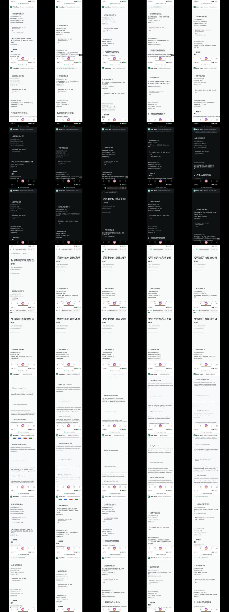](content-viewport-background-2026-07-29/matrix/theme-contact-sheet.jpg) 内容区主题色 50 视口 | 内容视口识别 50/50；Chrome 保持 100%；主题色 P90 195ms；高斯 P90 297ms | **A7 FAIL**。裁剪内容视口有效，但主题色删除图表和容器，高斯保留原文虚影。拒绝全页主题色/高斯。 |
| 2. 普通模式真实连续滚动 | [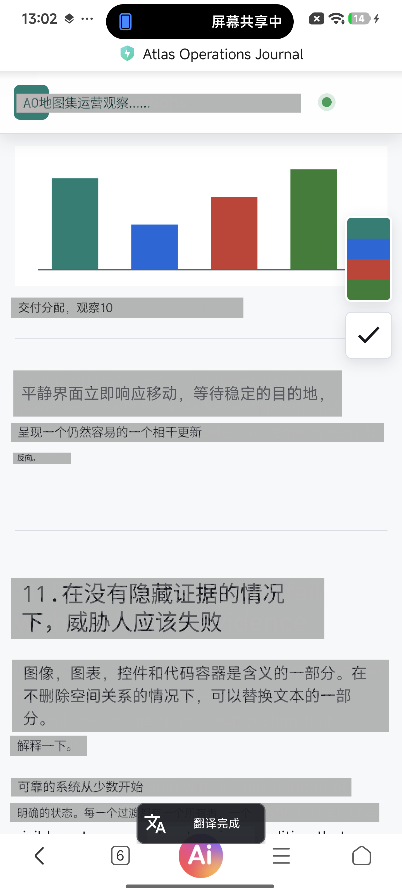](live-scroll-atomic-2026-07-29/run/checkpoints/scroll-15.png) 普通 `alpha=0.72` 第 15 次滚动 | 滚动 30/30；点击 30/30；隐藏 P90 25ms；提交 P90 1370ms；保护区 SSIM 1.0 | **A3/A4/A8/A9 PASS，A7 PARTIAL**。交互可靠，但局部灰色矩形、代码混排和段落切碎仍可见。 |
| 3. 确定性渲染上限 | [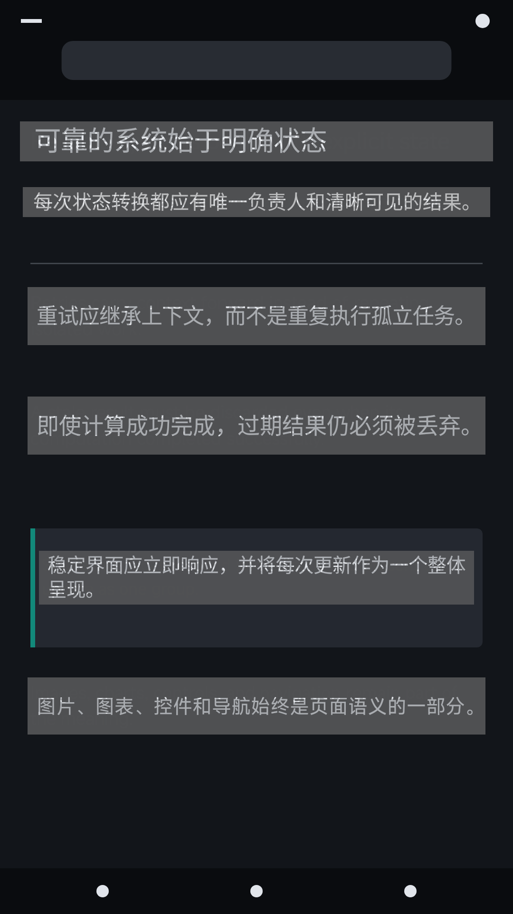](deterministic-overlay-rendering-2026-07-29/run/samples/011-dark-body-ideal.png) Dark 高准确输入 | 高准确输入 50/50；覆盖 100%；裁剪 0；最低对比度 6.41:1；渲染 P90 61ms | **机器门 PASS，A7 PARTIAL**。准确 OCR/翻译能解决漏译和异常长度，但不能解决普通模式材料贴片感。 |
| 4. 羽化材料 50 视口 | [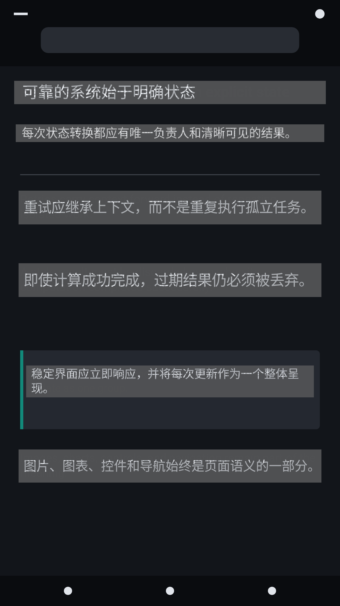](feathered-material-rendering-2026-07-29/run/samples/011-dark-body-standard.png) 普通 Standard  [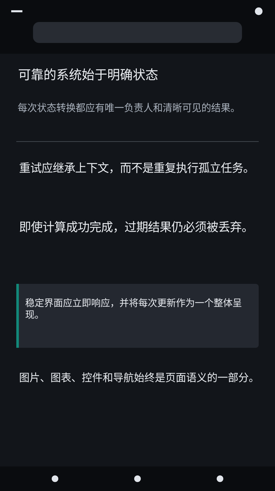](feathered-material-rendering-2026-07-29/run/samples/011-dark-body-enhanced_theme.png) Enhanced 羽化主题 | 五配置均 50/50；保护区/Chrome 保持 100%；Enhanced 主题最低对比度 5.79:1；材料变更面积 P90 3.29% | 普通羽化主题/高斯仍 **PARTIAL**；Enhanced 主题材料子项 **PASS**。高斯因原文模糊纹理降级。 |
| 5. Enhanced Light/Dark 真机交互 | [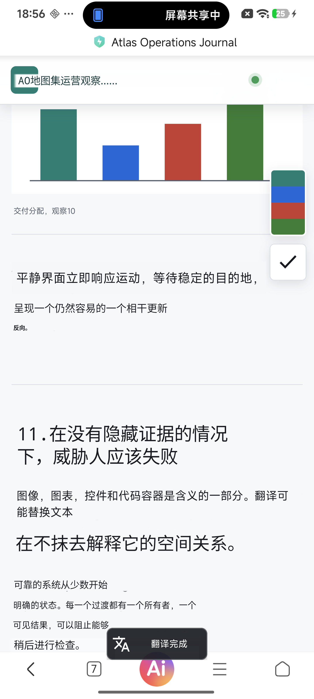](enhanced-theme-interaction-2026-07-29/run/light/checkpoints/scroll-15.png) Light  [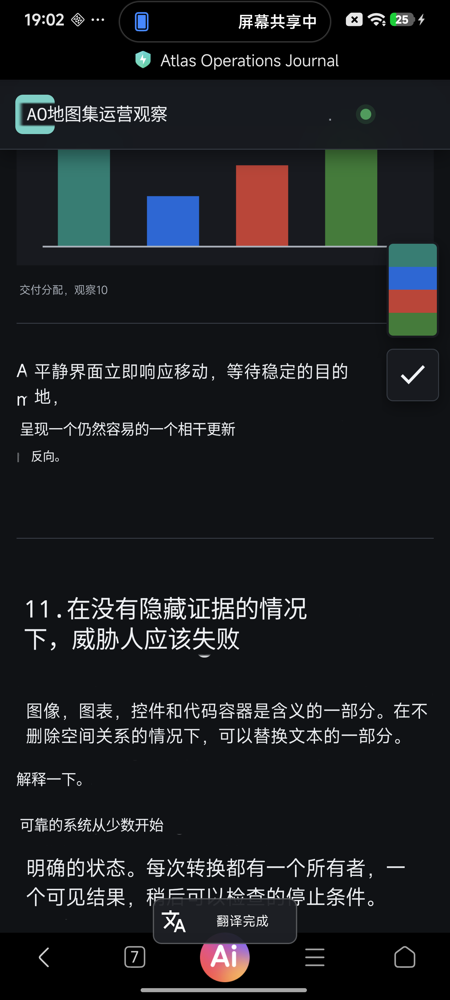](enhanced-theme-interaction-2026-07-29/run/dark/checkpoints/scroll-15.png) Dark | Light/Dark 滚动、点击、单隐藏、单完成、原子呈现均 30/30；隐藏 P90 18ms；提交 P90 1520/1546ms；退出残留 0 | **材料与交互链路 PASS**。代表帧无独立灰色文本底板，图表、标记和浏览器栏保持。A5/A6 语义质量不在本轮通过范围内。 |

## 3. 关键视觉对照

### 3.1 整页/内容区方案为何被拒绝

| 源页面 | 内容区主题色 | 内容区高斯 | 结论 |
| --- | --- | --- | --- |
| [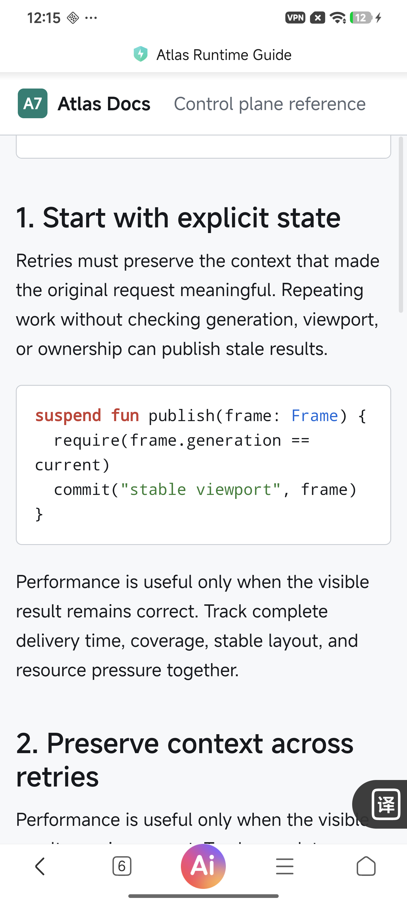](content-viewport-background-2026-07-29/matrix/samples/mixed-en-zh-source.png) | [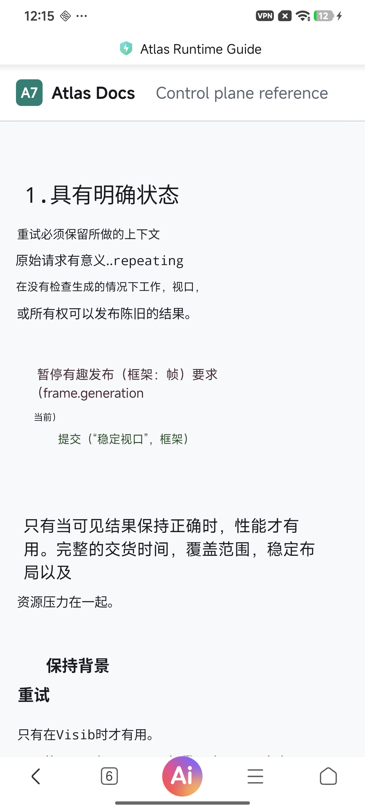](content-viewport-background-2026-07-29/matrix/samples/mixed-en-zh-theme.png) | [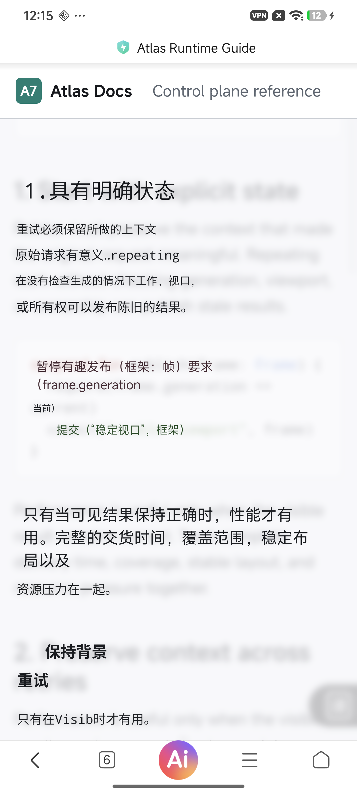](content-viewport-background-2026-07-29/matrix/samples/mixed-en-zh-blur.png) | 主题色抹除图表、代码容器和布局线索；高斯保留弱轮廓，但产生原文虚影。两者都不满足通用网页 A7。 |

### 3.2 普通模式与 Enhanced 主题材料

| 页面类型 | 普通 `alpha=0.72` | Enhanced `alpha=1` 羽化主题 | 结论 |
| --- | --- | --- | --- |
| Light 正文 | [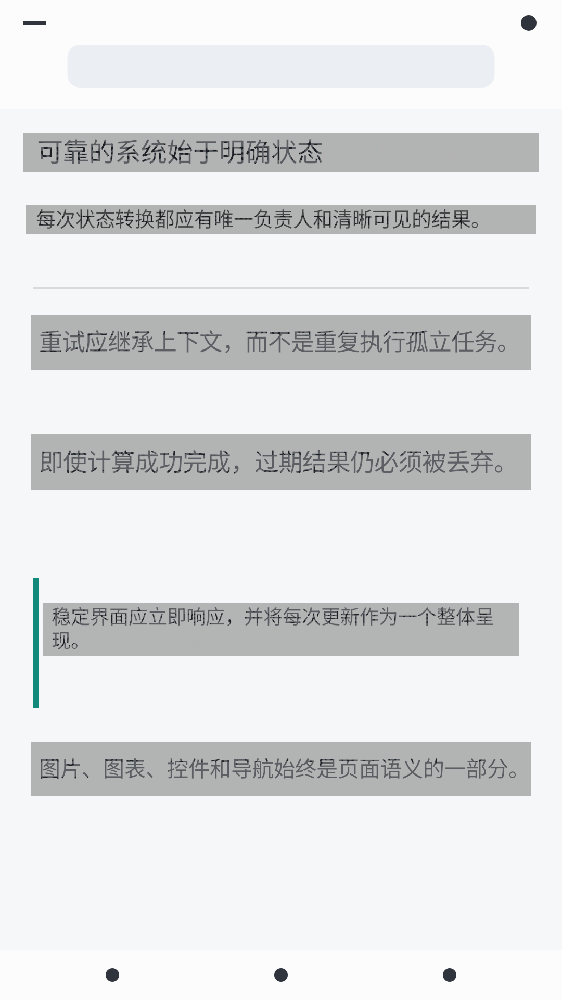](feathered-material-rendering-2026-07-29/run/samples/001-light-body-standard.png) | [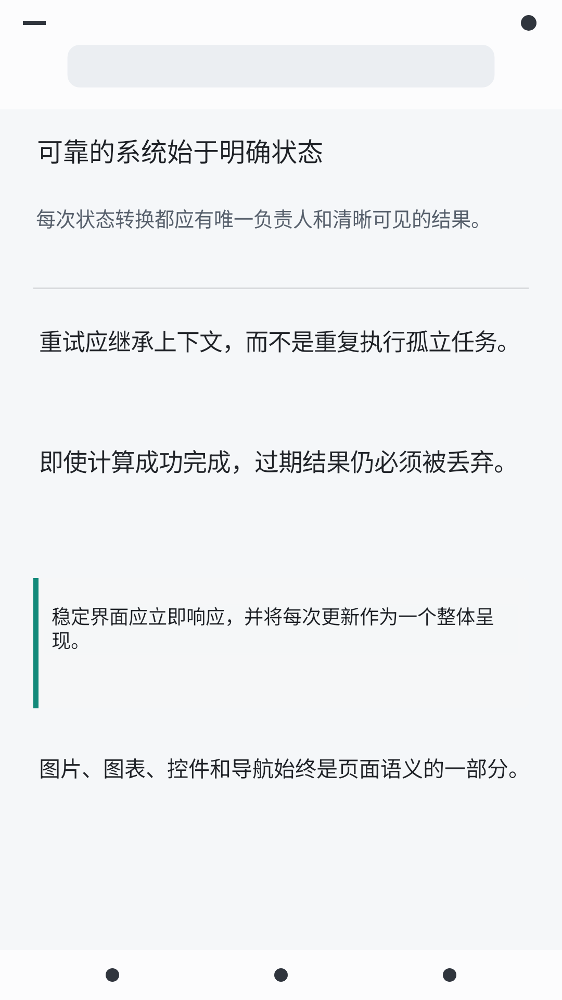](feathered-material-rendering-2026-07-29/run/samples/001-light-body-enhanced_theme.png) | 普通模式存在压灰条带；Enhanced 可准确重建浅色局部表面。 |
| Dark 正文 |  |  | 普通模式中灰底板更厚重；Enhanced 基本无独立底板。 |
| 图表混排 | [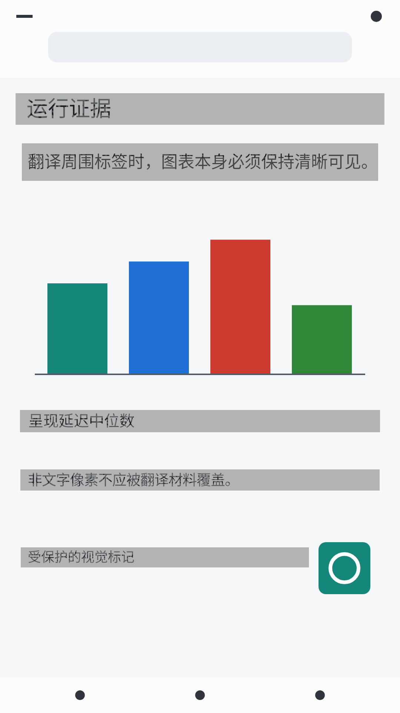](feathered-material-rendering-2026-07-29/run/samples/021-non-text-mixed-standard.png) | [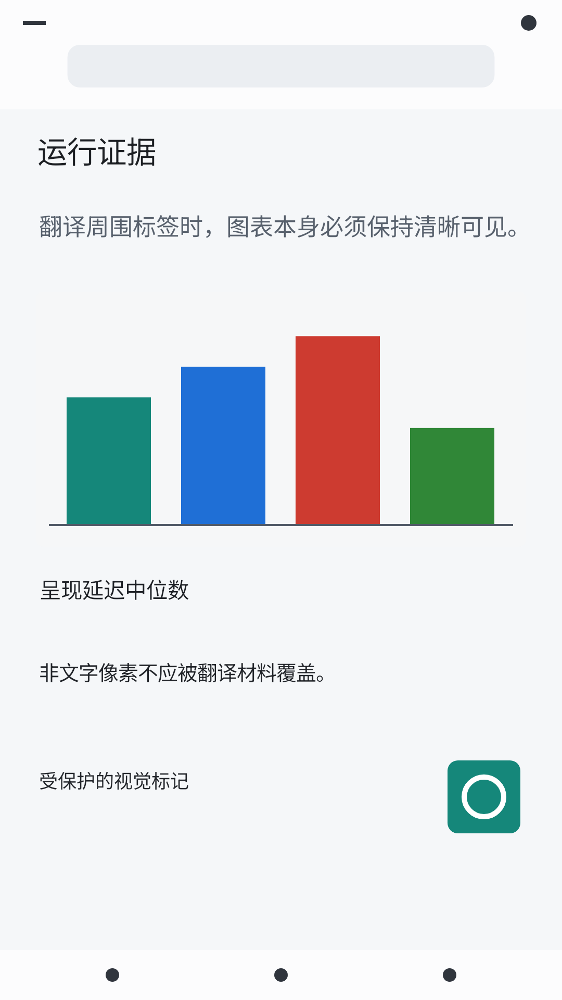](feathered-material-rendering-2026-07-29/run/samples/021-non-text-mixed-enhanced_theme.png) | Enhanced 材料只覆盖 OCR 文字区，图表和彩色标记不进入材料范围。 |

## 4. Light/Dark 最终验收表

| 验收项 | 标准 | Light | Dark | 结果 |
| --- | ---: | ---: | ---: | --- |
| 滚动有效 | 30 次位移均 >= 200px | 30/30 | 30/30 | PASS |
| 触摸透传 | 每轮底层网页点击计数 +1 | 30/30 | 30/30 | PASS |
| 单次隐藏 | 每轮恰好一次隐藏旧译文 | 30/30 | 30/30 | PASS |
| 单次完成 | 每轮恰好一次 OCR/翻译完成 | 30/30 | 30/30 | PASS |
| 原子呈现 | 单组、generation 有序 | 30/30 | 30/30 | PASS |
| 运动到隐藏 P90 | <= 150ms | 18ms | 18ms | PASS |
| 末次运动到提交 P90 | <= 2000ms | 1520ms | 1546ms | PASS |
| 15 秒静止自激 | 新增 OCR/隐藏 = 0 | 0 | 0 | PASS |
| 非文字保护 | 标记 SSIM >= 0.97，Chrome >= 0.99 | 1.0 / 1.0 | 1.0 / 1.0 | PASS |
| 原文切换 | 锚点漂移 <= 16px | 0px | 0px | PASS |
| 退出清理 | 悬浮窗口清零 | 2 -> 0 | 2 -> 0 | PASS |

## 5. 语义可信度边界

| 项目 | Light | Dark | 解释 |
| --- | ---: | ---: | --- |
| 当前链路累计失败区域 | 28 | 21 | 仍存在误识别、漏译或未生成区域 |
| 拉丁字符残留率 P90 | 3.77% | 5.13% | 代表帧仍可能出现短词混排 |
| A5 OCR 准确性 | 未评估 | 未评估 | 本轮没有人工标注 OCR 黄金集 |
| A6 翻译准确性 | 未评估 | 未评估 | 本轮没有人工语义评分，不因视觉通过而自动通过 |

高准确度 OCR + 翻译预计会改善漏译、混排和异常长度，但不会改变材料决策：普通 `alpha=0.72` 仍有贴片感；Enhanced `alpha=1` 局部羽化主题材料才是当前视觉候选。

## 6. 配置决策

| 配置 | 状态 | 使用边界 |
| --- | --- | --- |
| 普通 `alpha=0.72` + 局部 Standard | 保留 | 当前兼容性基线；局部背景继续存在 |
| 普通 `alpha=0.72` + 羽化主题 | 人工体验 | 硬边改善但灰条仍在，默认关闭 |
| 普通 `alpha=0.72` + 羽化高斯 | 不推荐 | 灰条和模糊残影同时存在 |
| Enhanced `alpha=1` + 羽化主题 | 首选候选 | 仅可信 Accessibility Overlay；显式开启；不自动替用户启用 |
| Enhanced `alpha=1` + 羽化高斯 | 不推荐 | 机器门通过但仍可见原文字形纹理 |
| 全页主题色 | 拒绝 | 除非未来作为独立纯文本阅读器重新定义 |
| 全页高斯 | 拒绝 | 不允许覆盖系统栏、浏览器栏和非文字内容 |

## 7. 下一阶段

| 优先级 | 验证场景 | 通过标准 | 停止/升级条件 |
| --- | --- | --- | --- |
| P0 | 第二台 OEM 设备复跑 Enhanced Light/Dark 各 30 轮 | A3/A4/A7 材料/A8/A9/A11 与 Xiaomi 一致通过 | 服务回收、窗口类型回退或触摸阻断出现一次即升级 |
| P0 | 20 个非滚动动态内容场景 | 折叠、轮播、局部刷新、视频区域更新不漏检且不自激 | 任一真实变化长期不更新或静止自激即先修检测链路 |
| P1 | 横屏、系统字体放大、分屏和旋转恢复 | 无裁剪、锚点漂移、窗口残留或字号低于门限 | 任一结构门失败即停止扩大 Enhanced 范围 |
| P2 | 高准确 OCR + 翻译黄金集 A5/A6 | 单独记录框准确率、漏译率、语义评分和排版影响 | 不以材料 PASS 替代语义结论 |

## 8. 原始报告索引

| 报告 | 覆盖内容 |
| --- | --- |
| [内容视口背景与 50 视口 A7 验证](content-viewport-background-2026-07-29/README.md) | 全页主题色可行性、内容视口裁剪、主题色/高斯拒绝依据 |
| [连续滚动、原子呈现与触摸透传验证](live-scroll-atomic-2026-07-29/README.md) | 普通模式真实 30 次滚动、点击、切换和 A7 PARTIAL |
| [确定性译文渲染 50 视口验证](deterministic-overlay-rendering-2026-07-29/README.md) | 隔离 OCR/翻译变量后的渲染上限和普通材料问题 |
| [羽化主题与高斯材料 50 视口验证](feathered-material-rendering-2026-07-29/README.md) | 普通/Enhanced、主题/高斯的五配置对照 |
| [Enhanced 羽化主题连续交互验证](enhanced-theme-interaction-2026-07-29/README.md) | 最终 Light/Dark 真机交互、材料、生命周期和清理结论 |

本汇总只引用原始证据，不替代各阶段的 JSON、逐轮数据和完整验收记录。
