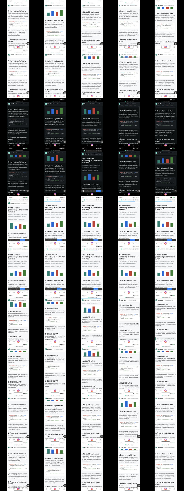
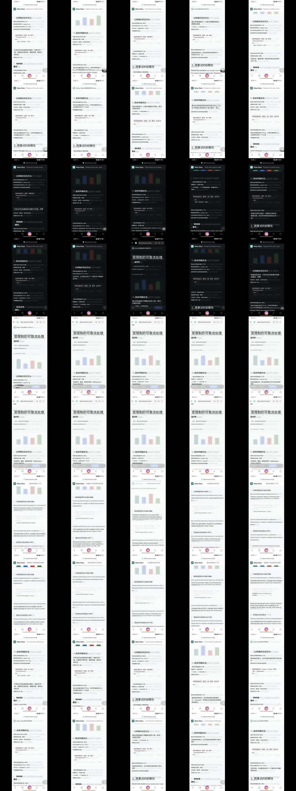

# 内容视口背景与 50 视口 A7 验证

日期：2026-07-29

设备：Xiaomi `23113RKC6C`，Android 16，1440x3200

范围：Debug A/B 与 Enhanced/Accessibility 可信悬浮层，`alpha=1`

## 结论

1. **全屏主题色技术上可行，但继续拒绝作为通用产品模式。** Light/Dark 控制组都能生成完整译文层，主题色合成分别为 36ms 和 34ms；代价是状态栏、浏览器栏、页面图表、代码框、图标及结构层级全部被纯色覆盖。
2. **裁剪到网页内容视口是有效优化。** 50/50 个受控视口都识别出内容边界，未触发兜底；系统栏和浏览器栏保持率为 100%。真实 Python 浅色页识别为 `y=392..2930`，Rust 暗色页识别为 `y=256..2982`。
3. **内容区主题色只适合显式的纯文本专注阅读模式。** 它在 Light/Dark 下干净、对比度稳定且比高斯更快，但仍会删除 Canvas 图表、代码容器、分隔线和布局线索，不能作为网页通用翻译背景。
4. **内容区高斯比主题色更能保留空间上下文，但当前仍不通过 A7。** 它保留约 6.23% 的边缘细节和图表轮廓，同时产生可见的原文虚影，并模糊非文字内容。
5. **本轮 A7 状态为 `FAIL`。** 静态视觉证据已发现持续混排、结构丢失和非文字污染；“译文整组原子出现”还需要实机录像，不能由静态截图替代。`semantic_quality_evaluated=false`，因此本轮也不认证 A5/A6。

生产决策不变：普通 `alpha=0.72` 继续使用局部背景；主题色和高斯默认关闭；全页实验只保留在 Debug，Enhanced 模式也不得自动开启。

## 为什么全屏主题色被拒绝

### 技术可行性

不透明可信悬浮层可以直接输出目标主题色。`alpha=1` 时无需读取底图做反向补偿，本轮增加常量填充快速路径。全屏控制组结果如下：

| 页面 | 主题色合成 | 高斯合成 | 主题色位图 | 主题色细节保留 |
| --- | ---: | ---: | ---: | ---: |
| Light | 36ms | 138ms | 18.43MB | 0% |
| Dark | 34ms | 142ms | 18.43MB | 0% |

普通悬浮窗不适用该结论。`alpha=0.72` 时最终通道为 `0.72 * overlay + 0.28 * source`，为任意底图精确重建接近纯白或纯黑的目标色，部分反算通道会超出 0..255，结果只能压灰或重新暴露原文。

### 产品拒绝原因

- 覆盖范围错误：全屏主题色连状态栏、浏览器地址栏、返回/主页等系统导航一起覆盖，用户失去退出和定位参照。
- 非文字语义丢失：图片、图表、代码容器、图标和分区全部变成纯色；网页被降级为不完整的 OCR 文本流。
- OCR 错误被放大：纯色删除原页面后，漏识别、错译和未翻译片段没有原内容可供核对，空洞与混排更明显。
- 页面层级丢失：标题、正文、代码、提示和侧栏只剩字号与坐标，原设计建立的容器、分隔和材质关系消失。

因此，全屏主题色只能被定义为用户主动进入、可随时查看原文的“纯文本阅读器”，不能叫作保持原页面一致性的翻译模式。

## 内容视口实现

内容视口由两类信号联合估计：

1. 对滚动前后截图计算逐行运动分数，找到真实滚动内容带。
2. 在候选带附近寻找跨屏水平结构分隔线，收紧浏览器栏和底部工具栏边界。
3. 低置信度时回退到屏幕高度的 8%..94%，并在报告中记录 `used_fallback=true`。
4. 先裁剪源图，再合成主题色或高斯背景，最终只提交一个内容区贴片；内容区以外像素不变。

对应实现与脚本：

- `LiveContentViewportPolicy.kt`
- `LiveRecognitionBenchmarkActivity.kt`
- `scripts/live-recognition-ab.sh`
- `scripts/live-background-a7-matrix.sh`

## 真实网页冒烟

使用真实官方文档验证裁剪边界：

| 页面 | 模式 | 内容边界 | 内容面积 | 兜底 | 观察 |
| --- | --- | --- | ---: | --- | --- |
| Python Control Flow | Light | `392..2930` | 79.31% | 否 | 浏览器和系统栏保持；主题色删除代码层级 |
| Rust Ownership | Dark | `256..2982` | 85.19% | 否 | 浏览器和系统栏保持；主题色删除页面结构 |

测试来源：<https://docs.python.org/3/tutorial/controlflow.html>、<https://doc.rust-lang.org/book/ch04-01-what-is-ownership.html>。

## 50 视口矩阵

这是可重复的受控 A7 视觉矩阵，不是有人工作业的真实语义黄金集。测试页包含真实 Canvas 位图柱状图、代码、品牌、UI、正文和明暗主题；每类 10 个视口。

| 类别 | 数量 | 视口兜底 | Chrome 保持 | 主题色 P50 | 高斯 P50 |
| --- | ---: | ---: | ---: | ---: | ---: |
| 竖屏亮色英译中 | 10 | 0 | 100% | 175ms | 256ms |
| 竖屏暗色英译中 | 10 | 0 | 100% | 173ms | 268ms |
| 横屏英译中 | 10 | 0 | 100% | 185ms | 275ms |
| 中译英 | 10 | 0 | 100% | 179ms | 267ms |
| 代码/品牌/UI 混排 | 10 | 0 | 100% | 192ms | 291ms |
| **整体** | **50** | **0** | **100%** | **P50 181ms / P90 195ms** | **P50 269ms / P90 297ms** |

其他机器指标：内容面积比例 P10 为 75.25%、P50 为 78%；源区域覆盖门、贴片覆盖门和产物生成门均为 50/50。这里的自动 `visual_pass` 只证明译文位图成功生成且贴片可见，不代表 A7 语义与页面一致性通过。

## A7 人工判定

| A7 子项 | 结果 | 证据 |
| --- | --- | --- |
| 内容视口与 Chrome 隔离 | PASS | 50/50 保持，0 次兜底 |
| Light/Dark 基本对比度 | PASS | 主题色和高斯均可读 |
| 无持续原文/译文混排 | FAIL | 横屏、中译英和混排样本可见原词、异常拼接及未完整替换区域 |
| 图片、图标和非文字区域无大面积污染 | FAIL | 主题色删除图表/代码容器；高斯只保留模糊轮廓 |
| 页面结构与空间关系 | FAIL | 主题色细节保留为 0%；高斯仅约 6.23% |
| 译文整组原子出现 | N/A | 静态截图不能证明，需要连续录像 |

综合状态：**A7 FAIL，不进入默认配置。** 自动覆盖门通过不能覆盖任一人工阻断项。

## 视觉证据

### 50 视口源页面

### 内容区主题色

### 内容区高斯模糊

全屏 Light/Dark 控制组位于 `fullscreen-control/`。它们明确显示整个系统与浏览器 Chrome 被纯色替换，是全屏主题色被拒绝的直接证据。

## 后续优化与停止条件

1. 保留普通模式 `alpha=0.72` 的局部背景和默认关闭，不扩大到整页。
2. Enhanced 模式优先尝试 OCR 文字形状遮罩加羽化，只弱化原文字形；图片、图标、图表、代码容器和导航保持原样。
3. 若继续高斯实验，目标是把原文虚影降到不可辨认，同时使用非文字保护掩码，而不是继续增加整页模糊强度。
4. 主题色只在明确的“纯文本专注阅读”入口继续研究，并必须提供原文瞬时切换、退出锚点和非文字占比保护门。
5. 下一轮必须补真实人工标注视口、A5/A6 语义评分、原子提交录像、30 次滚动与触摸透传；任一阻断项未通过即停止讨论默认开启。

机器汇总见 `matrix/summary.json`，逐视口报告见 `matrix/reports/`，人工判定见 `manual-a7-assessment.json`。
