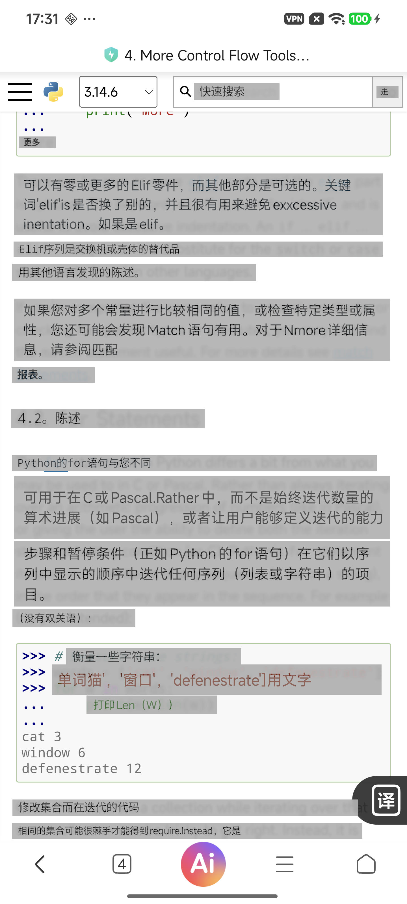
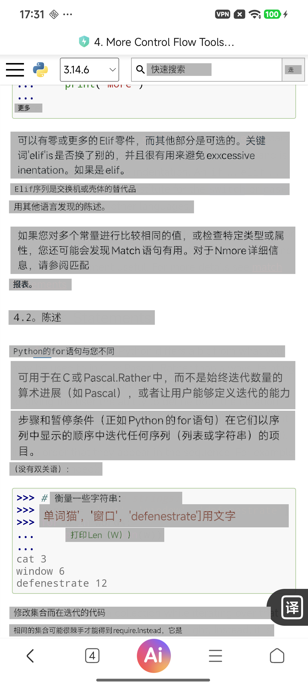
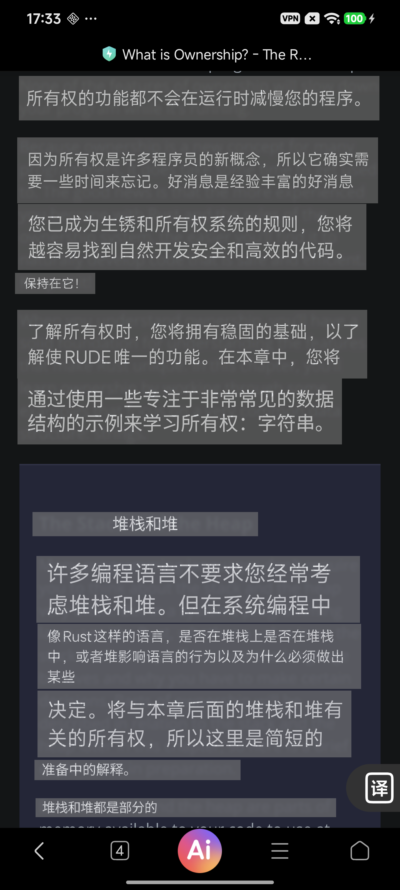
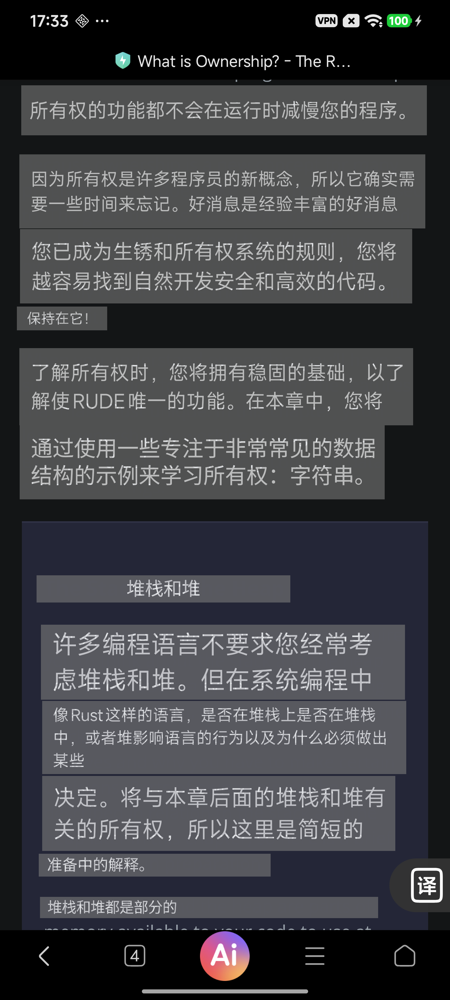

# 主题色与高斯模糊明暗页面验证

验证时间：2026-07-28

设备：Xiaomi `23113RKC6C`，Android 16，1440x3200

固定配置：英文 OCR、英译中、整屏识别、准确上下文、并行贴片渲染、Smart Assist 关闭。候选使用 `BLUR_TINT`，参考使用 `THEME_SURFACE`；每个页面执行一轮，因此时延只用于本轮冒烟，不形成 P50/P90 结论。

## 结果

| 页面 | 页面平均亮度 | 模糊贴片 | 源区域召回 | 贴片召回 | 细节残留 | 模糊渲染 | 主题色渲染 | 模糊开销 | 自动门 |
| --- | ---: | ---: | ---: | ---: | ---: | ---: | ---: | ---: | --- |
| 浅色 Python Control Flow | 220.31 | 18 | 100% | 100% | 3.05% | 166ms | 150ms | 10.67% | PASS |
| 暗色 Rust Ownership | 46.61 | 12 | 100% | 100% | 2.41% | 145ms | 132ms | 9.85% | PASS |

页面平均亮度使用 FFmpeg `signalstats.YAVG` 对滚动后原始截图计算，浅色 220.31、暗色 46.61，确认两组不是仅依赖页面名称判断主题。高斯候选与主题色参考的全屏 SSIM 分别为 0.9965 和 0.9986，说明差异主要集中在译文贴片纹理而不是页面结构。两轮 `visual_render_pass`、`background_detail_gate_pass` 和 `background_performance_gate_pass` 均为 `true`，贴片外变化采样数均为 0。两轮 `semantic_quality_evaluated=false`，本结果不证明译文语义正确。

## 浅色页面

高斯模糊候选：

主题色参考：

原始证据：[滚动前截图](light/baseline.png)、[滚动后截图](light/current.png)、[设备最终显示](light/candidate-displayed.png)、[单轮报告](light/report.json)、[原始结果](light/results.jsonl)。

## 暗色页面

高斯模糊候选：

主题色参考：

原始证据：[滚动前截图](dark/baseline.png)、[滚动后截图](dark/current.png)、[设备最终显示](dark/candidate-displayed.png)、[单轮报告](dark/report.json)、[原始结果](dark/results.jsonl)。

## 视觉结论

1. 高斯模糊能够保留弱页面纹理，主题色参考更平整；两者均没有污染贴片外区域。
2. 浅色页高斯候选可见少量被模糊的底层文字和代码颜色，虽通过 20% 细节门，但不一定比主题色更干净。
3. 暗色页的译文块仍明显偏中灰，与近黑页面形成较强块状反差。根因是默认模式的窗口 Alpha 为 0.72，可补偿目标色通道被限制在 72-183；该问题不能仅靠当前高斯半径解决。
4. 当前两页只证明渲染机制和自动门正常，不满足 50 个黄金视口的 A7 产品验收矩阵，背景体验仍应保持默认关闭。
