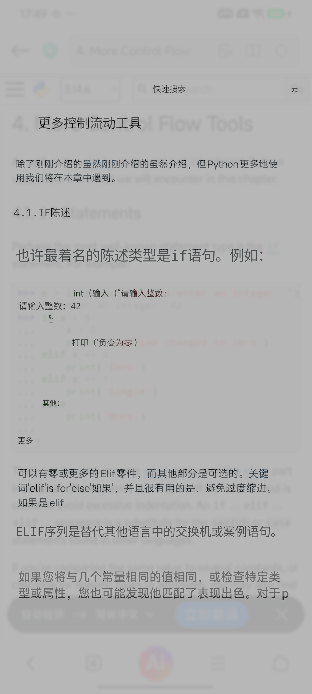
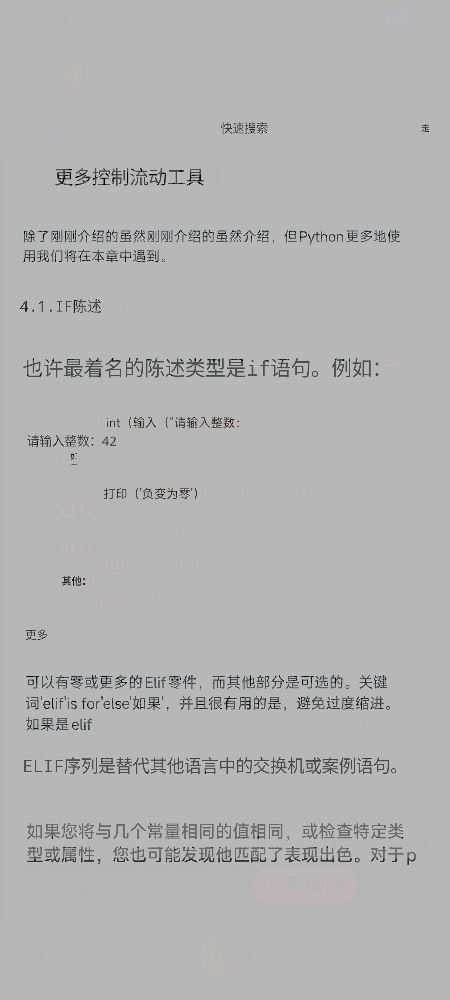
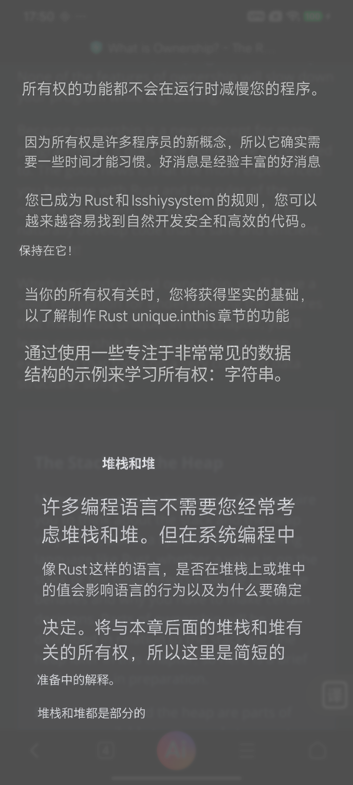
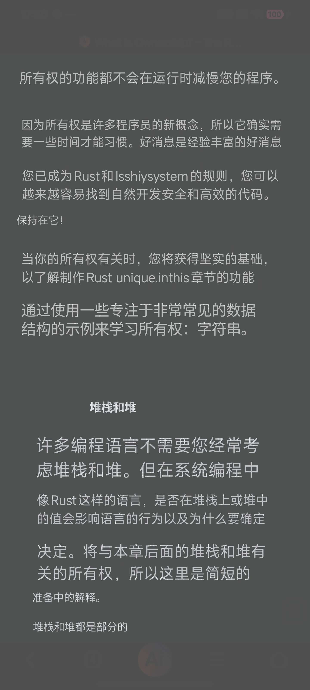
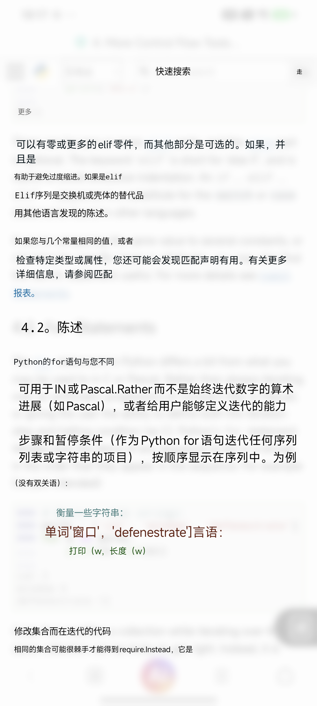
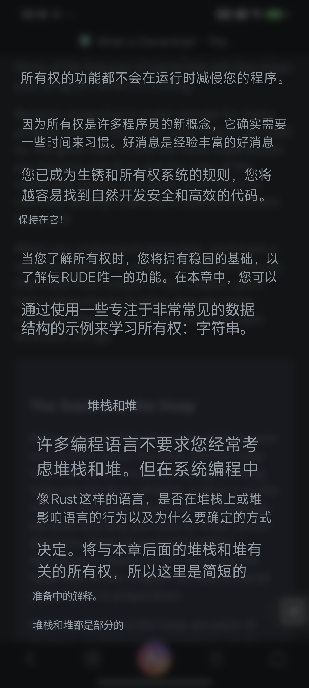

# 全页背景与透明文字验证

验证时间：2026-07-28

设备：Xiaomi `23113RKC6C`，Android 16，1440x3200

## 验证目标

验证启用主题色或高斯模糊时，是否可以把背景效果应用到整个屏幕，并取消每段译文自己的矩形背景，让译文直接依托统一的悬浮层背景显示。

本轮通过 Debug A/B 路径实现：先生成透明背景的译文文字贴片，再把全页背景和所有文字预合成为一张 1440x3200 位图，最终只以一个全屏贴片交给既有悬浮窗显示。正式服务仍使用原有局部贴片，背景功能默认关闭。

## 实现约束

1. 全页背景与透明文字必须先合成为一张位图，再统一应用悬浮窗 `alpha=0.72`，避免背景和文字分别叠加导致透明度计算两次。
2. 全屏悬浮层继续使用既有不可触摸窗口配置，因此本轮实现不改变底层页面的点击和滚动透传逻辑。
3. 基线主题色来自整屏采样后的主背景估计，并按窗口透明度反向补偿；基线高斯方案对整屏降采样、模糊后，以 18% 页面细节和 82% 主题色混合，再执行同样的透明度补偿。
4. 本轮只验证视觉和单次资源开销，不形成 P50/P90 性能结论，也不替代 50 个黄金视口的 A7 验收。

## 结果

| 页面 | 方案 | 全页合成 | 细节残留 | PSS 增量 | 最终位图 | 与原页 SSIM |
| --- | --- | ---: | ---: | ---: | ---: | ---: |
| 浅色 Python Control Flow | 高斯模糊 | 137ms | 3.28% | 20,137KB | 18,432,000B | 0.7237 |
| 浅色 Python Control Flow | 主题色 | 159ms | 0% | 18,827KB | 18,432,000B | 0.7222 |
| 暗色 Rust Ownership | 高斯模糊 | 150ms | 2.60% | 20,582KB | 18,432,000B | 0.3381 |
| 暗色 Rust Ownership | 主题色 | 188ms | 0% | 18,588KB | 18,432,000B | 0.3384 |

`PSS 增量`是在合成返回后采样的常驻增量，不包含 OpenCV 中间矩阵的瞬时峰值。按 1440x3200 ARGB_8888 计算，最终全页位图为 18.43MB；高斯合成期间的输出位图、源/目标矩阵、降采样矩阵和临时背景位图理论上还会产生约 76MB 的瞬时新增图像存储，因此连续滚动重建时存在内存抖动风险。

候选与参考都通过现有自动渲染门，但这里不能直接视为产品通过：全页模式只有一个覆盖整个屏幕的贴片，所以“贴片外变化为 0”是结构上的必然结果；当前细节门只检查模糊强度，也不会判断图片、图标、代码和页面层级是否被过度抹除。

## 浅色页面

全页高斯模糊，文字无局部背景：

全页主题色，文字无局部背景：

原始证据：[滚动前截图](light/baseline.png)、[滚动后截图](light/current.png)、[设备最终显示](light/candidate-displayed.png)、[单轮报告](light/report.json)、[原始结果](light/results.jsonl)。

## 暗色页面

全页高斯模糊，文字无局部背景：

全页主题色，文字无局部背景：

原始证据：[滚动前截图](dark/baseline.png)、[滚动后截图](dark/current.png)、[设备最终显示](dark/candidate-displayed.png)、[单轮报告](dark/report.json)、[原始结果](dark/results.jsonl)。

## 分析与决策

### 全页主题色

技术上可行，但不通过 A7 视觉一致性验收。它完全消除了局部灰色底板，也同时消除了原页面的图片、代码块、图标、分区层级和导航上下文。用户只能阅读译文，不能继续理解译文与原页面内容的空间关系，因此不应进入正式设置项。

### 全页高斯模糊

比全页主题色更接近可用方向：局部矩形边界消失，暗色页面尤其连续，文字可直接依托统一背景阅读。但现有参数只保留 2.60%-3.28% 的边缘细节，浏览器栏、图片和代码区域都被洗平，同时仍能看到被模糊的原文残影。每次稳定滚动还要增加约 137-150ms 的全页合成并重建 18.43MB 位图，不适合作为当前默认或正式自动模式。

### 推荐实现方向

1. 保留当前“关闭、主题色、高斯模糊”人工选择和默认关闭，不把本轮全页方案接入生产服务。
2. 下一轮优先验证“内容视口背景”：排除状态栏、浏览器工具栏和系统导航区，只在网页正文区域使用低强度模糊或轻量主题色。
3. 更优方案是根据 OCR 文字区域生成带羽化边缘的文字遮罩，只弱化原文字形，不覆盖图片、图标和代码块；译文使用轻微描边或阴影保证亮暗背景可读，不再使用矩形底板。
4. 新方案进入默认前，必须在 50 个黄金视口中分别检查文字可读性、页面结构保真、原文残留、非文字污染、滚动重建 P90 和内存峰值。

本轮结论：**全页主题色拒绝；全页高斯模糊仅保留为 Debug 人工实验；透明文字依托统一背景的方向成立，但应缩小到内容视口或 OCR 文字遮罩，而不是覆盖整个屏幕。**

## Enhanced 全页优化复验

复验时间：2026-07-28

### 问题根因

普通应用悬浮窗为了保持触摸透传，项目把窗口透明度限制为 `alpha=0.72`。设底层通道为 `S`、悬浮层通道为 `O`，最终显示值为：

`display = 0.72 * O + 0.28 * S`

为了让任意底层颜色都能被完全替换，同一个目标通道只能落在约 `72-183` 的公共可达范围内。因此浅色页面会被压成灰色、暗色页面会被抬成灰色；若强行恢复纯白或近黑，底层高对比原文又无法被 72% 透明层完全擦除。这是透明合成约束，不是主题色估计错误，也不能单靠调整高斯半径解决。

项目已有 Enhanced/Accessibility 可信悬浮层，可使用 `alpha=1`。本轮只在 Debug A/B 中模拟该条件，并将全页模糊调整为大面积材质参数：最大模糊半径由 12px 提升到 48px，页面细节权重由 18% 提升到 28%，主题色权重为 72%。现有局部贴片参数未改变。

### 优化前后

| 页面 | 指标 | 普通全页 `alpha=0.72` | Enhanced 全页 `alpha=1` | 变化 |
| --- | --- | ---: | ---: | ---: |
| 浅色 Python | 页面平均亮度 | 167.98 | 222.44 | 原页 220.30，亮度偏差减少 95.9% |
| 浅色 Python | 细节残留 | 3.28% | 5.00% | 保留更多大结构，文字纹理被强模糊 |
| 浅色 Python | 全页合成 | 137ms | 150ms | +13ms / +9.5% |
| 浅色 Python | PSS 增量 | 20,137KB | 20,460KB | +323KB |
| 暗色 Rust | 页面平均亮度 | 92.65 | 43.78 | 原页 46.67，亮度偏差减少 93.7% |
| 暗色 Rust | 细节残留 | 2.60% | 4.60% | 恢复近黑层级，保留弱结构 |
| 暗色 Rust | 全页合成 | 150ms | 156ms | +6ms / +4.0% |
| 暗色 Rust | PSS 增量 | 20,582KB | 20,584KB | 基本不变 |

浅色优化结果：

暗色优化结果：

原始证据：[浅色报告](optimized/light/report.json)、[浅色原页](optimized/light/current.png)、[浅色主题色参考](optimized/light/reference-preview.png)、[暗色报告](optimized/dark/report.json)、[暗色原页](optimized/dark/current.png)、[暗色主题色参考](optimized/dark/reference-preview.png)。

### 优化结论

1. 浅色页重新呈现白色阅读面，译文为高对比深色；原英文从可读重影降为柔和横向纹理。代码颜色仍有弱提示，但代码结构不再清晰。
2. 暗色页恢复近黑背景，译文层级明显优于中灰基线；原英文不可直接阅读，标题和段落位置仍可感知。
3. 大面积模糊符合“更大材质使用更厚模糊”的层级规律，但状态栏、浏览器工具栏、图片和代码仍被一起模糊，因此尚未通过完整 A7。
4. `alpha=1` 只允许用于项目已有的 Enhanced/Accessibility 可信悬浮层；普通应用悬浮窗继续使用 `alpha=0.72` 和局部背景，否则可能破坏底层触摸透传。
5. 产品建议调整为：普通模式维持局部主题色/高斯且默认关闭；Enhanced 模式可以继续验证全页高斯，但应先排除系统栏和浏览器栏，并在 50 个黄金视口中验证触摸、结构保真和内存峰值。

复验结论：**Enhanced 全页高斯在亮暗主题保真和文字可读性上达到可继续验证水平；全页主题色仍然拒绝；全页高斯仍不进入默认配置。**
