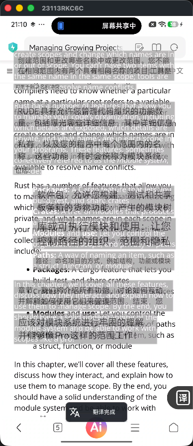
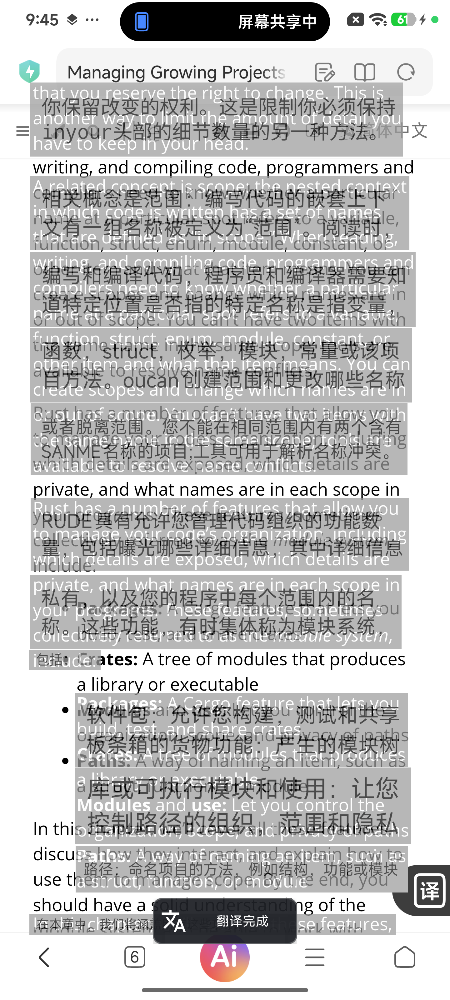
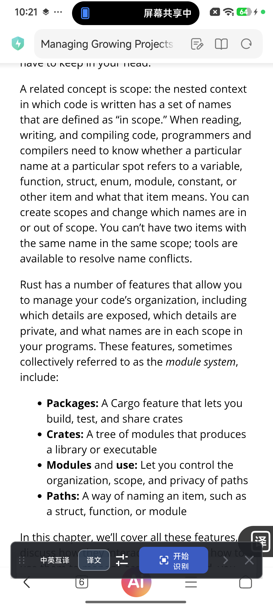
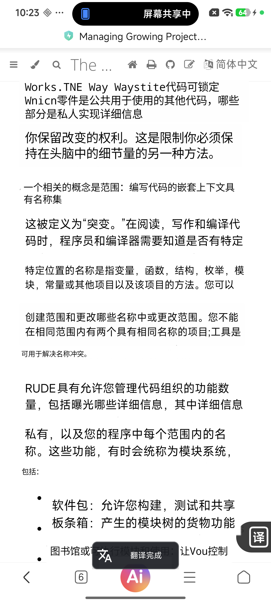
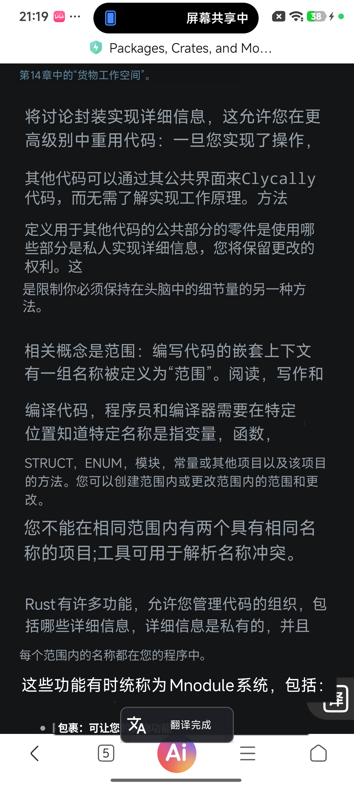

# 悬浮翻译叠层故障恢复与安装验证

- 日期：2026-07-30
- 设备：Xiaomi 23113RKC6C，Android API 36
- 最终提交：`0fa1220`
- 安装包：`output/apk/ImageTranslateOCR-enhanced-safe-fallback-0fa1220-debug.apk`
- SHA-256：`fe9f69a2359dfb253b8a1a80a9ae50457a4166745b0f6d467b58f4512a46a95f`

## 结论

原故障由非可信 `APPLICATION_OVERLAY` 的透明窗口与网页原文同时可见引起。普通悬浮窗受 Android 触摸遮挡限制，真机实际 alpha 被限制为约 `0.8`，因此无法通过强制 `alpha=1` 可靠消除底层英文。

最终策略：

- 请求 `ENHANCED` 且辅助服务已连接：使用可信 `ACCESSIBILITY_OVERLAY`、`alpha=1` 和主题色背景，正常呈现翻译。
- 请求 `ENHANCED` 但辅助服务不可用：立即清空翻译层并暂停新翻译，只保留控制入口；不再自动降级为透明翻译贴片。
- 辅助服务恢复：保留的 `ENHANCED + THEME_COLOR` 偏好自动生效，无需重启投屏会话。
- 用户显式选择普通模式时，原有 `alpha=0.72` 局部背景实验行为不变。

## 对照结果

| 场景 | 证据 | 结果 |
| --- | --- | --- |
| 原故障 |  | 多代文字与灰色半透明贴片重叠，不可读。 |
| 被否决的透明降级 |  | 遥测已变为 `STANDARD`，但底层英文仍透出；说明仅切背景模式不足。 |
| 最终断连态 |  | 只有网页原文，没有翻译补丁和旧层残留；日志为 `Live translation paused`。 |
| 恢复 Enhanced |  | 自动恢复主题色翻译，无灰块叠层；窗口类型为 `ACCESSIBILITY_OVERLAY`。 |
| 已验证回退节点 |  | 干净节点 `9430ae7` 可正常显示 Enhanced，作为实现对照。 |

## 自动化与真机验收

| 验收项 | 结果 | 证据 |
| --- | --- | --- |
| Debug 单元测试 | PASS | 干净工作树执行 `:app:testDebugUnitTest`。 |
| Debug APK 构建 | PASS | 干净工作树执行 `:app:assembleDebug`。 |
| AndroidTest APK 构建 | PASS | 干净工作树执行 `:app:assembleDebugAndroidTest`。 |
| Enhanced 断连启动 | PASS | 无 `overlay_translation_completed`，只记录暂停事件。 |
| 同会话恢复 | PASS | generation 10，11 patches，failed 0。 |
| 主题背景 | PASS | `background_mode=FEATHERED_THEME_SURFACE`，12 个主题采样补丁。 |
| 原子呈现 | PASS | `atomic_group=true`，presentation 18 ms。 |
| 恢复总耗时 | PARTIAL | 2022 ms，比 2000 ms 目标高 22 ms；不影响本次叠层故障修复结论。 |
| 安装一致性 | PASS | 设备 `base.apk` 与交付 APK 的 SHA-256 完全一致。 |

## 停止条件

本轮在以下条件满足后停止：断连时零翻译层残留；恢复后使用可信窗口并只呈现一代主题色结果；APK 完成覆盖安装且设备哈希一致。OCR 与翻译语义准确度不属于本次材料层故障范围。
