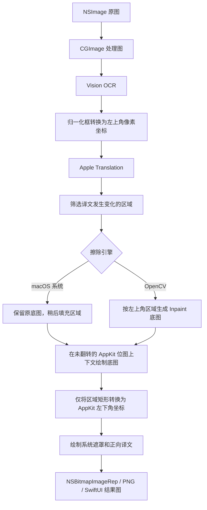

# ImageTranslateOCR macOS

完全本地运行的原生 macOS 图片翻译验证版。

- Vision 中文/英文 OCR
- Apple Translation 英中双向翻译
- Core Graphics 背景擦除和译文覆盖
- 可切换 Core Graphics（默认）或 OpenCV Telea Inpaint
- 文件面板、拖放和 PNG 导出
- ScreenCaptureKit 显示器/窗口采集与透明回贴
- 滚轮停止后自动重新 OCR，旧结果按 generation 丢弃
- 英译中和中译英方向切换

## 屏幕翻译

主窗口的“屏幕翻译”工具栏可以选择整台显示器或一个当前可见窗口。开始后，应用会采集目标、执行 Vision OCR 和 Apple Translation，并通过鼠标穿透的透明 `NSPanel` 将整组译文一次性贴回目标区域。

选择窗口后点击“开始”，主窗口会自动隐藏，应用继续在后台运行。菜单栏的书本图标可以查看状态、开始或停止翻译、刷新采集目标和重新打开主窗口。只有所选窗口本身处于窗口层级最前时才会采集；切换到其他窗口会立即清空译文层，重新置顶所选窗口后才会重新采集。

滚动处理沿用 Android 实时翻译已经验证的生命周期约束：

1. 收到滚轮事件或检测到目标帧变化时立即隐藏并释放旧译文层。
2. 每次运动递增 generation；旧 OCR/翻译任务即使稍后返回，也不能重新展示。
3. 最后一次运动后等待 520ms，再对稳定视口采集一次。
4. 新译文先在离屏位图中完整绘制，再原子替换透明回贴层。
5. ScreenCaptureKit 采集时排除本应用，避免译文层进入下一轮 OCR。
6. 窗口移动、缩放或跨显示器时使旧 generation 失效，并使用最新窗口 frame 重采集。

回贴图与采集图保持相同像素画布：Vision 区域坐标始终是采集图左上角像素坐标，透明补丁也在同尺寸画布绘制，最终只把整张透明画布按 `SCWindow.frame` 映射到无边框面板。窗口 frame、所在显示器或尺寸发生变化时不会拉伸复用旧结果，而是隐藏后重新采集。

首次使用需要在“系统设置 > 隐私与安全性 > 屏幕与系统音频录制”中允许本应用。全局滚轮监听在部分系统配置下还需要“输入监控”权限；即使未授予，应用也会每 300ms 对目标做低分辨率帧比较，在画面停止变化后触发同一采集流程。

当前窗口回贴以窗口主要所在显示器进行坐标换算。跨显示器窗口、窗口被其他应用遮挡、Mission Control 切换和全屏空间仍应作为独立的真机兼容性矩阵验证。

### Rust 核心复用边界

Android V4 使用的 `ocr-translation-core` 已包含 regions-first 分组、布局槽位、提示词生成和模型响应校验，这些逻辑应由 macOS 复用，不应在 Swift 重写。当前 macOS 默认后端是 Apple Translation，它不接受 LLM prompt；同时 `ocr-translation-edge` 目前只导出 Android JNI。因此本地 Apple 翻译路径继续直接翻译 Vision 区域。

接入 Android 同款模型后端时，推荐的下一步是为 `ocr-translation-edge` 增加稳定的 C ABI（字符串输入、字符串结果、显式释放），构建 arm64/x86_64 macOS XCFramework，并让 Swift 只负责：

- 将 Vision 区域编码为 V4 `SemanticTranslationRequest`；
- 调用 Rust `prepare/complete` 或完整 provider 入口；
- 按 Rust 返回的 `layoutHint` / `renderSlots` 绘制透明补丁。

这样布局、prompt 版本和响应契约才能与 Android 保持同源。

## 图像处理流程与坐标约定

macOS 版本在识别、擦除、回写和界面覆盖层之间统一保存一套“左上角为原点”的逻辑区域坐标，只在最终使用 AppKit 绘制遮罩和译文时转换坐标。图像像素本身不参与方向校正。



各阶段的坐标约定如下：

| 阶段 | 原点与方向 | 处理方式 |
| --- | --- | --- |
| Vision `boundingBox` | 左下角，0...1 归一化坐标 | `OCRService` 转换为左上角像素坐标 |
| `RecognizedRegion` / `TranslatedRegion` | 左上角，像素坐标 | OCR、翻译、标号和点击区域共用，不重复转换 |
| OpenCV Mat | 左上角，首行为顶部 | 直接使用逻辑区域，不翻转图像或矩形 |
| SwiftUI 结果覆盖层 | 左上角 | 直接使用逻辑区域并按显示比例缩放 |
| AppKit 位图绘制 | 左下角 | 仅在绘制边界转换矩形 Y 坐标 |

设图像高度为 `H`，逻辑区域为 `(x, y, width, height)`，AppKit 绘制区域为：

```text
drawX = x
drawY = H - (y + height) = H - maxY
drawWidth = width
drawHeight = height
```

因此左右位置和区域尺寸保持不变，只改变矩形原点的坐标表达。底图始终在未翻转的上下文中绘制，译文也在正常 AppKit 上下文中绘制，不对 `CGImage`、OpenCV 输出或整个 `NSGraphicsContext` 应用翻转变换。

### 上下翻转问题复盘

这次问题由“区域坐标转换”和“整个绘图上下文翻转”混在一起引起：

1. Vision 的识别框已在 `OCRService` 中转换成左上角像素坐标。
2. 旧渲染代码为了直接使用这些矩形，将共享 `NSGraphicsContext` 设置为 `flipped: true`。
3. 该设置改变的不只是矩形坐标，还改变了随后绘制的底图和文字字形，所以 macOS 系统与 OpenCV 两个引擎都会出现上下翻转。
4. 首次排查只根据最终图像方向推断 OpenCV 原始输出方向，并给 OpenCV 增加了单独翻转。这是错误的分层判断，因为两个引擎都经过同一个公共渲染上下文。
5. 第二次修改先用未翻转上下文绘制底图，再切换到翻转上下文绘制覆盖层，底图恢复正常，但译文字形仍跟随覆盖层上下文翻转。
6. 最终方案完全移除共享上下文和 OpenCV 输出上的翻转，只对每个区域执行上述 `drawY` 换算，再在正常上下文中绘制遮罩和文字。

后续修改需要保持以下不变量：

- 引擎只负责生成底图，不负责修正显示方向。
- `TranslatedRegion.bounds` 始终表示左上角像素坐标。
- OpenCV 直接接收逻辑区域；AppKit 绘制边界负责唯一一次坐标转换。
- 不根据最终合成图反推某个引擎的原始方向；应分别验证引擎输出、公共底图绘制和文字绘制。
- 无替换区域时，渲染输出应与输入逐像素同向一致；文字方向测试应同时包含明确的顶部标记。

要求 macOS 15.0+。首次翻译时系统可能需要下载中英语言包。

OpenCV 引擎需要本机安装 Homebrew OpenCV：

```bash
brew install opencv
```

安装后在 Xcode 中选择 `OpenCV` 构建配置，或执行：

```bash
xcodebuild -project ImageTranslateOCRMac.xcodeproj \
  -scheme ImageTranslateOCRMac -configuration OpenCV build
```

`Debug` 和 `Release` 不链接任何第三方库，OpenCV 选项会禁用；`OpenCV` 配置同时提供系统与 OpenCV 两个运行时选项。

```bash
xcodebuild -project ImageTranslateOCRMac.xcodeproj \
  -scheme ImageTranslateOCRMac \
  -configuration Debug \
  -derivedDataPath .derivedData \
CODE_SIGNING_ALLOWED=NO build
```

OCR 冒烟验证：

```bash
xcrun swiftc -parse-as-library ImageTranslateOCRMac/Models.swift \
  ImageTranslateOCRMac/OCRService.swift Tools/OCRSmoke.swift \
  -framework AppKit -framework Vision -o /tmp/ImageTranslateOCR-OCRSmoke
/tmp/ImageTranslateOCR-OCRSmoke ../docs/assets/2026-07-21-source.png
```

滚动帧策略冒烟验证：

```bash
xcrun swiftc ImageTranslateOCRMac/ScreenFrameChangePolicy.swift \
  Tools/ScreenFrameChangePolicySmoke.swift \
  -o /tmp/ImageTranslateOCR-ScreenFramePolicySmoke
/tmp/ImageTranslateOCR-ScreenFramePolicySmoke
```
