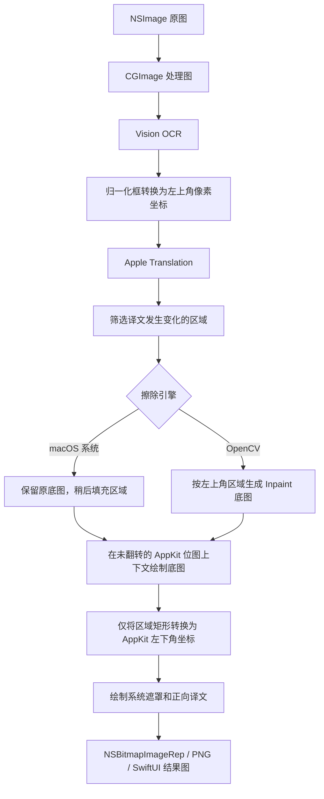

# ImageTranslateOCR macOS

完全本地运行的原生 macOS 图片翻译验证版。

- Vision 中文/英文 OCR
- Apple Translation 中译英
- Core Graphics 背景擦除和译文覆盖
- 可切换 Core Graphics（默认）或 OpenCV Telea Inpaint
- 文件面板、拖放和 PNG 导出

## 图像处理流程与坐标约定

macOS 版本在识别、擦除、回写和界面覆盖层之间统一保存一套“左上角为原点”的逻辑区域坐标，只在最终使用 AppKit 绘制遮罩和译文时转换坐标。图像像素本身不参与方向校正。



各阶段的坐标约定如下：

| 阶段 | 原点与方向 | 处理方式 |
| --- | --- | --- |
| Vision `boundingBox` | 左下角，0...1 归一化坐标 | `OCRService` 转换为左上角像素坐标 |
| `RecognizedRegion` / `TranslatedRegion` | 左上角，像素坐标 | OCR、翻译、标号和点击区域共用，不重复转换 |
| OpenCV Mat | 左上角，首行为顶部 | 直接使用逻辑区域，不翻转图像或矩形 |
| SwiftUI 结果覆盖层 | 左上角 | 直接使用逻辑区域并按显示比例缩放 |
| AppKit 位图绘制 | 左下角 | 仅在绘制边界转换矩形 Y 坐标 |

设图像高度为 `H`，逻辑区域为 `(x, y, width, height)`，AppKit 绘制区域为：

```text
drawX = x
drawY = H - (y + height) = H - maxY
drawWidth = width
drawHeight = height
```

因此左右位置和区域尺寸保持不变，只改变矩形原点的坐标表达。底图始终在未翻转的上下文中绘制，译文也在正常 AppKit 上下文中绘制，不对 `CGImage`、OpenCV 输出或整个 `NSGraphicsContext` 应用翻转变换。

### 上下翻转问题复盘

这次问题由“区域坐标转换”和“整个绘图上下文翻转”混在一起引起：

1. Vision 的识别框已在 `OCRService` 中转换成左上角像素坐标。
2. 旧渲染代码为了直接使用这些矩形，将共享 `NSGraphicsContext` 设置为 `flipped: true`。
3. 该设置改变的不只是矩形坐标，还改变了随后绘制的底图和文字字形，所以 macOS 系统与 OpenCV 两个引擎都会出现上下翻转。
4. 首次排查只根据最终图像方向推断 OpenCV 原始输出方向，并给 OpenCV 增加了单独翻转。这是错误的分层判断，因为两个引擎都经过同一个公共渲染上下文。
5. 第二次修改先用未翻转上下文绘制底图，再切换到翻转上下文绘制覆盖层，底图恢复正常，但译文字形仍跟随覆盖层上下文翻转。
6. 最终方案完全移除共享上下文和 OpenCV 输出上的翻转，只对每个区域执行上述 `drawY` 换算，再在正常上下文中绘制遮罩和文字。

后续修改需要保持以下不变量：

- 引擎只负责生成底图，不负责修正显示方向。
- `TranslatedRegion.bounds` 始终表示左上角像素坐标。
- OpenCV 直接接收逻辑区域；AppKit 绘制边界负责唯一一次坐标转换。
- 不根据最终合成图反推某个引擎的原始方向；应分别验证引擎输出、公共底图绘制和文字绘制。
- 无替换区域时，渲染输出应与输入逐像素同向一致；文字方向测试应同时包含明确的顶部标记。

要求 macOS 15.0+。首次翻译时系统可能需要下载中英语言包。

OpenCV 引擎需要本机安装 Homebrew OpenCV：

```bash
brew install opencv
```

安装后在 Xcode 中选择 `OpenCV` 构建配置，或执行：

```bash
xcodebuild -project ImageTranslateOCRMac.xcodeproj \
  -scheme ImageTranslateOCRMac -configuration OpenCV build
```

`Debug` 和 `Release` 不链接任何第三方库，OpenCV 选项会禁用；`OpenCV` 配置同时提供系统与 OpenCV 两个运行时选项。

```bash
xcodebuild -project ImageTranslateOCRMac.xcodeproj \
  -scheme ImageTranslateOCRMac \
  -configuration Debug \
  -derivedDataPath .derivedData \
CODE_SIGNING_ALLOWED=NO build
```

OCR 冒烟验证：

```bash
xcrun swiftc -parse-as-library ImageTranslateOCRMac/Models.swift \
  ImageTranslateOCRMac/OCRService.swift Tools/OCRSmoke.swift \
  -framework AppKit -framework Vision -o /tmp/ImageTranslateOCR-OCRSmoke
/tmp/ImageTranslateOCR-OCRSmoke ../docs/assets/2026-07-21-source.png
```
