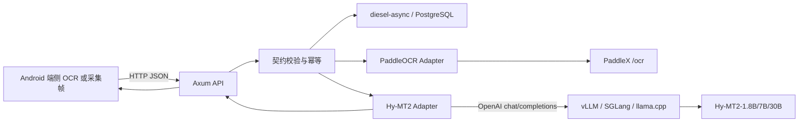

# Hy-MT2 OCR Translation Service

该目录提供 Android OCR 翻译的本地网络服务：

- Rust 2024、Axum 0.8。
- `diesel-async` + PostgreSQL，用于请求幂等和短期结果缓存。
- Hy-MT2 通过 OpenAI兼容推理端点调用，支持 vLLM、SGLang或带 STQ内核的 llama.cpp server。
- PaddleX 作为隔离的 OCR 上游，Gateway 可一次接收采集图并返回 OCR 框和译文。
- 兼容 Android当前 `/api/v1/translation-batches`，同时实现目标 `/api/v2`契约和能力接口。

服务不会上传截图，也不会把 OCR请求原文写入数据库或普通日志。数据库只保存请求哈希、请求元数据和默认保留10分钟的幂等响应。

## 架构



模型运行时与Rust API保持进程隔离，但对应源码版本、模型校验、兼容补丁和启动脚本已经迁入
[`hy-mt2-runtime`](hy-mt2-runtime/README.md)。Hy-MT2没有Rust原生推理API，Rust服务通过稳定的OpenAI兼容边界调用项目内STQ `llama-server`，后续替换模型体量不影响Android契约。

## 接口

| 接口 | 用途 |
|---|---|
| `GET /healthz` | PostgreSQL和模型联合就绪检查 |
| `POST /api/v1/translation-batches` | 当前Android客户端兼容接口 |
| `POST /api/v1/ocr-translations` | 采集图 OCR+翻译一体化接口 |
| `POST /api/v2/translation-batches` | 完整会话、代际和区域修订协议 |
| `GET /api/v2/translation/capabilities` | Hy-MT2语言与批次限制 |

批次最多64个区域、单区域2,000个Unicode code points、整批16,000个code points，请求体最大256 KiB。`CONTEXT_ONLY`区域不进入v2响应。代码块按保护规则返回`PRESERVED`；其他URL和标识符保护仍受模型能力约束，正式环境应增加术语表或占位符保护层。

## 本地启动

前置条件：

1. Rust 1.85+。
2. PostgreSQL可用。
3. CMake和支持C++17的编译器，用于首次构建项目内STQ运行时。

CUDA环境可按Hy-MT2官方方式启动vLLM：

```bash
vllm serve tencent/Hy-MT2-1.8B \
  --host 127.0.0.1 \
  --port 8088 \
  --tensor-parallel-size 1
```

首次使用时下载模型；当前机器已经把已校验权重迁移到该目录：

```bash
translation-service/hy-mt2-runtime/download-model.sh
```

一条命令启动项目内模型运行时和Rust API：

```bash
scripts/run-local-translation-stack.sh
```

一条命令同时启动 PaddleOCR、模型运行时和 Rust Gateway：

```bash
scripts/run-local-ocr-translation-stack.sh
```

模型服务只监听`127.0.0.1:8088`，对Android开放的仍是Axum API `0.0.0.0:8090`。
如已使用vLLM、SGLang或其他OpenAI兼容服务，可设置`HY_MT2_BASE_URL`后单独执行
`scripts/run-local-translation-service.sh`。

环境变量见[.env.example](.env.example)。需要鉴权时设置`API_BEARER_TOKEN`；生产环境必须在反向代理层启用HTTPS，不应把服务直接暴露到公网。

## 验证

服务启动后执行：

```bash
scripts/verify-local-translation-service.sh
scripts/verify-local-ocr-translation-service.sh
```

脚本验证健康状态、项目v1 Mock、v2关联字段、能力接口和真实Hy-MT2译文，结果写入`translation-service/.artifacts/`。`semantic-quality.json`单独报告品牌保留和长句语义，不会把HTTP结构通过等同于翻译质量通过。

Android真机与开发机处于同一局域网时，Debug Demo直接访问当前开发机服务：

```bash
JAVA_HOME="/Applications/Android Studio.app/Contents/jbr/Contents/Home" \
  ./gradlew :app:connectedDebugAndroidTest \
  -Pandroid.testInstrumentationRunnerArguments.class=\
com.example.imagetranslate.translate.RemoteTranslationServiceInstrumentedTest
```

Android Debug 可在主程序中填写当前开发机的局域网地址，例如
`http://192.168.0.63:8090`。Rust 服务默认监听 `0.0.0.0:8090`，仅应在可信开发网络使用；
PaddleX 仍只监听 `127.0.0.1:8081`。主程序支持分别配置网络翻译和 PaddleOCR 一体化服务，
保存后无需重新构建 APK。
主程序默认使用本地模型，用户在翻译设置或悬浮窗中切换到网络服务后才调用Hy-MT2。
如需替换地址，构建时传入`-PREMOTE_TRANSLATION_BASE_URL=https://example.com`；Release
未传该参数时不会包含本地测试入口。

## 生产化边界

- v1仅用于兼容当前客户端；正式协议应迁移v2。
- `API_BEARER_TOKEN`只适合本地或受控环境，正式环境应接入短期访问令牌校验。
- PostgreSQL幂等响应含短期译文，默认10分钟删除；生产环境应根据隐私策略缩短或关闭。
- 服务日志只记录`requestId`、区域数、耗时、代际和错误统计，不记录OCR原文和译文。
- Hy-MT2参数按官方1.8B/7B建议值：`temperature=0.7`、`top_p=0.6`、`top_k=20`、`repetition_penalty=1.05`。
